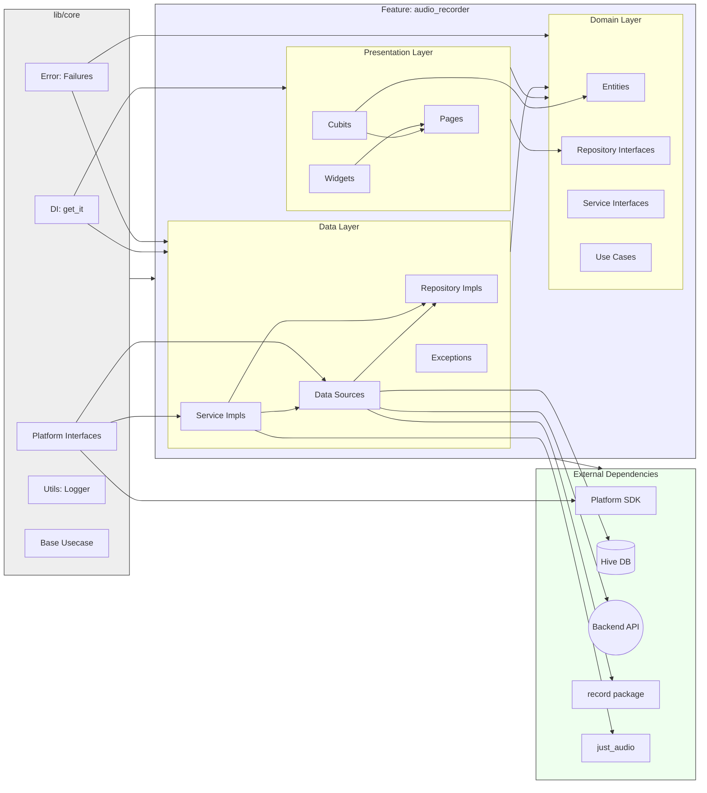

# Architecture: Audio Transcription Feature

This document outlines the **implemented architecture** for the audio recording and transcription feature, based on a **Feature-Sliced Clean Architecture** approach. Local audio files are treated as payloads for a backend transcription service, with local persistence (Hive) managing offline jobs and metadata like duration.

***Note (April 8th, 2024): This document has been updated to reflect the actual codebase structure and implementation status. The architecture uses feature-slicing, and core functionality (local storage, fake API interaction, repository logic, basic presentation) is largely implemented.***

## 1. Overall Structure (Feature-Sliced Clean Architecture)

The project utilizes a feature-sliced approach combined with Clean Architecture principles:

*   **`lib/core/`**: Contains application-wide, reusable components, abstractions, and utilities (DI, error handling, platform interfaces, base use cases, logging).
*   **`lib/features/`**: Houses individual, self-contained feature modules. Currently, only `audio_recorder` exists.
*   **`lib/features/<feature_name>/`**: Each feature internally follows Clean Architecture layers:
    *   **`domain/`**: Contains business logic, entities, models, repository interfaces, domain service interfaces, adapters, mappers, and feature-specific use cases. It has no dependencies on other layers.
    *   **`data/`**: Implements repository interfaces, defines data sources (local, remote), manages data models/DTOs, data-specific exceptions, factories, services, adapters, and mappers. Depends only on `domain`.
    *   **`presentation/`**: Contains UI elements (pages, widgets) and state management (Cubits/Blocs). Depends only on `domain`.



*(Note: This diagram shows the general structure and dependencies for the `audio_recorder` feature within the overall architecture.)*

## 2. Implemented Architecture Details

This architecture treats local files as opaque handles/payloads. The primary source of truth for list display is a **merged state** derived from the backend API (via `TranscriptionRemoteDataSource`) and local persistence (`LocalJobStore` using Hive). **Local audio duration is captured ONCE after recording and stored locally via `LocalJobStore`.**

**Key Components & Flow (Listing):**

1.  **Local Job Capture & Persistence (Implemented):**
    *   `AudioDurationRetriever` (`data/services/`) is called by `AudioLocalDataSourceImpl.stopRecording()` (`data/datasources/`).
    *   `AudioLocalDataSourceImpl` creates a `LocalJob` entity (`domain/entities/`) with `status = created`, `durationMillis`, `localFilePath`, `localCreatedAt`.
    *   It saves this `LocalJob` using the injected `LocalJobStore` interface (`domain/repositories/`).
    *   **`LocalJobStore` Interface (Domain - Implemented):** Defines the contract for local persistence (`domain/repositories/local_job_store.dart`).
    *   **Implementation (`HiveLocalJobStoreImpl` - Implemented):** Uses `Hive` (`data/datasources/local_job_store_impl.dart`) to store `LocalJob` objects. Hive is initialized, adapters registered, and the store injected via `get_it` (`core/di/`).
2.  **Simplified Local File Listing (Assumed via `AudioFileManager`):**
    *   `AudioFileManager` (`data/services/`) likely provides basic path listing, removing the old N+1 problem (implementation details not fully verified but structure exists).
3.  **Backend Integration (Interface + Fake Implementation):**
    *   **`TranscriptionRemoteDataSource` Interface (Domain - Implemented):** Defines contract (`domain/repositories/transcription_remote_data_source.dart`).
    *   **Fake Implementation (`FakeTranscriptionDataSourceImpl` - Implemented):** A fake implementation exists (`data/datasources/fake_transcription_data_source_impl.dart`) for development and testing purposes, registered via `get_it`.

## 3. Audio Playback Architecture (Refactored & Standardized)

**UPDATE:** The audio playback system has been **standardized on `just_audio`**. Phase 1 (Interface Decoupling) and Phase 2 (Standardize on `just_audio`) are complete. The `AudioPlayerAdapterImpl` now uses `just_audio` exclusively, and the `audioplayers` dependency has been removed.

**NOTE:** While this architecture promotes decoupling, real-world implementation revealed critical dependencies and potential pitfalls, particularly around dependency injection, state synchronization, and the specific behaviors of the `just_audio` library. See the "Implementation Notes & Gotchas" and updated File Responsibilities below, and refer to `docs/audio_player_analysis.md` for a detailed breakdown of debugging these issues. **Integration testing covering the interactions between the Adapter, Mapper, and Service is crucial to prevent regressions.**

**REVISED PLAN (Completed):**
1.  **Phase 1 (Interface Decoupling - COMPLETE):** Defined `DomainPlayerState` enum. Updated `AudioPlayerAdapter` interface to use `DomainPlayerState`. Updated the `audioplayers`-based `AudioPlayerAdapterImpl` and the `PlaybackStateMapper` implementation & tests to conform to the new interface contract.
2.  **Phase 2 (Standardize on `just_audio` - COMPLETE):** Rewritten the `AudioPlayerAdapterImpl` to use `just_audio` instead of `audioplayers`. Updated the adapter tests accordingly. Removed the `audioplayers` dependency entirely.

The following description reflects the current state *after* standardization on `just_audio`.

The audio playback system utilizes a Clean Architecture approach with Adapter and Mapper patterns, standardized on `just_audio` for all playback and duration-related operations.

### 3.1. Playback Architecture Diagram

```mermaid
graph LR
    subgraph "Presentation Layer (UI & State)"
        direction LR
        UI[AudioPlayerWidget]
        CUBIT[AudioListCubit]
    end

    subgraph "Domain Layer (Interf & Ent)"
        direction LR
        ENTITY_PSTATE["PlaybackState (Freezed)"]
        ENTITY_DSTATE["DomainPlayerState (enum)"]
        SVC_IF[AudioPlaybackService Interface]
        ADP_IF[AudioPlayerAdapter Interface]
        MAP_IF[PlaybackStateMapper Interface]
    end

    subgraph "Data Layer (Implementations)"
        direction LR
        SVC_IMPL[AudioPlaybackServiceImpl]
        ADP_IMPL[AudioPlayerAdapterImpl]
        MAP_IMPL[PlaybackStateMapperImpl]
    end

    subgraph "External Dependencies"
        direction LR
        PLAYER[just_audio::AudioPlayer]
        // PLAYER_DURATION[just_audio::AudioPlayer] // No longer needed as separate item
    end

    %% --- Dependencies --- 
    UI --> CUBIT
    CUBIT --> SVC_IF
    CUBIT --> ENTITY_PSTATE
    
    SVC_IMPL --> SVC_IF
    SVC_IMPL --> ADP_IF
    SVC_IMPL --> MAP_IF
    
    ADP_IMPL --> ADP_IF
    MAP_IMPL --> MAP_IF
    
    ADP_IMPL --> PLAYER
    MAP_IMPL --> ENTITY_PSTATE
    MAP_IMPL -- Uses --> ENTITY_DSTATE
    MAP_IMPL -- Consumes Stream From --> ADP_IF
    // SVC_DURATION[AudioDurationRetrieverImpl] -- Uses --> PLAYER_DURATION // Duration handled by adapter?

    %% Interface/Entity usage
    ADP_IF -- Emits --> ENTITY_DSTATE
    MAP_IF -- Consumes --> ENTITY_DSTATE
    MAP_IF -- Emits --> ENTITY_PSTATE
    SVC_IF -- Emits --> ENTITY_PSTATE

    %% Grouping for Layout Hint (Optional)
    subgraph Feature
      direction LR
      subgraph Presentation [Presentation Layer]
        UI
        CUBIT
      end
      subgraph Domain [Domain Layer]
        ENTITY_PSTATE
        ENTITY_DSTATE
        SVC_IF
        ADP_IF
        MAP_IF
      end
      subgraph Data [Data Layer]
        SVC_IMPL
        ADP_IMPL
        MAP_IMPL
        // SVC_DURATION // Removed? Or handled differently?
      end
    end
    
    Presentation --> Domain
    Data --> Domain
    Data --> External

```
(Note: Diagram updated to reflect single `just_audio` dependency)

### 3.2. Relevant File Structure

```
lib/features/audio_recorder/
├── domain/
│   ├── adapters/
│   │   └── audio_player_adapter.dart      # Interface: Abstracts player. Uses DomainPlayerState.
│   ├── entities/
│   │   ├── domain_player_state.dart     # Entity (enum): Library-agnostic player states.
│   │   └── playback_state.dart          # Entity (Freezed): UI-facing playback states.
│   ├── mappers/
│   │   └── playback_state_mapper.dart   # Interface: Abstracts raw event -> PlaybackState.
│   ├── models/                          # Domain specific models (if any, separate from entities)
│   ├── repositories/                    # Repository Interfaces (e.g., LocalJobStore)
│   ├── services/
│   │   └── audio_playback_service.dart  # Interface: High-level playback API.
│   └── usecases/                        # Feature specific business logic units
├── data/
│   ├── adapters/
│   │   └── audio_player_adapter_impl.dart # Implementation: Wraps 'just_audio'. Maps to DomainPlayerState.
│   ├── datasources/                     # Data source implementations (e.g., HiveLocalJobStoreImpl)
│   ├── exceptions/                      # Data layer specific exceptions
│   ├── factories/                       # Factories for creating data layer objects
│   ├── mappers/
│   │   └── playback_state_mapper_impl.dart# Implementation: Maps DomainPlayerState -> PlaybackState.
│   ├── repositories/                    # Repository Implementations
│   └── services/
│       ├── audio_duration_retriever_impl.dart # IMPL: Uses 'just_audio' for duration. (Still separate?)
│       └── audio_playback_service_impl.dart # Implementation: Orchestrates Adapter & Mapper.
└── presentation/
    ├── cubit/
    │   ├── audio_list_cubit.dart        # State Management: Uses AudioPlaybackService.
    │   └── audio_list_state.dart        # State Definition: Includes PlaybackInfo.
    ├── pages/                           # Feature screens/pages
    └── widgets/
        └── audio_player_widget.dart     # UI Component: Displays controls & info.
```

### 3.3. File Responsibilities (Updated)

*   **Domain Layer:**
    *   `domain/adapters/audio_player_adapter.dart`: Defines the *contract* for interacting with *any* audio player. Uses `DomainPlayerState`. Exposes the necessary raw streams (player state, position, duration, completion, etc.) required by the `PlaybackStateMapper`.
    *   `domain/entities/domain_player_state.dart`: Defines the library-agnostic player states.
    *   `domain/entities/playback_state.dart`: Defines the core *business state* (`initial`, `loading`, `playing`, etc.).
    *   `domain/mappers/playback_state_mapper.dart`: Defines the *contract* for transforming event streams into `Stream<PlaybackState>`. Consumes `Stream<DomainPlayerState>`.
    *   `domain/services/audio_playback_service.dart`: Defines the high-level playback use cases. Exposes `Stream<PlaybackState>`.
*   **Data Layer:**
    *   `data/adapters/audio_player_adapter_impl.dart`: *Implements* `AudioPlayerAdapter` using **`just_audio`**. Maps internal `just_audio` states to `DomainPlayerState`.
    *   `data/mappers/playback_state_mapper_impl.dart`: *Implements* `PlaybackStateMapper`. **Crucially, this implementation uses RxDart (`Rx.merge`, `BehaviorSubject`, etc.) to combine the various input streams (`positionStream`, `durationStream`, `playerStateStream`, `completeStream`) provided by the `AudioPlayerAdapter` via the `initialize` method. It maintains internal state (`_currentPlayerState`, `_currentDuration`, `_currentPosition`) and constructs the final `PlaybackState` based on the latest events from all input streams. It exposes the resulting combined and mapped `Stream<PlaybackState>`. Note that filtering logic (e.g., using `.distinct()` with custom comparators) might be needed here to manage high-frequency streams like position updates.**
    *   `data/services/audio_duration_retriever_impl.dart`: *Implements* `AudioDurationRetriever` using `just_audio` (`data/services/audio_duration_retriever_impl.dart`). Although the primary player adapter also uses `just_audio`, this service is kept separate, likely to maintain a clear single responsibility (retrieving duration without needing full playback controls).
    *   `data/services/audio_playback_service_impl.dart`: Orchestrates the playback lifecycle by calling methods on the `AudioPlayerAdapter` (e.g., `play`, `pause`, `stop`, `setSourceUrl`). **!! CRITICAL WIRING !!: This service's creation within the Dependency Injection container (typically in `lib/core/di/injection_container.dart`) is responsible for initializing the `PlaybackStateMapper` by passing the necessary streams obtained from the `AudioPlayerAdapter`. See Section 3.4 below.** It exposes the `playbackStateStream` provided by the *correctly initialized* mapper. **Note on `play()` vs `resume()`:** While the `AudioListCubit` should correctly call `resumeRecording()` (-> `service.resume()`) for resuming playback, the `play()` method in this service includes internal state checks (`_lastKnownState`) as a safeguard. It can handle being called on a paused track by correctly invoking `resume()` internally, ensuring robustness even if the calling layer makes a mistake.

### 3.4. Implementation Notes & Gotchas (Updated)

**WARNING:** The most critical point of failure observed during implementation is the **dependency injection wiring** between the `AudioPlayerAdapter`, `PlaybackStateMapper`, and `AudioPlaybackService`. Ensure the `PlaybackStateMapperImpl` is correctly initialized with the necessary streams obtained from the `AudioPlayerAdapterImpl` within the DI container (typically `lib/core/di/injection_container.dart`). **Failure to perform this wiring correctly is the most likely cause of silent playback state failures (e.g., UI not updating, buttons unresponsive) and will NOT be caught by unit tests that mock component outputs.**

The crucial wiring code within the `AudioPlaybackService` factory in `injection_container.dart` looks like this:

```dart
sl.registerLazySingleton<AudioPlaybackService>(() {
  // Resolve dependencies first
  final adapter = sl<AudioPlayerAdapter>();
  final mapper = sl<PlaybackStateMapper>();

  // **** THE CRITICAL WIRING STEP ****
  // Initialize the mapper with the adapter's streams
  // We MUST cast mapper back to its implementation type to access initialize
  (mapper as PlaybackStateMapperImpl).initialize(
    positionStream: adapter.onPositionChanged,
    durationStream: adapter.onDurationChanged,
    completeStream: adapter.onPlayerComplete,
    playerStateStream: adapter.onPlayerStateChanged,
  );
  // ***********************************

  // Now create the service instance with the wired dependencies
  return AudioPlaybackServiceImpl(
    audioPlayerAdapter: adapter,
    playbackStateMapper: mapper,
  );
});
```

Implementing this architecture with `just_audio` surfaced several important points:

*   **`just_audio`: `seek()` Before Load:** The `just_audio` player **ignores** `seek()` commands if the audio source has not been loaded via `setSourceUrl()` or `load()`. To handle seeking *before* the first playback ("fresh seek"), a "prime the pump" pattern is necessary: `stop()` any existing player, `setSourceUrl()` to load the target audio, `seek()` to the desired position, and immediately `pause()` to prevent auto-play and leave the player in the correct state. This logic resides in `AudioPlaybackServiceImpl.seek()`. See `docs/audio_player_analysis.md` Update 5.
*   **`just_audio`: Stream Frequency & Filtering:** `just_audio` streams, particularly `positionStream`, can emit events very frequently (e.g., 60Hz). The `PlaybackStateMapperImpl` needs to handle this, potentially filtering events (e.g., using RxDart's `.distinct()` with custom comparison logic) to avoid unnecessary state calculations and UI rebuilds while still allowing essential updates (like position changes during playback or state changes). See `docs/audio_player_analysis.md` Update 2/3.
*   **State Synchronization & UI Responsiveness:** Achieving immediate UI feedback (e.g., slider thumb tracking user drag) often requires temporary local state within the widget (`StatefulWidget`). This local state must be carefully reconciled with the authoritative `PlaybackState` flowing from the Cubit/Service to avoid visual inconsistencies or flickering, especially after actions like seeking. Relying solely on the state stream can feel laggy, but manual/optimistic updates introduce risks if not perfectly aligned with the actual player state changes. See `docs/audio_player_analysis.md` Update 4.
*   **Integration Testing:** Given the critical dependency wiring between the Adapter, Mapper, and Service, **integration tests** are highly recommended. These tests should verify that events emitted by a (mocked) Adapter correctly propagate through a real Mapper and Service to produce the expected `PlaybackState` output, catching DI or initialization errors that unit tests miss.
*   **UI State vs. Internal Tracking:** The `AudioListCubit` maintains a critical separation between internal playback tracking (`_currentPlayingFilePath`) and UI state (`AudioListLoaded.playbackInfo.activeFilePath`). This pattern prevents race conditions during asynchronous playback operations by:
    * Preserving the internal tracking even when receiving a `stopped` state from the playback service, allowing subsequent play operations to maintain context
    * Only explicitly clearing internal tracking when the user explicitly calls `stopRecording()`
    * Ensuring the UI reflects the current playback state while not losing the file context during state transitions
    * Safeguarding against race conditions where events from the audio service arrive after or during state transitions triggered by user actions

### 3.5. Testing Strategy (NEW SECTION)

This architecture enables a robust testing strategy across different layers:

*   **Domain Layer:** Tested using pure Dart **unit tests**. These tests verify business logic, entities, and interface contracts without any Flutter or external dependencies. Mocks are used for repository/service interfaces defined within the domain.
*   **Data Layer:**
    *   **Unit Tests:** Repository implementations, data sources, mappers, and services are unit-tested. External dependencies (e.g., `just_audio`, `Hive`, network clients like `Dio`, platform interfaces) are mocked using libraries like `mockito`. This verifies the logic within the data layer components in isolation.
    *   **Integration Tests:** Where valuable, integration tests can verify the interaction with actual external systems like the local database (Hive) or file system, though these are typically slower and more brittle than unit tests.
*   **Presentation Layer:**
    *   **Cubit/Bloc Tests:** State management logic is tested using libraries like `bloc_test`. Dependencies (Repositories/Services from the domain layer) are mocked to verify that the Cubit emits the correct states in response to events or method calls.
    *   **Widget Tests:** UI components (`Widgets`, `Pages`) are tested using `flutter_test`. These tests verify that widgets render correctly based on given states and that user interactions (button taps, form inputs) trigger the appropriate actions (e.g., calling methods on a mocked Cubit).
