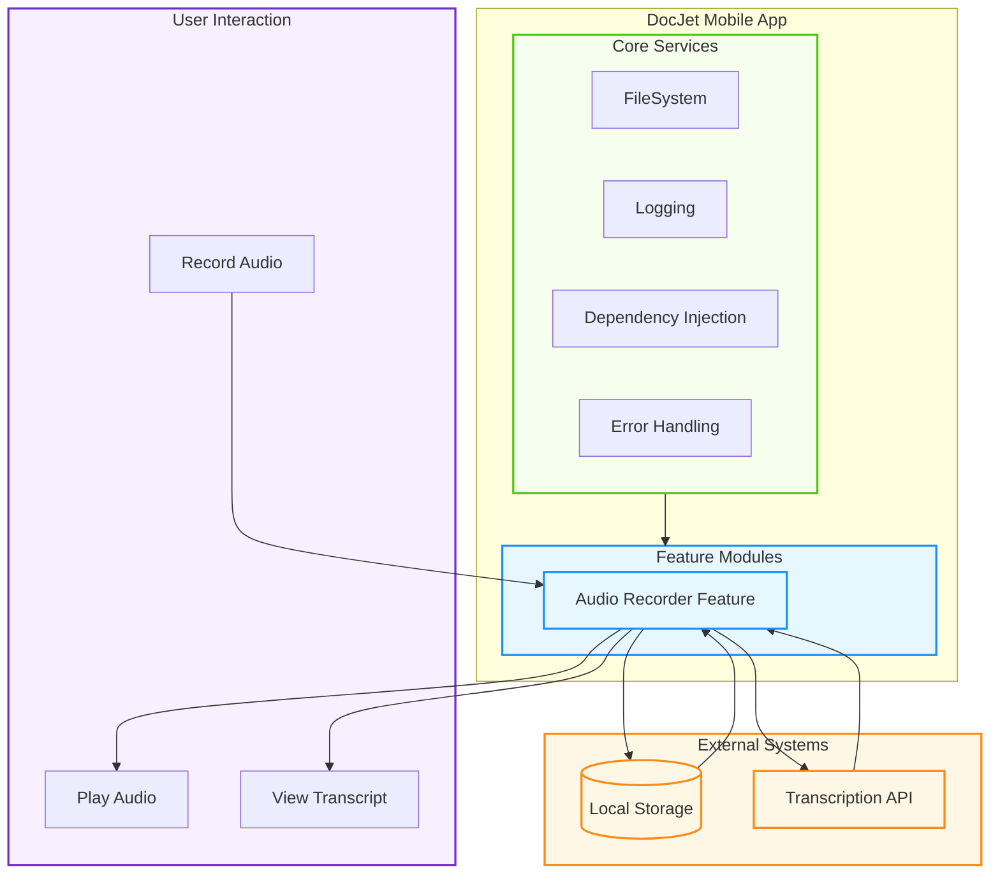
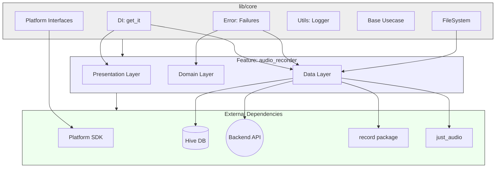
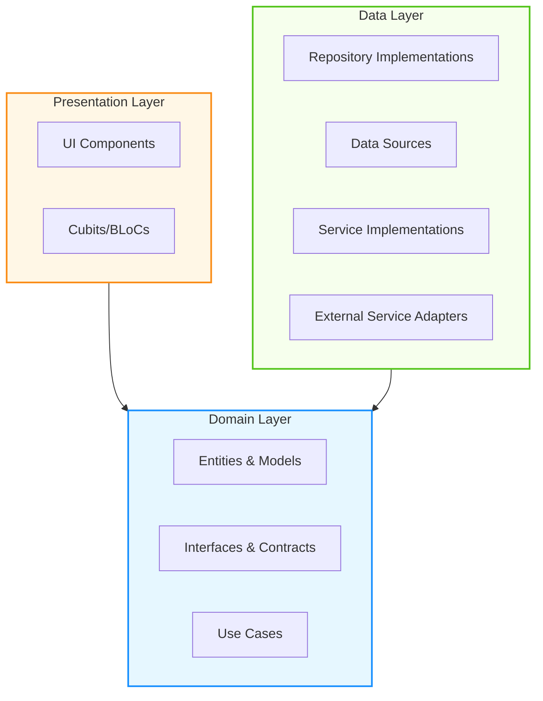
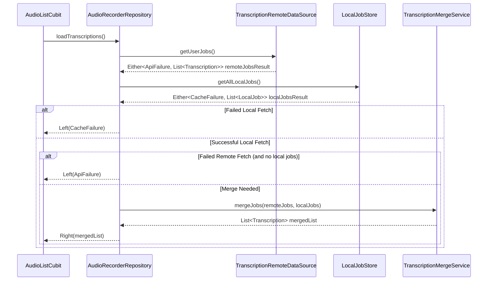
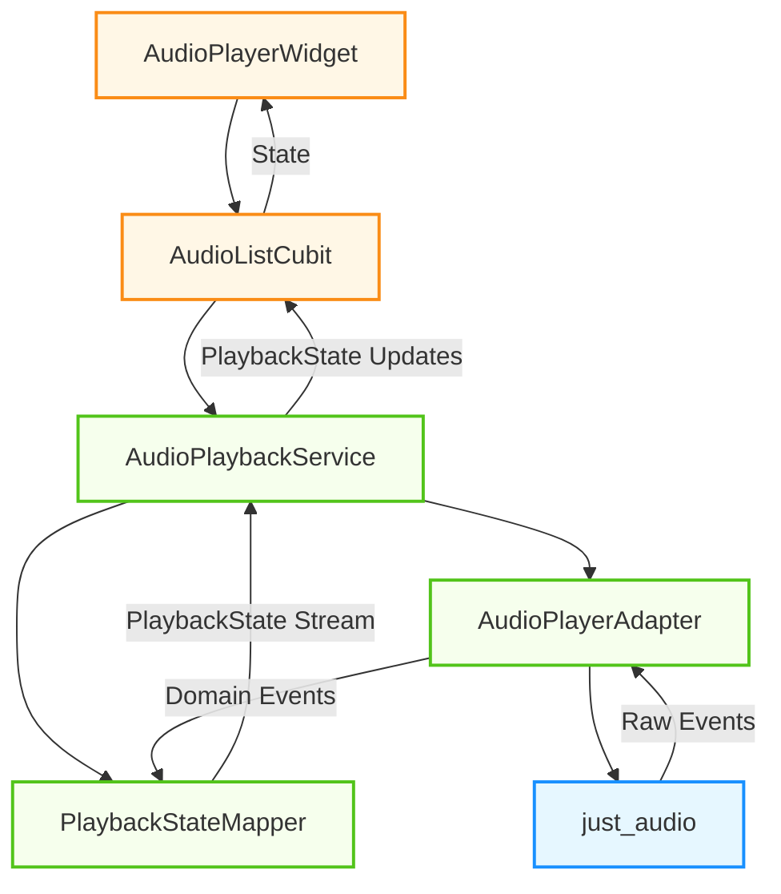
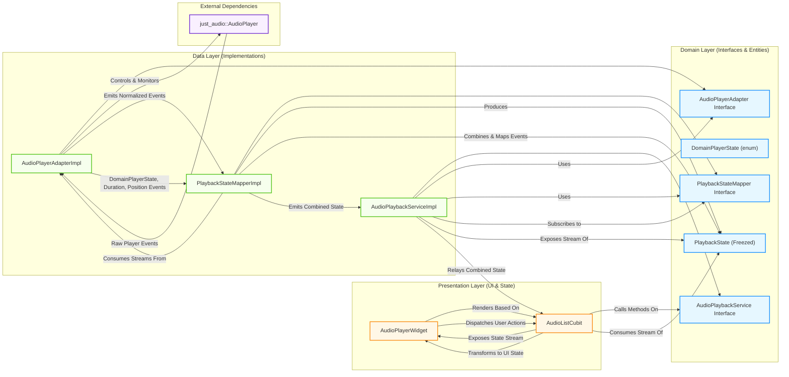
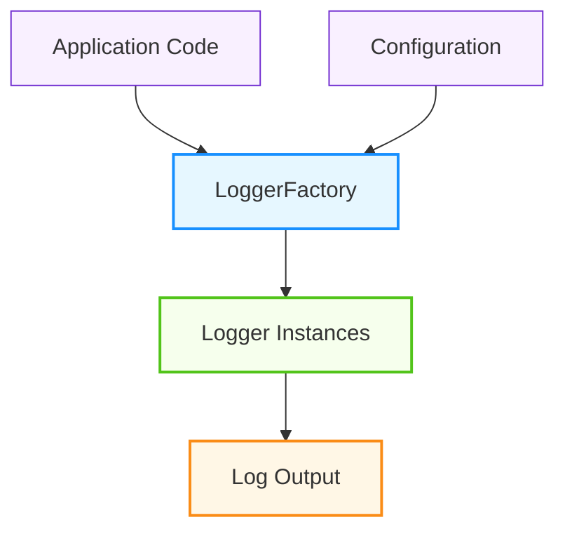
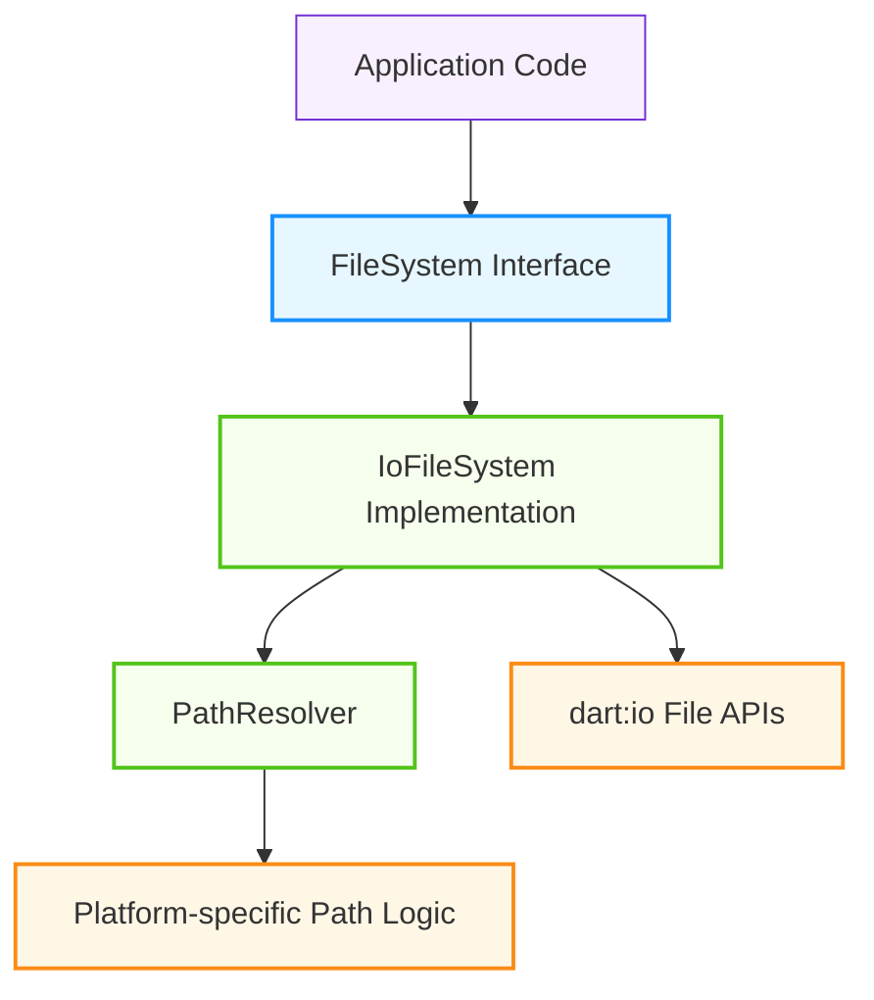
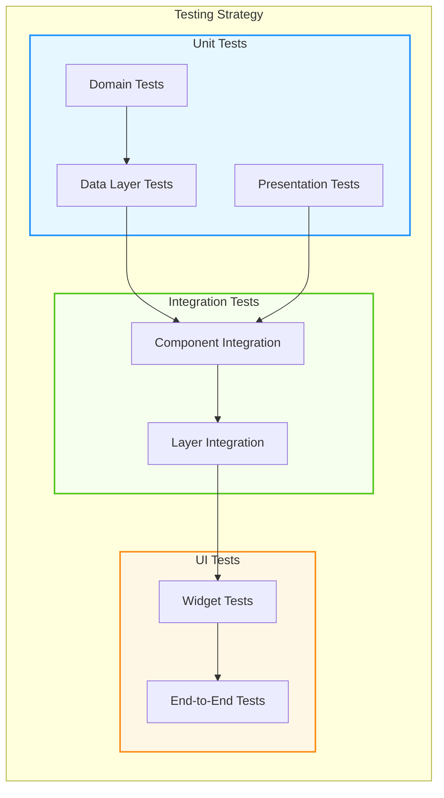

# DocJet Mobile: Architecture Documentation

This document outlines the architecture for the DocJet Mobile app, which provides audio recording, transcription, and playback capabilities. The architecture follows a **Feature-Sliced Clean Architecture** approach for maintainability, testability, and scalability.

***Note (July 2024): This document reflects the current architecture state including recent refactoring work on logging standardization and file path handling.***

## 1. System Overview

DocJet Mobile is an audio recording and transcription application that allows users to:
1. Record audio
2. Store recordings locally
3. Send recordings for transcription
4. View and play recordings with their transcripts

The following high-level diagram illustrates the overall system architecture and data flow:



### 1.1 Key Architectural Decisions

| Decision | Rationale |
|---|---|
| **Feature-Sliced Architecture** | Enables parallel development, better separation of concerns, and allows features to evolve independently |
| **Clean Architecture Layers** | Isolates business logic (domain) from implementation details (data) and presentation concerns |
| **Dependency Injection** | Improves testability and allows for clean runtime configuration |
| **Stream-Based Reactive Approach** | Provides real-time UI updates and better handles asynchronous events from audio hardware |
| **Adapter Pattern for Audio** | Isolates the application from specific audio library implementations and simplifies testing |
| **Standardized File Handling** | Prevents iOS/Android path-related bugs and provides consistent file access |
| **Centralized Logging** | Enables dynamic control of log verbosity and standardizes error reporting |

### 1.2 Refactoring Status

| Refactoring Step | Status | Description |
|---|---|---|
| **Logging Standardization** | ✅ COMPLETE | Implemented LoggerFactory with dynamic log level control |
| **File Path Handling** | ✅ COMPLETE | Centralized file operations through FileSystem with proper path resolution |
| **Seek API Fixes** | 🔄 IN PROGRESS | Addressing inconsistencies in the seek API |
| **Error Handling** | 📅 PLANNED | Standardizing error handling and propagation |
| **Stream Flow** | 📅 PLANNED | Reducing stream complexity in mappers |
| **State Management** | 🔮 FUTURE | Consolidating state management |
| **Coupling Reduction** | 🔮 FUTURE | Improving encapsulation |
| **UI Performance** | 🔮 FUTURE | Enhancing rendering and responsiveness |

## 2. Core Architecture

The application is structured according to feature-sliced clean architecture principles:



### 2.1 Layer Responsibilities

* **Core Layer**: Contains application-wide utilities, abstractions, and configurations
* **Feature Modules**: Self-contained functional units with their own Clean Architecture layers
* **External Dependencies**: Third-party libraries and services managed via adapters and interfaces

### 2.2 Clean Architecture Within Features

Each feature follows Clean Architecture with these layers:



#### Domain Layer
* **Entities**: Core business objects and value types
* **Interfaces**: Contracts for repositories and services
* **Use Cases**: Business logic operations

#### Data Layer
* **Repositories**: Implement domain interfaces
* **Data Sources**: Handle data access (local/remote)
* **Services**: Implement complex business operations
* **Adapters**: Wrap external libraries

#### Presentation Layer
* **UI Components**: Widgets and screens
* **State Management**: Cubits/BLoCs

## 3. Audio Recorder Feature

The Audio Recorder feature handles recording, storing, transcribing, and playing back audio files.

### 3.1 Feature Structure

```mermaid
graph TB
    subgraph AudioRecorderFeature [Audio Recorder Feature]
        direction TB
        
        subgraph Domain [Domain Layer]
            Entities[Entities (Transcription, LocalJob)]
            Repositories[Repository Interfaces (AudioRecorderRepository, LocalJobStore)]
            Services[Service Interfaces (AudioPlaybackService, TranscriptionMergeService)]
            Adapters[Adapter Interfaces (AudioPlayerAdapter)]
            Mappers[Mapper Interfaces (PlaybackStateMapper)]
        end
        
        subgraph Data [Data Layer]
            RepoImpls[Repository Implementations (AudioRecorderRepositoryImpl, HiveLocalJobStoreImpl)]
            DataSources[Data Sources (AudioLocalDataSource, TranscriptionRemoteDataSource)]
            ServiceImpls[Service Implementations (AudioPlaybackServiceImpl, TranscriptionMergeServiceImpl)]
            AdapterImpls[Adapter Implementations (AudioPlayerAdapterImpl)]
            MapperImpls[Mapper Implementations (PlaybackStateMapperImpl)]
            Utils[Utils (AudioFileManager)]
        end
        
        subgraph Presentation [Presentation Layer]
            Pages[Pages (AudioRecorderListView)]
            Cubits[Cubits (AudioListCubit, AudioRecordingCubit)]
            Widgets[Widgets (AudioPlayerWidget)]
        end
    end
    
    %% Dependencies
    Data --> Domain
    Presentation --> Domain
    
    %% Styling
    style Domain fill:#e6f7ff,stroke:#1890ff,stroke-width:2px
    style Data fill:#f6ffed,stroke:#52c41a,stroke-width:2px
    style Presentation fill:#fff7e6,stroke:#fa8c16,stroke-width:2px
```

### 3.2 Key Components & Data Flows

1.  **Recording Pipeline**:
    *   `AudioRecordingCubit` → `AudioRecorderRepository` → `AudioLocalDataSource` (uses `record` package) → `FileSystem` (via `AudioFileManager`) → `LocalJobStore` (Hive)

2.  **Transcription List Loading & Merging Pipeline**:
    *   `AudioListCubit` → `AudioRecorderRepository`
    *   `AudioRecorderRepository` → `LocalJobStore` (Hive)
    *   `AudioRecorderRepository` → `TranscriptionRemoteDataSource` (Backend API)
    *   `AudioRecorderRepository` → `TranscriptionMergeService` → Merged `List<Transcription>`

3.  **Transcription Upload Pipeline**:
    *   (User Action/Trigger) → `AudioRecorderRepository` → `LocalJobStore` (validate state) → `TranscriptionRemoteDataSource` (upload) → `LocalJobStore` (update state)

4.  **Playback Pipeline**:
    *   `AudioPlayerWidget` → `AudioListCubit` → `AudioPlaybackService` → `PlaybackStateMapper` & `AudioPlayerAdapter` → `just_audio`

5.  **Storage**:
    *   Local audio files managed by `FileSystem` via `AudioFileManager`.
    *   Local job metadata (`LocalJob`) stored via `LocalJobStore` (Hive).
    *   Merged view (`Transcription`) constructed by the repository using the `TranscriptionMergeService`.

### 3.3 Data Flow: Loading Transcription List

This diagram illustrates how the repository combines local and remote data to present the unified list of transcriptions to the Cubit.



## 4. Audio Playback Architecture

The audio playback system has been refactored and standardized on `just_audio`. This architecture uses adapters and mappers to isolate the application from the specific audio library implementation.

### 4.1 Playback Components Overview

This diagram shows the high-level flow of control and state updates during playback.



### 4.2 Detailed Event Flow Diagram

This diagram details the interaction between components and the transformation of events.



### 4.3 Key Playback Components

#### Domain Layer
* **`AudioPlayerAdapter` Interface**:
  * Abstracts audio player operations
  * Provides streams for player events
  * Includes `getDuration()` method for retrieving audio file length

* **`PlaybackState` Entity**:
  * Represents business-level playback states (initial, loading, playing, paused, stopped, completed, error)
  * Created using Freezed for immutability and union types

* **`DomainPlayerState` Enum**:
  * Abstracts library-specific player states to domain-specific states
  * Provides clear state transitions for the mapper

* **`PlaybackStateMapper` Interface**:
  * Defines contract for transforming raw player events to business states
  * Combines position, duration, and state events into a unified state

* **`AudioPlaybackService` Interface**:
  * Provides high-level playback API (play, pause, resume, seek, stop)
  * Exposes combined playback state stream

#### Data Layer
* **`AudioPlayerAdapterImpl`**:
  * Wraps `just_audio` library
  * Maps raw player states to domain states
  * Handles library-specific edge cases
  * Provides duration retrieval through the adapter

* **`PlaybackStateMapperImpl`**:
  * Combines various input streams into a coherent PlaybackState
  * Uses RxDart for stream transformation
  * Maintains internal state for consistency

* **`AudioPlaybackServiceImpl`**:
  * Orchestrates audio playback using the adapter
  * Manages playback context (current file, etc.)
  * Exposes the mapper's output stream

#### Presentation Layer
* **`AudioListCubit`**:
  * Manages UI state using the BLoC pattern
  * Subscribes to service streams
  * Preserves playback context across state changes
  * Handles errors and edge cases

* **`AudioPlayerWidget`**:
  * Renders playback controls and progress
  * Dispatches user actions to the cubit
  * Manages local UI state for smooth interactions

### 4.4 Critical Implementation Details

**Critical Wiring in Dependency Injection**:

```dart
sl.registerLazySingleton<AudioPlaybackService>(() {
  // Resolve dependencies first
  final adapter = sl<AudioPlayerAdapter>();
  final mapper = sl<PlaybackStateMapper>();

  // **** THE CRITICAL WIRING STEP ****
  // Initialize the mapper with the adapter's streams
  // We MUST cast mapper back to its implementation type to access initialize
  (mapper as PlaybackStateMapperImpl).initialize(
    positionStream: adapter.onPositionChanged,
    durationStream: adapter.onDurationChanged,
    completeStream: adapter.onPlayerComplete,
    playerStateStream: adapter.onPlayerStateChanged,
  );
  // ***********************************

  // Now create the service instance with the wired dependencies
  return AudioPlaybackServiceImpl(
    audioPlayerAdapter: adapter,
    playbackStateMapper: mapper,
  );
});
```

This crucial wiring connects the streams from the adapter to the mapper, ensuring events flow correctly through the system.

## 5. Cross-Cutting Concerns

### 5.1 Centralized Logging System (COMPLETED)

The application uses a standardized, centralized logging system. This architecture was implemented as part of Step 1 in the refactoring plan.



#### Key Components
* **`LoggerFactory`**: Creates and configures loggers with consistent settings
* **Component-specific Logging**: Each component has its own logger with configurable levels
* **Runtime Log Control**: Log levels can be adjusted dynamically
* **Testing Support**: Comprehensive testing utilities for verifying logs

#### Implementation Pattern
```dart
class MyComponent {
  // Component-specific logger
  final logger = LoggerFactory.getLogger(MyComponent, level: Level.off);
  
  // Optional tag for consistent logging
  static final _tag = logTag(MyComponent);
  
  // Optional debug enabler
  static void enableDebugLogs() => LoggerFactory.setLogLevel(MyComponent, Level.debug);
  
  void doSomething() {
    logger.d('$_tag doSomething: Started');
    try {
      // Implementation
      logger.d('$_tag doSomething: Completed');
    } catch (e, s) {
      logger.e('$_tag doSomething: Failed', error: e, stackTrace: s);
      rethrow;
    }
  }
}
```

### 5.2 File Path Handling (COMPLETED)

The application uses a robust, centralized file path handling system. This architecture was implemented as part of Step 8 in the refactoring plan.



#### Key Components
* **`FileSystem` Interface**: Single access point for all file operations
* **`PathResolver`**: Handles platform-specific path resolution (internal only)
* **Relative Path Storage**: All stored paths are relative to app's container directory
* **Clear Error Handling**: Fast failure with explicit error messages

#### Implementation Pattern
```dart
class MyComponent {
  final FileSystem _fileSystem;
  
  MyComponent(this._fileSystem);
  
  Future<void> processFile(String relativePath) async {
    // Check if file exists
    final exists = await _fileSystem.fileExists(relativePath);
    if (!exists) {
      throw FileNotFoundException('File not found: $relativePath');
    }
    
    // Read file
    final bytes = await _fileSystem.readFile(relativePath);
    
    // Process data...
    
    // Write result
    await _fileSystem.writeFile('results/$relativePath', processedBytes);
  }
}
```

## 6. Upcoming Architectural Improvements

Based on the refactoring plan, the following architectural improvements are in progress or planned:

### 6.1 Fixing the Seek API (IN PROGRESS)
* **Problem**: The adapter's `seek` method takes a `filePath` parameter but doesn't use it
* **Solution**: Create a new adapter interface with a simplified `seek(Duration)` method
* **Status**: In progress
* **Impact**: Clearer responsibility separation and more intuitive API

### 6.2 Standardizing Error Handling (PLANNED)
* **Problem**: Inconsistent error handling across components
* **Solution**: Standardize error types and propagation patterns
* **Status**: Planned
* **Impact**: Better error recovery and user feedback

### 6.3 Simplifying Stream Flow (PLANNED)
* **Problem**: Complex stream transformation in mappers
* **Solution**: Simplify stream handling and reduce unnecessary transformations
* **Status**: Planned
* **Impact**: Performance improvements and code simplification

### 6.4 Future Improvements
* **Reducing Stateful Components**: Consolidating state management
* **Reducing Coupling**: Better encapsulation with context objects
* **Improving UI Performance**: Enhanced rendering and responsiveness

## 7. Testing Strategy

The architecture enables comprehensive testing at all levels:



### Domain Layer Tests
* Pure Dart unit tests
* No external dependencies
* Focus on business logic

### Data Layer Tests
* Mocked external dependencies
* Test repositories, adapters, and services in isolation
* Verify external API contract compliance

### Presentation Layer Tests
* Cubit/BLoC tests for state management
* Widget tests for UI components
* Mocked domain services

### Integration Tests
* Test component interactions
* Verify correct event propagation
* May use fake implementations

## 8. Conclusion

The DocJet Mobile architecture demonstrates a modern, maintainable approach to Flutter application development. While appearing complex at first glance, the architecture's separation of concerns and clear boundaries enable:

1. **Independent Testing**: Each component can be tested in isolation
2. **Parallel Development**: Features and layers can be developed concurrently
3. **Adaptability**: Implementation details can change without affecting core business logic
4. **Maintainability**: Clear responsibility boundaries reduce the risk of regressions

The ongoing refactoring efforts show a commitment to continuous improvement and addressing technical debt proactively rather than reactively.

---

*"Complex systems that work invariably evolved from simple systems that worked."* — John Gall
