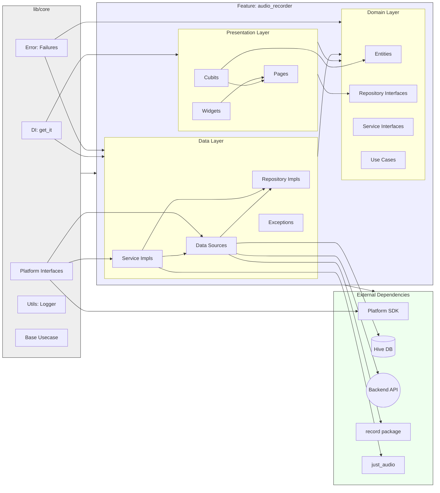
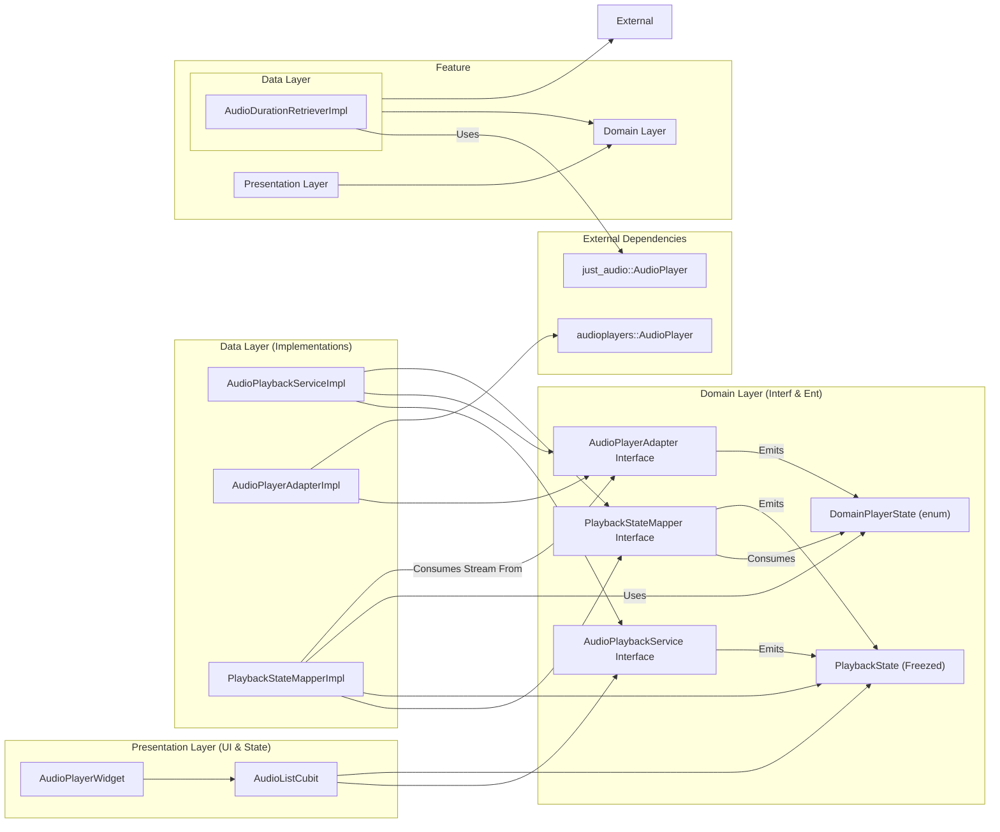

# Architecture: Audio Transcription Feature

This document outlines the **implemented architecture** for the audio recording and transcription feature, based on a **Feature-Sliced Clean Architecture** approach. Local audio files are treated as payloads for a backend transcription service, with local persistence (Hive) managing offline jobs and metadata like duration.

***Note (April 8th, 2024): This document has been updated to reflect the actual codebase structure and implementation status. The architecture uses feature-slicing, and core functionality (local storage, fake API interaction, repository logic, basic presentation) is largely implemented.***

## 1. Overall Structure (Feature-Sliced Clean Architecture)

The project utilizes a feature-sliced approach combined with Clean Architecture principles:

*   **`lib/core/`**: Contains application-wide, reusable components, abstractions, and utilities (DI, error handling, platform interfaces, base use cases, logging).
*   **`lib/features/`**: Houses individual, self-contained feature modules. Currently, only `audio_recorder` exists.
*   **`lib/features/<feature_name>/`**: Each feature internally follows Clean Architecture layers:
    *   **`domain/`**: Contains business logic, entities, repository interfaces, domain service interfaces, and feature-specific use cases. It has no dependencies on other layers.
    *   **`data/`**: Implements repository interfaces, defines data sources (local, remote), manages data models/DTOs, and data-specific exceptions/services. Depends only on `domain`.
    *   **`presentation/`**: Contains UI elements (pages, widgets) and state management (Cubits/Blocs). Depends only on `domain`.



*(Note: This diagram shows the general structure and dependencies for the `audio_recorder` feature within the overall architecture.)*

## 2. Implemented Architecture Details

This architecture treats local files as opaque handles/payloads. The primary source of truth for list display is a **merged state** derived from the backend API (via `TranscriptionRemoteDataSource`) and local persistence (`LocalJobStore` using Hive). **Local audio duration is captured ONCE after recording and stored locally via `LocalJobStore`.**

**Key Components & Flow (Listing):**

1.  **Local Job Capture & Persistence (Implemented):**
    *   `AudioDurationRetriever` (`data/services/`) is called by `AudioLocalDataSourceImpl.stopRecording()` (`data/datasources/`).
    *   `AudioLocalDataSourceImpl` creates a `LocalJob` entity (`domain/entities/`) with `status = created`, `durationMillis`, `localFilePath`, `localCreatedAt`.
    *   It saves this `LocalJob` using the injected `LocalJobStore` interface (`domain/repositories/`).
    *   **`LocalJobStore` Interface (Domain - Implemented):** Defines the contract for local persistence.
    *   **Implementation (`HiveLocalJobStoreImpl` - Implemented):** Uses `Hive` (`data/datasources/`) to store `LocalJob` objects. Hive is initialized, adapters registered, and the store injected via `get_it` (`core/di/`).
2.  **Simplified Local File Listing (Assumed via `AudioFileManager`):**
    *   `AudioFileManager` (`data/services/`) likely provides basic path listing, removing the old N+1 problem (implementation details not fully verified but structure exists).
3.  **Backend Integration (Interface + Fake Implementation):**
    *   **`TranscriptionRemoteDataSource` Interface (Domain - Implemented):** Defines contract (`

## 3. Audio Playback Architecture (Refactored - April 2024)

**UPDATE (Current Date - Please fill in):** The leaky abstraction in the audio playback system identified on April 15th has been **partially fixed**. The `AudioPlayerAdapter` interface and its consumers (`PlaybackStateMapper`) now use a library-agnostic `DomainPlayerState` enum, removing the direct dependency on `audioplayers::PlayerState` from the domain layer. However, the system **still uses two different audio libraries**: `audioplayers` in `AudioPlayerAdapterImpl` for playback and `just_audio` in `AudioDurationRetrieverImpl` for duration retrieval. Standardizing on a single library (`just_audio`) is the next step.

**REVISED PLAN:**
1.  **Phase 1 (Interface Decoupling - COMPLETE):** Defined `DomainPlayerState` enum. Updated `AudioPlayerAdapter` interface to use `DomainPlayerState`. Updated the `audioplayers`-based `AudioPlayerAdapterImpl` and the `PlaybackStateMapper` implementation & tests to conform to the new interface contract.
2.  **Phase 2 (Standardize on `just_audio` - NEXT):** Rewrite the `AudioPlayerAdapterImpl` to use `just_audio` instead of `audioplayers`. Update the adapter tests accordingly. Remove the `audioplayers` dependency entirely.

The following description reflects the state *after* Phase 1 and *before* Phase 2 begins.

The audio playback system utilizes a Clean Architecture approach with Adapter and Mapper patterns. The Domain layer is now decoupled from specific player implementations.

### 3.1. Playback Architecture Diagram



### 3.2. Relevant File Structure

```
lib/features/audio_recorder/
├── domain/
│   ├── adapters/
│   │   └── audio_player_adapter.dart      # Interface: Abstracts player. Uses DomainPlayerState.
│   ├── entities/
│   │   ├── domain_player_state.dart     # Entity (enum): Library-agnostic player states.
│   │   └── playback_state.dart          # Entity (Freezed): UI-facing playback states.
│   ├── mappers/
│   │   └── playback_state_mapper.dart   # Interface: Abstracts raw event -> PlaybackState. Consumes DomainPlayerState.
│   └── services/
│       └── audio_playback_service.dart  # Interface: High-level playback API.
├── data/
│   ├── adapters/
│   │   └── audio_player_adapter_impl.dart # Implementation: Wraps 'audioplayers'. Maps to DomainPlayerState.
│   ├── mappers/
│   │   └── playback_state_mapper_impl.dart# Implementation: Maps DomainPlayerState -> PlaybackState.
│   └── services/
│       ├── audio_duration_retriever_impl.dart # IMPL: Uses 'just_audio' for duration.
│       └── audio_playback_service_impl.dart # Implementation: Orchestrates Adapter & Mapper.
└── presentation/
    ├── cubit/
    │   ├── audio_list_cubit.dart        # State Management: Uses AudioPlaybackService.
    │   └── audio_list_state.dart        # State Definition: Includes PlaybackInfo.
    └── widgets/
        └── audio_player_widget.dart     # UI Component: Displays controls & info.
```

### 3.3. File Responsibilities (Updated)

*   **Domain Layer:**
    *   `domain/adapters/audio_player_adapter.dart`: Defines the *contract* for interacting with *any* audio player. **FIXED:** Uses `DomainPlayerState` for its `onPlayerStateChanged` stream, removing the leaky abstraction. Removed redundant `play()` method.
    *   `domain/entities/domain_player_state.dart`: **NEW:** Defines the library-agnostic player states (`playing`, `paused`, `stopped`, etc.).
    *   `domain/entities/playback_state.dart`: Defines the core *business state* (`initial`, `loading`, `playing`, etc.) using `freezed`. Used by Presentation Layer.
    *   `domain/mappers/playback_state_mapper.dart`: Defines the *contract* for transforming event streams into `Stream<PlaybackState>`. **FIXED:** Its `initialize` method now accepts `Stream<DomainPlayerState>`.
    *   `domain/services/audio_playback_service.dart`: Defines the high-level playback use cases (play, pause, etc.). Exposes `Stream<PlaybackState>`.
*   **Data Layer:**
    *   `data/adapters/audio_player_adapter_impl.dart`: *Implements* `AudioPlayerAdapter` using **`audioplayers`**. **FIXED:** Maps internal `audioplayers` states to `DomainPlayerState` in its `onPlayerStateChanged` stream. **NEXT STEP (Phase 2):** Rewrite this using `just_audio`.
    *   `data/mappers/playback_state_mapper_impl.dart`: *Implements* `PlaybackStateMapper`. **FIXED:** Accepts `Stream<DomainPlayerState>` via `initialize` and maps these domain states into the final `PlaybackState` stream.
    *   `data/services/audio_duration_retriever_impl.dart`: (**ISSUE**) Uses `just_audio` to get duration. Will likely be simplified or merged once `AudioPlayerAdapterImpl` uses `just_audio`.
    *   `data/services/audio_playback_service_impl.dart`: Orchestrates Adapter & Mapper. (Implementation verified, but lacks dedicated tests).
