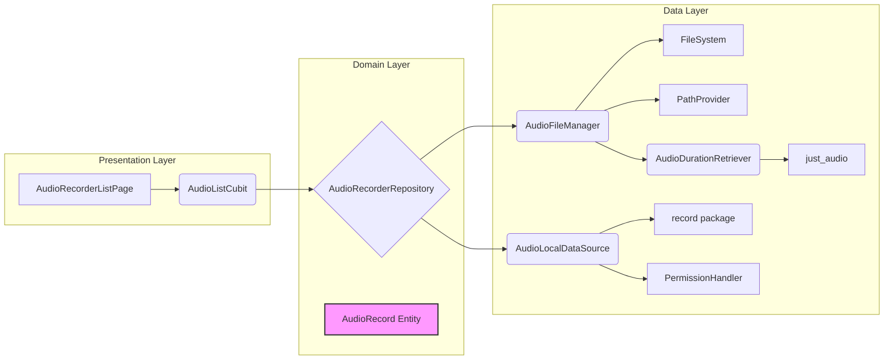
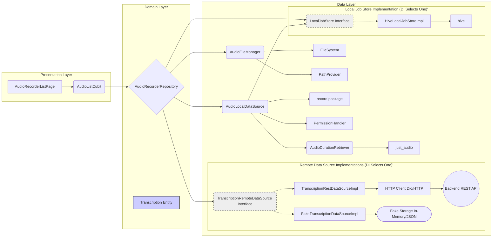

# Architecture: Audio Transcription Feature

This document outlines the current and proposed architecture for the audio recording and transcription feature, reflecting the understanding that local audio files serve primarily as payloads for a backend transcription service.

***Note (April 7th, 2024): The current codebase primarily reflects the "Current Architecture" described in Section 1. The implementation has *not yet* been fully updated to match the "Proposed Architecture" in Section 2. This document serves as the target state and plan.***

## 1. Current Architecture (Pre-Transcription API Focus)

This architecture focused heavily on managing audio files locally, treating local metadata (duration, creation date via file stat) as the primary source of truth for the UI list.

**Flow (Listing):**

1.  `AudioListCubit` requests recordings from `AudioRecorderRepository`.
2.  `AudioRecorderRepository` calls `AudioFileManager.listRecordingDetails`.
3.  `AudioFileManagerImpl` lists directory contents (`.m4a` files).
4.  **N+1 Problem:** For each file, it *concurrently* calls:
    *   `FileSystem.stat()` to get `FileStat` (for `createdAt` via `modified` time).
    *   `AudioDurationRetriever.getDuration()` which uses `just_audio` (creating a player instance per file) to read duration metadata.
5.  Details are mapped to `AudioRecord` entities and returned to the Cubit/UI.

**Key Issues:**

*   **Misaligned Focus:** Treats local files and their metadata as the primary data, which is incorrect given the transcription API requirement.
*   **Performance Bottleneck (N+1):** Fetching `stat` and `duration` for each file locally is inefficient and slow, especially `getDuration` via `just_audio`.
*   **Redundant Data:** Local duration and exact creation time might be irrelevant if the backend provides canonical information post-transcription.
*   **Bloated Data Layer:** `AudioFileManager` and `AudioDurationRetriever` exist solely to fetch local metadata that is likely unnecessary.

## 2. Proposed Architecture (Transcription API Focused - Revised for Local Duration)

This revised architecture treats local files as opaque handles/payloads. The primary source of truth for list display becomes the transcription status and metadata retrieved from the backend API. **Local audio duration is captured ONCE after recording and stored locally.**

*(Note: `AudioDurationRetriever (I)` used *only* by `AudioLocalDataSource (F)` after recording. `LocalJobStore (Q_Interface)` replaces `LocalDurationStore`, implemented with Hive. `TranscriptionRemoteDataSource (N_Interface)` shown with `Real` and `Fake` implementations.)*

**Key Changes & Flow (Listing):**

1.  **Local Job Capture & Persistence (NEW):**
    *   `AudioDurationRetriever` is **KEPT**, but called **ONLY** by `AudioLocalDataSource.stopRecording()` *after* recording finishes successfully *or* when saving an offline job.
    *   When a recording is finished (or determined to be offline initially):
        *   `AudioLocalDataSource` (or potentially a new coordinating service) gathers `localFilePath`, `durationMillis`, sets `status` to `created`.
        *   It saves this information using the **`LocalJobStore` Interface**.
    *   **`LocalJobStore` Interface (Domain):** Defines the contract for local job persistence (replacing `LocalDurationStore`).
        *   `Future<void> saveJob(LocalJob job);` // Where LocalJob is a simple entity/DTO
        *   `Future<LocalJob?> getJob(String localFilePath);`
        *   `Future<List<LocalJob>> getOfflineJobs();` // Get jobs needing upload (status == 'created')
        *   `Future<List<LocalJob>> getAllLocalJobs();` // Get all locally tracked jobs for merging
        *   `Future<void> updateJobStatus(String localFilePath, TranscriptionStatus status, {String? backendId});` // To update on successful upload
        *   `Future<void> deleteJob(String localFilePath);` // Needed for cleanup when backend job is confirmed or deleted
    *   **Implementation (`HiveLocalJobStoreImpl`):** Uses `Hive` to efficiently store and query `LocalJob` objects (containing path, duration, status, potentially creation time for FIFO). Replaces the `shared_preferences` approach.
2.  **Simplified Local File Listing:**
    *   `AudioFileManager` interface: `listRecordingDetails()` becomes `listRecordingPaths()` -> `Future<List<String>>`.
    *   `AudioFileManagerImpl`: Simply lists `.m4a` file paths. No `stat`, no duration fetching during list load. **N+1 problem eliminated.**
3.  **Backend Integration:**
    *   **`TranscriptionRemoteDataSource` Interface (Domain):** Defines contract for backend communication (e.g., `getAllTranscriptionStatuses`, `uploadForTranscription`, `getTranscriptionJob`).
    *   **Implementation Strategy:**
        *   `TranscriptionRestDataSourceImpl`: Uses HTTP client for the real API (Production).
        *   **`FakeTranscriptionDataSourceImpl` (CRUCIAL):** Implements the interface using in-memory/JSON data. **Essential for development/testing** to simulate states, delays, and errors without hitting the real backend.
        *   Dependency Injection (`get_it`) selects the implementation.
    *   **`Transcription` Entity (Domain - Revised):** Represents the merged state of a recording/job.
        *   `String? id`: **Backend Job ID (UUID format). Nullable.** This is only populated *after* the job is successfully submitted to the backend API.
        *   `String localFilePath`: The path on the device. **Primary key for local-only jobs.** Crucial for mapping and managing the actual file.
        *   `TranscriptionStatus status`: Enum (`created`, `submitted`, `uploading`, `processing`, `transcribed`, `generating`, `completed`, `failed`). Adjusted statuses.
        *   `DateTime? localCreatedAt`: Timestamp when the recording was saved locally. Useful for FIFO if needed.
        *   `DateTime? backendCreatedAt`: Timestamp from backend.
        *   `DateTime? backendUpdatedAt`: Timestamp of last backend update.
        *   `int? localDurationMillis`: Duration stored locally post-recording (via `LocalJobStore`).
        *   `int? backendDurationMillis`: Duration provided by the backend (if available).
        *   `String? displayTitle`: Title snippet from backend.
        *   `String? displayText`: Text preview snippet from backend.
        *   `String? errorCode`: Backend error code if `status` is `failed`.
        *   `String? errorMessage`: Backend error message if `status` is `failed`.
        *   **Duration Logic:** The Repository/Cubit should prioritize `backendDurationMillis` if available (e.g., status >= `transcribed`), otherwise use `localDurationMillis`.
        *   **Explicit Clarification:** This `Transcription` entity is the **client-side, unified representation** of a recording job's state. It merges data persisted locally (via `LocalJobStore`, especially for `created` status jobs using `localFilePath` as the key) with data fetched from the backend API (identified by the `id` field once available). Its fields (like `status`, `displayTitle`) directly map to what the UI needs to show in the "Transkripte" list, aligning with the `spec.md`. It is *distinct* from the backend `Job` entity but represents its state on the mobile client.
        *   **Duration Logic:** When mapping data to the `Transcription` entity, the Repository/Cubit *must* prioritize `backendDurationMillis` if it's available and non-null (indicating the backend processed it). Otherwise, it *must* fall back to using `localDurationMillis` from the `LocalJobStore`.
        *   **ID Handling Emphasis:** `String? id`: Backend Job ID (UUID format). **Nullable.** This is the primary identifier *once the job exists on the backend*. Before that (status `created`), `localFilePath` is the key identifier for local management.
4.  **Orchestration (`AudioRecorderRepositoryImpl`):**
    *   Depends on `AudioFileManager`, `TranscriptionRemoteDataSource`, and `LocalJobStore`.
    *   `loadTranscriptions()` method:
        *   Calls `TranscriptionRemoteDataSource.getAllTranscriptionStatuses()`. Handles API errors.
        *   Calls `LocalJobStore.getAllLocalJobs()`.
        *   Calls `AudioFileManager.listRecordingPaths()` (potentially redundant if paths are reliably in `LocalJobStore`, but useful for sanity checks/cleanup).
        *   **Merges information** into `List<Transcription>`:
            *   Maps backend statuses to `Transcription` objects, using `id` as the key.
            *   Maps local jobs (from `LocalJobStore`) to `Transcription` objects, using `localFilePath` as the key, setting `id = null`, status = `created`, etc.
            *   Combines the lists, potentially resolving conflicts (e.g., a job exists locally and remotely).
            *   Applies duration priority logic.
        *   Returns `List<Transcription>` (or `Result<List<Transcription>, Error>`).
    *   `uploadRecording(String localFilePath)` method:
        *   Retrieves job details from `LocalJobStore`.
        *   Calls `TranscriptionRemoteDataSource.uploadForTranscription(localFilePath, ...)`.
        *   On success: calls `LocalJobStore.updateJobStatus`.
        *   Handles failures/retries.
    *   Background sync logic (potentially triggered elsewhere) would use `LocalJobStore.getOfflineJobs()` and call `uploadRecording`.
    *   **Merge Logic - Key Scenarios to Handle:** The merge process *must* correctly handle:
        *   **Local-Only Jobs:** Files present locally (`LocalJobStore` entry with status `created`, no backend `id`), not yet known to the backend.
        *   **Backend-Only Jobs:** Info received from the API, but no corresponding `LocalJob` entry (e.g., created via web, or local entry lost). File might or might not be locally present.
        *   **Synced Jobs:** Present in both `LocalJobStore` (with a `backendId` and status potentially >= `submitted`) and the API response. Use the API data as the primary source of truth for status/metadata, but retain `localFilePath` and `localDurationMillis`.
        *   **Conflict Resolution:** Define precedence if statuses differ unexpectedly (e.g., API says `transcribing`, local store says `created`). Generally, API status wins for jobs with a backend `id`.
        *   **Backend ID Mapping:** Correctly associate local jobs with backend responses once an upload succeeds and a backend `id` is available (updating the `LocalJobStore` record).
        *   **Orphaned Local Files/Jobs:** Files listed by `AudioFileManager` but *not* in `LocalJobStore` or the API response (potential cleanup needed?). Jobs in `LocalJobStore` but *not* in the API response *or* locally present files (stale data?).
5.  **Presentation (`AudioListCubit`):**
    *   Manages `AudioListState` containing `List<Transcription>`.
    *   Displays data based on `Transcription` fields (status, title, text, appropriate duration).
    *   Initiates uploads/retries via the repository.

**Benefits:**

*   **Aligns with Reality & Requirement:** Reflects API-centric process AND includes local duration.
*   **Performance:** Eliminates N+1 list load bottleneck. Duration fetched once.
*   **Clean Data Flow:** Clear separation of concerns.
*   **Single Source of Truth (Defined):** Backend dictates status/metadata for processed jobs; `LocalJobStore` (Hive) manages state for local-only/pending jobs.
*   **Testability:** `FakeDataSource` allows isolated UI/domain logic testing. `LocalJobStore` can also be faked.
*   **Offline Support:** Robust handling of offline job creation and persistence via Hive.

## 3. Battle Plan: Implementing the Proposed Architecture

This roadmap outlines the steps to refactor the codebase from the "Current Architecture" to the "Proposed Architecture". Focus on completing each step before moving to the next to ensure a solid foundation.

1.  **Update `architecture.md`:** *(Done)* Ensure this document accurately reflects the target state and plan.
2.  **Define Domain/Data Interfaces & Entities:**
    *   Create `TranscriptionStatus` enum (`domain/entities/transcription_status.dart`) mirroring backend job statuses: `created` (local-only initial state), `submitted`, `transcribing`, `transcribed`, `generating`, `generated`, `completed`, `error`. **Crucial:** Ensure these values align *exactly* with the backend API's possible status strings defined in `spec.md` for reliable mapping.
    *   Create `Transcription` entity class (`domain/entities/transcription.dart`) with **nullable `id`** and other fields defined above. **See Section 2, point 3 for explicit clarification on this entity's role.**
    *   **`LocalJob` Entity (for Persistence):** A simple DTO/entity stored locally (e.g., in Hive) containing essential offline information:
        *   `String localFilePath` (Primary Key for local identification)
        *   `int durationMillis` (Captured once post-recording)
        *   `TranscriptionStatus status` (e.g., `created`, `submitted`, `error` if upload failed before API confirmation)
        *   `DateTime localCreatedAt` (Timestamp for FIFO processing/display)
        *   `String? backendId` (Nullable UUID, populated after successful API submission confirmation)
    *   Define `LocalJobStore` interface (`domain/repositories/local_job_store.dart`).
    *   Define `TranscriptionRemoteDataSource` interface (`domain/repositories/transcription_remote_data_source.dart`).
3.  **Implement Local Job Persistence (Hive):**
    *   Add `hive`, `hive_flutter`, `hive_generator`, `build_runner` dependencies to `pubspec.yaml`.
    *   Define the `LocalJob` class with `@HiveType` annotations.
    *   Generate the `TypeAdapter` using `build_runner`.
    *   Implement `HiveLocalJobStoreImpl` (`data/datasources/local_job_store_impl.dart`) conforming to the interface. Initialize Hive correctly.
    *   Inject `LocalJobStore` into `AudioLocalDataSourceImpl` (or a new coordinator service).
    *   Modify `AudioLocalDataSourceImpl` (or coordinator):
        *   On `stopRecording`: Call `AudioDurationRetriever.getDuration`. Create `LocalJob` (status `created`). Call `localJobStore.saveJob`. Trigger upload attempt.
        *   On successful upload (via API call elsewhere): Call `localJobStore.updateJobStatus`.
    *   Modify recording deletion logic to call `localJobStore.deleteJob`.
4.  **Implement Fake Backend Data Source:**
    *   Create `FakeTranscriptionDataSourceImpl` (`data/datasources/fake_transcription_data_source_impl.dart`).
    *   Implement methods to return hardcoded or configurable lists of `Transcription` data, simulating different statuses, delays, and errors. Store fake data in memory initially.
5.  **Refactor Repository (`AudioRecorderRepositoryImpl`):**
    *   Update dependencies: Inject `LocalJobStore`, `TranscriptionRemoteDataSource`. Adjust `AudioFileManager` usage.
    *   Rewrite `loadTranscriptions`: Implement the merge logic using `LocalJobStore` for local state and `TranscriptionRemoteDataSource` for backend state. Handle nullable `id` correctly.
    *   Implement `uploadRecording(String localFilePath)`: Interact with `TranscriptionRemoteDataSource` and update `LocalJobStore` on success/failure.
6.  **Refactor Presentation Layer (`AudioList*`):**
    *   Update `AudioListState` (`presentation/cubit/`) to manage `List<Transcription>`, loading, and error states.
    *   Update `AudioListCubit` to use the refactored `AudioRecorderRepository` method (`loadTranscriptions`) and emit the new states.
    *   Update `AudioRecorderListPage` (`presentation/pages/`):
        *   Change `BlocConsumer` to use `AudioListCubit`/`AudioListState<List<Transcription>>`.
        *   Modify the `builder` logic to handle the new state.
        *   Update `ListView.builder` and its `itemBuilder` (e.g., `ListTile`) to display data from the `Transcription` entity (status badge, title/text preview, formatted timestamp, correct duration based on priority logic).
        *   Change `AppBar` title to "Transkripte".
7.  **Implement Background Sync:**
    *   Choose a mechanism (e.g., `connectivity_plus` listener + manual trigger, `workmanager`).
    *   Implement logic to: Detect connectivity -> Get offline jobs from `LocalJobStore` -> Attempt upload via `AudioRecorderRepository` -> Update `LocalJobStore`.
8.  **Update Dependency Injection (`get_it`):**
    *   In `core/di/injection_container.dart`, register `LocalJobStore` and its Hive implementation. Register `TranscriptionRemoteDataSource` (Fake for now). Initialize Hive.
9.  **Test Core Logic & UI:**
    *   Write unit tests for `AudioRecorderRepositoryImpl` merge logic (offline, online, mixed scenarios).
    *   Test `HiveLocalJobStoreImpl`.
    *   Test background sync logic (might require integration tests).
    *   Write widget tests for `AudioRecorderListPage` handling both local (`created`) and backend states.
10. **(Later) Implement Real Backend Data Source:**
    *   Add HTTP client (`dio` or `http`) dependency.
    *   Implement `TranscriptionRestDataSourceImpl`.
    *   Update DI container to provide the real implementation for production builds.
11. **(Later) Refine UI/UX:** Once the data flow is correct, focus on improving the visual presentation and user experience of the list and recorder pages, including clear indication of offline status.