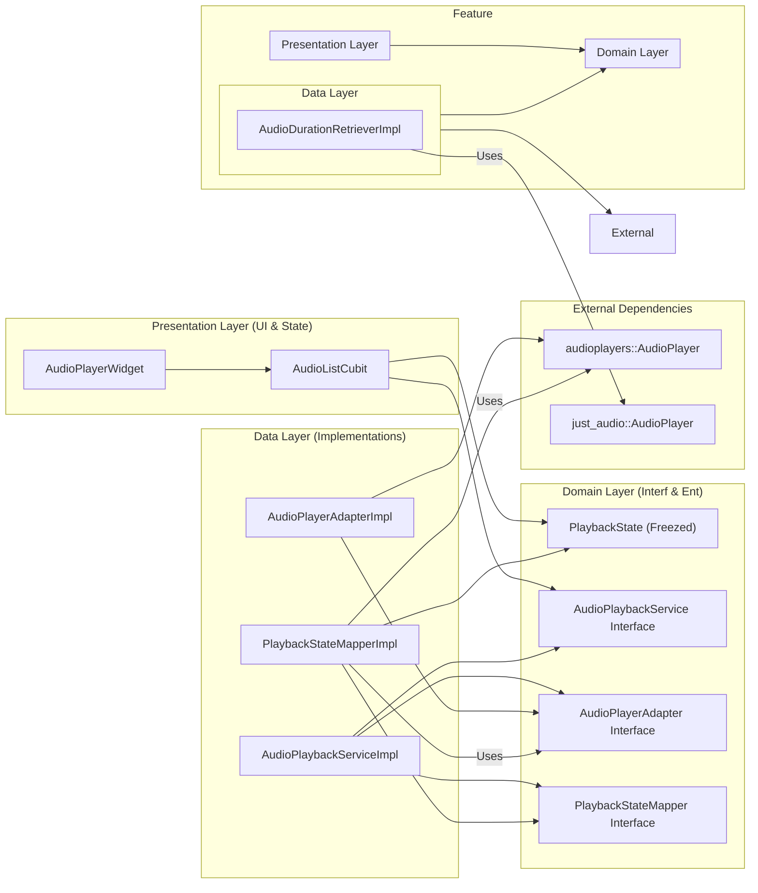

# Architecture: Audio Transcription Feature

This document outlines the **implemented architecture** for the audio recording and transcription feature, based on a **Feature-Sliced Clean Architecture** approach. Local audio files are treated as payloads for a backend transcription service, with local persistence (Hive) managing offline jobs and metadata like duration.

***Note (April 8th, 2024): This document has been updated to reflect the actual codebase structure and implementation status. The architecture uses feature-slicing, and core functionality (local storage, fake API interaction, repository logic, basic presentation) is largely implemented.***

## 1. Overall Structure (Feature-Sliced Clean Architecture)

The project utilizes a feature-sliced approach combined with Clean Architecture principles:

*   **`lib/core/`**: Contains application-wide, reusable components, abstractions, and utilities (DI, error handling, platform interfaces, base use cases, logging).
*   **`lib/features/`**: Houses individual, self-contained feature modules. Currently, only `audio_recorder` exists.
*   **`lib/features/<feature_name>/`**: Each feature internally follows Clean Architecture layers:
    *   **`domain/`**: Contains business logic, entities, repository interfaces, domain service interfaces, and feature-specific use cases. It has no dependencies on other layers.
    *   **`data/`**: Implements repository interfaces, defines data sources (local, remote), manages data models/DTOs, and data-specific exceptions/services. Depends only on `domain`.
    *   **`presentation/`**: Contains UI elements (pages, widgets) and state management (Cubits/Blocs). Depends only on `domain`.


*(Note: This diagram shows the general structure and dependencies for the `audio_recorder` feature within the overall architecture.)*

## 2. Implemented Architecture Details

This architecture treats local files as opaque handles/payloads. The primary source of truth for list display is a **merged state** derived from the backend API (via `TranscriptionRemoteDataSource`) and local persistence (`LocalJobStore` using Hive). **Local audio duration is captured ONCE after recording and stored locally via `LocalJobStore`.**

**Key Components & Flow (Listing):**

1.  **Local Job Capture & Persistence (Implemented):**
    *   `AudioDurationRetriever` (`data/services/`) is called by `AudioLocalDataSourceImpl.stopRecording()` (`data/datasources/`).
    *   `AudioLocalDataSourceImpl` creates a `LocalJob` entity (`domain/entities/`) with `status = created`, `durationMillis`, `localFilePath`, `localCreatedAt`.
    *   It saves this `LocalJob` using the injected `LocalJobStore` interface (`domain/repositories/`).
    *   **`LocalJobStore` Interface (Domain - Implemented):** Defines the contract for local persistence.
    *   **Implementation (`HiveLocalJobStoreImpl` - Implemented):** Uses `Hive` (`data/datasources/`) to store `LocalJob` objects. Hive is initialized, adapters registered, and the store injected via `get_it` (`core/di/`).
2.  **Simplified Local File Listing (Assumed via `AudioFileManager`):**
    *   `AudioFileManager` (`data/services/`) likely provides basic path listing, removing the old N+1 problem (implementation details not fully verified but structure exists).
3.  **Backend Integration (Interface + Fake Implementation):**
    *   **`TranscriptionRemoteDataSource` Interface (Domain - Implemented):** Defines contract (`

## 3. Audio Playback Architecture (Refactored - April 2024)

**CRITICAL NOTE (April 15th, 2024):** A major issue was identified: the application currently uses **TWO different audio player libraries**: `audioplayers` for the main playback adapter (`AudioPlayerAdapterImpl`) and `just_audio` for duration retrieval (`AudioDurationRetrieverImpl`). Additionally, the `AudioPlayerAdapter` interface in the **Domain Layer** incorrectly exposes types (`PlayerState`) from the `audioplayers` package, violating the Dependency Rule (data layer leaking into domain). This redundancy and leaky abstraction must be fixed.

**REVISED PLAN:** The architecture will be refactored in two phases:
1.  **Phase 1 (Interface Decoupling):** Define a library-agnostic `DomainPlayerState` enum/class. Update the `AudioPlayerAdapter` interface to use this domain type for its state stream. Update the current `audioplayers`-based implementation and its consumers (mapper, tests) to work with this new interface contract.
2.  **Phase 2 (Standardize on `just_audio`):** Rewrite the `AudioPlayerAdapterImpl` to use `just_audio` instead of `audioplayers`. Update the adapter tests accordingly. Remove the `audioplayers` dependency entirely.

The following description reflects the state *before* this critical refactoring begins.

The audio playback system was significantly refactored to improve testability and separation of concerns, moving away from a monolithic service. It now utilizes a **Clean Architecture approach with Adapter and Mapper patterns**.

### 3.1. Playback Architecture Diagram



### 3.2. Relevant File Structure

```
lib/features/audio_recorder/
├── domain/
│   ├── adapters/
│   │   └── audio_player_adapter.dart      # Interface: Abstracts audio player operations & events
│   ├── entities/
│   │   └── playback_state.dart          # Entity (Freezed): Defines possible playback states
│   ├── mappers/
│   │   └── playback_state_mapper.dart   # Interface: Abstracts raw event -> PlaybackState mapping
│   └── services/
│       └── audio_playback_service.dart  # Interface: Defines high-level playback control API
├── data/
│   ├── adapters/
│   │   └── audio_player_adapter_impl.dart # Implementation: Wraps 'audioplayers' package
│   ├── mappers/
│   │   └── playback_state_mapper_impl.dart# Implementation: Maps raw streams to PlaybackState using RxDart
│   └── services/
│       └── audio_playback_service_impl.dart # Implementation: Orchestrates Adapter & Mapper
└── presentation/
    ├── cubit/
    │   ├── audio_list_cubit.dart        # State Management: Handles UI logic, interacts with Service
    │   └── audio_list_state.dart        # State Definition: Includes PlaybackInfo for UI
    └── widgets/
        └── audio_player_widget.dart     # UI Component: Displays playback controls & info
```

### 3.3. File Responsibilities

*   **Domain Layer:**
    *   `domain/adapters/audio_player_adapter.dart`: Defines the *contract* for how the application interacts with *any* audio player. Specifies methods (play, pause, stop, seek, setSourceUrl, dispose) and output streams (`onPlayerStateChanged`, `onDurationChanged`, `onPositionChanged`, `onPlayerComplete`). **ISSUE (April 15th, 2024): This interface currently leaks the `audioplayers::PlayerState` type in its `onPlayerStateChanged` stream.** **PHASE 1 PLAN:** This stream will be changed to use a new, library-agnostic `DomainPlayerState` defined within the domain layer.
    *   `domain/entities/playback_state.dart`: Defines the core *business state* of playback using a `freezed` sealed class (`initial`, `loading`, `playing`, `paused`, `stopped`, `completed`, `error`). This is the canonical representation of state used within the domain and presentation layers.
    *   `domain/mappers/playback_state_mapper.dart`: Defines the *contract* for transforming the raw, low-level event streams provided by the `AudioPlayerAdapter` into the unified, high-level `Stream<PlaybackState>`. **PHASE 1 PLAN:** The `initialize` method's `playerStateStream` input type will change from `Stream<audioplayers::PlayerState>` to `Stream<DomainPlayerState>`.
    *   `domain/services/audio_playback_service.dart`: Defines the high-level *use cases* for audio playback available to the presentation layer (play, pause, resume, seek, stop, dispose). It exposes the final `Stream<PlaybackState>` for UI updates.
*   **Data Layer:**
    *   `data/adapters/audio_player_adapter_impl.dart`: *Implements* the `AudioPlayerAdapter` interface using the `audioplayers` package. **PHASE 1 PLAN:** The `onPlayerStateChanged` getter will be updated to map internal `audioplayers` states to the new `DomainPlayerState`. **PHASE 2 PLAN:** This entire implementation will be rewritten to use `just_audio`.
    *   `data/mappers/playback_state_mapper_impl.dart`: *Implements* the `PlaybackStateMapper`. **PHASE 1 PLAN:** This implementation will be updated to accept `DomainPlayerState` from the adapter via `initialize`.
    *   `data/services/audio_duration_retriever_impl.dart`: (**ISSUE**) Uses `just_audio` to get duration. **PHASE 2 PLAN:** This becomes the *only* place `just_audio` (or whatever final player) is used directly outside the adapter.
    *   `data/services/audio_playback_service_impl.dart`: (**ISSUE**) Orchestrates Adapter & Mapper. **PHASE 1 PLAN:** This implementation will be updated to use `just_audio` for playback.
