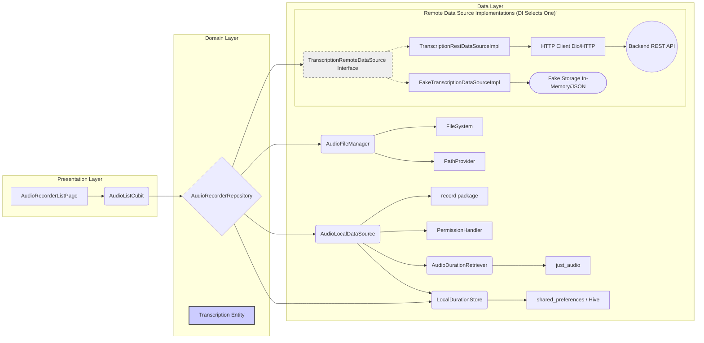

# Architecture: Audio Transcription Feature

This document outlines the current and proposed architecture for the audio recording and transcription feature, reflecting the understanding that local audio files serve primarily as payloads for a backend transcription service.

## 1. Current Architecture (Pre-Transcription API Focus)

This architecture focused heavily on managing audio files locally, treating local metadata (duration, creation date via file stat) as the primary source of truth for the UI list.

**Flow (Listing):**

1.  `AudioListCubit` requests recordings from `AudioRecorderRepository`.
2.  `AudioRecorderRepository` calls `AudioFileManager.listRecordingDetails`.
3.  `AudioFileManagerImpl` lists directory contents (`.m4a` files).
4.  **N+1 Problem:** For each file, it *concurrently* calls:
    *   `FileSystem.stat()` to get `FileStat` (for `createdAt` via `modified` time).
    *   `AudioDurationRetriever.getDuration()` which uses `just_audio` (creating a player instance per file) to read duration metadata.
5.  Details are mapped to `AudioRecord` entities and returned to the Cubit/UI.

**Key Issues:**

*   **Misaligned Focus:** Treats local files and their metadata as the primary data, which is incorrect given the transcription API requirement.
*   **Performance Bottleneck (N+1):** Fetching `stat` and `duration` for each file locally is inefficient and slow, especially `getDuration` via `just_audio`.
*   **Redundant Data:** Local duration and exact creation time might be irrelevant if the backend provides canonical information post-transcription.
*   **Bloated Data Layer:** `AudioFileManager` and `AudioDurationRetriever` exist solely to fetch local metadata that is likely unnecessary.

## 2. Proposed Architecture (Transcription API Focused - Revised for Local Duration)

This revised architecture treats local files as opaque handles/payloads. The primary source of truth for list display becomes the transcription status and metadata retrieved from the backend API. **Local audio duration is captured ONCE after recording and stored locally.**

*(Note: `AudioDurationRetriever (I)` / `just_audio (J)` kept. `LocalDurationStore (Q)` added. `TranscriptionRemoteDataSource` shown as Interface (`N_Interface`) with Real (`N_Real`) and Fake (`N_Fake`) implementations selected via DI.)*

**Key Changes & Flow (Listing):**

1.  **Duration Capture & Storage (NEW):**
    *   `AudioDurationRetriever` is **KEPT**, but **NOT** called during list loading.
    *   When `AudioLocalDataSource.stopRecording()` completes:
        *   It calls `AudioDurationRetriever.getDuration()` for the finished `filePath`.
        *   It saves this duration (e.g., `Map<String, int> {filePath: durationMillis}`) using a new abstraction: `LocalDurationStore` (backed by `shared_preferences`, `Hive`, or similar).
2.  **Simplified Local File Listing:**
    *   `AudioFileManager` interface changes: `listRecordingDetails()` becomes `listRecordingPaths()` -> `Future<List<String>>`.
    *   `AudioFileManagerImpl` implementation simply lists `.m4a` file paths from the directory. No `stat`, no duration fetching during list load. **N+1 problem eliminated for list view.**
3.  **Backend Integration:**
    *   **New `TranscriptionRemoteDataSource` Interface:** Defines the contract for communication with the backend transcription API (methods like `getAllTranscriptionStatuses`, `uploadForTranscription`, etc.).
    *   **Implementation Strategy:**
        *   **`TranscriptionRestDataSourceImpl`:** Implements the interface using an HTTP client (`Dio`/`http`) to talk to the actual REST API. **Used in production.**
        *   **`FakeTranscriptionDataSourceImpl`:** Implements the interface using in-memory data, local storage (e.g., JSON file), or simulated delays. **Used for development and testing** until the real API is fully available or when testing offline/error states.
        *   Dependency injection (e.g., `get_it`) will be used to provide the appropriate implementation based on the build environment.
    *   **Updated `Transcription` Entity (Domain):** Represents the state and result of a transcription job (e.g., `id`, `fileName`, `status: 'pending_upload' | 'uploading' | 'processing' | 'complete' | 'failed'`, `createdAt` (backend time), `Duration? duration`, `transcriptSnippet`, etc.). `duration` can come from local store or backend.
4.  **Orchestration (`AudioRecorderRepositoryImpl`):**
    *   Now depends on `AudioFileManager`, `TranscriptionRemoteDataSource`, and `LocalDurationStore`.
    *   `loadTranscriptions()` method (replaces/evolves `loadRecordings`):
        *   Calls `TranscriptionRemoteDataSource.getAllTranscriptionStatuses()` to get backend state.
        *   Calls `AudioFileManager.listRecordingPaths()` to find all local file paths.
        *   Calls `LocalDurationStore.getAllDurations()` (or similar) to get the map of locally stored durations.
        *   **Merges information:**
            *   Maps backend statuses to `Transcription` entities (using backend duration if available).
            *   Identifies local-only files (paths present locally but not in backend results).
            *   Creates `Transcription` entities for these local-only files with status `'pending_upload'` and uses the **locally stored duration** from the map.
        *   Returns `List<Transcription>` to the Cubit.
5.  **Presentation (`AudioListCubit`):**
    *   Manages the state `List<Transcription>`.
    *   Handles UI logic based on `Transcription.status` and displays `Transcription.duration`.
    *   Initiates uploads via the repository.
    *   Potentially implements polling or listens to push notifications/sockets.

**Benefits:**

*   **Aligns with Reality & Requirement:** Architecture reflects the API-centric process AND includes the required local duration.
*   **Performance:** Eliminates the N+1 bottleneck for list display by getting duration only once post-recording.
*   **Clean Data Flow:** Clear separation: `AudioFileManager` (paths), `AudioLocalDataSource` (recording + duration capture), `LocalDurationStore` (persisted durations), `TranscriptionRemoteDataSource` (backend API).
*   **Single Source of Truth:** Backend dictates status/metadata for processed jobs; local store provides duration for pending jobs.

## 3. Next Steps (Revised)

1.  **Refactor `AudioFileManager` Interface & Implementation:** Change `listRecordingDetails` to `listRecordingPaths` (remains the same goal: simplify listing).
2.  **Define `LocalDurationStore` Interface & Implementation:** Create abstraction for storing/retrieving `Map<String, int>` (e.g., using `shared_preferences`
3.  **Define `TranscriptionRemoteDataSource` Interface:** Specify the API methods.
4.  **Implement `TranscriptionRemoteDataSourceImpl`:** Add HTTP client logic (initially, potentially implement the `Fake` version first for development).
5.  **Refactor `AudioRecorderRepository` Interface & Implementation:** Update dependencies (add `LocalDurationStore`), implement `loadTranscriptions` with the new merging logic.