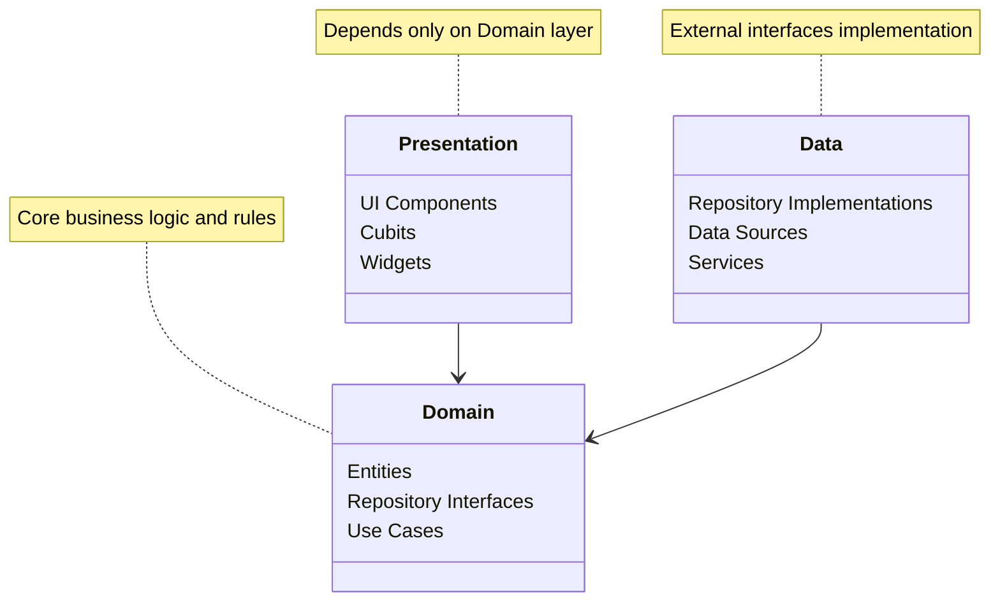
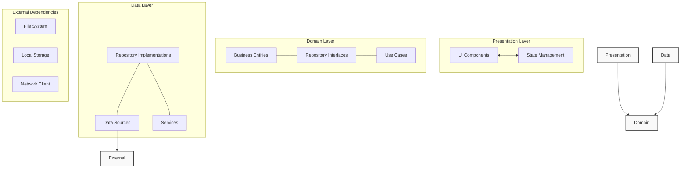
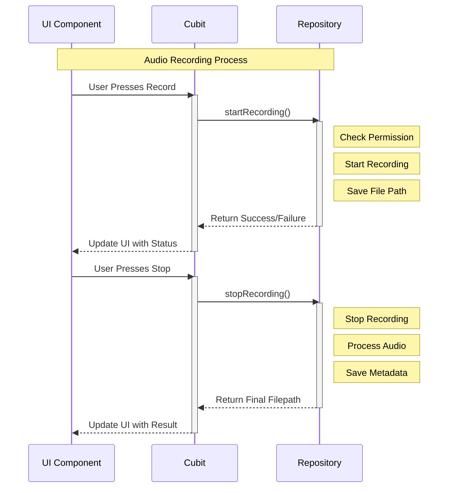
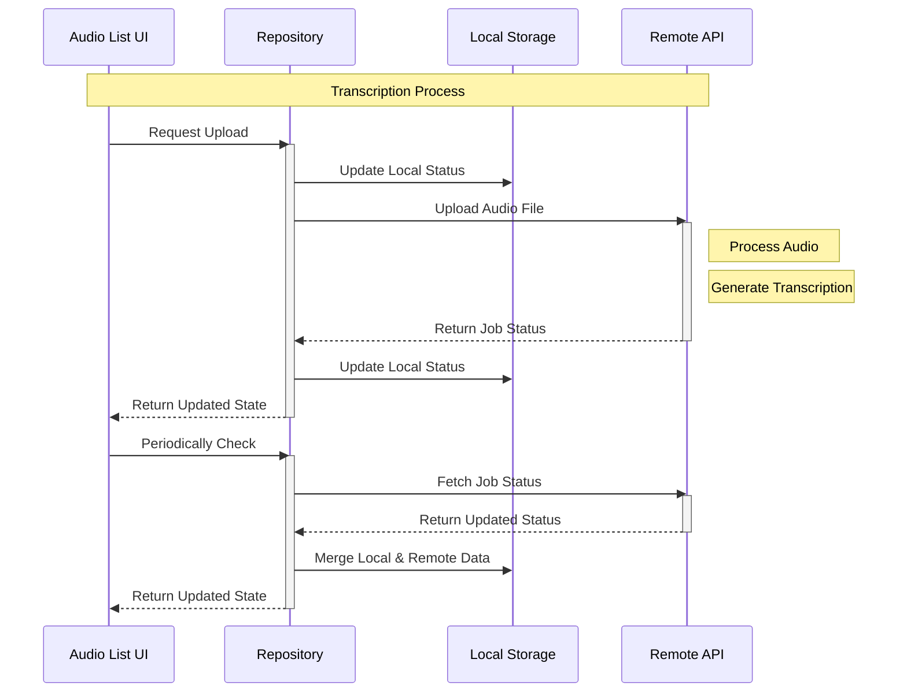
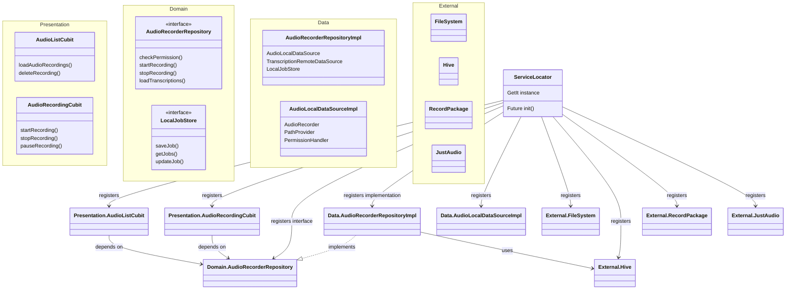

# DocJet Mobile Architecture Documentation

## Table of Contents
1. [Overview](#overview)
2. [Architecture Pattern](#architecture-pattern)
3. [Project Structure](#project-structure)
4. [Core Module](#core-module)
5. [Features Module](#features-module)
   - [Audio Recorder Feature](#audio-recorder-feature)
6. [Dependency Injection](#dependency-injection)
7. [State Management](#state-management)
8. [Data Flow](#data-flow)
9. [File by File Analysis](#file-by-file-analysis)
10. [Audio Player Architecture](#audio-player-architecture)
11. [Infrastructure Architecture](#infrastructure-architecture)
12. [Diagrams](#diagrams)

## Overview

DocJet Mobile is a Flutter application designed for audio recording and transcription. The application follows clean architecture principles with a focus on separation of concerns and testability.

The application allows users to:
- Record audio
- Playback recorded audio
- Transcribe audio (through external services)
- Manage audio recordings and transcriptions

## Architecture Pattern

The application follows the **Clean Architecture** pattern with three main layers:



### Key principles implemented:

1. **Dependency Rule**: Inner layers don't know about outer layers.
2. **Separation of Concerns**: Each layer has a specific responsibility.
3. **Domain-Centric**: Business rules and entities are in the domain layer.
4. **Testability**: Easy to test components in isolation.

## Project Structure

The project follows a modular structure divided into core components and features.

```
lib/
├── core/                 # Core functionality used across features
│   ├── config/           # App configuration
│   ├── di/               # Dependency injection
│   ├── error/            # Error handling
│   ├── platform/         # Platform-specific implementations
│   ├── services/         # Core services
│   ├── usecases/         # Base use cases
│   └── utils/            # Utility functions
│
├── features/             # Feature modules
│   └── audio_recorder/   # Audio recording feature
│       ├── data/         # Data layer implementation
│       ├── domain/       # Domain layer definitions
│       └── presentation/ # UI components
│
└── main.dart             # Application entry point
```

## Core Module

The core module contains functionality that is shared across features:

### Config
Configuration settings for the application.

### Dependency Injection (DI)
Uses `get_it` package for service locator pattern implementation. All dependencies are registered in `injection_container.dart`.

### Error
Error handling classes including `Failure` abstractions for domain layer error handling.

### Platform
Platform-specific implementations for file system operations, path handling, and permissions:
- `FileSystem`: File operations abstraction
- `PathProvider`: Path resolution utilities
- `PermissionHandler`: Permission handling abstraction

### Services
Core services including:
- `AppSeeder`: Initial data seeding service

### Usecases
Base use case abstractions for implementing clean architecture use cases.

### Utils
Utility functions used across the application.

## Features Module

### Audio Recorder Feature

The audio recorder feature follows the clean architecture pattern with three layers:

#### Data Layer
Contains implementations of repositories, data sources, and services:

```
audio_recorder/data/
├── adapters/          # Adapters for external dependencies
├── datasources/       # Data sources for local and remote data
├── exceptions/        # Data layer specific exceptions
├── factories/         # Factory classes
├── mappers/           # Data transformation classes
├── repositories/      # Repository implementations
└── services/          # Feature-specific services
```

Key components:
- `AudioLocalDataSourceImpl`: Handles local audio recording operations
- `AudioRecorderRepositoryImpl`: Implements the repository interface
- `AudioFileManagerImpl`: Manages audio file operations
- `AudioPlaybackServiceImpl`: Handles audio playback functionality
- `TranscriptionMergeServiceImpl`: Merges local and remote transcription data

#### Domain Layer
Contains business entities, repository interfaces, and use cases:

```
audio_recorder/domain/
├── adapters/          # Interfaces for adapters
├── entities/          # Business objects
├── mappers/           # Domain transformation interfaces
├── repositories/      # Repository interfaces
├── services/          # Domain service interfaces
└── usecases/          # Business logic use cases
```

Key entities:
- `AudioRecord`: Represents a single audio recording
- `Transcription`: Represents a recording with its transcription status
- `PlaybackState`: Represents the state of audio playback
- `LocalJob`: Represents a local transcription job

Key repositories:
- `AudioRecorderRepository`: Interface defining audio recording operations
- `LocalJobStore`: Interface for managing local transcription jobs
- `TranscriptionRemoteDataSource`: Interface for remote transcription service

#### Presentation Layer
Contains UI components, state management, and widgets:

```
audio_recorder/presentation/
├── cubit/             # BLoC/Cubit state management
├── pages/             # Full page UI components
└── widgets/           # Reusable UI components
```

Key components:
- `AudioListCubit`: Manages state for listing audio recordings
- `AudioRecordingCubit`: Manages state for recording audio
- `AudioRecorderListPage`: UI for displaying list of recordings
- `AudioRecorderPage`: UI for recording audio

## Dependency Injection

The application uses the `get_it` package for dependency injection. All dependencies are registered in `injection_container.dart`.

The initialization process:
1. Initialize Hive for local storage
2. Register adapters for Hive
3. Register SharedPreferences
4. Register repositories, data sources, and services
5. Register platform implementations
6. Register feature-specific components

## State Management

The application uses the BLoC pattern through the Flutter Bloc package, specifically Cubits:

- `AudioListCubit`: Manages the state of audio recordings list
- `AudioRecordingCubit`: Manages the state of the audio recording process

## Data Flow

1. **User Interaction** → UI components in presentation layer
2. **UI Events** → Processed by Cubits
3. **Cubits** → Call repository methods
4. **Repository** → Orchestrates data from different sources
   - Local data from `AudioLocalDataSource`
   - Remote data from `TranscriptionRemoteDataSource`
5. **Data Sources** → Interact with external systems
   - Local file system through `FileSystem`
   - Audio recording through `record` package
   - Local storage through `Hive`
   - Remote API through network client

## File by File Analysis

### Main Application Files

#### `lib/main.dart`
Entry point of the application. Initializes dependencies, sets up BLoC providers, and runs the app.

### Core Module Files

#### `lib/core/di/injection_container.dart`
Sets up dependency injection using `get_it`. Registers all dependencies including repositories, data sources, services, and external packages.

#### `lib/core/platform/file_system.dart`
Abstraction for file system operations.

#### `lib/core/platform/path_provider.dart`
Provides paths for storing application data.

#### `lib/core/platform/permission_handler.dart`
Handles permission requests and checks.

#### `lib/core/services/app_seeder.dart`
Service for seeding initial data when the app is first launched.

### Audio Recorder Feature Files

#### Domain Layer

#### `lib/features/audio_recorder/domain/entities/audio_record.dart`
Represents a single audio recording with its file path, duration, and creation timestamp.

#### `lib/features/audio_recorder/domain/entities/transcription.dart`
Represents a recording with its transcription status, combining local and remote data.

#### `lib/features/audio_recorder/domain/entities/playback_state.dart`
Represents the state of audio playback including position, duration, and player state.

#### `lib/features/audio_recorder/domain/entities/local_job.dart`
Represents a local transcription job stored with Hive.

#### `lib/features/audio_recorder/domain/repositories/audio_recorder_repository.dart`
Interface defining operations for audio recording and transcription.

#### Data Layer

#### `lib/features/audio_recorder/data/datasources/audio_local_data_source_impl.dart`
Implementation of local data source for audio recording.

#### `lib/features/audio_recorder/data/repositories/audio_recorder_repository_impl.dart`
Implementation of audio recorder repository, orchestrating data from different sources.

#### `lib/features/audio_recorder/data/services/audio_file_manager_impl.dart`
Implementation of service for managing audio files.

#### `lib/features/audio_recorder/data/services/audio_playback_service_impl.dart`
Implementation of service for audio playback functionality.

#### Presentation Layer

#### `lib/features/audio_recorder/presentation/cubit/audio_list_cubit.dart`
Manages state for audio recordings list.

#### `lib/features/audio_recorder/presentation/cubit/audio_recording_cubit.dart`
Manages state for audio recording process.

#### `lib/features/audio_recorder/presentation/pages/audio_recorder_list_page.dart`
UI component for displaying list of recordings.

#### `lib/features/audio_recorder/presentation/pages/audio_recorder_page.dart`
UI component for recording audio.

## Audio Player Architecture

The audio player functionality follows a clean, layered approach with proper separation of concerns and the adapter pattern to isolate external dependencies.

### Key Components

1. **External Dependency**: 
   - `just_audio` package: Provides the core audio playback functionality

2. **Domain Layer**:
   - `AudioPlayerAdapter`: Interface defining operations for audio playback
   - `AudioPlaybackService`: Interface for the service that manages playback
   - `PlaybackStateMapper`: Interface for mapping raw player states to domain states
   - Domain entities:
     - `DomainPlayerState`: Enum representing player states in domain terms
     - `PlaybackState`: Freezed class representing the complete playback state

3. **Data Layer**:
   - `AudioPlayerAdapterImpl`: Implementation of adapter using just_audio
   - `AudioPlaybackServiceImpl`: Implementation of playback service
   - `PlaybackStateMapperImpl`: Implementation of state mapper using RxDart
   - `AudioFileManager`: Interface for managing audio files
   - `AudioFileManagerImpl`: Implementation of the file manager

### Audio Player Class Diagram

```mermaid
classDiagram
    %% External Dependencies
    class JustAudioPlayer {
        <<External Library>>
        +playerStateStream
        +positionStream
        +durationStream
        +play()
        +pause()
        +stop()
        +seek()
        +setFilePath()
    }
    
    %% Domain Interfaces
    class AudioPlayerAdapter {
        <<interface>>
        +setSourceUrl(String url)
        +pause()
        +resume()
        +seek(String filePath, Duration position)
        +stop()
        +dispose()
        +Stream~DomainPlayerState~ onPlayerStateChanged
        +Stream~Duration~ onDurationChanged
        +Stream~Duration~ onPositionChanged
        +Stream~void~ onPlayerComplete
        +getDuration(String relativePath)
    }
    
    class AudioPlaybackService {
        <<interface>>
        +play(String filePath)
        +pause()
        +resume()
        +seek(String pathOrUrl, Duration position)
        +stop()
        +dispose()
        +Stream~PlaybackState~ playbackStateStream
    }
    
    class PlaybackStateMapper {
        <<interface>>
        +initialize(streams...)
        +dispose()
        +Stream~PlaybackState~ playbackStateStream
    }
    
    class AudioFileManager {
        <<interface>>
        +listRecordingPaths()
        +deleteRecording(String filePath)
        +getRecordingDetails(String filePath)
    }
    
    %% Domain Entities
    class DomainPlayerState {
        <<enumeration>>
        initial
        loading
        playing
        paused
        stopped
        completed
        error
    }
    
    class PlaybackState {
        <<freezed>>
        +initial()
        +loading()
        +playing(Duration currentPosition, Duration totalDuration)
        +paused(Duration currentPosition, Duration totalDuration)
        +stopped()
        +completed()
        +error(String message, Duration? currentPosition, Duration? totalDuration)
    }
    
    class AudioRecord {
        String filePath
        Duration duration
        DateTime createdAt
    }
    
    %% Data Layer Implementations
    class AudioPlayerAdapterImpl {
        -AudioPlayer _audioPlayer
        -PathResolver _pathResolver
        -StreamController~DomainPlayerState~ _playerStateController
        -StreamController~Duration~ _durationController
        -StreamController~Duration~ _positionController
        -StreamController~void~ _playerCompleteController
        +setSourceUrl(String url)
        +pause()
        +resume()
        +seek(String filePath, Duration position)
        +stop()
        +dispose()
        -_setupInternalListeners()
    }
    
    class AudioPlaybackServiceImpl {
        -AudioPlayerAdapter _audioPlayerAdapter
        -PlaybackStateMapper _playbackStateMapper
        -BehaviorSubject~PlaybackState~ _playbackStateSubject
        -String? _currentFilePath
        +play(String filePath)
        +pause()
        +resume()
        +seek(String pathOrUrl, Duration position)
        +stop()
        +dispose()
    }
    
    class PlaybackStateMapperImpl {
        -StreamController~Duration~ positionController
        -StreamController~Duration~ durationController
        -StreamController~void~ completeController
        -StreamController~DomainPlayerState~ playerStateController
        -DomainPlayerState _currentPlayerState
        -Duration _currentPosition
        -Duration _currentDuration
        -Stream~PlaybackState~ _playbackStateStream
        +initialize(streams...)
        +dispose()
        -_createCombinedStream()
        -_constructState(String trigger)
    }
    
    class AudioFileManagerImpl {
        -FileSystem fileSystem
        -PathProvider pathProvider
        -AudioPlayerAdapter audioPlayerAdapter
        +listRecordingPaths()
        +deleteRecording(String filePath)
        +getRecordingDetails(String filePath)
        -_getRecordDetails(String path)
    }
    
    %% Relationships
    AudioPlayerAdapterImpl ..|> AudioPlayerAdapter : implements
    AudioPlayerAdapterImpl --> JustAudioPlayer : wraps
    AudioPlaybackServiceImpl ..|> AudioPlaybackService : implements
    AudioPlaybackServiceImpl --> AudioPlayerAdapter : uses
    AudioPlaybackServiceImpl --> PlaybackStateMapper : uses
    PlaybackStateMapperImpl ..|> PlaybackStateMapper : implements
    PlaybackStateMapperImpl --> PlaybackState : creates
    AudioPlayerAdapter --> DomainPlayerState : returns in stream
    PlaybackStateMapper --> PlaybackState : returns in stream
    AudioFileManagerImpl ..|> AudioFileManager : implements
    AudioFileManagerImpl --> AudioPlayerAdapter : uses
    AudioFileManagerImpl --> AudioRecord : creates
    
    %% Dependency Direction
    AudioPlaybackService ..> PlaybackState : depends on
    PlaybackStateMapper ..> DomainPlayerState : consumes
    PlaybackStateMapper ..> PlaybackState : produces
```



### Audio Player Flow

The audio player architecture follows a reactive pattern with stream-based communication between components:

1. The `AudioPlayerAdapterImpl` wraps the external `just_audio` library, transforming its events into domain-specific streams.

2. The `PlaybackStateMapperImpl` combines multiple streams from the adapter (position, duration, player state) into a unified `PlaybackState` stream using RxDart.

3. The `AudioPlaybackServiceImpl` orchestrates playback operations by:
   - Communicating with the adapter for player control (play, pause, etc.)
   - Subscribing to the mapper's state stream
   - Providing a clean interface for the UI layer

4. The `AudioFileManager` handles file operations and interacts with the adapter for operations like retrieving audio duration.

The dependency injection container sets up this flow by:
1. Creating the adapter with the just_audio player
2. Creating the mapper and injecting the adapter's streams
3. Creating the service with both the adapter and mapper

This architecture ensures:
- Clean separation of concerns
- Testability through interfaces
- Domain-driven design principles
- Reactive state management

## Infrastructure Architecture

The application's infrastructure provides the foundational services that feature modules build upon. These include file system operations, path management, and permission handling.

### Key Components

1. **File System Management**:
   - `FileSystem`: Interface for file system operations
   - `IoFileSystem`: Concrete implementation using `dart:io`
   - `PathProvider`: Interface for accessing system directories
   - `AppPathProvider`: Implementation using `path_provider` package
   - `PathResolver`: Interface for resolving file paths
   - `PathResolverImpl`: Implementation handling both absolute and relative paths

2. **Permission Handling**:
   - `PermissionHandler`: Interface for permission management
   - `AppPermissionHandler`: Implementation using `permission_handler` package

3. **Data Storage**:
   - `Hive`: NoSQL database for local storage
   - `LocalJobStore`: Interface for managing job data
   - `HiveLocalJobStoreImpl`: Implementation using Hive

### Infrastructure Class Diagram

```mermaid
classDiagram
    %% External Dependencies
    class DartIO {
        <<External Library>>
        File
        Directory
        FileStat
    }
    
    class PathProviderPackage {
        <<External Library>>
        getApplicationDocumentsDirectory()
    }
    
    class PermissionHandlerPackage {
        <<External Library>>
        Permission
        PermissionStatus
        request()
        status()
        openAppSettings()
    }
    
    class HivePackage {
        <<External Library>>
        Box
        Hive
        HiveObject
    }
    
    %% Core Interfaces
    class FileSystem {
        <<interface>>
        +stat(String path)
        +fileExists(String path)
        +deleteFile(String path)
        +directoryExists(String path)
        +createDirectory(String path, bool recursive)
        +listDirectory(String path)
        +writeFile(String path, Uint8List bytes)
        +readFile(String path)
    }
    
    class PathProvider {
        <<interface>>
        +getApplicationDocumentsDirectory()
    }
    
    class PathResolver {
        <<interface>>
        +resolve(String inputPath, bool mustExist)
    }
    
    class PermissionHandler {
        <<interface>>
        +request(List~Permission~ permissions)
        +status(Permission permission)
        +openAppSettings()
    }
    
    class LocalJobStore {
        <<interface>>
        +saveJob(LocalJob job)
        +getJobs()
        +updateJob(LocalJob job)
        +deleteJob(String id)
    }
    
    %% Core Implementations
    class IoFileSystem {
        -PathProvider _pathProvider
        +stat(String path)
        +fileExists(String path)
        +deleteFile(String path)
        +directoryExists(String path)
        +createDirectory(String path, bool recursive)
        +listDirectory(String path)
        +writeFile(String path, Uint8List bytes)
        +readFile(String path)
        -_resolvePath(String inputPath)
    }
    
    class AppPathProvider {
        +getApplicationDocumentsDirectory()
    }
    
    class PathResolverImpl {
        -PathProvider pathProvider
        -FileExistsFunction fileExists
        +resolve(String inputPath, bool mustExist)
    }
    
    class AppPermissionHandler {
        +request(List~Permission~ permissions)
        +status(Permission permission)
        +openAppSettings()
    }
    
    class HiveLocalJobStoreImpl {
        -Box~LocalJob~ _box
        +saveJob(LocalJob job)
        +getJobs()
        +updateJob(LocalJob job)
        +deleteJob(String id)
        +openBox()
    }
    
    %% Feature Dependencies
    class AudioLocalDataSourceImpl {
        -PathProvider pathProvider
        -FileSystem fileSystem
        -PermissionHandler permissionHandler
        -AudioPlayerAdapter audioPlayerAdapter
        +checkPermission()
        +requestPermission()
        +startRecording()
        +stopRecording()
    }
    
    class AudioPlayerAdapterImpl {
        -PathResolver _pathResolver
        +setSourceUrl(String url)
        +getDuration(String relativePath)
    }
    
    class AudioFileManagerImpl {
        -FileSystem fileSystem
        -PathProvider pathProvider
        -AudioPlayerAdapter audioPlayerAdapter
        +listRecordingPaths()
        +deleteRecording(String filePath)
        +getRecordingDetails(String filePath)
    }
    
    class AudioRecorderRepositoryImpl {
        -AudioLocalDataSource localDataSource
        -AudioFileManager fileManager
        -LocalJobStore localJobStore
        +checkPermission()
        +requestPermission()
        +startRecording()
        +stopRecording()
        +loadTranscriptions()
    }
    
    %% Relationships - Implementations
    IoFileSystem ..|> FileSystem : implements
    AppPathProvider ..|> PathProvider : implements
    PathResolverImpl ..|> PathResolver : implements
    AppPermissionHandler ..|> PermissionHandler : implements
    HiveLocalJobStoreImpl ..|> LocalJobStore : implements
    
    %% Relationships - External Dependencies
    IoFileSystem --> DartIO : uses
    AppPathProvider --> PathProviderPackage : uses
    AppPermissionHandler --> PermissionHandlerPackage : uses
    HiveLocalJobStoreImpl --> HivePackage : uses
    
    %% Feature Dependencies
    AudioLocalDataSourceImpl --> FileSystem : uses
    AudioLocalDataSourceImpl --> PathProvider : uses
    AudioLocalDataSourceImpl --> PermissionHandler : uses
    AudioPlayerAdapterImpl --> PathResolver : uses
    AudioFileManagerImpl --> FileSystem : uses
    AudioFileManagerImpl --> PathProvider : uses
    AudioRecorderRepositoryImpl --> LocalJobStore : uses
    
    %% Internal Dependencies
    IoFileSystem --> PathProvider : uses
    PathResolverImpl --> PathProvider : uses
```



### Integration with Audio Player System

The infrastructure components are tightly integrated with the audio player system:

1. **File System Integration**:
   - `AudioFileManager` uses `FileSystem` to list, read, and delete audio files
   - `AudioPlayerAdapter` uses `PathResolver` to handle file paths for playback
   - `AudioLocalDataSource` uses `FileSystem` to store recording files

2. **Permission Handling**:
   - `AudioLocalDataSource` uses `PermissionHandler` to check and request microphone permissions
   - `AudioRecordingCubit` interacts with repository to manage permission states in the UI

3. **Data Persistence**:
   - `AudioRecorderRepository` uses `LocalJobStore` to persist recording metadata and transcription states
   - Local recording jobs are stored in Hive databases

### Dependency Injection for Infrastructure

The `injection_container.dart` file wires all infrastructure components together:

1. First, platform implementations are registered:
   - `PathProvider` for directory access
   - `FileSystem` for file operations
   - `PermissionHandler` for permission management

2. Then feature-specific components using these infrastructure services:
   - `AudioFileManager` with `FileSystem` and `PathProvider`
   - `AudioPlayerAdapter` with `PathResolver`
   - `AudioLocalDataSource` with all infrastructure components

This layered approach ensures:
- Clear isolation of platform-specific code
- Consistent file access patterns
- Proper permission handling
- Easy mocking for tests

## Diagrams

### High-Level Architecture



### Audio Recording Flow



### Transcription Process Flow



### Dependency Injection Graph



This document provides an in-depth analysis of the current architecture of the DocJet Mobile application. The codebase follows clean architecture principles with clear separation of concerns across layers. The modular structure allows for maintainability and testability while providing a solid foundation for future development. 