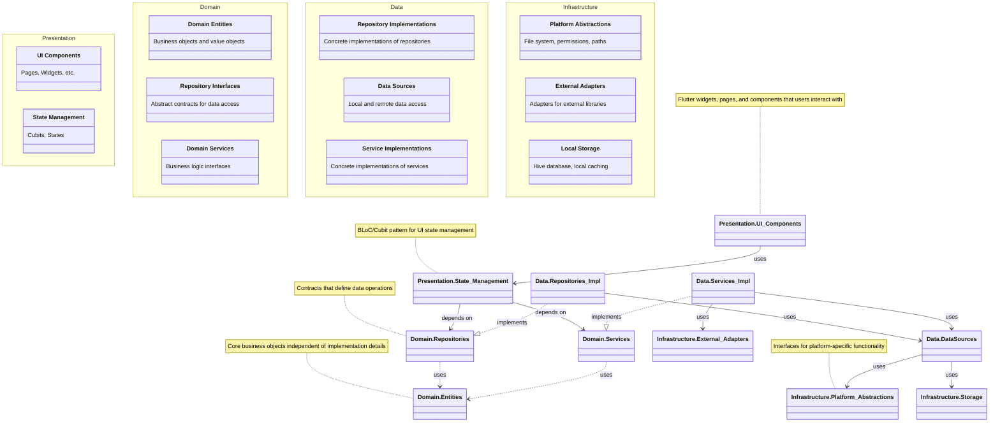
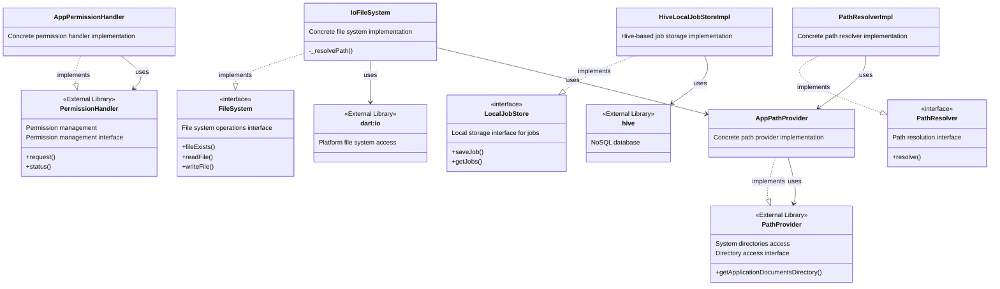
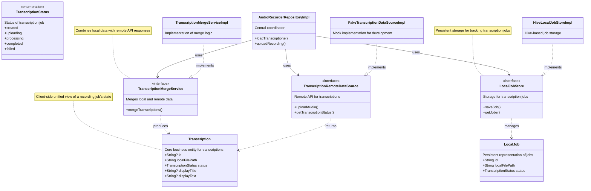
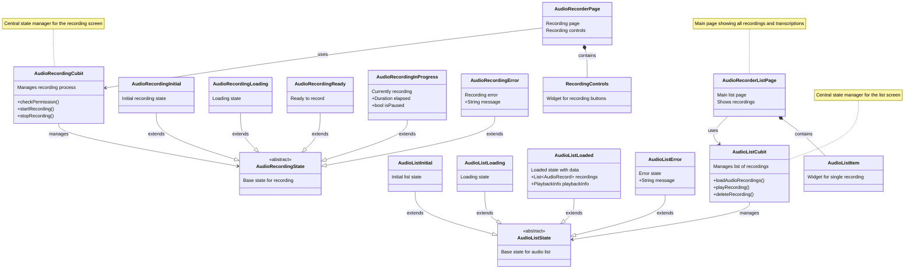

# DocJet Mobile System Class Diagram

This document provides a comprehensive visualization of the DocJet Mobile system architecture through class diagrams at multiple levels of detail.

## Table of Contents
1. [System Overview](#system-overview)
2. [Core Infrastructure](#core-infrastructure)
3. [Audio Recording System](#audio-recording-system)
4. [Audio Playback System](#audio-playback-system)
5. [Transcription System](#transcription-system)
6. [UI Components and State Management](#ui-components-and-state-management)

## System Overview

This diagram shows the high-level components of the system and their relationships, organized by architectural layers.

## Core Infrastructure

The core infrastructure provides foundational services used by all features.

## Audio Recording System

This diagram shows the classes involved in the audio recording feature.

```mermaid
classDiagram
    %% External Dependency
    class RecordPackage["record"] {
        <<External Library>>
        Low-level audio recording
    }
    
    %% Domain Layer
    class AudioRecord {
        Core business entity for recordings
        +String filePath
        +Duration duration
        +DateTime createdAt
    }
    
    class AudioRecorderRepository {
        <<interface>>
        Recording operations contract
        +checkPermission()
        +startRecording()
        +stopRecording()
        +pauseRecording()
    }
    
    %% Data Layer
    class AudioRecorderRepositoryImpl {
        Implementation of repository
        Orchestrates data sources
    }
    
    class AudioLocalDataSource {
        <<interface>>
        Local recording operations
        +startRecording()
        +stopRecording()
    }
    
    class AudioLocalDataSourceImpl {
        Implementation using record package
    }
    
    class AudioFileManager {
        <<interface>>
        Audio file handling
        +listRecordingPaths()
        +deleteRecording()
    }
    
    class AudioFileManagerImpl {
        Implementation for file operations
    }
    
    class AudioConcatenationService {
        <<interface>>
        For merging audio files
        +concatenate()
    }
    
    %% Presentation Layer
    class AudioRecordingCubit {
        Recording state management
        +checkPermission()
        +startRecording()
        +stopRecording()
    }
    
    class AudioRecordingState {
        <<abstract>>
        Base state for recording
    }
    
    class AudioRecordingInitial {
        Initial recording state
    }
    
    class AudioRecordingReady {
        Ready to record state
    }
    
    class AudioRecordingInProgress {
        Currently recording state
        +Duration elapsed
    }
    
    %% Relationships
    AudioRecordingCubit --> AudioRecorderRepository : uses
    AudioRecordingCubit --> AudioRecordingState : manages
    AudioRecordingInitial --|> AudioRecordingState : extends
    AudioRecordingReady --|> AudioRecordingState : extends
    AudioRecordingInProgress --|> AudioRecordingState : extends
    
    AudioRecorderRepositoryImpl ..|> AudioRecorderRepository : implements
    AudioRecorderRepositoryImpl --> AudioLocalDataSource : uses
    AudioRecorderRepositoryImpl --> AudioFileManager : uses
    
    AudioLocalDataSourceImpl ..|> AudioLocalDataSource : implements
    AudioLocalDataSourceImpl --> RecordPackage : uses
    AudioLocalDataSourceImpl --> FileSystem : uses
    AudioLocalDataSourceImpl --> PermissionHandler : uses
    AudioLocalDataSourceImpl --> AudioConcatenationService : uses
    
    AudioFileManagerImpl ..|> AudioFileManager : implements
    AudioFileManagerImpl --> FileSystem : uses
    AudioFileManagerImpl --> PathProvider : uses
    
    note for AudioRecorderRepository "Core abstraction for recording operations"
    note for AudioRecord "Value object representing a recording"
    note for AudioRecordingCubit "Manages UI state for recording screen"
```

## Audio Playback System

This diagram shows the classes involved in the audio playback feature.

```mermaid
classDiagram
    %% External Dependency
    class JustAudio["just_audio"] {
        <<External Library>>
        Low-level audio playback
    }
    
    %% Domain Layer
    class DomainPlayerState {
        <<enumeration>>
        Playback states independent of implementation
        +initial
        +loading
        +playing
        +paused
        +stopped
        +completed
        +error
    }
    
    class PlaybackState {
        <<freezed>>
        Complete playback state
        +initial()
        +loading()
        +playing()
        +paused()
        +stopped()
        +completed()
        +error()
    }
    
    class AudioPlayerAdapter {
        <<interface>>
        Audio player abstraction
        +setSourceUrl()
        +pause()
        +resume()
        +seek()
        +dispose()
    }
    
    class AudioPlaybackService {
        <<interface>>
        High-level playback service
        +play()
        +pause()
        +resume()
        +seek()
    }
    
    class PlaybackStateMapper {
        <<interface>>
        Maps raw states to domain states
        +playbackStateStream
    }
    
    %% Data Layer
    class AudioPlayerAdapterImpl {
        Implementation using just_audio
        -_setupInternalListeners()
    }
    
    class AudioPlaybackServiceImpl {
        Implementation of playback service
    }
    
    class PlaybackStateMapperImpl {
        Implementation using RxDart
        -_createCombinedStream()
        -_constructState()
    }
    
    %% Presentation Layer
    class AudioListCubit {
        Manages audio list and playback
        +loadAudioRecordings()
        +playRecording()
        +pausePlayback()
    }
    
    class AudioListState {
        <<abstract>>
        Base state for audio list
    }
    
    class AudioListLoaded {
        Loaded state with recordings
        +List~AudioRecord~ recordings
        +PlaybackInfo playbackInfo
    }
    
    class PlaybackInfo {
        UI-friendly playback state
        +bool isPlaying
        +Duration position
    }
    
    %% Relationships
    AudioListCubit --> AudioRecorderRepository : uses
    AudioListCubit --> AudioPlaybackService : uses
    AudioListCubit --> AudioListState : manages
    AudioListLoaded --|> AudioListState : extends
    
    AudioPlayerAdapterImpl ..|> AudioPlayerAdapter : implements
    AudioPlayerAdapterImpl --> JustAudio : uses
    AudioPlayerAdapterImpl --> PathResolver : uses
    
    AudioPlaybackServiceImpl ..|> AudioPlaybackService : implements
    AudioPlaybackServiceImpl --> AudioPlayerAdapter : uses
    AudioPlaybackServiceImpl --> PlaybackStateMapper : uses
    
    PlaybackStateMapperImpl ..|> PlaybackStateMapper : implements
    PlaybackStateMapperImpl --> DomainPlayerState : consumes
    PlaybackStateMapperImpl --> PlaybackState : produces
    
    AudioPlaybackService ..> PlaybackState : returns
    
    note for AudioPlayerAdapter "Isolates the application from the specific audio player implementation"
    note for PlaybackStateMapper "Transforms raw player events into unified domain states"
    note for AudioPlaybackService "Orchestrates playback operations with high-level API"
```

## Transcription System

This diagram shows the classes involved in the transcription feature.

## UI Components and State Management

This diagram shows the presentation layer components and state management.

Each diagram provides a different view of the system, focusing on specific functional areas while maintaining the layered architecture. The descriptions within each class and the notes help to explain the purpose and responsibility of key components. 