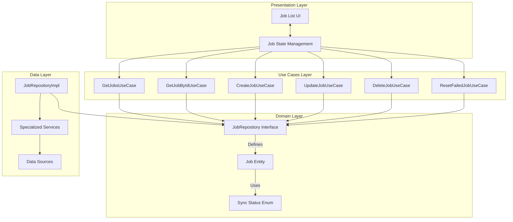
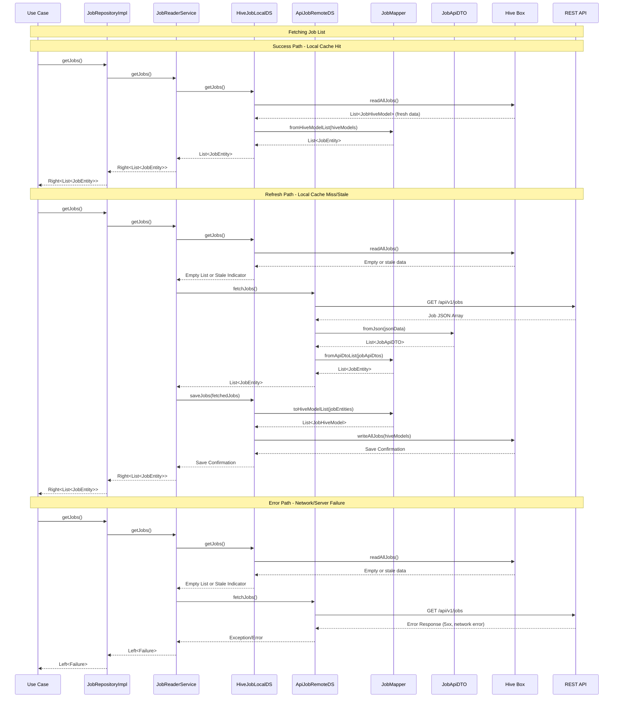

# Mermaid Theme Testing - Realistic Examples

This document contains realistic diagrams styled with different approaches to ensure visibility in both light and dark modes.

## High-Level Architecture Diagram (Flowchart)

**Current Test: Absolute Default Rendering (No Theme, No Custom Styling)**

## Job Data Layer Flow (Sequence Diagram)

**Current Test: Absolute Default Rendering (No Theme, No Custom Styling)**

