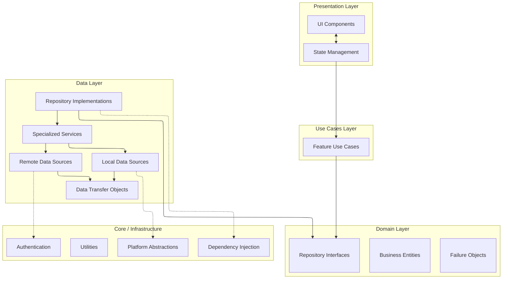
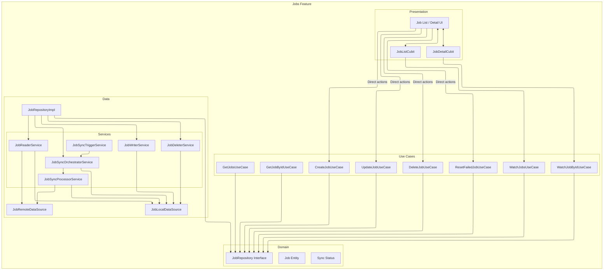

# DocJet Mobile Architecture

This document provides an overview of the DocJet Mobile application architecture.

## Table of Contents

1. [Architectural Principles](#architectural-principles)
2. [Layered Architecture](#layered-architecture)
3. [Feature Architectures](#feature-architectures)

## Architectural Principles

DocJet Mobile follows these key principles:

1. **Clean Architecture** - Clear separation of concerns between layers
2. **Domain-Driven Design** - Core business logic in a pure Dart domain layer
3. **Repository Pattern** - Abstraction over data sources with consistent interfaces
4. **Offline-First** - Local storage with remote synchronization
5. **Reactive UI** - State management for reactive user interfaces

## Layered Architecture

The application uses a Clean Architecture approach with 4 main layers:

### Presentation Layer
- UI components (screens, widgets)
- State management (Cubits/BLoCs)
- Navigation

### Use Cases Layer
- Feature-specific use cases
- Business logic orchestration
- Single responsibility actions
- Includes standard `UseCase` for single actions and `StreamUseCase` for reactive data flows.
- Bridge between Presentation and Domain

### Domain Layer
- Business entities (pure Dart objects)
- Repository interfaces
- Failure handling

### Data Layer
- Repository implementations
- Specialized services (readers, writers, orchestrators)
- Remote data sources (API clients)
- Local data sources (database)
- Data transfer objects (DTOs)

### Core / Infrastructure
- Dependency injection
- Authentication
- Platform abstraction (file system, network)
- Shared utilities

## Job Feature Architecture

For the Jobs feature, we use a service-oriented repository pattern:

## Feature Architectures

Detailed architecture documentation for specific features:

1. [Jobs Feature Architecture](./feature-job-dataflow.md) - Components and data flow for jobs
2. [Jobs Feature: Presentation Layer](./feature-job-presentation.md) - State management and UI interaction
3. [Authentication Architecture](./auth_architecture.md) - Authentication components and flows

## Authentication

The application uses a domain-level authentication context approach, keeping user identity concerns properly isolated:

### Authentication Components
- **AuthCredentialsProvider**: Infrastructure-level provider managing secure storage and retrieval of authentication tokens and user identity with JWT validation capabilities
- **AuthEventBus**: Centralized event system that notifies application components about authentication state changes (login, logout)
- **JwtValidator**: Utility for validating tokens and extracting claims locally without requiring network calls
- **AuthSessionProvider**: Domain-level interface that provides authentication context to components without exposing implementation details
  - **Methods**: `isAuthenticated()` → `Future<bool>`, `getCurrentUserId()` → `Future<String>`
  - **Error Handling**: Throws `AuthException.unauthenticated()` when no user is authenticated
- **SecureStorageAuthSessionProvider**: Implementation connecting the domain-level interface to infrastructure
- **AuthService**: Higher-level service for user login, logout, profile retrieval, and session management
- **AuthInterceptor**: HTTP interceptor with exponential backoff retry logic and centralized logout triggers

### Authentication Context Flow
This architecture avoids passing user IDs through UI and domain layers:
- UI components don't need to track or pass user IDs
- Domain interfaces are simpler and focus on business operations
- Repository implementations retrieve user context directly from `AuthSessionProvider` 
- Authentication errors are handled consistently at the data layer with specialized exception types
- Other components react to auth events via the `AuthEventBus` (e.g., clearing cached data on logout)

### Enhanced Auth Capabilities
The authentication system now includes several advanced features:

1. **Real User Profile Retrieval**: Full user profile data is retrieved after login and token refresh
2. **Offline Support**: JWT tokens are validated locally enabling offline operation when the network is unavailable
3. **Comprehensive Exception Handling**: Specific exception types for different auth error scenarios
4. **Centralized Event System**: Components across the app can react to auth state changes via `AuthEventBus`
5. **Robust Token Refresh**: Automatic refresh with exponential backoff for network issues
6. **Offline Status Indicators**: UI shows offline mode when operating without network connectivity
