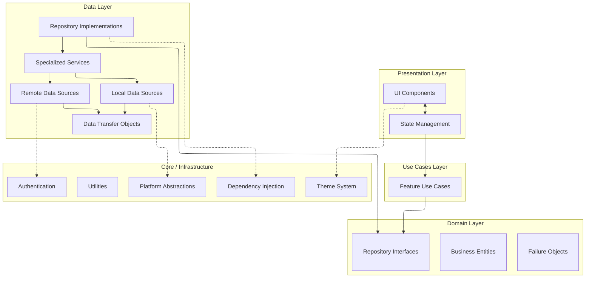
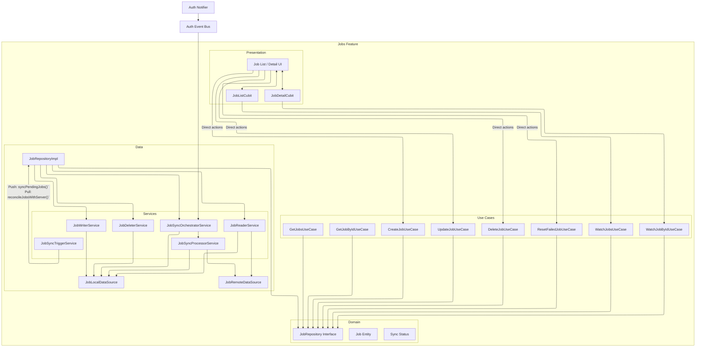

# DocJet Mobile Architecture

This document provides an overview of the DocJet Mobile application architecture.

## Table of Contents

1. [Architectural Principles](#architectural-principles)
2. [Layered Architecture](#layered-architecture)
3. [Feature Architectures](#feature-architectures)
4. [UI Theming System](#ui-theming-system)

## Architectural Principles

DocJet Mobile follows these key principles:

1. **Clean Architecture** - Clear separation of concerns between layers
2. **Domain-Driven Design** - Core business logic in a pure Dart domain layer
3. **Repository Pattern** - Abstraction over data sources with consistent interfaces
4. **Offline-First** - Local storage with remote synchronization
5. **Reactive UI** - State management for reactive user interfaces
6. **Theme-Driven UI** - Centralized theme system with semantic color tokens

## Layered Architecture

The application uses a Clean Architecture approach with 4 main layers:

### Presentation Layer
- UI components (screens, widgets)
- State management (Cubits/BLoCs, specifically using Riverpod with code generation - see [Riverpod Guide](./architecture-riverpod-guide.md))
- Navigation

### Use Cases Layer
- Feature-specific use cases
- Business logic orchestration
- Single responsibility actions
- Includes standard `UseCase` for single actions and `StreamUseCase` for reactive data flows.
- Bridge between Presentation and Domain

### Domain Layer
- Business entities (pure Dart objects)
- Repository interfaces
- Failure handling

### Data Layer
- Repository implementations
- Specialized services (readers, writers, orchestrators)
- Remote data sources (API clients)
- Local data sources (database)
- Data transfer objects (DTOs)

### Core / Infrastructure
- Dependency injection
- Authentication
- Platform abstraction (file system, network)
- Shared utilities
- Theme system and semantic color tokens
- Background storage operations via `LazyHiveService`

#### LazyHiveService

The application uses Hive for local data persistence, optimized through `LazyHiveService`:

- Spawns a dedicated background isolate for Hive operations
- Registers TypeAdapters in both main and background isolates
- Provides a simple API (`init()` and `getBox<T>()`) for accessing Hive boxes
- Implements retry logic with exponential backoff for isolate failures
- Significantly improves app startup performance by removing I/O from the UI thread
- Lazily opens boxes on first access rather than during app initialization

This architecture ensures the UI remains responsive during heavy I/O operations.

## Job Feature Architecture

For the Jobs feature, we use a service-oriented repository pattern:

## Feature Architectures

Detailed architecture documentation for specific features:

1. [Jobs Feature Architecture](./feature-job-dataflow.md) - Components and data flow for jobs
2. [Jobs Feature: Presentation Layer](./feature-job-presentation.md) - State management and UI interaction
3. [Authentication Architecture](./feature-auth-architecture.md) - Authentication components and flows
4. [UI Theming Architecture](../features/feature-ui-theming.md) - Theming system and semantic color tokens

## UI Theming System

The application implements a centralized theming system built around Flutter's `ThemeExtension` mechanism:

1. **Semantic Color Tokens** - `AppColorTokens` extension provides semantic colors 
   (e.g., `dangerBg`, `warningFg`, `offlineBg`, `primaryActionBg`)
2. **Light & Dark Themes** - Automatically adapts to platform brightness preferences using `ThemeMode.system`
3. **Theme Access** - Components access tokens through `getAppColors(context)` utility in `app_theme.dart`
4. **Widget-Specific Themes** - Components like `OfflineBannerTheme` use tokens for consistent styling
5. **Theme Utils** - Utilities like `ThemeUtils.surfaceContainerHighestOrDefault()` for IDE discoverability

This approach ensures visual consistency, simplifies theme changes, and supports native light/dark mode switching. Components use semantic tokens rather than hardcoded colors, making the UI adaptable and maintainable.

For details, see the [UI Theming Architecture](../features/feature-ui-theming.md) document.

## Authentication

The application uses a domain-level authentication context approach, keeping user identity concerns properly isolated:

### Authentication Components
- **AuthCredentialsProvider**: Infrastructure-level provider managing secure storage and retrieval of authentication tokens and user identity with JWT validation capabilities
- **AuthEventBus**: Centralized event system that notifies application components about authentication state changes (login, logout, offline/online transitions)
- **JwtValidator**: Utility for validating tokens and extracting claims locally without requiring network calls
- **AuthSessionProvider**: Domain-level interface that provides authentication context to components without exposing implementation details
  - **Methods**: `isAuthenticated()` → `Future<bool>`, `getCurrentUserId()` → `Future<String>`
  - **Error Handling**: Throws `AuthException.unauthenticated()` when no user is authenticated
- **SecureStorageAuthSessionProvider**: Implementation connecting the domain-level interface to infrastructure
- **AuthService**: Higher-level service for user login, logout, profile retrieval, and session management
- **AuthInterceptor**: HTTP interceptor with exponential backoff retry logic and centralized logout triggers
- **IUserProfileCache**: Interface defining methods for caching user profile data locally
  - **Methods**: `saveProfile()`, `getProfile()`, `clearProfile()`, `clearAllProfiles()`, `isProfileStale()`
  - **Implementation**: `SharedPreferencesUserProfileCache` stores profiles with timestamps in SharedPreferences
- **AuthNotifier**: State management for authentication state, detecting offline/online transitions and managing UI updates

### Authentication Context Flow
This architecture avoids passing user IDs through UI and domain layers:
- UI components don't need to track or pass user IDs
- Domain interfaces are simpler and focus on business operations
- Repository implementations retrieve user context directly from `AuthSessionProvider` 
- Authentication errors are handled consistently at the data layer with specialized exception types
- Other components react to auth events via the `AuthEventBus` (e.g., clearing cached data on logout)

### Enhanced Auth Capabilities
The authentication system includes several advanced features:

1. **Real User Profile Retrieval**: Full user profile data is retrieved after login and token refresh
2. **Offline Profile Caching**: User profiles are cached locally using `SharedPreferencesUserProfileCache` to allow offline operation
   - Profiles are stored with timestamps in SharedPreferences
   - Token validity is checked before using cached profiles
   - Caches are cleared on logout or when both tokens are invalid
   - `acceptOfflineProfile` parameter controls whether cached profiles are acceptable
3. **Connectivity Events**: `NetworkInfoImpl` detects and emits connectivity state changes through `AuthEventBus`:
   - `AuthEvent.offlineDetected`: When network connectivity is lost
   - `AuthEvent.onlineRestored`: When network connectivity is restored
   - Components like `JobSyncOrchestratorService` react to events by pausing/resuming sync
   - `AuthNotifier` updates its state for all UI components based on these events
4. **Offline Authentication**: JWT tokens are validated locally enabling offline operation when the network is unavailable
5. **Comprehensive Exception Handling**: Specific exception types for different auth error scenarios
6. **Global Offline UI**: The `OfflineBanner` component automatically shows when offline
   - Appears at the top of all screens via `AppShell` (applied using `MaterialApp.builder`)
   - Uses theme-aware colors that adapt to light/dark mode via `OfflineBannerTheme`
   - Provides accessibility support through `Semantics` widget
   - Animated transitions with `AnimatedContainer` and `AnimatedOpacity`
7. **Robust Token Refresh**: Automatic refresh with exponential backoff for network issues
8. **Centralized Notification System**: The app uses a flexible notification system for displaying transient messages
   - `AppNotifierService` manages application-wide transient messages (info, success, warning, error)
   - `ConfigurableTransientBanner` displays messages with appropriate styling based on type
   - Auto-dismisses based on configurable duration parameter or stays until manually dismissed
   - Provides enhanced accessibility through Semantics and liveRegion support
   - Can be triggered from anywhere in the app (including AuthNotifier for profile fetch errors)
   - Decouples UI notifications from domain-specific state for greater flexibility
   - Uses theme-aware styling that adapts to light/dark mode
