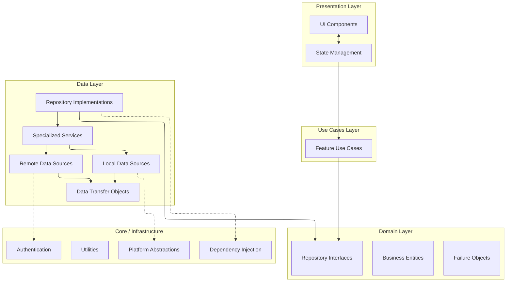

# DocJet Mobile Architecture

This document provides an overview of the DocJet Mobile application architecture.

## Table of Contents

1. [Architectural Principles](#architectural-principles)
2. [Layered Architecture](#layered-architecture)
3. [Feature Architectures](#feature-architectures)

## Architectural Principles

DocJet Mobile follows these key principles:

1. **Clean Architecture** - Clear separation of concerns between layers
2. **Domain-Driven Design** - Core business logic in a pure Dart domain layer
3. **Repository Pattern** - Abstraction over data sources with consistent interfaces
4. **Offline-First** - Local storage with remote synchronization
5. **Reactive UI** - State management for reactive user interfaces

## Layered Architecture

The application uses a Clean Architecture approach with 4 main layers:



### Presentation Layer
- UI components (screens, widgets)
- State management (Cubits/BLoCs)
- Navigation

### Use Cases Layer
- Feature-specific use cases
- Business logic orchestration
- Single responsibility actions
- Includes standard `UseCase` for single actions and `StreamUseCase` for reactive data flows.
- Bridge between Presentation and Domain

### Domain Layer
- Business entities (pure Dart objects)
- Repository interfaces
- Failure handling

### Data Layer
- Repository implementations
- Specialized services (readers, writers, orchestrators)
- Remote data sources (API clients)
- Local data sources (database)
- Data transfer objects (DTOs)

### Core / Infrastructure
- Dependency injection
- Authentication
- Platform abstraction (file system, network)
- Shared utilities

## Job Feature Architecture

For the Jobs feature, we use a service-oriented repository pattern:

```mermaid badge="Updated Diagram"
%%{init: {'flowchart': {'defaultRenderer': 'elk'}}}%%
graph TD
    subgraph "Jobs Feature"
        subgraph "Presentation"
            JobsUI[Job List / Detail UI]
            JobListCubit[JobListCubit]
            JobDetailCubit[JobDetailCubit]
        end

        subgraph "Use Cases"
            GetJobs[GetJobsUseCase]
            GetJobById[GetJobByIdUseCase]
            CreateJob[CreateJobUseCase]
            UpdateJob[UpdateJobUseCase]
            DeleteJob[DeleteJobUseCase]
            ResetFailedJob[ResetFailedJobUseCase]
            WatchJobs[WatchJobsUseCase]
            WatchJobById[WatchJobByIdUseCase]
        end

        subgraph "Domain"
            JobEntity[Job Entity]
            SyncStatus[Sync Status]
            JobRepo[JobRepository Interface]
        end

        subgraph "Data"
            RepoImpl[JobRepositoryImpl]

            subgraph "Services"
                ReaderSvc[JobReaderService]
                WriterSvc[JobWriterService]
                DeleterSvc[JobDeleterService]
                SyncOrch[JobSyncOrchestratorService]
                SyncProc[JobSyncProcessorService]
                SyncTrigger[JobSyncTriggerService]
            end

            LocalDS[JobLocalDataSource]
            RemoteDS[JobRemoteDataSource]
        end

        %% UI to Cubit/Use Case Connections
        JobsUI <--> JobListCubit
        JobsUI <--> JobDetailCubit
        JobsUI --> CreateJob  // Direct actions might still go to Use Cases
        JobsUI --> UpdateJob
        JobsUI --> DeleteJob
        JobsUI --> ResetFailedJob

        %% Cubit to Use Case Connections (Reactive)
        JobListCubit --> WatchJobs
        JobDetailCubit --> WatchJobById

        %% Use Case to Repository Connections
        GetJobs --> JobRepo
        GetJobById --> JobRepo
        CreateJob --> JobRepo
        UpdateJob --> JobRepo
        DeleteJob --> JobRepo
        ResetFailedJob --> JobRepo
        WatchJobs --> JobRepo
        WatchJobById --> JobRepo

        %% Data Layer Connections
        RepoImpl --> JobRepo
        RepoImpl --> ReaderSvc
        RepoImpl --> WriterSvc
        RepoImpl --> DeleterSvc
        RepoImpl --> SyncOrch
        SyncTrigger --> SyncOrch
        SyncOrch --> SyncProc
        ReaderSvc --> LocalDS
        WriterSvc --> LocalDS
        DeleterSvc --> LocalDS
        SyncOrch --> LocalDS
        SyncProc --> LocalDS
        ReaderSvc --> RemoteDS
        SyncProc --> RemoteDS
    end

    %% Class Definitions
    class JobsUI,JobListCubit,JobDetailCubit presentation; // Updated presentation layer classes
    class GetJobs,GetJobById,CreateJob,UpdateJob,DeleteJob,ResetFailedJob,WatchJobs,WatchJobById usecases;
    class JobEntity,SyncStatus,JobRepo domain;
    class RepoImpl,LocalDS,RemoteDS data;
    class ReaderSvc,WriterSvc,DeleterSvc,SyncOrch,SyncProc,SyncTrigger services; // Corrected class name
```

## Feature Architectures

Detailed architecture documentation for specific features:

1. [Jobs Feature Architecture](./job_dataflow.md) - Components and data flow for jobs
2. [Jobs Feature: Presentation Layer](./job_presentation_layer.md) - State management and UI interaction
3. [Authentication Architecture](./auth_architecture.md) - Authentication components and flows
