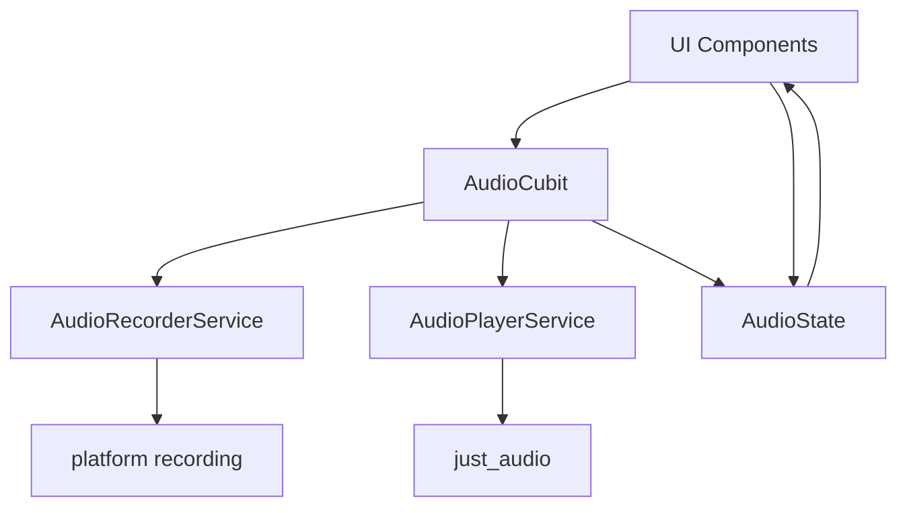
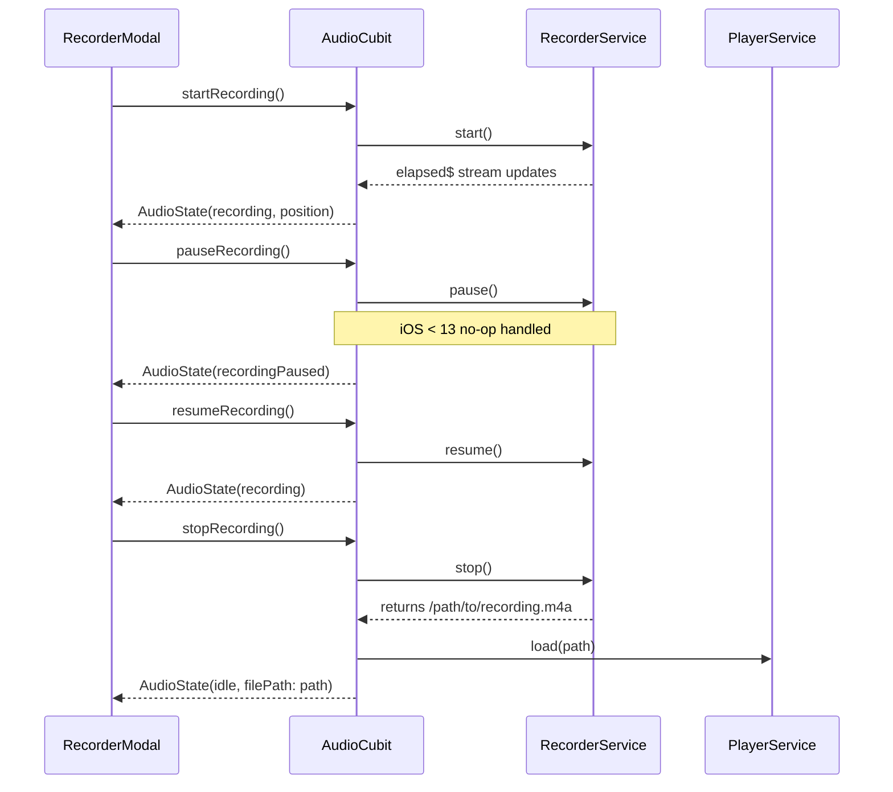
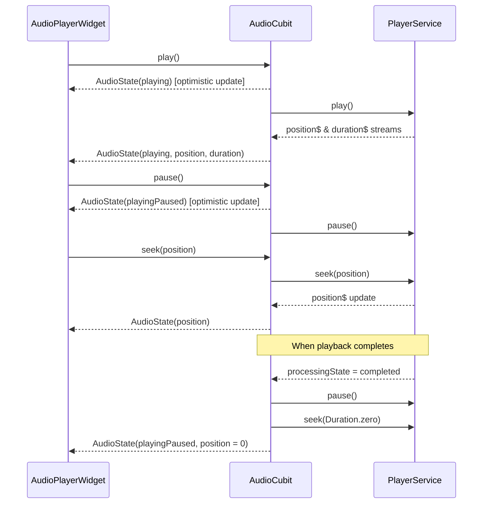
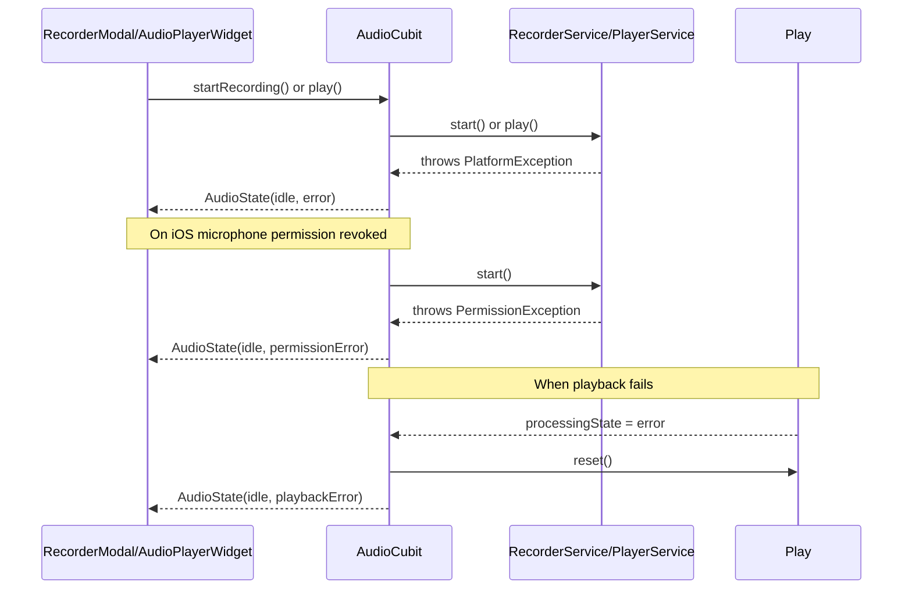

# Audio Recorder & Player System

This document details the architecture, implementation, and usage guidelines for the audio recording and playback system in DocJet Mobile.

> **Related Guide**: For detailed background on reactive stream management, throttling, and state synchronization principles, see [Audio Playback & Reactive State](./architecture-audio-reactive-guide.md)

## Overview

The Audio Recorder & Player system provides a unified interface for recording audio and playing it back within the application. It follows clean architecture principles with clear separation of concerns between recording, playback, and state management.

Key capabilities:
- Record audio with pause/resume functionality
- Automatic handling of iOS pause quirks
- Playback with seek and position tracking
- Auto-rewind on completion
- Unified state management via BLoC pattern
- Secure file persistence with relative paths

## Architecture

The system follows a layered architecture with services, state management, and UI components:



### Component Responsibilities

| Component | Responsibility |
|-----------|----------------|
| `AudioRecorderService` | Handles audio recording operations through the `record` package |
| `AudioPlayerService` | Manages audio playback through the `just_audio` package |
| `AudioCubit` | Orchestrates both services and maintains unified state |
| `AudioState` | Immutable state model with current phase, position, duration, and file information |
| `AudioPlayerWidget` | Reusable widget for audio playback with seek slider |
| `RecorderModal` | Bottom sheet UI for recording with controls and player |

## Sequence Flow

### Recording Flow



### Playback Flow



### Error Flow



## Core Components

### 1. AudioRecorderService (Interface)

```dart
abstract class AudioRecorderService {
  /// Stream emitting the elapsed recording time (throttled to 250ms)
  Stream<Duration> get elapsed$;
  
  /// Starts a new recording
  Future<void> start();
  
  /// Pauses the current recording
  /// Note: On iOS < 13, this is a no-op at the plugin level
  Future<void> pause();
  
  /// Resumes a paused recording
  Future<void> resume();
  
  /// Stops the recording and returns the file path
  Future<String> stop();
  
  /// Clean up resources
  Future<void> dispose();
}
```

### 2. AudioPlayerService (Interface)

```dart
abstract class AudioPlayerService {
  /// Stream of the current playback position (throttled to 200ms)
  Stream<Duration> get position$;
  
  /// Stream of the audio duration (throttled to 200ms)
  Stream<Duration> get duration$;
  
  /// Stream of processing state changes
  Stream<ProcessingState> get processingState$;
  
  /// Loads an audio file for playback
  Future<void> load(String filePath);
  
  /// Starts or resumes playback
  Future<void> play();
  
  /// Pauses playback
  Future<void> pause();
  
  /// Seeks to a specific position
  Future<void> seek(Duration position);
  
  /// Resets the player state
  Future<void> reset();
  
  /// Clean up resources
  Future<void> dispose();
}
```

### 3. AudioState

```dart
enum AudioPhase {
  idle,
  recording,
  recordingPaused,
  playing,
  playingPaused,
}

class AudioState extends Equatable {
  final AudioPhase phase;
  final Duration position;
  final Duration duration;
  final String? filePath;
  final AudioError? error;
  
  // Constructor and copyWith methods...
}
```

### 4. AudioCubit

The `AudioCubit` acts as the facade over both services, providing:

- Unified state management via `AudioState`
- Stream combination with proper throttling
- Proper emission of state changes
- Service lifecycle management
- Auto-rewind on playback completion

Key implementation details:
- Uses `Rx.combineLatest3` to merge elapsed$, position$, and duration$ streams
- Applies exactly one `.debounceTime(60ms)` on the combined stream
- Emits optimistic UI updates before await for responsive UI
- Handles the iOS pause quirk via internal state tracking

### 5. AudioPlayerWidget

Reusable UI component displaying:
- Play/pause button that adapts to current state
- Seek slider showing position and allowing drag-to-seek
- Current position and duration display

#### Key Implementation Details
- **Color Theming**: All visual elements (icons, text, slider) derive their colors from `AppColorTokens` to ensure theme consistency.
- **Accessibility**: Interactive elements within `AudioPlayerWidget`, such as play/pause and seek controls, include appropriate `Semantics` properties (labels, roles, states) to support assistive technologies. This is often achieved by using base components like `CircularActionButton` which have these semantics built-in.

```dart
class AudioPlayerWidget extends StatelessWidget {
  const AudioPlayerWidget({super.key});
  
  @override
  Widget build(BuildContext context) {
    return BlocBuilder<AudioCubit, AudioState>(
      builder: (context, state) {
        // Build UI based on state
      }
    );
  }
}
```

### 6. Theming and Color System

The audio UI components leverage a centralized theming system managed by `AppColorTokens`. This class provides a consistent set of color definitions for both light and dark themes, ensuring visual harmony across the application.

**Key Features:**

-   **Centralized Tokens**: `AppColorTokens` defines all primary, interactive, semantic, and status colors used by the audio widgets.
-   **Composable Structure**: To enhance maintainability and clarity, `AppColorTokens` is composed of several specialized token classes:
    -   `BaseStatusTokens`: Defines general status colors (e.g., danger, warning, success, info).
    -   `BrandInteractiveTokens`: Defines CI brand colors and colors for interactive elements.
    -   `NotificationBannerTokens`: Defines colors specifically for notification banners.
    -   `SemanticStatusTokens`: Defines colors for semantic states within the UI (e.g., recording, playing).
-   **Theme Awareness**: Widgets access these tokens via `Theme.of(context).extension<AppColorTokens>()`, ensuring they adapt to the current theme (light/dark).
-   **Accessibility**: Color choices are made with accessibility contrast ratios in mind.

Widgets like `RecorderModal` and `AudioPlayerWidget` source their background colors, icon colors, and text colors directly from `AppColorTokens`, ensuring a consistent look and feel that aligns with the overall application theme.

### 7. RecorderModal

The `RecorderModal` provides the primary user interface for creating new audio recordings. It's typically presented as a bottom sheet and manages the different phases of audio capture and review.

**Key Features & Implementation Details:**

-   **State-Driven UI**: The modal displays different controls based on the current `AudioPhase` from `AudioCubit`:
    -   **Idle**: Shows a prominent "Record" button (`RecordStartButton`).
    -   **Recording**: Displays a timer, along with "Pause" and "Stop" buttons.
    -   **Paused**: Shows the timer, "Resume," and "Stop" buttons.
    -   **Loaded (Review)**: Presents the `AudioPlayerWidget` for playback, along with "Accept" and "Cancel/Retake" actions.
-   **Color Theming**: Consistent with other UI elements, `RecorderModal` sources its background, button, and icon colors from `AppColorTokens`.
-   **Accessibility**: All interactive controls within the modal (e.g., record, pause, stop, play, accept buttons) are wrapped with appropriate `Semantics` widgets, providing clear labels, button roles, and state information for assistive technologies. This relies on underlying components like `CircularActionButton` and `RecordStartButton`.
-   **Smooth Transitions**: When transitioning between states (e.g., from recording to paused), the modal uses `AnimatedSize` in conjunction with `Container` background color animations to provide smooth visual feedback without abrupt layout jumps.
-   **Helper Methods**: Internal UI building logic is encapsulated in private, `static` helper methods (e.g., `_buildRecordingControls`, `_buildActionButtons`) for clarity and efficiency.

## File Path Management

Audio files follow a strict path management approach to ensure security and persistence:

1. **Recording Location**:
   - The `record` package saves to `/tmp` or `/Caches` on iOS
   - These locations are subject to system cleanup
   
2. **Persistence Strategy**:
   - Files are moved to `<app documents>/audio/` directory
   - `FileSystem` abstraction provides security boundaries (`lib/core/fs/file_system.dart`)
   - Uses file rename with copy+delete fallback
   
3. **Path Normalization**:
   - `FileSystem.resolvePath()` handles relative vs. absolute paths
   - Relative paths (`audio/recording.m4a`) are used for job creation
   - Edge cases like `path.relative()` returning `'.'` are handled

## Integration Guide

### Using in JobListPlayground

The `JobListPlayground` demonstrates audio recording/playback integration:

1. Tapping record button opens `RecorderModal` as a bottom sheet
2. After recording, the modal returns the absolute file path
3. The path is processed and moved into the app's documents directory (via `FileSystem`), then used to create a job

```dart
// Basic integration pattern
final cubit = AudioCubit(
  recorderService: AudioRecorderServiceImpl(),
  playerService: AudioPlayerServiceImpl(),
);

final filePath = await showModalBottomSheet<String>(
  context: context,
  builder: (_) => BlocProvider.value(
    value: cubit,
    child: const RecorderModal(),
  ),
);

// Close cubit when done
await cubit.close();
```

### Adding to a New Feature

To integrate audio recording in another feature:

1. Create the services and cubit:
```dart
final recorderService = AudioRecorderServiceImpl();
final playerService = AudioPlayerServiceImpl();
final audioCubit = AudioCubit(
  recorderService: recorderService,
  playerService: playerService,
);
```

2. Provide the cubit to the widget tree:
```dart
BlocProvider<AudioCubit>(
  create: (context) => audioCubit,
  child: YourWidget(),
)
```

3. Use the `RecorderModal` or build custom UI using the cubit:
```dart
// Use modal approach
final filePath = await showModalBottomSheet<String>(
  context: context,
  builder: (_) => const RecorderModal(),
);

// Or access cubit directly in your widgets
final cubit = context.read<AudioCubit>();
cubit.startRecording();
```

4. Important: Remember to close the cubit when you're done:
```dart
@override
void dispose() {
  audioCubit.close();
  super.dispose();
}
```

## Testing Approach

### Service Tests

- `AudioRecorderServiceTest`: Verifies elapsed stream emits at correct intervals, handling of pause/resume, and proper file path return
- `AudioPlayerServiceTest`: Confirms throttled streams forward correctly, proper loading, and state transitions

### Cubit Tests

- `AudioCubitTest`: Validates state transitions for all phases, stream combination, proper file handling, and auto-rewind functionality

### Widget Tests

- `AudioPlayerWidgetTest`: Checks rendering, touch interactions, and reactive rebuilds
- `RecorderModalTest`: Verifies complete recording flow, button state changes, and final path return

### Integration/Golden Testing

While standard golden tests exist for visual components, we deliberately avoid audio golden file tests due to:
- Environment-based recording variation (microphone quality, background noise)
- Binary file differences causing source control bloat
- Long-term maintenance cost exceeding value

Instead, we use contract-based mocks to validate integration points and provide predefined audio samples for integration tests.

## iOS Quirks Detection & Handling

The iOS pause quirk (lack of pause support on iOS < 13) is detected using:

```dart
// Inside the RecorderServiceImpl
final bool isiOS = Platform.isIOS;
late final bool _supportsRecordingPause;

Future<void> _initializeIOSVersionCheck() async {
  if (isiOS) {
    final iosInfo = await DeviceInfoPlugin().iosInfo;
    final versionParts = iosInfo.systemVersion.split('.');
    final majorVersion = int.tryParse(versionParts[0]) ?? 0;
    _supportsRecordingPause = majorVersion >= 13;
  } else {
    _supportsRecordingPause = true;
  }
}
```

## Best Practices & Known Issues

### Stream Management

- **DO** use `.distinct()` on all outgoing streams
- **DO** apply exactly one `.debounceTime()` in the cubit, not on individual service streams
- **DO** use `.asBroadcastStream()` for all exposed streams to allow multiple listeners
- **DON'T** update UI directly from service streams; always go through the cubit

### Testing

- **DO** use `blocTest` for testing the `AudioCubit`
- **DO** use explicit pumps with durations (e.g., `tester.pump(Duration(milliseconds: 250))`) instead of `pumpAndSettle()` to avoid test flakiness with throttled streams
- **DO** consider hand-rolled fakes instead of complex Mockito setups for generic methods

### File Management

- **DO** use `FileSystem` abstraction instead of direct `dart:io` for security and testability
- **DO** check if files are within app documents directory before using
- **DO** place audio files in the standard `audio/` subdirectory
- **DO** convert absolute paths to relative before storing in jobs
- **DON'T** log full paths in production due to PII concerns

### Edge Cases

- **iOS Pause Quirk**: The `record` plugin silently no-ops on `pause()` for iOS < 13
- **Path Relativity**: `path.relative()` can return `'.'` if the file is at the docs directory root
- **Finished State**: Detect playback completion via `phase == AudioPhase.playingPaused && position == Duration.zero` (auto-rewind)
- **Navigator Lifecycle**: Always `await cubit.close()` AFTER modal is popped

## Dependencies

The system relies on the following packages:
- `record`: ^5.0.1 - For audio recording
- `just_audio`: ^0.9.35 - For audio playback
- `path`: ^1.8.3 - For path manipulation
- `path_provider`: ^2.1.1 - For app document directory access
- `flutter_bloc`: ^8.1.3 - For state management
- `rxdart`: ^0.27.7 - For stream combining and operators
- `device_info_plus`: ^9.0.2 - For iOS version detection

Internal `FileSystem` abstraction (`lib/core/fs/file_system.dart`) is used for secure file operations.

## Error Handling

The system handles multiple error scenarios:

### Recording Errors
- Permission denied: If microphone permissions are revoked during recording
- Storage full: If device storage is exhausted during recording
- Hardware failure: If recording device becomes unavailable

### Playback Errors
- File not found: If the audio file was deleted or moved
- Format errors: If file is corrupted or in an unsupported format
- Player initialization failure: If system audio services are unavailable

Error handling follows these principles:
1. Errors are captured at service level but propagated to the UI via AudioState
2. Recovery actions are applied automatically when possible (reset player on error)
3. User-visible errors use appropriate semantic messaging in the UI

## Future Enhancements

Potential future improvements:
1. Adding waveform visualization during recording
2. Background audio support (with `just_audio_background`)
3. Audio effects and processing
4. Extended file format support
5. Integration with speech-to-text APIs 