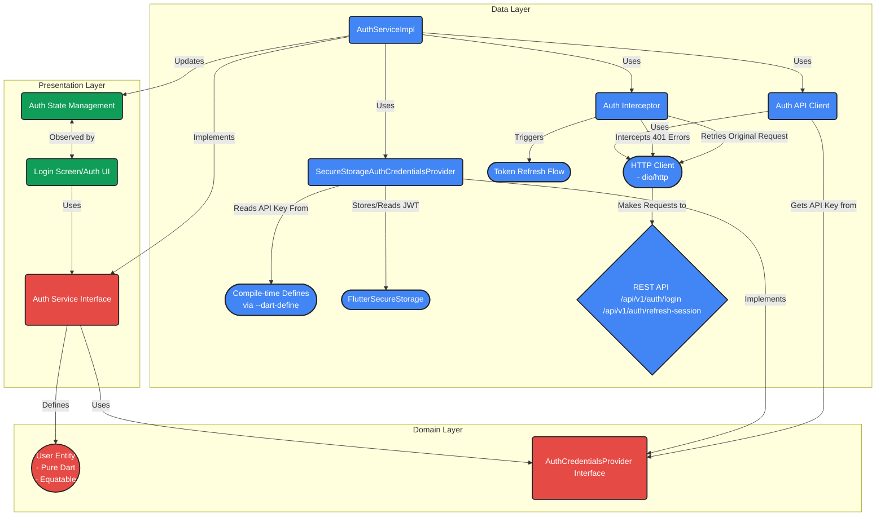
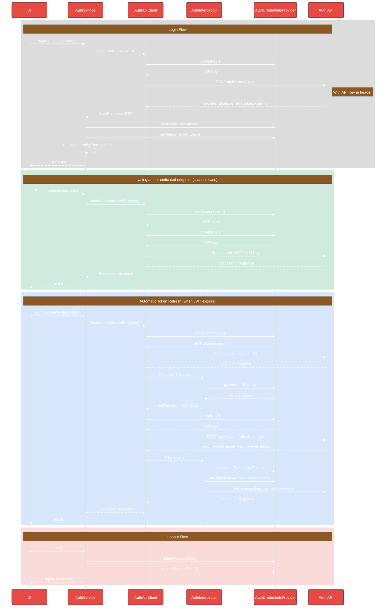

# Authentication Architecture

This document details the authentication system architecture for DocJet Mobile.

## Authentication Component Overview

This diagram illustrates the components and their relationships for the authentication system.



## Authentication Flow

### Current Implementation

This sequence diagram illustrates the current authentication implementation:



### Desired Implementation

This sequence diagram illustrates the complete desired authentication process, including the enhancements outlined in the TODOs:

```mermaid
%%{init: {'theme': 'base', 'themeVariables': { 
  'primaryColor': '#E64A45', 
  'primaryTextColor': '#fff', 
  'primaryBorderColor': '#222', 
  'lineColor': '#4285F4', 
  'secondaryColor': '#0F9D58', 
  'tertiaryColor': '#9E9E9E',
  'actorLineColor': '#e0e0e0',
  'noteBkgColor': '#8C5824',      
  'noteTextColor': '#fff'       
}}}%%
sequenceDiagram
    participant UI as UI
    participant AuthSvc as AuthService
    participant ApiClient as AuthApiClient
    participant Interceptor as AuthInterceptor
    participant CredProvider as AuthCredentialsProvider
    participant API as Auth API
    participant AppComponents as Other App Components

    %% Login Flow
    rect rgb(80, 80, 80, 0.2)
    Note over UI,API: Login Flow
    UI->>AuthSvc: login(email, password)
    AuthSvc->>ApiClient: login(email, password)
    ApiClient->>CredProvider: getApiKey()
    CredProvider-->>ApiClient: API Key
    ApiClient->>API: POST /api/v1/auth/login
    Note right of API: With API Key in header
    API-->>ApiClient: {access_token, refresh_token, user_id}
    ApiClient-->>AuthSvc: AuthResponse DTO
    AuthSvc->>CredProvider: setAccessToken(token)
    AuthSvc->>CredProvider: setRefreshToken(token)
    AuthSvc->>ApiClient: getUserProfile()
    ApiClient->>API: GET /api/v1/users/profile
    API-->>ApiClient: {id, name, email, settings, etc}
    ApiClient-->>AuthSvc: User Profile DTO
    AuthSvc->>AuthSvc: Create User entity
    AuthSvc-->>UI: User entity
    end
    
    %% Using an authenticated endpoint (success)
    rect rgb(15, 157, 88, 0.2)
    Note over UI,API: Using an authenticated endpoint (success case)
    UI->>AuthSvc: Some authenticated action
    AuthSvc->>ApiClient: makeAuthenticatedRequest()
    ApiClient->>CredProvider: getAccessToken()
    CredProvider-->>ApiClient: JWT token
    Note over CredProvider: Validate token expiry locally
    ApiClient->>CredProvider: getApiKey()
    CredProvider-->>ApiClient: API Key
    ApiClient->>API: Request with JWT + API Key
    API-->>ApiClient: Successful Response
    ApiClient-->>AuthSvc: Processed response
    AuthSvc-->>UI: Result
    end
    
    %% Offline Authentication
    rect rgb(230, 150, 40, 0.2)
    Note over UI,API: Offline Authentication
    UI->>AuthSvc: Some authenticated action
    AuthSvc->>ApiClient: makeAuthenticatedRequest()
    ApiClient->>CredProvider: getAccessToken()
    CredProvider-->>ApiClient: JWT token
    Note over ApiClient: Detect offline state
    ApiClient--x API: Network unavailable
    ApiClient->>CredProvider: validateTokenLocally(token)
    CredProvider-->>ApiClient: Token valid until {expiry}
    ApiClient->>ApiClient: Use cached data
    ApiClient-->>AuthSvc: Processed response with offline flag
    AuthSvc-->>UI: Result with offline indicator
    end
    
    %% Token Refresh Flow (automatic)
    rect rgb(66, 133, 244, 0.2)
    Note over UI,API: Automatic Token Refresh (when JWT expires)
    UI->>AuthSvc: Some authenticated action
    AuthSvc->>ApiClient: makeAuthenticatedRequest()
    ApiClient->>CredProvider: getAccessToken()
    CredProvider-->>ApiClient: JWT token (expired)
    ApiClient->>API: Request with expired JWT
    API-->>ApiClient: 401 Unauthorized
    ApiClient->>Interceptor: Receives 401 error
    Interceptor->>CredProvider: getRefreshToken()
    CredProvider-->>Interceptor: Refresh token
    Interceptor->>ApiClient: refreshToken(refreshToken)
    ApiClient->>CredProvider: getApiKey()
    CredProvider-->>ApiClient: API Key
    ApiClient->>API: POST /api/v1/auth/refresh-session
    API-->>ApiClient: {new_access_token, new_refresh_token}
    ApiClient-->>Interceptor: New tokens
    Interceptor->>CredProvider: setAccessToken(newToken)
    Interceptor->>CredProvider: setRefreshToken(newRefreshToken)
    Interceptor->>API: Retry original request with new token
    API-->>ApiClient: Successful Response
    ApiClient-->>AuthSvc: Processed response
    AuthSvc-->>UI: Result
    end
    
    %% Token Refresh Failure with Exponential Backoff
    rect rgb(150, 50, 50, 0.2)
    Note over UI,API: Token Refresh Failure (with retry)
    Interceptor->>API: POST /api/v1/auth/refresh-session
    API-->>Interceptor: Network Error
    Interceptor->>Interceptor: Retry with exponential backoff
    Note over Interceptor: Wait 1s, then 2s, then 4s...
    Interceptor->>API: POST /api/v1/auth/refresh-session
    API-->>Interceptor: {new_access_token, new_refresh_token}
    end
    
    %% Logout Flow with Event System
    rect rgb(230, 74, 69, 0.2)
    Note over UI,AppComponents: Logout Flow with Event System
    UI->>AuthSvc: logout()
    AuthSvc->>CredProvider: deleteAccessToken()
    AuthSvc->>CredProvider: deleteRefreshToken()
    AuthSvc->>AuthSvc: Emit AuthEvent.loggedOut
    AuthSvc-->>UI: Logout successful
    AuthSvc-->>AppComponents: AuthEvent.loggedOut
    AppComponents->>AppComponents: Clear caches
    AppComponents->>AppComponents: Reset states
    end
```



## Authentication Components

### Domain Layer

#### AuthService Interface
The `AuthService` interface defines the following methods:
- `Future<User> login(String email, String password)` - Authenticates a user and returns user data
- `Future<bool> refreshSession()` - Manually refreshes the authentication token (used on startup)
- `Future<void> logout()` - Logs the user out by clearing stored tokens
- `Future<bool> isAuthenticated()` - Checks if stored credentials exist (basic check for initial app state)

#### AuthCredentialsProvider Interface
Manages secure storage and retrieval of authentication credentials:
- API key from environment variables
- Access and refresh tokens in secure storage

### Data Layer

#### AuthServiceImpl
Implements the `AuthService` interface, orchestrating the authentication flow.

#### AuthApiClient
Responsible for communication with authentication endpoints:
- `login()` - Authenticates with email/password
- `refreshToken()` - Refreshes tokens when expired
- Maps API errors to domain-specific exceptions

#### AuthInterceptor
A Dio interceptor that:
1. Automatically detects 401 (Unauthorized) errors
2. Initiates token refresh flow
3. Retries the original request with the new token
4. Handles failure cases (like invalid refresh tokens)

This approach provides seamless token refresh without UI layer awareness of expired tokens. The authentication flow is handled at the data layer where it belongs, maintaining clean separation of concerns.

#### SecureStorageAuthCredentialsProvider
Concrete implementation of `AuthCredentialsProvider` using:
- `flutter_secure_storage` for token storage
- `String.fromEnvironment` for the API key (sourced from compile-time definitions via `--dart-define` or `--dart-define-from-file`)

### Presentation Layer

#### AuthState
Immutable state object representing the current authentication state:
- `user` - The authenticated user entity
- `status` - Current status (authenticated, unauthenticated, loading, error)
- `errorMessage` - Error message if authentication failed

#### AuthNotifier
State management for authentication, connecting UI to domain services:
- `login()` - Authenticates a user
- `logout()` - Logs out the current user
- `checkAuthStatus()` - Verifies authentication on app startup

The UI components observe the `AuthNotifier` state to render the appropriate screens based on authentication status. 

## Authentication Implementation TODOs

The following enhancements are needed to complete the authentication implementation according to the architecture diagram:

### 1. Implement Real User Profile Retrieval

After token refresh, we need to retrieve the current user profile rather than using a placeholder:

```dart
// Current implementation in AuthNotifier:
if (refreshed) {
  // We successfully refreshed, need to manually get user info since
  // we don't have it from login flow
  try {
    // In a real implementation, we'd call a getUserProfile method
    // on the auth service to get the full user details.
    // For now, we'll create a placeholder user
    final userId = 'existing-user';
    state = AuthState.authenticated(User(id: userId));
  } catch (e) {
    // If we can't get the user info, force logout
    await logout();
  }
}
```

- Create a `getUserProfile` method in the `AuthService` interface
- Implement the method in `AuthServiceImpl` to get user data from API
- Create a user profile endpoint in `AuthApiClient`

### 2. Add Explicit Token Validation

Currently, `isAuthenticated()` only checks if credentials exist, not their validity:

```dart
/// Checks if a user is currently authenticated
///
/// Returns true if the user is authenticated, false otherwise.
/// This performs a basic check of stored credentials; it does not
/// validate with the server if the credentials are still valid.
Future<bool> isAuthenticated();
```

- Add optional `validateToken` parameter to `isAuthenticated` method
- Implement lightweight JWT validation (check expiration without API call)

### 3. Enhance Auth Exception Handling

Current error mapping is basic and could be more specific:

```dart
if (statusCode == 401) {
  // For login endpoint, it's invalid credentials
  // For refresh endpoint, it's an expired token
  if (e.requestOptions.path.contains(_refreshEndpoint)) {
    return AuthException.tokenExpired();
  }
  return AuthException.invalidCredentials();
}
```

- Create more specific exception subtypes for better error handling
- Add dedicated exception handling for network issues in interceptor

### 4. Add Offline Authentication Support

The refresh session workflow doesn't handle offline scenarios:

```dart
Future<bool> refreshSession() async {
  // Get the stored refresh token
  final refreshToken = await credentialsProvider.getRefreshToken();

  // Can't refresh without a refresh token
  if (refreshToken == null) {
    return false;
  }
  // ...
}
```

- Implement local token validation for offline support
- Add graceful degradation when offline (flag to work offline if network unavailable)

### 5. Update Interceptor Error Recovery

The auth interceptor could be more robust in handling various error scenarios:

```dart
try {
  // Attempt to refresh the token
  final refreshToken = await credentialsProvider.getRefreshToken();
  if (refreshToken == null) {
    // No refresh token available, can't retry
    return handler.next(err);
  }
  // ...
}
```

- Add centralized auth state listener to handle forced logouts
- Improve retry logic with exponential backoff for transient errors

### 6. Add Log Out Event Notification

Logout currently doesn't notify other parts of the app:

```dart
/// Logs out the current user
Future<void> logout() async {
  await _authService.logout();
  state = AuthState.initial();
}
```

- Create auth event system to notify app about authentication changes
- Add proper app-wide response to logout events (clear caches, etc.) 