# Authentication Architecture

This document details the authentication system architecture for DocJet Mobile.

## Authentication Component Overview

This diagram illustrates the components and their relationships for the authentication system.

```mermaid
%%{init: {'flowchart': {'defaultRenderer': 'elk'}}}%%
graph TD
    subgraph "Presentation Layer"
        UI(Login Screen/Auth UI) -->|Uses| AuthService(Auth Service Interface)
        AuthState(Auth State Management) <-->|Observed by| UI
        AuthState -->|Shows Offline Status| UI
    end

    subgraph "Domain Layer"
        AuthService -->|Defines| User((User Entity<br>- Pure Dart<br>- Equatable))
        AuthService -->|Uses| AuthCredProvider(AuthCredentialsProvider Interface)
        AuthService -->|Emits Events via| AuthEventBus([Auth Event Bus])
    end

    subgraph "Data Layer"
        AuthServiceImpl(AuthServiceImpl) -->|Implements| AuthService
        AuthServiceImpl -->|Uses| AuthApiClient(Auth API Client)
        AuthServiceImpl -->|Updates| AuthState
        AuthServiceImpl -->|Uses| AuthCredProviderImpl(SecureStorageAuthCredentialsProvider)
        AuthServiceImpl -->|Uses| AuthInterceptor(Auth Interceptor)
        
        AuthCredProviderImpl -->|Implements| AuthCredProvider
        AuthCredProviderImpl -->|Reads API Key From| CompileDefines([Compile-time Defines<br>via --dart-define])
        AuthCredProviderImpl -->|Stores/Reads JWT| SecureStorage([FlutterSecureStorage])
        AuthCredProviderImpl -->|Validates Tokens via| JwtValidator([JWT Validator])
        
        DioFactory -->|Configures| HttpClient
        DioFactory -->|Injects API Key via Interceptor| HttpClient
        DioFactory -->|Injects AuthInterceptor| HttpClient
        
        AuthApiClient -->|Uses| HttpClient([HTTP Client<br>- Specifically Dio])
        AuthApiClient -->|Gets User Profile| AuthAPI
        
        AuthInterceptor -->|Intercepts 401 Errors| HttpClient
        AuthInterceptor -->|Triggers| TokenRefresh([Token Refresh Flow])
        AuthInterceptor -->|Retries Original Request| HttpClient
        AuthInterceptor -->|Uses Exponential Backoff| TokenRefresh
        AuthInterceptor -->|Listens to| AuthEventBus
        AuthInterceptor -->|Uses Function Reference to| AuthApiClient
        
        HttpClient -->|Makes Requests to| AuthAPI{REST API<br>Endpoints defined in ApiConfig<br>(e.g., /api/v1/auth/login)}
    end

    subgraph "Other Components"
        OtherComponents([App Components]) -->|React to| AuthEventBus
    end
```

## Authentication Flow

This sequence diagram illustrates the current authentication implementation including all the enhanced features:

```mermaid
sequenceDiagram
    participant UI as UI
    participant AuthSvc as AuthService
    participant ApiClient as AuthApiClient
    participant Interceptor as AuthInterceptor
    participant CredProvider as AuthCredentialsProvider
    participant API as Auth API
    participant AppComponents as Other App Components

    %% Login Flow
    Note over UI,API: Login Flow
    UI->>AuthSvc: login(email, password)
    AuthSvc->>ApiClient: login(email, password)
    ApiClient->>CredProvider: getApiKey()
    CredProvider-->>ApiClient: API Key
    ApiClient->>API: POST /api/v1/auth/login
    Note right of API: With API Key in header
    API-->>ApiClient: {access_token, refresh_token, user_id}
    ApiClient-->>AuthSvc: AuthResponse DTO
    AuthSvc->>CredProvider: setAccessToken(token)
    AuthSvc->>CredProvider: setRefreshToken(token)
    AuthSvc->>ApiClient: getUserProfile()
    ApiClient->>API: GET /api/v1/users/profile
    API-->>ApiClient: {id, name, email, settings, etc}
    ApiClient-->>AuthSvc: User Profile DTO
    AuthSvc->>AuthSvc: Create User entity
    AuthSvc->>AuthSvc: Emit AuthEvent.loggedIn
    AuthSvc-->>UI: User entity
    
    %% Using an authenticated endpoint (success)
    Note over UI,API: Using an authenticated endpoint (success case)
    UI->>AuthSvc: Some authenticated action
    AuthSvc->>ApiClient: makeAuthenticatedRequest()
    ApiClient->>CredProvider: getAccessToken()
    CredProvider-->>ApiClient: JWT token
    Note over CredProvider: Validate token expiry locally
    ApiClient->>CredProvider: getApiKey()
    CredProvider-->>ApiClient: API Key
    ApiClient->>API: Request with JWT + API Key
    API-->>ApiClient: Successful Response
    ApiClient-->>AuthSvc: Processed response
    AuthSvc-->>UI: Result
    
    %% Offline Authentication
    Note over UI,API: Offline Authentication
    UI->>AuthSvc: Some authenticated action
    AuthSvc->>ApiClient: makeAuthenticatedRequest()
    ApiClient->>CredProvider: getAccessToken()
    CredProvider-->>ApiClient: JWT token
    Note over ApiClient: Detect offline state
    ApiClient--x API: Network unavailable
    ApiClient->>CredProvider: validateTokenLocally(token)
    CredProvider-->>ApiClient: Token valid until {expiry}
    ApiClient->>ApiClient: Use cached data
    ApiClient-->>AuthSvc: Processed response with offline flag
    AuthSvc-->>UI: Result with offline indicator
    
    %% Token Refresh Flow (automatic)
    Note over UI,API: Automatic Token Refresh (when JWT expires)
    UI->>AuthSvc: Some authenticated action
    AuthSvc->>ApiClient: makeAuthenticatedRequest()
    ApiClient->>CredProvider: getAccessToken()
    CredProvider-->>ApiClient: JWT token (expired)
    ApiClient->>API: Request with expired JWT
    API-->>ApiClient: 401 Unauthorized
    ApiClient->>Interceptor: Receives 401 error
    Interceptor->>Interceptor: Acquire mutex lock
    Interceptor->>CredProvider: getRefreshToken()
    CredProvider-->>Interceptor: Refresh token
    Interceptor->>ApiClient: refreshToken(refreshToken)
    Note right of Interceptor: Using function reference instead of direct dependency
    ApiClient->>CredProvider: getApiKey()
    CredProvider-->>ApiClient: API Key
    ApiClient->>API: POST /api/v1/auth/refresh-session
    API-->>ApiClient: {new_access_token, new_refresh_token}
    ApiClient-->>Interceptor: New tokens
    Interceptor->>CredProvider: setAccessToken(newToken)
    Interceptor->>CredProvider: setRefreshToken(newRefreshToken)
    Interceptor->>API: Retry original request with new token
    API-->>ApiClient: Successful Response
    ApiClient-->>AuthSvc: Processed response
    AuthSvc-->>UI: Result
    Interceptor->>Interceptor: Release mutex lock
    
    %% Token Refresh Failure with Exponential Backoff
    Note over UI,API: Token Refresh Failure (with retry)
    Interceptor->>API: POST /api/v1/auth/refresh-session
    API-->>Interceptor: Network Error
    Interceptor->>Interceptor: Retry with exponential backoff
    Note over Interceptor: Wait 500ms, then 1s, then 2s...
    Interceptor->>API: POST /api/v1/auth/refresh-session
    API-->>Interceptor: {new_access_token, new_refresh_token}
    
    %% Unexpected Error Handling
    Note over UI,API: Unexpected Error During Token Refresh
    Interceptor->>API: POST /api/v1/auth/refresh-session
    API-->>Interceptor: Unexpected Error (not auth related)
    Interceptor->>Interceptor: Create new DioException with error context
    Interceptor->>Interceptor: Trigger logout
    Interceptor->>Interceptor: Release mutex lock
    Interceptor-->>AuthSvc: Propagate enhanced error
    
    %% Logout Flow with Event System
    Note over UI,AppComponents: Logout Flow with Event System
    UI->>AuthSvc: logout()
    AuthSvc->>CredProvider: deleteAccessToken()
    AuthSvc->>CredProvider: deleteRefreshToken()
    AuthSvc->>AuthSvc: Emit AuthEvent.loggedOut
    AuthSvc-->>UI: Logout successful
    AuthSvc-->>AppComponents: AuthEvent.loggedOut
    AppComponents->>AppComponents: Clear caches
    AppComponents->>AppComponents: Reset states
```



## Authentication Components

### Domain Layer

#### AuthService Interface
The `AuthService` interface defines the following methods:
- `Future<User> login(String email, String password)` - Authenticates a user and returns user data
- `Future<bool> refreshSession()` - Manually refreshes the authentication token (used on startup)
- `Future<void> logout()` - Logs the user out by clearing stored tokens
- `Future<bool> isAuthenticated({bool validateTokenLocally = false})` - Checks if stored credentials exist and optionally validates token expiry locally
- `Future<User> getUserProfile()` - Retrieves the user profile information
- `Future<String> getCurrentUserId()` - Gets the current authenticated user ID

The service also emits authentication events via `AuthEventBus` for app-wide state management:
- `AuthEvent.loggedIn` - Emitted when a user successfully logs in
- `AuthEvent.loggedOut` - Emitted when a user logs out

#### AuthEventBus
A central event bus that broadcasts authentication events to interested components. It:
- Enables loose coupling between auth components and dependent features
- Provides standardized events (`AuthEvent.loggedIn`, `AuthEvent.loggedOut`) 
- Allows app components to react appropriately to auth state changes

#### AuthCredentialsProvider Interface
Manages secure storage and retrieval of authentication credentials:
- API key from environment variables
- Access and refresh tokens in secure storage
- JWT validation methods to check token validity without network calls
- User ID extraction from tokens

### Data Layer

#### AuthServiceImpl
Implements the `AuthService` interface, orchestrating the authentication flow:
- Handles local token validation for offline authentication
- Coordinates with `AuthApiClient` for network operations
- Emits events via `AuthEventBus` for logout and login
- Gracefully handles offline scenarios with appropriate error propagation

#### AuthApiClient
Responsible for communication with authentication endpoints:
- Uses `ApiConfig` constants for endpoint paths (e.g., `ApiConfig.loginEndpoint`)
- `login()` - Authenticates with email/password
- `refreshToken()` - Refreshes tokens when expired
- `getUserProfile()` - Retrieves full user profile data
- Maps API errors to domain-specific exceptions using enhanced exception types
- **Note:** Relies on the injected `Dio` instance (typically configured by `DioFactory`)
  to handle `x-api-key` header injection and JWT token management via interceptors.
  It does *not* directly manage the API key or access tokens.

#### AuthInterceptor
A Dio interceptor that:
1. Automatically detects 401 (Unauthorized) errors
2. Initiates token refresh flow
3. Implements exponential backoff retry logic for transient errors
4. Triggers app-wide logout via `AuthEventBus` when refresh fails
5. Retries the original request with the new token
6. Uses mutex locking to prevent concurrent refresh attempts 
7. Provides robust error propagation for unexpected failures
8. **Uses function-based DI:** Instead of directly depending on `AuthApiClient`, it accepts a 
   function reference to the `refreshToken` method. This breaks the circular dependency where 
   `AuthApiClient` needs an authenticated Dio with `AuthInterceptor`, and `AuthInterceptor` 
   needs `AuthApiClient` for token refresh.

This approach provides seamless token refresh without UI layer awareness of expired tokens. The authentication flow is handled at the data layer where it belongs, maintaining clean separation of concerns.

#### SecureStorageAuthCredentialsProvider
Concrete implementation of `AuthCredentialsProvider` using:
- `flutter_secure_storage` for token storage
- `String.fromEnvironment` for the API key (sourced from compile-time definitions)
- JWT validation for checking token expiry and extracting claims

#### JwtValidator
A utility class that provides:
- Local validation of JWT tokens without network calls
- Token expiry checking
- Claims extraction from tokens
- Proper error handling for malformed tokens

### Presentation Layer

#### AuthState
Immutable state object representing the current authentication state:
- `user` - The authenticated user entity
- `status` - Current status (authenticated, unauthenticated, loading, error)
- `errorMessage` - Error message if authentication failed
- `isOffline` - Flag indicating if the app is operating in offline mode

#### AuthNotifier
State management for authentication, connecting UI to domain services:
- Exposes the `AuthState` to the UI.
- Provides methods like `login()`, `logout()`, `checkAuthStatus()`, `getUserProfile()` which interact with the `AuthService`.
- Crucially, listens to `AuthEventBus` for events like `AuthEvent.loggedIn` and `AuthEvent.loggedOut` (fired by `AuthServiceImpl`) to update the `AuthState` reactively, ensuring the UI reflects the current authentication status even when changes originate deeper in the system (e.g., after a background token refresh failure leading to logout).

The UI components observe the `AuthNotifier` state to render the appropriate screens based on authentication status and display offline indicators when needed.

## Dependency Injection Considerations

### Avoiding Circular Dependencies

To avoid circular dependencies between `AuthApiClient` and `AuthInterceptor`:

1. **Function-Based DI:** `AuthInterceptor` accepts a function reference to `refreshToken` instead of
   directly depending on the `AuthApiClient` instance:

   ```dart
   AuthInterceptor({
     required Future<AuthResponseDto> Function(String) refreshTokenFunction,
     required this.credentialsProvider,
     // ...
   }) : _refreshTokenFunction = refreshTokenFunction;
   ```

2. **Proper Registration Order:** The DI container registers components in this order:
   - First register `basicDio` (without auth interceptors)
   - Then register `AuthApiClient` (using `basicDio`)
   - Finally register `authenticatedDio` (using function reference to `AuthApiClient.refreshToken`)

3. **Clear API Responsibilities:** The API key injection is handled entirely by `DioFactory` via interceptors.
   The `AuthApiClient` does not add the API key itself, which makes the correct DI setup critical. 