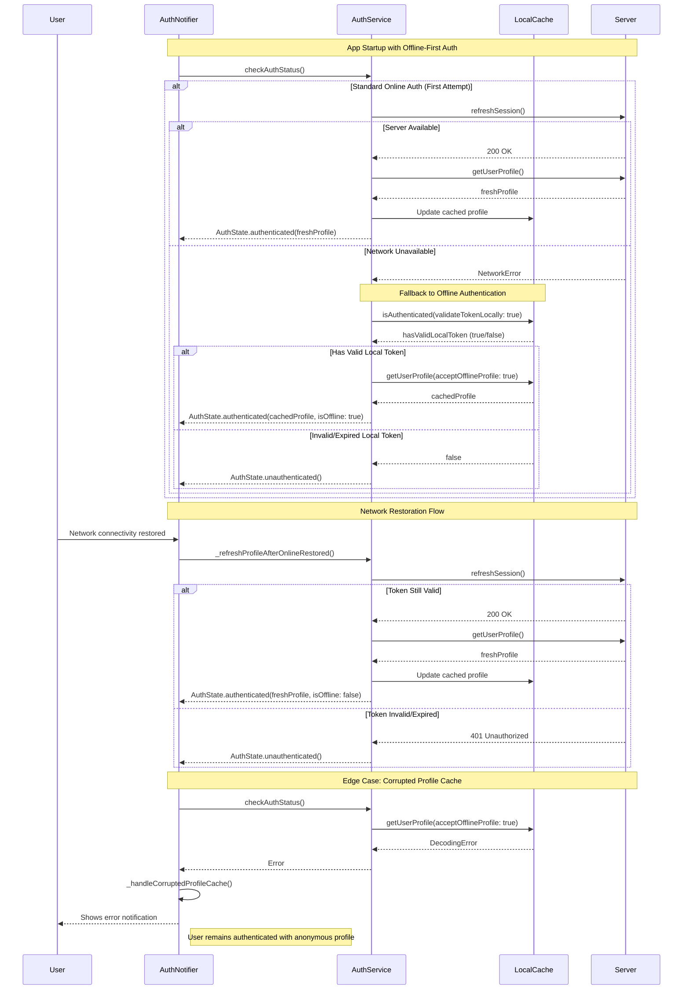

# Authentication Architecture

This document details the authentication system architecture for DocJet Mobile.

## Table of Contents

- [Authentication Component Overview](#authentication-component-overview)
- [Authentication Flow](#authentication-flow)
- [Authentication Components](#authentication-components)
- [Auth Event Bus](#auth-event-bus)
- [Theming & UI Components](#theming--ui-components)
- [Dependency Injection Considerations](#dependency-injection-considerations)
- [Troubleshooting Authentication Issues](#troubleshooting-authentication-issues)
- [Offline Authentication Flow](#offline-authentication-flow)

## Authentication Component Overview

This diagram illustrates the components and their relationships for the authentication system.

```mermaid
%%{init: {'flowchart': {'defaultRenderer': 'elk'}}}%%
graph TD
    subgraph "Presentation Layer"
        UI(Login Screen/Auth UI) -->|Uses| AuthService(Auth Service Interface)
        AuthState(Auth State Management) <-->|Observed by| UI
        AuthState -->|Shows Offline Status| UI
    end

    subgraph "Domain Layer"
        AuthService -->|Defines| User((User Entity<br>- Pure Dart<br>- Equatable))
        AuthService -->|Uses| AuthCredProvider(AuthCredentialsProvider Interface)
        AuthService -->|Emits Events via| AuthEventBus([Auth Event Bus])
    end

    subgraph "Data Layer"
        AuthServiceImpl(AuthServiceImpl) -->|Implements| AuthService
        AuthServiceImpl -->|Uses| AuthenticationApiClient(Authentication API Client)
        AuthServiceImpl -->|Uses| UserApiClient(User API Client)
        AuthServiceImpl -->|Updates| AuthState
        AuthServiceImpl -->|Uses| AuthCredProviderImpl(SecureStorageAuthCredentialsProvider)

        AuthCredProviderImpl -->|Implements| AuthCredProvider
        AuthCredProviderImpl -->|Reads API Key From| CompileDefines([Compile-time Defines<br>via --dart-define])
        AuthCredProviderImpl -->|Stores/Reads JWT| SecureStorage([FlutterSecureStorage])
        AuthCredProviderImpl -->|Validates Tokens via| JwtValidator([JWT Validator])

        DioFactory -->|Configures| basicDio(Dio Instance<br>for Basic Auth)
        DioFactory -->|Injects API Key Interceptor| basicDio
        DioFactory -->|Configures| authenticatedDio(Dio Instance<br>for Authenticated Calls)
        DioFactory -->|Injects API Key Interceptor| authenticatedDio
        DioFactory -->|Injects| AuthInterceptor(Auth Interceptor) --> authenticatedDio

        AuthenticationApiClient -->|Uses| basicDio
        AuthenticationApiClient -->|Provides func to| AuthInterceptor

        UserApiClient -->|Uses| authenticatedDio

        AuthInterceptor -->|Intercepts 401 Errors on| authenticatedDio
        AuthInterceptor -->|Calls refresh func on| AuthenticationApiClient
        AuthInterceptor -->|Triggers| TokenRefresh([Token Refresh Flow])
        AuthInterceptor -->|Retries Original Request via| authenticatedDio
        AuthInterceptor -->|Uses Exponential Backoff| TokenRefresh
        AuthInterceptor -->|Listens to| AuthEventBus

        basicDio -->|Makes Requests to| AuthAPI{REST API<br>Endpoints defined in ApiConfig<br>&#40;e.g., /api/v1/auth/login&#41;}
        authenticatedDio -->|Makes Requests to| AuthAPI{REST API<br>Endpoints defined in ApiConfig<br>&#40;e.g., /api/v1/users/profile&#41;}

    end

    subgraph "Other Components"
        OtherComponents([App Components]) -->|React to| AuthEventBus
    end
```



## Authentication Flow

This sequence diagram illustrates the current authentication implementation including all the enhanced features:

```mermaid
sequenceDiagram
    participant UI as UI
    participant AuthSvc as AuthService
    participant ApiClient as AuthenticationApiClient
    participant Interceptor as AuthInterceptor
    participant CredProvider as AuthCredentialsProvider
    participant API as Auth API
    participant AppComponents as Other App Components

    %% Login Flow
    Note over UI,API: Login Flow
    UI->>AuthSvc: login(email, password)
    AuthSvc->>ApiClient: login(email, password)
    ApiClient->>CredProvider: getApiKey()
    CredProvider-->>ApiClient: API Key
    ApiClient->>API: POST /api/v1/auth/login
    Note right of API: With API Key in header
    API-->>ApiClient: {access_token, refresh_token, user_id}
    ApiClient-->>AuthSvc: AuthResponse DTO
    AuthSvc->>CredProvider: setAccessToken(token)
    AuthSvc->>CredProvider: setRefreshToken(token)
    AuthSvc->>ApiClient: getUserProfile()
    ApiClient->>API: GET /api/v1/users/profile
    API-->>ApiClient: {id, name, email, settings, etc}
    ApiClient-->>AuthSvc: User Profile DTO
    AuthSvc->>AuthSvc: Create User entity
    AuthSvc->>AuthSvc: Emit AuthEvent.loggedIn
    AuthSvc-->>UI: User entity
    
    %% Using an authenticated endpoint (success)
    Note over UI,API: Using an authenticated endpoint (success case)
    UI->>AuthSvc: Some authenticated action
    AuthSvc->>ApiClient: makeAuthenticatedRequest()
    ApiClient->>CredProvider: getAccessToken()
    CredProvider-->>ApiClient: JWT token
    Note over CredProvider: Validate token expiry locally
    ApiClient->>CredProvider: getApiKey()
    CredProvider-->>ApiClient: API Key
    ApiClient->>API: Request with JWT + API Key
    API-->>ApiClient: Successful Response
    ApiClient-->>AuthSvc: Processed response
    AuthSvc-->>UI: Result
    
    %% Offline Authentication
    Note over UI,API: Offline Authentication
    UI->>AuthSvc: Some authenticated action
    AuthSvc->>ApiClient: makeAuthenticatedRequest()
    ApiClient->>CredProvider: getAccessToken()
    CredProvider-->>ApiClient: JWT token
    Note over ApiClient: Detect offline state
    ApiClient--x API: Network unavailable
    ApiClient->>CredProvider: validateTokenLocally(token)
    CredProvider-->>ApiClient: Token valid until {expiry}
    ApiClient->>ApiClient: Use cached data
    ApiClient-->>AuthSvc: Processed response with offline flag
    AuthSvc-->>UI: Result with offline indicator
    
    %% Token Refresh Flow (automatic)
    Note over UI,API: Automatic Token Refresh (when JWT expires)
    UI->>AuthSvc: Some authenticated action
    AuthSvc->>ApiClient: makeAuthenticatedRequest()
    ApiClient->>CredProvider: getAccessToken()
    CredProvider-->>ApiClient: JWT token (expired)
    ApiClient->>API: Request with expired JWT
    API-->>ApiClient: 401 Unauthorized
    ApiClient->>Interceptor: Receives 401 error
    Interceptor->>Interceptor: Acquire mutex lock
    Interceptor->>CredProvider: getRefreshToken()
    CredProvider-->>Interceptor: Refresh token
    Interceptor->>ApiClient: refreshToken(refreshToken)
    Note right of Interceptor: Using function reference instead of direct dependency
    ApiClient->>CredProvider: getApiKey()
    CredProvider-->>ApiClient: API Key
    ApiClient->>API: POST /api/v1/auth/refresh-session
    API-->>ApiClient: {new_access_token, new_refresh_token}
    ApiClient-->>Interceptor: New tokens
    Interceptor->>CredProvider: setAccessToken(newToken)
    Interceptor->>CredProvider: setRefreshToken(newRefreshToken)
    Interceptor->>API: Retry original request with new token
    API-->>ApiClient: Successful Response
    ApiClient-->>AuthSvc: Processed response
    AuthSvc-->>UI: Result
    Interceptor->>Interceptor: Release mutex lock
    
    %% Token Refresh Failure with Exponential Backoff
    Note over UI,API: Token Refresh Failure (with retry)
    Interceptor->>API: POST /api/v1/auth/refresh-session
    API-->>Interceptor: Network Error
    Interceptor->>Interceptor: Retry with exponential backoff
    Note over Interceptor: Wait 500ms, then 1s, then 2s...
    Interceptor->>API: POST /api/v1/auth/refresh-session
    API-->>Interceptor: {new_access_token, new_refresh_token}
    
    %% Unexpected Error Handling
    Note over UI,API: Unexpected Error During Token Refresh
    Interceptor->>API: POST /api/v1/auth/refresh-session
    API-->>Interceptor: Unexpected Error (not auth related)
    Interceptor->>Interceptor: Create new DioException with error context
    Interceptor->>Interceptor: Trigger logout
    Interceptor->>Interceptor: Release mutex lock
    Interceptor-->>AuthSvc: Propagate enhanced error
    
    %% Logout Flow with Event System
    Note over UI,AppComponents: Logout Flow with Event System
    UI->>AuthSvc: logout()
    AuthSvc->>CredProvider: deleteAccessToken()
    AuthSvc->>CredProvider: deleteRefreshToken()
    AuthSvc->>AuthSvc: Emit AuthEvent.loggedOut
    AuthSvc-->>UI: Logout successful
    AuthSvc-->>AppComponents: AuthEvent.loggedOut
    AppComponents->>AppComponents: Clear caches
    AppComponents->>AppComponents: Reset states
```



## Authentication Components

### Domain Layer

#### AuthService Interface
The `AuthService` interface defines the following methods:
- `Future<User> login(String email, String password)` - Authenticates a user and returns user data
- `Future<bool> refreshSession()` - Manually refreshes the authentication token (used on startup)
- `Future<void> logout()` - Logs the user out by clearing stored tokens
- `Future<bool> isAuthenticated({bool validateTokenLocally = false})` - Checks if stored credentials exist and optionally validates token expiry locally
- `Future<User> getUserProfile({bool acceptOfflineProfile = true})` - Retrieves the user profile information, with option to accept cached profiles when offline
- `Future<String> getCurrentUserId()` - Gets the current authenticated user ID

The service also emits authentication events via `AuthEventBus` for app-wide state management:
- `AuthEvent.loggedIn` - Emitted when a user successfully logs in
- `AuthEvent.loggedOut` - Emitted when a user logs out
- `offlineDetected`: When the app transitions from online to offline state, detected by NetworkInfoImpl
- `onlineRestored`: When the app transitions from offline back to online state, detected by NetworkInfoImpl

These events provide a consistent, centralized way for different app components to react to authentication and connectivity state changes without creating direct dependencies.

#### AuthEventBus
A central event bus that broadcasts authentication events to interested components. It:
- Enables loose coupling between auth components and dependent features
- Provides standardized events (`AuthEvent.loggedIn`, `AuthEvent.loggedOut`) 
- Allows app components to react appropriately to auth state changes
- Provides connectivity events (`AuthEvent.offlineDetected`, `AuthEvent.onlineRestored`) to allow features to adapt to connectivity changes without tight coupling

The events are emitted in the following circumstances:
- `loggedIn`: When a user successfully authenticates using login credentials
- `loggedOut`: When a user explicitly logs out or when token refresh irrecoverably fails
- `offlineDetected`: When the app transitions to offline mode
- `onlineRestored`: When the app comes back online after being offline

These events allow different components to react to auth state changes without tight coupling.

#### AuthCredentialsProvider Interface
Manages secure storage and retrieval of authentication credentials:
- API key from environment variables
- Access and refresh tokens in secure storage
- JWT validation methods to check token validity without network calls
- User ID extraction from tokens

### Data Layer

#### AuthServiceImpl
Implements the `AuthService` interface, orchestrating the authentication flow:
- Handles local token validation for offline authentication
- Coordinates with both `AuthenticationApiClient` and `UserApiClient` for network operations
- Emits events via `AuthEventBus` for logout and login
- Gracefully handles offline scenarios with appropriate error propagation

AuthServiceImpl includes offline profile caching capabilities:
- Uses the `IUserProfileCache` dependency to store and retrieve user profiles
- Saves profiles to cache with timestamps after successful network fetches
- Falls back to cached profiles when network requests fail with offline errors
- Validates tokens before using cached profiles (requires at least one valid token)
- Clears cached profiles during logout or when both tokens are invalid
- Accepts an `acceptOfflineProfile` parameter in `getUserProfile()` to control offline behavior

The offline caching flow follows these steps:
1. Attempt to fetch profile from network
2. If network request succeeds, save to cache with current timestamp
3. If network request fails with offline error and `acceptOfflineProfile` is true:
   - Check token validity (access and refresh tokens)
   - If both tokens are invalid, clear cache and throw authentication error
   - If at least one token is valid, attempt to fetch profile from cache
4. Return cached profile if available, or throw the original error if no cache exists

This approach allows users to remain logged in during offline scenarios as long as they have valid tokens and a previously cached profile.

#### AuthenticationApiClient
Responsible for pre-authentication communication:
- Uses `ApiConfig` constants for endpoint paths (e.g., `ApiConfig.loginEndpoint`)
- `login()` - Authenticates with email/password
- `refreshToken()` - Refreshes tokens when expired
- Maps API errors to domain-specific exceptions using enhanced exception types
- **Important**: Uses `basicDio` without auth interceptors since these endpoints establish authentication
  but don't require it themselves.

#### UserApiClient
Responsible for authenticated user-related API calls:
- `getUserProfile()` - Retrieves full user profile data using JWT authentication
- Handles authentication token errors and propagation
- **Important**: Uses `authenticatedDio` with auth interceptors to ensure proper
  JWT token management for all requests.

These two API clients implement the Split Client pattern where responsibilities are
clearly separated based on authentication requirements.

#### AuthInterceptor
A Dio interceptor that:
1. Automatically detects 401 (Unauthorized) errors
2. Initiates token refresh flow
3. Implements exponential backoff retry logic for transient errors
4. Triggers app-wide logout via `AuthEventBus` when refresh fails
5. Retries the original request with the new token
6. Uses mutex locking to prevent concurrent refresh attempts 
7. Provides robust error propagation for unexpected failures
8. **Uses function-based DI:** Instead of directly depending on `AuthenticationApiClient`, it accepts a 
   function reference to the `refreshToken` method. This breaks the circular dependency where 
   the authenticated Dio needs `AuthInterceptor`, and `AuthInterceptor` needs 
   `AuthenticationApiClient` for token refresh.

This approach provides seamless token refresh without UI layer awareness of expired tokens. The authentication flow is handled at the data layer where it belongs, maintaining clean separation of concerns.

#### SecureStorageAuthCredentialsProvider
Concrete implementation of `AuthCredentialsProvider` using:
- `flutter_secure_storage` for token storage
- `AppConfig` for the API key (sourced via dependency injection)
- JWT validation for checking token expiry and extracting claims

#### JwtValidator
A utility class that provides:
- Local validation of JWT tokens without network calls
- Token expiry checking
- Claims extraction from tokens
- Proper error handling for malformed tokens

#### IUserProfileCache Interface
An interface that defines methods for caching user profile data locally:
- `saveProfile(UserProfileDto profileDto, DateTime timestamp)` - Stores a profile with timestamp
- `getProfile(String userId)` - Retrieves a cached profile by user ID
- `clearProfile(String userId)` - Removes a specific user's profile from cache
- `clearAllProfiles()` - Clears all cached profiles
- `isProfileStale(String userId, {required bool isAccessTokenValid, required bool isRefreshTokenValid})` - Determines if a cached profile should be considered stale based on token validity

#### SharedPreferencesUserProfileCache
Concrete implementation of `IUserProfileCache` using `SharedPreferences`:
- Uses JSON serialization to store `UserProfileDto` objects
- Manages storage keys with consistent prefixing (`cached_profile_${userId}`)
- Stores timestamps alongside profiles for staleness checking
- Implements cache cleanup during logout
- Considers profiles stale when both access and refresh tokens are invalid
- Provides built-in error handling for storage and retrieval operations

This cache implementation enables offline access to user profiles when network connectivity is unavailable, allowing the app to maintain functionality even when offline.

### Presentation Layer

#### AuthState
Immutable state object representing the current authentication state:
- `user` - The authenticated user entity
- `status` - Current status (authenticated, unauthenticated, loading, error)
- `errorMessage` - Error message if authentication failed
- `isOffline` - Flag indicating if the app is operating in offline mode

#### AuthNotifier
State management for authentication, connecting UI to domain services:
- Exposes the `AuthState` to the UI.
- Provides methods like `login()`, `logout()`, `checkAuthStatus()`, `getUserProfile()` which interact with the `AuthService`.
- Listens to `AuthEventBus` for events like `AuthEvent.loggedIn` and `AuthEvent.loggedOut` (fired by `AuthServiceImpl`) to update the `AuthState` reactively, ensuring the UI reflects the current authentication status even when changes originate deeper in the system (e.g., after a background token refresh failure leading to logout).
- Handles connectivity transitions by updating the `isOffline` flag in all states (authenticated, error, unauthenticated, loading) when receiving `offlineDetected` and `onlineRestored` events.
- Automatically refreshes user profile when the app comes back online through the `_refreshProfileAfterOnlineRestored()` helper.
- Integrates with the `AppNotifierService` to display non-critical errors (e.g., 404 on profile endpoint) without blocking the app.

#### AppNotifierService
A centralized notification service that manages application-wide messages:
- Provides app-wide transient notifications (info, success, warning, error)
- Manages a single message state with auto-dismiss capability
- Used by `AuthNotifier` to show non-critical errors like profile fetch failures
- Decouples UI notifications from domain-specific state

The `AppNotifierService` allows any component to trigger notifications without maintaining its own state for transient messages, creating a more flexible and maintainable architecture.

#### UI Components

##### OfflineBanner
A theme-aware banner that automatically displays when the app is in offline mode:
- Observes the `authNotifierProvider` to detect offline status
- Animates height and opacity for smooth transitions
- Adapts to light/dark theme using `Theme.of(context).colorScheme`
- Provides accessibility support through `Semantics` labels
- Consistently displays across all screens through the AppShell

##### ConfigurableTransientBanner
A theme-aware banner that automatically displays transient messages from anywhere in the app:
- Supports multiple message types (info, success, warning, error) with appropriate styling
- Automatically dismisses based on configurable duration parameter
- Includes manual dismiss button for user control
- Provides accessibility support through Semantics with liveRegion
- Adapts styling based on message type using AppColorTokens

##### AppShell
A global wrapper component that ensures consistent UI elements across the app:
- Applied via `MaterialApp.builder` to automatically wrap all screens
- Handles displaying the offline banner and transient notification banner at the top of each screen
- Listens to `appNotifierServiceProvider` to show/hide notifications
- Preserves navigation and screen structure while adding app-wide UI elements

The UI components observe the appropriate state providers to render UI elements based on authentication status, connectivity, and notification state.

#### Performance Considerations

##### Provider/State Lifecycle Management
- **Cubit/Bloc Hoisting**: When using state management solutions like Flutter Bloc:
  - Create instances at the highest appropriate level in the widget tree (typically in `main.dart` using `MultiBlocProvider`)
  - Access existing instances in child widgets with `BlocProvider.of<T>(context)` or `context.read<T>()`
  - Use `BlocProvider.value()` when passing existing instances down the widget tree
  - This prevents costly recreation of state management objects during rebuilds
- **Lean Components**: Keep widgets focused on UI, delegating business logic to the appropriate layer
- **Proper Disposal**: Ensure subscriptions and streams are properly disposed when no longer needed
- **Widget Rebuilds**: Use granular state observation (e.g., `BlocSelector`) to limit rebuilds to only affected components

## Auth Event Bus

The `AuthEventBus` provides a publish-subscribe mechanism for auth-related events:

1. **loggedIn**: Emitted when a user successfully logs in
2. **loggedOut**: Emitted when a user logs out
3. **offlineDetected**: Emitted when the app transitions to offline mode
4. **onlineRestored**: Emitted when the app comes back online after being offline

These events allow different components to react to auth state changes without tight coupling.

## Theming & UI Components

The auth module includes UI components that leverage the application's theme system:

1. **OfflineBanner**: Banner shown when the app is in offline mode
2. **ConfigurableTransientBanner**: Banner shown when transient messages occur, with auto-dismiss functionality
3. **AppShell**: Wrapper component that provides the offline and transient notification banners across all screens
4. **AuthErrorMessage**: Displays auth-related error messages with theme-aware styling

All these components adapt to the app's theme (light/dark) automatically by using semantic color tokens from `AppColorTokens`. For more details on the theming system, see [UI Theming Architecture](../../features/feature-ui-theming.md).

## Dependency Injection Considerations

### Avoiding Circular Dependencies

To avoid circular dependencies between `AuthenticationApiClient` and `AuthInterceptor`:

1. **Function-Based DI:** `AuthInterceptor` accepts a function reference to `refreshToken` instead of
   directly depending on the `AuthenticationApiClient` instance:

   ```dart
   AuthInterceptor({
     required Future<AuthResponseDto> Function(String) refreshTokenFunction,
     required this.credentialsProvider,
     // ...
   }) : _refreshTokenFunction = refreshTokenFunction;
   ```

2. **Proper Registration Order:** The DI container registers components in this order:
   - First register `basicDio` (without auth interceptors)
   - Then register `AuthenticationApiClient` (using `basicDio`)
   - Finally register `authenticatedDio` (using function reference to `AuthenticationApiClient.refreshToken`)

3. **Clear API Responsibilities:** The API key injection is handled entirely by `DioFactory` via interceptors.
   Both `basicDio` and `authenticatedDio` instances include the API key interceptor to ensure
   all API requests have the correct authorization. The `AuthenticationApiClient` does not add the API key itself.

### Caching Dependencies Registration

The offline profile caching functionality requires proper registration of cache-related dependencies:

1. **Register SharedPreferences:**
   ```dart
   // Asynchronous registration for SharedPreferences
   getIt.registerSingletonAsync<SharedPreferences>(() async {
     return await SharedPreferences.getInstance();
   });
   ```

2. **Register UserProfileCache:**
   ```dart
   // Register the cache implementation after SharedPreferences is ready
   getIt.registerLazySingleton<IUserProfileCache>(() {
     return SharedPreferencesUserProfileCache(
       getIt<SharedPreferences>(),
       LoggerFactory.getLogger('SharedPreferencesUserProfileCache'),
     );
   });
   ```

3. **Update AuthService Registration:**
   ```dart
   // Include the cache in AuthServiceImpl instantiation
   getIt.registerLazySingleton<AuthService>(() => AuthServiceImpl(
     authenticationApiClient: getIt<AuthenticationApiClient>(),
     userApiClient: getIt<UserApiClient>(),
     credentialsProvider: getIt<AuthCredentialsProvider>(),
     eventBus: getIt<AuthEventBus>(),
     userProfileCache: getIt<IUserProfileCache>(), // Inject the cache
   ));
   ```

This registration sequence ensures that the SharedPreferences instance is properly initialized before being used by the cache implementation, and that the cache is available when creating the AuthServiceImpl.

### Split Client Pattern for API Clients

The authentication system implements the "Split Client" pattern to clearly separate authenticated and non-authenticated API concerns:

1. **Separate Client Classes by Authentication Context:**
   - `AuthenticationApiClient` - Handles pre-authentication operations (login, token refresh) using `basicDio`
   - `UserApiClient` - Handles authenticated user operations (profile) using `authenticatedDio`

2. **Explicit Constructor Parameter Naming:**
   ```dart
   // Clear parameter naming makes Dio usage explicit
   AuthenticationApiClient({required Dio basicHttpClient, /*...*/})
   UserApiClient({required Dio authenticatedHttpClient, /*...*/})
   ```

3. **Proper Dio Instance Usage:**
   - `basicDio` - No auth interceptors, only API key, for public endpoints
   - `authenticatedDio` - Full interceptor chain including auth, for protected endpoints

4. **Registration in AuthModule:**
   ```dart
   // Register clients with the correct Dio instance
   getIt.registerFactory<AuthenticationApiClient>(() => AuthenticationApiClient(
     basicHttpClient: sl<Dio>('basicDio'),
     // ...
   ));
   
   getIt.registerFactory<UserApiClient>(() => UserApiClient(
     authenticatedHttpClient: sl<Dio>('authenticatedDio'),
     // ...
   ));
   ```

### Guidelines for New API Clients

When adding new API clients to the app, follow these patterns:

1. **Determine Authentication Needs:**
   - Does this endpoint require authentication? → Use `authenticatedDio`
   - Is this a public endpoint or auth operation? → Use `basicDio`
   - Does the feature require *both* public and authenticated endpoints? → See below.

2. **API Client Responsibilities:**
   - Each API client should have a clear, focused responsibility
   - Limit each client to similar endpoints within a specific domain area (e.g., `JobsApiClient`, `DocumentApiClient`)

3. **API Client Implementation:**
   - **Single Auth Context:** If all endpoints require the same context (all public or all authenticated), inject only the corresponding `Dio` instance:
     ```dart
     /// Example of an authenticated-only API client
     class DocumentApiClient {
       final Dio authenticatedHttpClient; // For authenticated endpoints
       // ...
     
       DocumentApiClient({
         required this.authenticatedHttpClient,
         // ...
       });
     }
     ```
   - **Mixed Auth Context:** If a feature's API client needs to call *both* public and authenticated endpoints, inject *both* `Dio` instances:
     ```dart
     /// Example of an API client needing both contexts
     class JobsApiClient {
       final Dio basicHttpClient; // For public endpoints
       final Dio authenticatedHttpClient; // For authenticated endpoints
       // ...
     
       JobsApiClient({
         required this.basicHttpClient,
         required this.authenticatedHttpClient,
         // ...
       });

       Future<void> getPublicJobs() async {
         // Use basicHttpClient
       }

       Future<void> applyForJob(String jobId) async {
         // Use authenticatedHttpClient
       }
     }
     ```
     Register this client providing both `sl<Dio>('basicDio')` and `sl<Dio>('authenticatedDio')`.

4. **Handling Auth-Dependent Endpoints:**
   - If the *same API endpoint* behaves differently based on authentication status (e.g., `/search`):
     - Expose *separate methods* in the API client for each behavior (e.g., `searchPublic()`, `searchAuthenticated()`), each explicitly using the correct `Dio` instance.
     - The corresponding **Service** layer (e.g., `JobsServiceImpl`) is responsible for checking the current auth state (using `AuthService.isAuthenticated()`) and calling the appropriate API client method.
     - **Do not** put auth-state checking logic inside the API client itself.

5. **Error Handling:**
   - Handle authentication errors consistently
   - Provide clear error messages that distinguish between different failure types
   - Use safe type conversion with explicit error handling

6. **Testing:**
   - Test clients needing both contexts by mocking both `Dio` instances.
   - Verify correct headers (API key only for `basicDio`, API key + JWT for `authenticatedDio`)
   - Test error cases like network failures, authentication failures, etc. for both contexts.

Following these guidelines ensures consistent authentication behavior across the app and prevents issues like "Missing API key" when "401 Unauthorized" would be more appropriate.

## Troubleshooting Authentication Issues

This section provides guidance for diagnosing and fixing common authentication issues in DocJet Mobile. Our enhanced error handling now provides much more context to help you quickly identify and resolve problems.

### Common Authentication Error Types

The system can now detect and report these specific authentication issues:

| Error Type | Description | Likely Causes |
|------------|-------------|---------------|
| `invalidCredentials` | Invalid email/password combination | User entered incorrect credentials |
| `network` | Cannot connect to the server | Network connectivity issues, server unavailable |
| `server` | Server responded with an error status | Backend API issues, check server logs |
| `tokenExpired` | Authentication token has expired | Token lifetime ended, needs refresh |
| `unauthenticated` | User is not authenticated | No valid authentication token |
| `refreshTokenInvalid` | Failed to refresh the authentication token | Expired or invalid refresh token, server issues |
| `userProfileFetchFailed` | Failed to fetch user profile | Server issues or permission problems |
| `unauthorizedOperation` | User lacks permission for operation | Insufficient user permissions |
| `offlineOperation` | Operation failed due to being offline | No network connectivity available |
| `missingApiKey` | The API key header is missing from the request | DI setup incorrectly using `basicDio` instead of `authenticatedDio`, or API key not provided at build time |
| `malformedUrl` | The request URL is incorrectly formed | Missing slash in path joining or incorrect endpoint configuration |
| `transientProfileError` | Non-critical error fetching user profile | 404 on profile endpoint, doesn't block app functionality but shows a dismissible banner |
| `unknown` | Unclassified error | Check error details for more information |

### Enhanced Error Context

All authentication errors now include:

- Specific error type classification
- The endpoint path that failed (e.g., `auth/login`)
- HTTP status code where applicable
- Original exception and stack trace (preserved for debugging)
- Descriptive error message with troubleshooting guidance

Example error message:
```
API key is missing for endpoint auth/login - check your app configuration
```

### API Response Format

**IMPORTANT:** The authentication API endpoints return responses with snake_case keys:

```json
{
  "access_token": "jwt-token-value",
  "refresh_token": "refresh-token-value",
  "user_id": "user-identifier"
}
```

The `AuthResponseDto` class in the codebase handles this format properly. Always use snake_case keys (`access_token`, `refresh_token`, `user_id`) when working with auth API requests and responses.

### Troubleshooting Steps

#### Missing API Key Issues

1. **Verify compile-time defines**: Ensure the API key is provided at build time:
   ```bash
   flutter run --dart-define=API_KEY=your_api_key
   ```

2. **Check DI configuration**: Ensure `AuthenticationApiClient` is using the `authenticatedDio` instance, not `basicDio`.

3. **Verify interceptor registration**: Check that `DioFactory` is properly configuring the API key interceptor.

#### URL Formation Issues

1. **Verify endpoint constants**: Ensure all endpoint paths in `ApiConfig` are formatted correctly.

2. **Check base URL format**: The base URL should end with a trailing slash (e.g., `https://api.example.com/`).

3. **Use the utility function**: Always use `ApiConfig.joinPaths()` for path concatenation.

#### Authentication Failures

1. **Verify credentials**: Confirm email and password are correct.

2. **Check token storage**: Use Flutter Secure Storage Inspector tools to verify token storage.

3. **Inspect token claims**: Use `JwtValidator.getClaims()` to debug token content.

4. **Reset local state**: Try clearing app storage and re-authenticating.

#### Network and Server Issues

1. **Verify connectivity**: Check device network connectivity.

2. **Test API directly**: Use tools like Postman to test the authentication endpoints.

3. **Review server logs**: Check backend logs for server-side issues.

4. **Verify CORS settings**: For web-based testing, ensure CORS is properly configured.

### Debugging with Enhanced Error Information

When troubleshooting authentication issues, use the `diagnosticString()` method of `AuthException` for detailed information including the stack trace:

```dart
try {
  await authService.login(email, password);
} on AuthException catch (e) {
  log(e.diagnosticString());  // includes detailed information and stack trace
  // Handle specific error types
  switch (e.type) {
    case AuthErrorType.invalidCredentials:
      // Handle invalid credentials
      break;
    case AuthErrorType.network:
      // Handle network issues
      break;
    case AuthErrorType.malformedUrl:
      // Handle malformed URL
      break;
    // Handle other error types...
  }
}
```

### Regression Testing

To verify authentication is working correctly after changes:

1. Run the integration tests:
   ```bash
   ./scripts/list_failed_tests.dart test/integration/auth_url_formation_test.dart
   ```

2. Check for common issues detected by the tests:
   - URL formation problems
   - Missing API key
   - Circular dependency issues
   - Error message clarity

## Offline Authentication Flow

The DocJet Mobile app implements a robust offline-first authentication system that allows users to remain authenticated and access critical functionality even when network connectivity is unavailable. This section details the enhanced offline authentication capabilities.



### Offline-First Authentication Components

The enhanced offline authentication system introduces several key enhancements:

#### AuthNotifier Enhancements

1. **Two-Stage Authentication Check**: `checkAuthStatus()` first attempts standard online authentication, then falls back to local token validation if network is unavailable:
   ```dart
   Future<void> checkAuthStatus() async {
     try {
       // First try standard online authentication
       final isAuthenticated = await _authService.isAuthenticated(validateTokenLocally: false);
       if (isAuthenticated) {
         await _authenticateWithValidToken();
         return;
       }
     } catch (e) {
       // Fall back to offline-aware authentication with local token validation
       await _tryOfflineAwareAuthentication();
     }
   }
   ```

2. **Offline-Aware Authentication**: Uses local token validation to authenticate users when offline:
   ```dart
   Future<void> _tryOfflineAwareAuthentication() async {
     try {
       final isValidLocally = await _authService.isAuthenticated(validateTokenLocally: true);
       if (isValidLocally) {
         final user = await _authService.getUserProfile(acceptOfflineProfile: true);
         state = state.authenticated(user: user, isOffline: true);
       } else {
         state = state.unauthenticated();
       }
     } catch (e) {
       // Handle auth exceptions and corrupted profile cache
     }
   }
   ```

3. **Network Restoration Handling**: `_refreshProfileAfterOnlineRestored()` validates tokens with the server when network is restored:
   ```dart
   Future<void> _refreshProfileAfterOnlineRestored() async {
     if (state.status != AuthStatus.authenticated) return;
     
     try {
       // Validate token with server first
       final isTokenValid = await _authService.refreshSession();
       if (!isTokenValid) {
         state = state.unauthenticated();
         return;
       }
       
       // Fetch fresh profile data
       final user = await _authService.getUserProfile(acceptOfflineProfile: false);
       state = state.authenticated(user: user, isOffline: false);
     } catch (e) {
       // Handle various error types appropriately
     }
   }
   ```

4. **Edge Case Handling**: Specific error handlers for different scenarios:
   - `_handleAuthExceptionDuringOfflineAuth()`: Handles token validation errors during offline mode
   - `_handleCorruptedProfileCache()`: Keeps the user authenticated with an anonymous profile when cache is corrupted

#### IUserProfileCache Interface

A dedicated interface for caching user profiles with timestamp validation:

```dart
abstract class IUserProfileCache {
  Future<void> saveProfile(UserProfileDto profileDto, DateTime timestamp);
  Future<UserProfileDto?> getProfile(String userId);
  Future<void> clearProfile(String userId);
  Future<void> clearAllProfiles();
  bool isProfileStale(String userId, {
    required bool isAccessTokenValid,
    required bool isRefreshTokenValid,
  });
}
```

### Network Error Handling

The authentication system includes comprehensive network error detection and handling:

1. **Network Error Types**: The system specifically detects these types of connectivity issues:
   - `DioExceptionType.connectionError`: Basic connection failures
   - `DioExceptionType.sendTimeout`: Timeouts during request sending
   - `DioExceptionType.receiveTimeout`: Timeouts waiting for responses
   - `DioExceptionType.connectionTimeout`: Timeouts establishing connection

2. **Helper Method**: The `_isNetworkConnectivityError` utility method centralizes network error detection:
   ```dart
   bool _isNetworkConnectivityError(DioExceptionType type) {
     return type == DioExceptionType.connectionError ||
            type == DioExceptionType.sendTimeout ||
            type == DioExceptionType.receiveTimeout ||
            type == DioExceptionType.connectionTimeout;
   }
   ```

3. **Two-Stage Authentication Process**:
   - **Stage 1**: Basic online authentication check without token validation
   - **Stage 2**: If Stage 1 passes but profile fetch fails due to network errors, fall back to offline auth

4. **Error Type Differentiation**:
   - Network connectivity errors trigger offline authentication
   - Non-network API errors (e.g., 500 server errors) transition to error state
   - Authentication errors (e.g., 401 unauthorized) trigger appropriate auth flows

5. **Logging and Debugging**:
   - Comprehensive logging throughout the error handling flow
   - Clear identification of error types and fallback paths
   - Verification of offline state transitions

This implementation allows users with valid cached credentials to remain authenticated even when the server is completely unreachable during startup, providing seamless offline access to cached data.

### User Experience During Connectivity Changes

The offline authentication system ensures the following experiences for users:

1. **Seamless Offline Transition**: Users already authenticated remain authenticated when connectivity is lost. They see a non-disruptive offline banner at the top of the screen.

2. **Online Restoration**: When connectivity is restored, the app automatically validates the user's authentication with the server in the background without requiring user intervention.

3. **Error Handling**:
   - **Token Expired During Offline Mode**: User is logged out with a clear message explaining token expiration
   - **Corrupted Profile Data**: User stays authenticated with a temporary anonymous profile and a notification about limited functionality
   - **Failed Network Validation**: If the server rejects a locally valid token upon coming online, the user is logged out with an appropriate message

4. **Security Balancing**: The system balances security requirements (invalidating expired tokens) with usability (keeping users authenticated with cached data when appropriate).

### Compatibility with Other Features

The offline authentication system seamlessly integrates with other offline-capable features like Jobs:

1. **Auth Event Responsiveness**: Features like `JobSyncOrchestratorService` listen to auth events (`offlineDetected`, `onlineRestored`, `loggedIn`, `loggedOut`) to adapt their behavior to connectivity changes.

2. **In-flight Cancellation**: Operations started before connectivity changes are handled gracefully (e.g., syncing jobs in progress when network becomes unavailable).

3. **State Persistence**: Components maintain correct state during connectivity transitions without requiring explicit user intervention.

### Performance Considerations for Offline Authentication

The offline authentication caching mechanism is designed for optimal performance:

1. **Minimal Storage Footprint**: 
   - Profile data is stored as compact JSON in SharedPreferences
   - Only essential profile fields are cached to minimize storage requirements
   - Old cache entries are automatically cleaned during logout and token invalidation

2. **Cache Access Efficiency**:
   - Direct key-based access using userId for O(1) lookup complexity
   - JSON parsing is done on-demand only when cache is accessed
   - Timestamps stored alongside data to enable efficient staleness checks without loading full profile 

3. **Memory Management**:
   - No in-memory caching layer to avoid duplicate storage
   - Objects are created on-demand and garbage collected when no longer needed
   - SharedPreferences implements its own memory-efficient caching

4. **Battery Considerations**:
   - Local token validation requires minimal CPU usage
   - Network operations are skipped when offline, preserving battery
   - Background token refresh operations respect app lifecycle state

5. **Edge Case Optimizations**:
   - Failed operations avoid expensive retries when offline
   - Corrupted cache recovery provides degraded functionality without crashes
   - Token validation errors short-circuit the authentication flow early

These optimizations ensure that the offline authentication system provides a responsive user experience even on resource-constrained devices or in low-battery situations.

### Testing Offline Authentication

For details on testing the offline authentication system, see [Authentication Testing Guide](./feature-auth-testing.md).