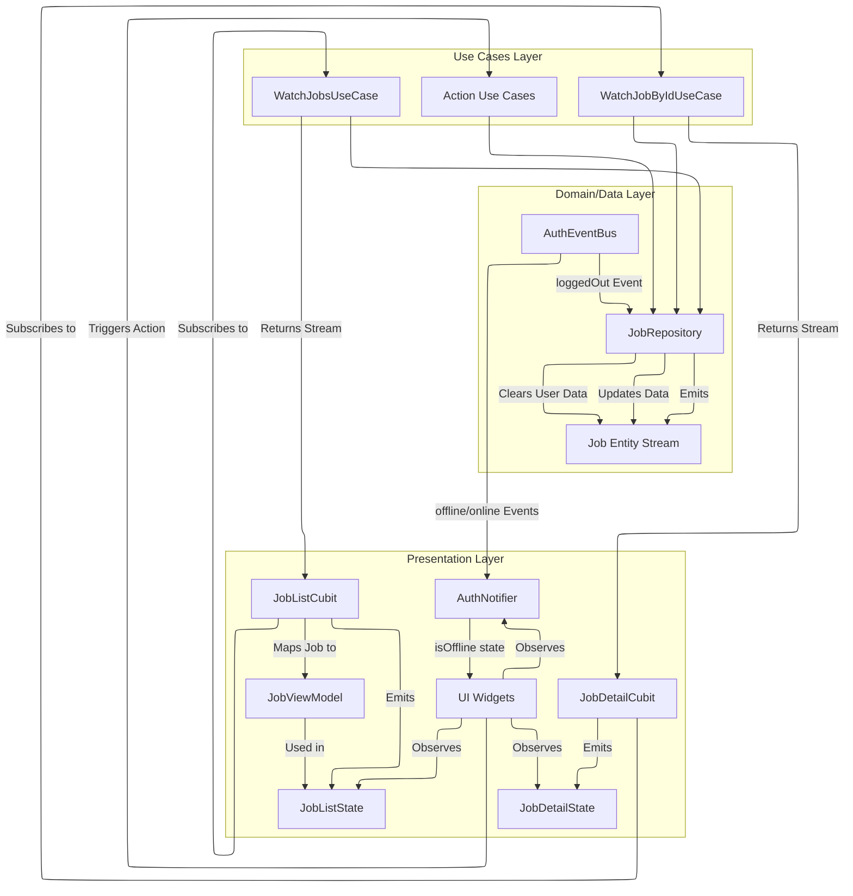

# Job Feature: Presentation Layer Architecture

This document outlines the architecture for the presentation layer of the Job feature, focusing on state management and its interaction with the underlying Use Cases.

## Key Components

- **UI Widgets:** Flutter widgets responsible for rendering the job list and job details based on the state provided by the Cubits.
  - `JobListItem` - A list item widget that displays key job information
  - `JobListPage` - The main page for displaying the job list
  - `JobListPlayground` - A development/testing sandbox for job UI components
- **Cubits:** Manage the state for specific UI sections.
  - `JobListCubit` - Manages state for the job list
  - `JobDetailCubit` - Manages state for a single job view
- **States:** Immutable objects representing the different states the UI can be in (loading, loaded, error, etc.).
  - `JobListState` with concrete subclasses (`JobListInitial`, `JobListLoading`, `JobListLoaded`, `JobListError`)
  - `JobDetailState` with freezed variants (`JobDetailLoading`, `JobDetailLoaded`, `JobDetailNotFound`, `JobDetailError`)
- **ViewModels:** Presentation-specific models that contain processed data for the UI.
  - `JobViewModel` - Contains UI-ready data derived from `Job` entities
  - `JobViewModelMapper` - Maps between domain entities and view models
- **Use Cases:** Provide the data streams or perform actions requested by the Cubits/UI.
- **AuthNotifier:** Provides authentication state including offline status that job components observe.

## Current Implemented Pages

The following pages are currently implemented for the Jobs feature:

1. **Job List Page (`JobListPage`)**
   - Displays a list of jobs using a `CupertinoPageScaffold`
   - Renders each job as a `JobListItem`
   - Shows loading indicators, error messages, or empty state messages as appropriate
   - Implemented using BLoC pattern with `JobListCubit`
   - Observes `authNotifierProvider` to detect offline status and disable interactive elements accordingly
   - Uses `BlocProvider.value` to access the existing `JobListCubit` from the parent to prevent recreation

2. **Job List Playground (`JobListPlayground`)**
   - A development environment for testing job list UI components
   - Includes mock data and experimental UI elements
   - Provides tools for testing job creation and visualization
   - Observes `authNotifierProvider` to implement offline-aware behavior
   - Uses `BlocProvider.value` to reuse the existing `JobListCubit` instance from the parent context

The Home Screen (`HomeScreen`) contains a "Go to Jobs List" button that is automatically disabled when the app is in offline mode by checking `authState.isOffline`.

## State Management Flow

The presentation layer leverages Cubits (`bloc` library) to manage state reactively.



### 1. Job List (`JobListCubit`)

- **Purpose:** Manages the state for the main job list view.
- **Dependencies:** `WatchJobsUseCase`, `JobViewModelMapper`.
- **Functionality:**
    - Subscribes to the `Stream<List<Job>>` provided by `WatchJobsUseCase` upon initialization.
    - Listens for updates to the job list (creations, updates, deletions, sync status changes).
    - Maps the incoming `List<Job>` (or errors) to `JobListState` instances using the `JobViewModelMapper`.
    - Emits states like `JobListLoading`, `JobListLoaded(List<JobViewModel>)`, `JobListError`.
- **ViewModel:** Uses a `JobViewModel` (created via the `JobViewModelMapper`) to prepare job data specifically for UI display (e.g., formatted dates, status text, derived properties like `hasFileIssue`).
- **Lifecycle Management:** Created once at the application level in `main.dart` using `MultiBlocProvider` to prevent recreation on rebuilds.

### 2. Job Detail (`JobDetailCubit`)

- **Purpose:** Manages the state for a single job detail view.
- **Dependencies:** `WatchJobByIdUseCase`.
- **Initialization:** Requires the `localId` of the job to observe (passed via factory parameter).
- **Functionality:**
    - Subscribes to the `Stream<Job?>` provided by `WatchJobByIdUseCase` using the initial `jobId`.
    - Listens for updates to the specific job.
    - Maps the incoming `Job?` (or errors) to `JobDetailState` instances.
    - Emits states like `JobDetailLoading`, `JobDetailLoaded(Job)`, `JobDetailNotFound`, `JobDetailError`.

## Interaction with Use Cases

- **Reactive Data:** The Cubits primarily rely on the `Watch...` use cases (`StreamUseCase`) to get notified of data changes originating from the data layer (e.g., local Hive changes, sync updates).
- **Actions:** User actions initiated from the UI (e.g., create, update, delete, reset failed job) typically trigger calls to the corresponding single-action Use Cases (e.g., `CreateJobUseCase`, `DeleteJobUseCase`). These actions modify the data layer, which in turn causes the `Watch...` use cases to emit updates, closing the reactive loop and updating the UI via the Cubits.
- **Authentication Context:** User context (like User ID or the User entity) is **never** passed down from the UI layer. The data layer (specifically, services like `JobWriterService` or the `JobRepository`) obtains the necessary authenticated user information by interacting with the `AuthSessionProvider` directly.

## Authentication Integration

The Jobs feature is integrated with the authentication system through the following mechanisms:

1. **Auth Event Handling:** `JobRepositoryImpl` subscribes to the `AuthEventBus` to receive authentication events:
   ```dart
   _authEventSubscription = _authEventBus.stream.listen((event) {
     if (event == AuthEvent.loggedOut) {
       _handleLogout();
     }
   });
   ```

2. **Logout Handling:** When a logout event is received, the repository clears all user-specific job data:
   ```dart
   Future<void> _handleLogout() async {
     _logger.i('$_tag Handling logout event. Clearing user data.');
     try {
       await _localDataSource.clearUserData();
       _logger.i('$_tag Successfully cleared user data on logout.');
     } catch (e) {
       _logger.e('$_tag Error clearing user data on logout: $e');
     }
   }
   ```

3. **Resource Cleanup:** The repository properly disposes of its event subscription when it's destroyed:
   ```dart
   void dispose() {
     _authEventSubscription?.cancel();
     _logger.d('$_tag Disposed auth event subscription.');
   }
   ```

4. **Offline Awareness:** The UI components observe the offline state from `AuthNotifier` to adapt their behavior:
   ```dart
   // In JobListPage
   final authState = ref.watch(authNotifierProvider);
   final isOffline = authState.isOffline;
   
   // Disable create button when offline
   CupertinoButton(
     onPressed: isOffline ? null : _handleCreateJob,
     // ...
   )
   ```

This integration ensures that:
- User data is properly cleared when a user logs out, maintaining data privacy
- UI components disable network-dependent actions when the app is offline
- Users receive clear visual feedback about actions that aren't available offline

## Offline UI Behavior

The Jobs feature UI adapts to offline status by:

1. **Status Awareness:**
   - All job-related screens observe the `AuthNotifier` to detect offline status
   - The `JobListPage` extracts offline state from `authNotifierProvider` at the top of its build method:
     ```dart
     final authState = ref.watch(authNotifierProvider);
     final isOffline = authState.isOffline;
     ```
   - Offline state is passed to children like `JobListItem` that need to adapt:
     ```dart
     return JobListItem(
       job: jobViewModel,
       isOffline: isOffline,
     );
     ```

2. **Disabled Actions:**
   - The "Create Job" button on `JobListPage` is automatically disabled when offline:
     ```dart
     if (!isOffline) // Only show Create Job button when online
       CupertinoButton.filled(
         child: const Text('Create Job'),
         onPressed: () { /* ... */ },
       ),
     ```
   - In `JobListPlayground`, multiple buttons are disabled when offline:
     ```dart
     CupertinoButton(
       // Disable refresh when offline
       onPressed: isOffline ? null : _handleRefresh,
       child: const Icon(CupertinoIcons.refresh),
     ),
     ```
   - The "Go to Jobs List" button on `HomeScreen` is disabled when offline
   - The Flask icon (debug mode) for accessing `JobListPlayground` is disabled when offline

3. **Visual Indicators:**
   - The global `OfflineBanner` component (visible at the top of all screens) provides the primary offline status indication
   - When the "Create Job" button is hidden in offline mode, an explanatory message appears:
     ```dart
     if (isOffline)
       const Text(
         'Job creation disabled while offline',
         style: TextStyle(
           fontSize: 12,
           fontStyle: FontStyle.italic,
         ),
       ),
     ```
   - Disabled buttons use theme-appropriate colors to visually indicate their inactive state
   - Job items display their sync status, which may indicate offline-related states

4. **Theme Integration:**
   - All offline-aware UI elements use the app's theme system for consistent styling
   - Colors adjust automatically between light and dark modes

This approach ensures users clearly understand when offline limitations apply while still providing access to already-synced content.

## Performance Considerations

The Jobs feature implements several performance optimizations:

1. **Cubit Lifecycle Management:**
   - `JobListCubit` is created once at the application level in `main.dart` using `MultiBlocProvider`:
     ```dart
     MultiBlocProvider(
       providers: [
         BlocProvider<JobListCubit>(
           create: (context) => getIt<JobListCubit>(),
           lazy: false, // Load immediately instead of when first accessed
         ),
       ],
       child: MaterialApp(/* ... */),
     ```
   - Child widgets like `JobListPage` access the existing instance using `BlocProvider.of`:
     ```dart
     final parentCubit = BlocProvider.of<JobListCubit>(context, listen: false);
     ```
   - When passing to other widgets, `BlocProvider.value` is used to avoid recreation:
     ```dart
     return BlocProvider.value(
       value: parentCubit,
       child: _JobListPlaygroundContent(isOffline: isOffline),
     );
     ```

2. **Conditional Logging:**
   - Debug logs are wrapped in `kDebugMode` checks to prevent unnecessary string interpolation in release builds:
     ```dart
     if (kDebugMode) {
       _logger.d('$_tag Jobs list is not empty, rendering ListView.');
     }
     ```

3. **Debounced Updates:**
   - UI operations that could cause rapid state changes implement debouncing to prevent excessive rebuilds

## Job Creation Flow

When a user creates a new job, the flow is:

1.  **UI** initiates job creation with content parameters only (no user ID).
2.  **CreateJobUseCase** passes parameters to the `JobRepository`.
3.  **JobRepository** delegates to relevant services (e.g., `JobWriterService`).
4.  **JobWriterService** (or `JobRepository`) obtains the current authenticated user's context (e.g., User ID) from the central authentication system (`AuthSessionProvider`).
5.  Service creates the job entity, associating it with the obtained user context.
6.  Creation is persisted, triggering updates through the reactive stream via `WatchJobsUseCase`, ultimately updating the UI.

## Handling File System Issues (Example)

This architecture supports notifying the UI about issues like failed audio deletions:

1.  The `Job` entity contains `failedAudioDeletionAttempts > 0`.
2.  The `WatchJobsUseCase` / `WatchJobByIdUseCase` streams emit updated `Job` objects when this counter changes.
3.  The `JobListCubit` / `JobDetailCubit` receive the updated `Job`.
4.  For the list view, the `JobViewModelMapper` creating the `JobViewModel` includes logic to expose a flag like `viewModel.hasFileIssue` based on the counter.
5.  The `JobListCubit` emits a new `JobListLoaded` state containing the updated `JobViewModel`. The `JobDetailCubit` emits a `JobDetailLoaded` state containing the updated raw `Job` entity.
6.  The UI rebuilds and can display an indicator based on `viewModel.hasFileIssue` (in the list view) or by accessing the corresponding property directly from the `Job` entity (in the detail view). 

## Known Limitations

### Orphaned Job Deletion Issue - RESOLVED

The previous limitation with orphaned job deletion has been resolved through the implementation of "smart delete" functionality:

#### Previous Limitation
The job deletion flow had a limitation when handling "orphaned" jobs (local jobs with no corresponding server record). When a user deleted such a job:

1. The job was marked with `SyncStatus.pendingDeletion`
2. During sync, the system attempted to delete it from the server
3. Since the job had no server counterpart, this resulted in a "not found" error
4. This led to unnecessary retry attempts and potential sync failures

#### Smart Delete Solution
The system now implements an intelligent deletion approach:

1. When a user swipes to delete a job, the `smartDeleteJob` method is called
2. The system checks if the job is an orphan (has no serverId) or no longer exists on the server
3. If confirmed as an orphan, it's immediately purged locally, providing instant feedback to the user
4. If connected to the server, jobs with server IDs are verified to exist before determining the deletion strategy
5. Non-orphaned jobs still use the standard sync-based deletion to ensure proper sync with the server

This enhancement significantly improves the user experience by making orphan deletions feel instant, while maintaining the robust sync-based deletion for server-synchronized jobs. 