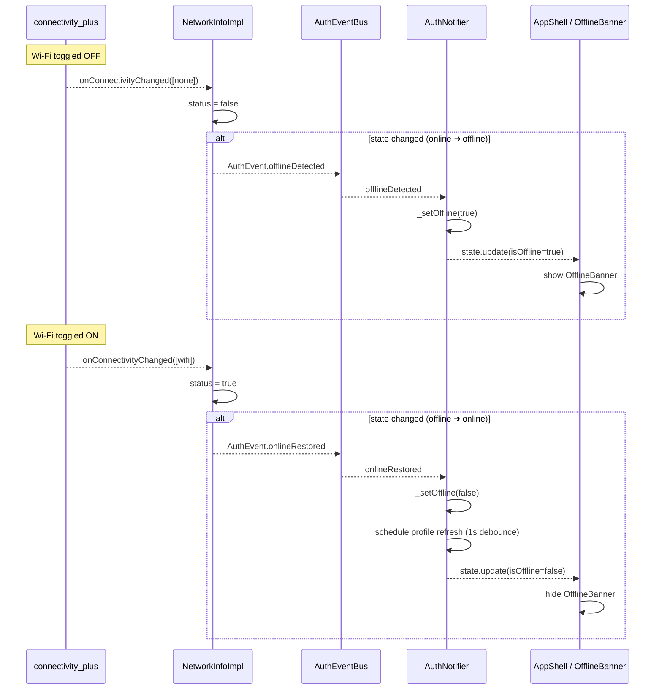

# Feature: Offline Detection via NetworkInfoImpl

This document explains how DocJet Mobile detects **offline** and **online** states and propagates them across the application.

It covers:

* Component responsibilities & interactions (Component Diagram)
* Runtime event propagation (Flow Chart)
* Frame-by-frame signal exchange (Sequence Diagram)
* Behavioural contracts & corner-cases
* Developer notes & testing pointers

---

## 1. Component Diagram

```mermaid
flowchart TD
  subgraph "Device / Platform"
    CP[Connectivity\n(connectivity_plus)]
  end

  subgraph "Core Services"
    NI[NetworkInfoImpl] -->|implements| IF[NetworkInfo]
    NI -->|fires events| EB[AuthEventBus]
  end

  subgraph "App State Layer"
    EB -->|streams events| AN[AuthNotifier]
  end

  subgraph "UI Layer"
    AN -->|provides state| APP[AppShell]
    APP --> OB[OfflineBanner]
  end

  style NI fill:#f9f,stroke:#333,stroke-width:2px
  style AN fill:#ccf,stroke:#333,stroke-width:2px
```

**Legend**

* **Connectivity_plus** – exposes low-level network changes as a `Stream<List<ConnectivityResult>>`.
* **NetworkInfoImpl** – single source of truth for connectivity, maps raw plugin data to `bool` and fires `AuthEvent.offlineDetected` / `AuthEvent.onlineRestored`.
* **AuthEventBus** – lightweight, broadcast-only stream for auth-related events.
* **AuthNotifier** – Riverpod `Notifier` that updates `AuthState.isOffline` whenever it receives the above events.
* **AppShell / OfflineBanner** – renders the purple banner when `isOffline == true`.

---

## 2. Runtime Flow Chart

```mermaid
graph LR
  A[Network change detected by connectivity_plus] --> B{Any result != none?}
  B -- Yes --> C[NetworkInfoImpl maps to online]
  C --> D[LastKnown != Online?]
  D -- Yes --> E[Fire AuthEvent.onlineRestored]\n& Emit true on stream
  D -- No --> F[Ignore – no state change]
  B -- No --> G[NetworkInfoImpl maps to offline]
  G --> H[LastKnown != Offline?]
  H -- Yes --> I[Fire AuthEvent.offlineDetected]\n& Emit false on stream
  H -- No --> F
```

Key notes:

* If the very first connectivity snapshot already reports **offline**, `NetworkInfoImpl` now fires `AuthEvent.offlineDetected` *immediately*. This ensures the OfflineBanner shows up right after a cold-start in airplane mode.
* In all other cases we still debounce: the service emits only **distinct** changes, preventing duplicate events and the infamous "purple flash".
* Error conditions (e.g. plugin throws) propagate as `addError` on the public stream and are logged with `Logger.f()`.

---

## 3. Sequence Diagram



---

## 4. Behavioural Contracts

1. **Single Source of Truth** – Only `NetworkInfoImpl` translates raw connectivity into semantic events. All other layers consume these events.
2. **Smart Bootstrap Signal** – On cold-start **and** already offline, the implementation now fires `offlineDetected` right away so the UI reflects reality. When starting online we still suppress the initial event to avoid the flash.
3. **Debounced Profile Refresh** – After `onlineRestored` the `AuthNotifier` waits 1 second before hitting the API to avoid stampeding herds when regaining network.
4. **App-Level Disposal** – `CoreModule` registers a `dispose` callback that tears down the `NetworkInfoImpl` singleton. You *must* call `GetIt.reset()` in integration tests to avoid bleed-over.
5. **Logger Hygiene** – Hardcore `Logger.f()` traces are left in for deep debugging but only compile in debug builds. `kDebugMode` gating prevents shipping verbose logs.

---

## 5. Corner-Cases & FAQs

| Scenario | Expected Behaviour |
|----------|-------------------|
| Plugin throws error | Error propagated via `onConnectivityChanged.addError`. `isConnected` fails fast with `rethrow` in debug mode, `false` in release. |
| Airplane mode entered before DI finished | Initial check runs _after_ DI so the first event still carries correct state. |
| Multiple listeners to `onConnectivityChanged` | Allowed – controller is broadcast. |
| State already offline, plugin still sends `[none]` | Ignored – distinct value filter.|

---

## 6. Developer Checklist

* Unit tests live in `test/core/platform/network_info_impl_test.dart` & `auth_notifier_test.dart` – run them with `./scripts/list_failed_tests.dart`.  
* For smoke tests use the manual scripts documented in `implement-connectivity-service.md` Cycle 4.
* When refactoring, **never** let another component fire `offlineDetected` / `onlineRestored`. Duplicate events break state determinism.
* Keep **AuthNotifier** a *pure* consumer; all detection logic belongs to **NetworkInfoImpl**.

> "I'm not renting space to uncertainty." — **Dollar Bill** 

---

## 7. Testing Caveats (Simulator vs Real Device)

Apple's `NWPathMonitor` (used by `connectivity_plus`) can get **stuck** on the macOS / iOS *simulator* after Wi-Fi toggles:

1. off → emits `[none]` (OK)  
2. on  → emits `[wifi]` *then immediately* `[none]`  
3. **never** sends the final `[wifi]` ➜ any state machine that relies on it will stay **offline forever**.

Real hardware delivers the final `wifi` event and the app comes back online.

### Hard-Bob Rule
ALWAYS verify connectivity logic on a real iPhone / iPad before filing a bug.

### Temporary Probe
`NetworkInfoImpl` contains a **debug-only probe** that logs every raw event with a timestamp:

```dart
void _debugRawEvent(List<ConnectivityResult> r) {
  // TODO(HARD-BOB): Delete before shipping
  if (!kDebugMode) return;
  final s = DateTime.now().toIso8601String();
  _logger.f('[TMP-RAW] $s -> $r');
}
```

Use it to capture the bounce in the simulator; remove the method and its call before releasing.

---

## 8. Flicker Contingency Plan  
Should we observe a startup **flicker** (banner flashes for <200 ms and disappears) on certain devices/OS versions:

1. revert to the old behaviour by gating the initial event behind a 100 ms timer:  
   ```dart
   if (!_lastKnownStatus! /* == offline */) {
     Future<void>.delayed(const Duration(milliseconds: 100), () {
       if (!_lastKnownStatus!) authEventBus.add(AuthEvent.offlineDetected);
     });
   }
   ```
2. keep the docs & tests in sync.  
3. log the affected device-/OS combo in the bug tracker so we can track regressions.

Until then: **ship it**. 