# Job Data Layer Flow

This document details the data flow architecture for the Job feature in DocJet Mobile.

> **TLDR:** This is an offline-first architecture with server-side synchronization. Jobs have a dual-ID system (client-generated UUID and server-assigned ID), undergo local-first CRUD operations, are synchronized on a 15-second interval, and can handle network failures with appropriate status tracking. Historical development details can be found in [job_dataflow_development_history.md](./job_dataflow_development_history.md).

## Table of Contents

- [Key Architecture Decisions](#key-architecture-decisions)
- [Directory Structure](#directory-structure)
- [Job Feature Architecture Overview](#job-feature-architecture-overview)
- [Job Presentation Layer Architecture](./job_presentation_layer.md) - *(See separate document)*
- [Job Data Layer Flow](#job-data-layer-flow)
- [Job Creation, Update, and Sync Flow](#job-creation-update-and-sync-flow)
- [Job Data Layer Components](#job-data-layer-components)
  - [Service-Oriented Repository Pattern](#service-oriented-repository-pattern)
    - [JobRepository Interface](#jobrepository-interface)
    - [JobRepositoryImpl](#jobrepositoryimpl)
    - [JobReaderService](#jobreaderservice)
    - [JobWriterService](#jobwriterservice)
    - [JobDeleterService](#jobdeleterservice)
    - [JobSyncOrchestratorService](#jobsyncorchestratorservice)
    - [JobSyncProcessorService](#jobsyncprocessorservice)
    - [JobSyncTriggerService](#jobsynctriggerservice)
  - [Data Sources](#data-sources)
    - [JobLocalDataSource](#joblocaldatasource)
    - [JobRemoteDataSource](#jobremotedatasource)
  - [Job Model Enhancements](#job-model-enhancements)
    - [SyncStatus Enum](#syncstatus-enum)
    - [Job Entity](#job-entity)
- [Sync Strategy](#sync-strategy)
  - [Core Principles](#core-principles)
  - [Sync Architecture](#sync-architecture)
  - [Sync Process Details](#sync-process-details)
  - [Server-Side Deletion Handling](#server-side-deletion-handling)
  - [Audio File Management](#audio-file-management)
- [Background Processing Support](#background-processing-support)
- [Remaining Improvements](#remaining-improvements)
- [Synchronization Flow Diagrams](#synchronization-flow-diagrams)
  - [Sync Orchestration - Job Collection](#sync-orchestration---job-collection)
  - [Sync Orchestration - Delegation](#sync-orchestration---delegation)
  - [Processor - New Job Creation](#processor---new-job-creation)
  - [Processor - Job Update](#processor---job-update)
  - [Processor - Sync Error Handling](#processor---sync-error-handling)
  - [Processor - Job Deletion](#processor---job-deletion)
  - [Processor - Local File Cleanup](#processor---local-file-cleanup)
  - [Manual Reset of Failed Job](#manual-reset-of-failed-job)
- [Local-First Operations Flow](#local-first-operations-flow)
  - [Job Creation Flow](#job-creation-flow)
  - [Job Update Flow](#job-update-flow)
  - [Job Deletion Flow](#job-deletion-flow)

## Key Architecture Decisions

1. **Dual-ID System**
   * `localId`: Client-generated UUID that never changes
   * `serverId`: Server-assigned ID after first successful sync
   * Preserves local references while supporting server-generated IDs

2. **Offline-First Operations**
   * All operations (create/update/delete) happen locally first
   * Changes are marked with appropriate sync status
   * Background synchronization pushes changes to server

3. **Individual Job Synchronization**
   * Each job is processed independently with clear paths for:
     - Creating new jobs (`serverId == null`)
     - Updating existing jobs (`serverId != null`)
     - Deleting jobs (`syncStatus == pendingDeletion`)
   * Allows for granular error handling per job

4. **Server Authority Model**
   * Server is the ultimate source of truth
   * Server data overwrites local data after initial sync
   * No conflict resolution - server response is accepted as-is

5. **Robust Error Handling**
   * Per-job error state tracking
   * Failed jobs are retried with exponential backoff
   * Maximum retry attempts with permanent failure state
   * Sync process continues with other jobs even if one fails
   * Non-fatal audio file deletion errors

6. **Resource Management**
   * Audio files tied directly to job lifecycle
   * Automatic cleanup when jobs are deleted (locally or server-side)

7. **Service-Oriented Architecture**
   * Specialized services with single responsibilities
   * Clear separation between read, write, delete, and sync operations
   * Split sync responsibility between Orchestrator (what to sync) and Processor (how to sync)
   * Improved testability with focused components

8. **Background Processing Support**
   * Explicit sync triggering mechanism
   * App lifecycle aware (foreground/background transitions)
   * Compatible with platform-specific background workers

## Directory Structure

### Feature Location
The Job feature is located at: `lib/features/jobs/` (plural)

### Key Components
- **Repository Interface**: `lib/features/jobs/domain/repositories/job_repository.dart`
- **Repository Implementation**: `lib/features/jobs/data/repositories/job_repository_impl.dart`
- **Domain Entities**: `lib/features/jobs/domain/entities/`
  - `job.dart`
  - `job_update_details.dart`
  - `sync_status.dart`

### Service Layer 
All services located in: `lib/features/jobs/data/services/`
- `job_sync_trigger_service.dart` - Periodic sync triggering
- `job_sync_orchestrator_service.dart` - Orchestrates what to sync
- `job_sync_processor_service.dart` - Handles API operations
- `job_reader_service.dart` - Read operations
- `job_writer_service.dart` - Write operations 
- `job_deleter_service.dart` - Delete operations

### Use Cases Layer
All use cases located in: `lib/features/jobs/domain/usecases/`
- `create_job_use_case.dart` - Creates new jobs
- `delete_job_use_case.dart` - Marks jobs for deletion
- `get_job_by_id_use_case.dart` - Retrieves a single job
- `get_jobs_use_case.dart` - Retrieves all jobs
- `reset_failed_job_use_case.dart` - Resets failed jobs for retry
- `update_job_use_case.dart` - Updates existing jobs
- `watch_jobs_use_case.dart` - Provides a stream of all jobs
- `watch_job_by_id_use_case.dart` - Provides a stream for a single job

### Data Sources
- **Local**: `lib/features/jobs/data/datasources/job_local_data_source.dart`
- **Remote**: `lib/features/jobs/data/datasources/job_remote_data_source.dart`
- **Implementations**:
  - `lib/features/jobs/data/datasources/hive_job_local_data_source_impl.dart`
  - `lib/features/jobs/data/datasources/api_job_remote_data_source_impl.dart`

### Models and Mappers
- **Models**: `lib/features/jobs/data/models/`
  - `job_hive_model.dart`
  - `job_api_dto.dart`
- **Mappers**: `lib/features/jobs/data/mappers/job_mapper.dart`

### Tests
Test files are located at: `test/features/jobs/data/services/`
- Each service has corresponding test files
- Mock files are generated with `@GenerateMocks` annotations

## Job Feature Architecture Overview

The following diagrams illustrate the components and their relationships for the job feature.

> **Note:** For details on the Presentation Layer (Cubits, States, UI interaction), see the dedicated [Job Presentation Layer Architecture](./job_presentation_layer.md) document.

### High-Level Architecture

This diagram shows the main architectural layers and primary flow of data:

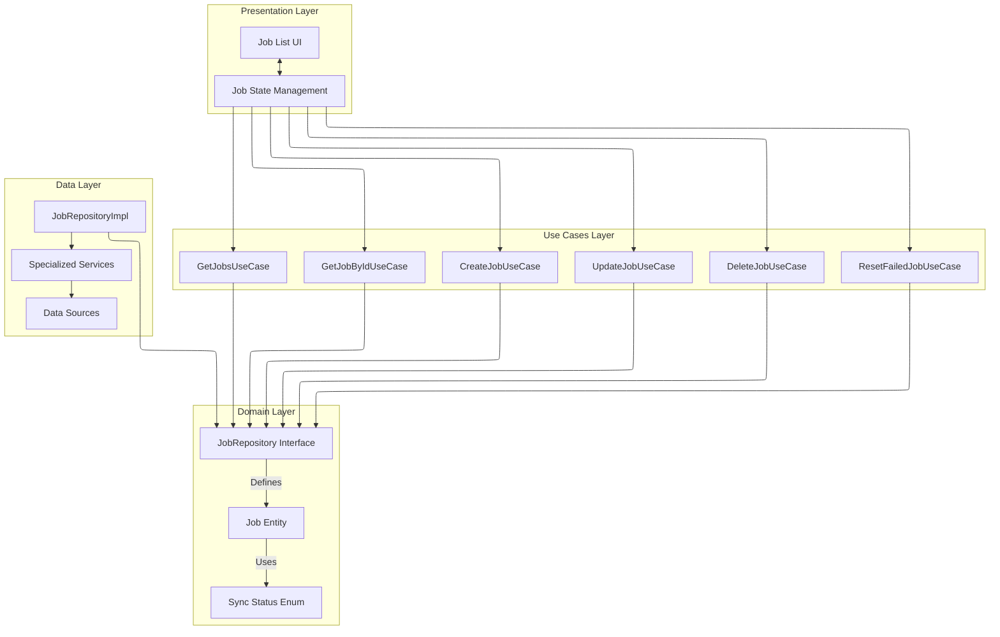
```mermaid
%%{init: {'flowchart': {'defaultRenderer': 'elk'}}}%%
graph TD
    subgraph "Presentation Layer"
        UI[Job List UI] 
        StateManagement[Job State Management]
        UI <--> StateManagement
    end

    subgraph "Use Cases Layer"
        GetJobs[GetJobsUseCase]
        GetJobById[GetJobByIdUseCase]
        CreateJob[CreateJobUseCase]
        UpdateJob[UpdateJobUseCase]
        DeleteJob[DeleteJobUseCase]
        ResetFailedJob[ResetFailedJobUseCase]
    end

    subgraph "Domain Layer"
        JobRepo[JobRepository Interface]
        JobEntity[Job Entity]
        SyncStatus[Sync Status Enum]
    end

    subgraph "Data Layer"
        RepoImpl[JobRepositoryImpl]
        Services[Specialized Services]
        DataSources[Data Sources]
    end

    %% Connections between layers
    StateManagement --> GetJobs
    StateManagement --> GetJobById
    StateManagement --> CreateJob
    StateManagement --> UpdateJob
    StateManagement --> DeleteJob
    StateManagement --> ResetFailedJob
    
    GetJobs --> JobRepo
    GetJobById --> JobRepo
    CreateJob --> JobRepo
    UpdateJob --> JobRepo
    DeleteJob --> JobRepo
    ResetFailedJob --> JobRepo
    
    JobRepo -- Defines --> JobEntity
    JobEntity -- Uses --> SyncStatus
    
    RepoImpl --> JobRepo
    RepoImpl --> Services
    Services --> DataSources

    %% Styling
    class UI,StateManagement presentation;
    class GetJobs,GetJobById,CreateJob,UpdateJob,DeleteJob,ResetFailedJob usecases;
    class JobRepo,JobEntity,SyncStatus domain;
    class RepoImpl,Services,DataSources data;
```

### Data Layer Services Detail

This diagram shows the details of the Service-Oriented Repository Pattern implementation:

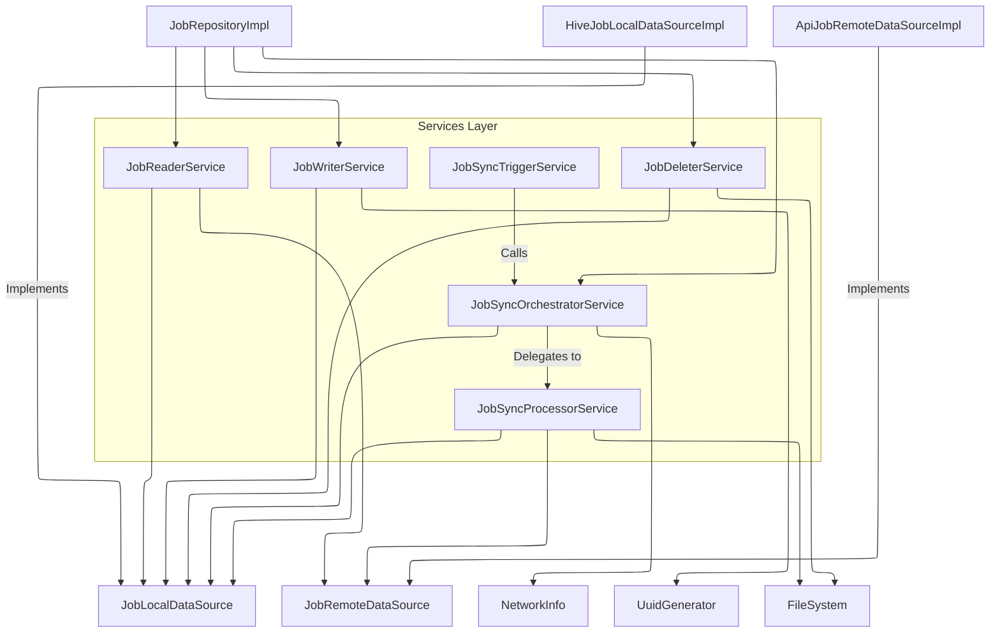
```mermaid
%%{init: {'flowchart': {'defaultRenderer': 'elk'}}}%%
graph TD
    %% Repository Implementation
    RepoImpl[JobRepositoryImpl]
    
    %% Services
    subgraph "Services Layer"
        ReaderSvc[JobReaderService]
        WriterSvc[JobWriterService]
        DeleterSvc[JobDeleterService]
        SyncOrch[JobSyncOrchestratorService]
        SyncProc[JobSyncProcessorService]
        SyncTrigger[JobSyncTriggerService]
    end
    
    %% Data Sources
            LocalDS[JobLocalDataSource]
            RemoteDS[JobRemoteDataSource]
    
    %% Infrastructure
            Network[NetworkInfo]
            UUID[UuidGenerator]
            FileSystem[FileSystem]
    
    %% Connections
    RepoImpl --> ReaderSvc
    RepoImpl --> WriterSvc
    RepoImpl --> DeleterSvc
    RepoImpl --> SyncOrch
    
    SyncTrigger -->|Calls| SyncOrch
    SyncOrch -->|Delegates to| SyncProc
    
    ReaderSvc --> LocalDS
    ReaderSvc --> RemoteDS
        
    WriterSvc --> LocalDS
    WriterSvc --> UUID
        
    DeleterSvc --> LocalDS
    DeleterSvc --> FileSystem
        
    SyncOrch --> LocalDS
    SyncOrch --> Network
        
    SyncProc --> LocalDS
    SyncProc --> RemoteDS
    SyncProc --> FileSystem
    
    %% Implementation Details
    LocalDSImpl[HiveJobLocalDataSourceImpl]
    RemoteDSImpl[ApiJobRemoteDataSourceImpl]
    
    LocalDSImpl -->|Implements| LocalDS
    RemoteDSImpl -->|Implements| RemoteDS
    
    %% Styling
    class ReaderSvc,WriterSvc,DeleterSvc,SyncOrch,SyncProc,SyncTrigger service;
    class RepoImpl,LocalDS,RemoteDS,LocalDSImpl,RemoteDSImpl data;
    class Network,UUID,FileSystem infra;
```

## Job Data Layer Flow

This sequence diagram shows the typical flows when the application requests job data, demonstrating how the repository interacts with local and remote data sources.

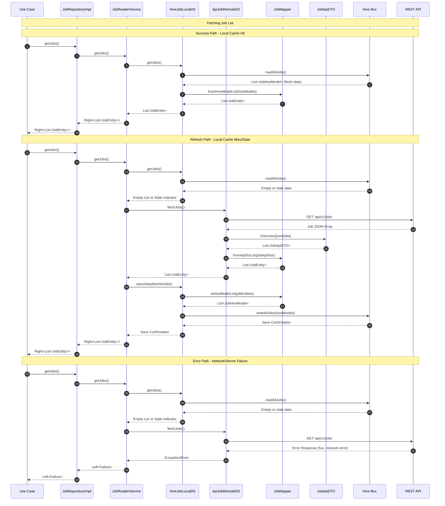
```mermaid
sequenceDiagram
    autonumber
    participant UseCase as Use Case
    participant JobRepo as JobRepositoryImpl
    participant ReaderSvc as JobReaderService
    participant LocalDS as HiveJobLocalDS
    participant RemoteDS as ApiJobRemoteDS
    participant Mapper as JobMapper
    participant ApiDTO as JobApiDTO
    participant Hive as Hive Box
    participant API as REST API

    Note over UseCase, API: Fetching Job List

    %% Success Path - Local Data
    Note over UseCase, API: Success Path - Local Cache Hit
    UseCase->>JobRepo: getJobs()
    JobRepo->>ReaderSvc: getJobs()
    ReaderSvc->>LocalDS: getJobs()
    LocalDS->>Hive: readAllJobs()
    Hive-->>LocalDS: List<JobHiveModel> (fresh data)
    LocalDS->>Mapper: fromHiveModelList(hiveModels)
    Mapper-->>LocalDS: List<JobEntity>
    LocalDS-->>ReaderSvc: List<JobEntity>
    ReaderSvc-->>JobRepo: Right<List<JobEntity>>
    JobRepo-->>UseCase: Right<List<JobEntity>>
    
    %% Refresh Path - Remote Fetch
    Note over UseCase, API: Refresh Path - Local Cache Miss/Stale
    UseCase->>JobRepo: getJobs()
    JobRepo->>ReaderSvc: getJobs()
    ReaderSvc->>LocalDS: getJobs()
    LocalDS->>Hive: readAllJobs()
    Hive-->>LocalDS: Empty or stale data
    LocalDS-->>ReaderSvc: Empty List or Stale Indicator
    ReaderSvc->>RemoteDS: fetchJobs()
    RemoteDS->>API: GET /api/v1/jobs
    API-->>RemoteDS: Job JSON Array
    RemoteDS->>ApiDTO: fromJson(jsonData)
    ApiDTO-->>RemoteDS: List<JobApiDTO>
    RemoteDS->>Mapper: fromApiDtoList(jobApiDtos)
    Mapper-->>RemoteDS: List<JobEntity>
    RemoteDS-->>ReaderSvc: List<JobEntity>
    ReaderSvc->>LocalDS: saveJobs(fetchedJobs)
    LocalDS->>Mapper: toHiveModelList(jobEntities)
    Mapper-->>LocalDS: List<JobHiveModel>
    LocalDS->>Hive: writeAllJobs(hiveModels)
    Hive-->>LocalDS: Save Confirmation
    LocalDS-->>ReaderSvc: Save Confirmation
    ReaderSvc-->>JobRepo: Right<List<JobEntity>>
    JobRepo-->>UseCase: Right<List<JobEntity>>
    
    %% Error Path
    Note over UseCase, API: Error Path - Network/Server Failure
    UseCase->>JobRepo: getJobs()
    JobRepo->>ReaderSvc: getJobs()
    ReaderSvc->>LocalDS: getJobs()
    LocalDS->>Hive: readAllJobs()
    Hive-->>LocalDS: Empty or stale data
    LocalDS-->>ReaderSvc: Empty List or Stale Indicator
    ReaderSvc->>RemoteDS: fetchJobs()
    RemoteDS->>API: GET /api/v1/jobs
    API-->>RemoteDS: Error Response (5xx, network error)
    RemoteDS-->>ReaderSvc: Exception/Error
    ReaderSvc-->>JobRepo: Left<Failure>
    JobRepo-->>UseCase: Left<Failure>
```

## Job Creation, Update, and Sync Flow

This sequence diagram illustrates the data flow for creating new jobs, updating existing jobs, and synchronizing pending changes with the backend.

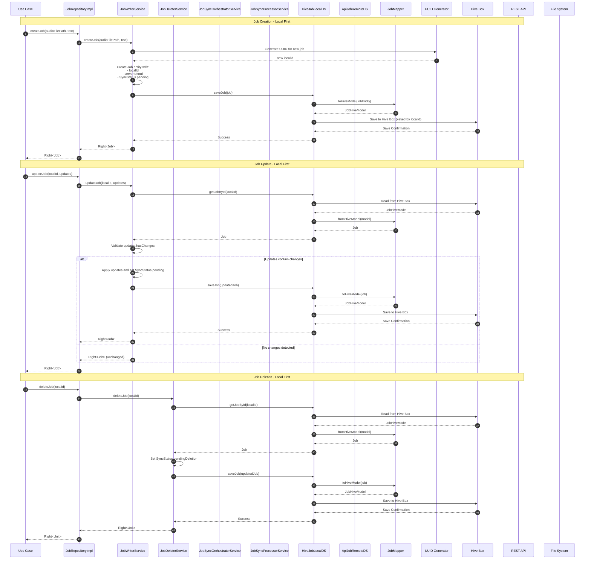
```mermaid
sequenceDiagram
    autonumber
    participant UseCase as Use Case
    participant JobRepo as JobRepositoryImpl
    participant WriterSvc as JobWriterService
    participant DeleterSvc as JobDeleterService
    participant SyncOrch as JobSyncOrchestratorService
    participant SyncProc as JobSyncProcessorService
    participant LocalDS as HiveJobLocalDS
    participant RemoteDS as ApiJobRemoteDS
    participant Mapper as JobMapper
    participant UUID as UUID Generator
    participant Hive as Hive Box
    participant API as REST API
    participant FileSystem as File System

    %% Job Creation Flow
    Note over UseCase, API: Job Creation - Local First
    UseCase->>JobRepo: createJob(audioFilePath, text)
    JobRepo->>WriterSvc: createJob(audioFilePath, text)
    WriterSvc->>UUID: Generate UUID for new job
    UUID-->>WriterSvc: new localId
    WriterSvc->>WriterSvc: Create Job entity with:<br/>- localId<br/>- serverId=null<br/>- SyncStatus.pending
    WriterSvc->>LocalDS: saveJob(job)
    LocalDS->>Mapper: toHiveModel(jobEntity)
    Mapper-->>LocalDS: JobHiveModel
    LocalDS->>Hive: Save to Hive Box (keyed by localId)
    Hive-->>LocalDS: Save Confirmation
    LocalDS-->>WriterSvc: Success
    WriterSvc-->>JobRepo: Right<Job>
    JobRepo-->>UseCase: Right<Job>
    
    %% Job Update Flow
    Note over UseCase, API: Job Update - Local First
    UseCase->>JobRepo: updateJob(localId, updates)
    JobRepo->>WriterSvc: updateJob(localId, updates)
    WriterSvc->>LocalDS: getJobById(localId)
    LocalDS->>Hive: Read from Hive Box
    Hive-->>LocalDS: JobHiveModel
    LocalDS->>Mapper: fromHiveModel(model)
    Mapper-->>LocalDS: Job
    LocalDS-->>WriterSvc: Job
    
    WriterSvc->>WriterSvc: Validate updates.hasChanges
    
    alt Updates contain changes
        WriterSvc->>WriterSvc: Apply updates and set SyncStatus.pending
        WriterSvc->>LocalDS: saveJob(updatedJob)
        LocalDS->>Mapper: toHiveModel(job)
        Mapper-->>LocalDS: JobHiveModel
        LocalDS->>Hive: Save to Hive Box
        Hive-->>LocalDS: Save Confirmation
        LocalDS-->>WriterSvc: Success
        WriterSvc-->>JobRepo: Right<Job>
    else No changes detected
        WriterSvc-->>JobRepo: Right<Job> (unchanged)
    end
    
    JobRepo-->>UseCase: Right<Job>
    
    %% Job Deletion Flow
    Note over UseCase, API: Job Deletion - Local First
    UseCase->>JobRepo: deleteJob(localId)
    JobRepo->>DeleterSvc: deleteJob(localId)
    DeleterSvc->>LocalDS: getJobById(localId)
    LocalDS->>Hive: Read from Hive Box
    Hive-->>LocalDS: JobHiveModel
    LocalDS->>Mapper: fromHiveModel(model)
    Mapper-->>LocalDS: Job
    LocalDS-->>DeleterSvc: Job
    
    DeleterSvc->>DeleterSvc: Set SyncStatus.pendingDeletion
    DeleterSvc->>LocalDS: saveJob(updatedJob)
    LocalDS->>Mapper: toHiveModel(job)
    Mapper-->>LocalDS: JobHiveModel
    LocalDS->>Hive: Save to Hive Box
    Hive-->>LocalDS: Save Confirmation
    LocalDS-->>DeleterSvc: Success
    DeleterSvc-->>JobRepo: Right<Unit>
    JobRepo-->>UseCase: Right<Unit>
```

## Job Data Layer Components

### Service-Oriented Repository Pattern

The job feature implements a service-oriented repository pattern with specialized services for different operations.

#### JobRepository Interface

The public contract for job operations that feature modules interact with. It defines all operations without exposing implementation details.

Key Methods:
* Read: `getJobs()`, `getJobById(localId)` (returns `Job?`)
* Write: `createJob(audioFilePath, text)`, `updateJob(localId, updates)`
* Delete: `deleteJob(localId)`
* Sync: `syncPendingJobs()`, `resetFailedJob(localId)`
* Reactive Read: `watchJobs()`, `watchJobById(localId)` (return Streams)

#### JobRepositoryImpl

Lightweight implementation that delegates to specialized services:

```dart
class JobRepositoryImpl implements JobRepository {
  final JobReaderService _readerService;
  final JobWriterService _writerService;
  final JobDeleterService _deleterService;
  final JobSyncOrchestratorService _orchestratorService;
  
  // Methods delegate directly to appropriate service
  Future<Either<Failure, List<Job>>> getJobs() => _readerService.getJobs();
  // Other methods follow the same pattern...
}
```

#### JobReaderService

Handles all read operations related to jobs.

Key features:
* Getting jobs from local storage
* Fetching jobs from remote API when needed
* Detecting server-side deletions
* Providing reactive streams via `watchJobs()` and `watchJobById()`

#### JobWriterService

Handles all job creation and update operations.

Key features:
* Creating new jobs with client-generated UUID
* Validating updates to avoid unnecessary processing
* Marking jobs for sync

#### JobDeleterService

Handles all job deletion operations.

Key features:
* Marking jobs for deletion (soft delete)
* Permanently deleting jobs after sync
* Cleaning up associated audio files

#### JobSyncOrchestratorService

Orchestrates the synchronization process by determining what needs to be synced and delegating the actual sync operations.

Key features:
* Collecting jobs that need synchronization (pending, pendingDeletion, retry-eligible)
* Network connectivity verification
* Concurrency protection with mutex
* Delegating individual job processing to the processor service
* Resetting failed jobs upon user request

#### JobSyncProcessorService

Handles the actual synchronization operations with the remote API.

Key features:
* Processing different sync paths (create/update/delete) 
* Making API calls to create, update, or delete jobs
* Error handling with retry mechanism
* Updating job status based on sync results
* Managing audio file cleanup after successful deletion

#### JobSyncTriggerService

Manages periodic sync operation triggered by timer or app lifecycle events.

Key features:
* 15-second periodic timer for sync
* App lifecycle awareness (background/foreground)
* Error handling for sync operation

### Data Sources

#### JobLocalDataSource

Interface defining operations for local storage of jobs. Implemented by `HiveJobLocalDataSourceImpl`.

Key methods include:
* `getJobsToRetry(maxRetries, backoffDuration)`: Gets jobs eligible for retry based on retry count and backoff time
* `watchJobs()`: Returns a `Stream` of the entire job list.
* `watchJobById(id)`: Returns a `Stream` for a specific job.

#### JobRemoteDataSource

Interface for remote API operations. Implemented by `ApiJobRemoteDataSourceImpl`.

Key features:
* Handles direct communication with the REST API
* Uses `AuthSessionProvider` to get the current user ID for job operations rather than requiring it as a parameter
* Provides proper authentication error handling
* Wraps API failures in domain-specific exceptions

### Job Model Enhancements

#### SyncStatus Enum

Enhanced with additional states:
* `pending`: Waiting for sync to server
* `synced`: Successfully synced
* `pendingDeletion`: Marked for deletion
* `error`: Failed sync but will retry
* `failed`: Failed sync and exceeded max retry attempts

#### Job Entity

Enhanced with error recovery fields:
* `retryCount`: Number of failed sync attempts (default: 0)
* `lastSyncAttemptAt`: Timestamp of last sync attempt for backoff calculation

## Authentication and Job Operations

The job feature interacts with authentication through the `AuthSessionProvider` interface:

### Authentication Context
- Repository and services obtain the current user ID through the `AuthSessionProvider` interface
- Components verify authentication state before performing operations
- Authentication errors are translated to domain-specific `AuthFailure` objects

### Authentication Error Handling
Job operations fail cleanly when authentication is invalid:
- `JobRepositoryImpl` checks `isAuthenticated()` before proceeding with job creation
- `JobWriterService` gets the current user ID from `getCurrentUserId()` and handles authentication exceptions
- `ApiJobRemoteDataSource` verifies authentication before making API calls

### Future Authentication Integrations
The following planned authentication enhancements (see [Architecture: Authentication](./architecture.md#future-authentication-enhancements)) will further improve the Job feature:

1. **Offline Authentication**: Will allow job operations to work offline with cached authentication
2. **Robust Error Recovery**: Will enable better handling of transient authentication failures during job sync
3. **Auth Event System**: Will allow job components to react to authentication state changes (logout/token expiry)

## Sync Strategy

This section details the comprehensive synchronization strategy for jobs, covering creation, updates, deletions, and error handling.

### Core Principles

1. **Server Authority ("Server Wins")**: 
   - The server is the ultimate source of truth
   - After initial sync, server data always overwrites local data
   - No conflict detection or resolution needed - server response is accepted as-is

2. **Offline-First Creation/Updates**:
   - New jobs are created locally first with client-generated UUID
   - Job updates are applied locally first
   - Both are marked with `SyncStatus.pending` until synced

### Sync Architecture

The sync process is split between two specialized services:

1. **JobSyncOrchestratorService**:
   - Decides *what* to sync and when
   - Handles concurrency with mutex lock (Default is re-entrant from `package:mutex`)
   - Collects jobs that need synchronization
   - Checks network connectivity
   * Delegating actual sync operations to processor
   * Providing API for manual reset of failed jobs

2. **JobSyncProcessorService**:
   - Performs the actual API operations
   - Updates local job state based on API responses
   - Handles error conditions and updates job status
   - Manages associated resources (e.g., audio files)

This separation of concerns allows for:
- Better testability of the orchestration logic separate from API interactions
- Clearer responsibility boundaries
- Reduced risk of race conditions

### Sync Process Details

1. **Triggering:** 
   - The `JobSyncTriggerService` calls `JobRepository.syncPendingJobs()` every 15 seconds
   - Triggers also occur on app foregrounding via lifecycle observer
   - Compatible with platform-specific background workers

2. **Orchestration:** 
   - `JobSyncOrchestratorService` gathers three types of jobs to process:
     * Jobs with `SyncStatus.pending` for creation/update
     * Jobs with `SyncStatus.pendingDeletion` for deletion
     * Jobs with `SyncStatus.error` that meet retry criteria
   - For each job, it calls the appropriate processor method
   - Handles concurrency with mutex to prevent parallel sync attempts

3. **Retry Eligibility:**
   - Jobs are eligible for retry when:
     * `syncStatus == SyncStatus.error`
     * `retryCount < MAX_RETRY_ATTEMPTS` (default: 5)
     * Time since last attempt follows exponential backoff: `now - (baseBackoff * 2^retryCount)`
   - The `JobLocalDataSource` implements the logic for finding retry-eligible jobs

4. **Processing:**
   - `JobSyncProcessorService` handles each job based on its status:
   - **New Job Flow** (`serverId == null`, `SyncStatus.pending`):
     * Creates job on server with client-generated `localId`
     * Receives response with server-assigned `serverId`
     * Updates job with `SyncStatus.synced`
   - **Update Job Flow** (`serverId != null`, `SyncStatus.pending`):
     * Updates job on server using its `serverId`
     * Only sends changed fields
     * Updates job with `SyncStatus.synced`
   - **Delete Job Flow** (`SyncStatus.pendingDeletion`):
     * Deletes job on server (if it has a `serverId`)
     * Permanently deletes local job on success
     * Deletes associated audio file

5. **Error Handling:**
   - If an API call fails (e.g., `createJob`, `updateJob`, `deleteJob`), the `JobSyncProcessorService` catches the exception.
   - It calls `_handleSyncError` which updates the job's local state:
     - Increments `retryCount`.
     - Sets `lastSyncAttemptAt` to the current time.
     - Sets `syncStatus` to `SyncStatus.error` if retries remain.
     - Sets `syncStatus` to `SyncStatus.failed` if `retryCount` reaches `maxRetryAttempts` (currently 5).
   - The orchestrator identifies jobs in the `error` state for subsequent retry attempts based on an exponential backoff calculation.
   - **Retry Timing**: The eligibility for retry is determined by the `HiveJobLocalDataSourceImpl.getJobsToRetry` method. The backoff duration itself is calculated using the `calculateRetryBackoff` function in `lib/features/jobs/data/config/job_sync_config.dart`.
     - The formula is: `min(retryBackoffBase * pow(2, retryCount), maxBackoffDuration)`.
     - Configuration values (defined in `JobSyncConfig`):
       - `retryBackoffBase`: Currently 1 minute.
       - `maxRetryAttempts`: Currently 5.
       - `maxBackoffDuration`: Currently 1 hour (caps the exponential growth).
     - A job is only considered for retry if the current time is after its `lastSyncAttemptAt` plus the calculated backoff duration.
   - The overall sync process continues with other jobs even if one fails.

6. **Manual Reset:**
   - Jobs with `SyncStatus.failed` require manual intervention
   - UI displays failed jobs with a retry option
   - `resetFailedJob(localId)` in the `JobSyncOrchestratorService`:
     * Checks if job exists and has `SyncStatus.failed`
     * Resets to `SyncStatus.pending` with zeroed retry count
     * Returns `Right<Unit>` on success or appropriate error

### Server-Side Deletion Handling

When fetching jobs from the server:
1. Repository gets full list of jobs from API
2. Compares with local jobs that have `syncStatus.synced` (ignoring pending ones)
3. Any jobs previously synced but missing from API response are considered deleted by server
4. These jobs are immediately deleted locally (including associated audio files)

> **IMPORTANT:** Jobs with `SyncStatus.pending`, `SyncStatus.pendingDeletion`, `SyncStatus.error`, or `SyncStatus.failed` are intentionally ignored during this check to prevent accidental deletion of jobs that have not yet successfully synced to the server.

### Audio File Management

1. Audio files are stored locally when jobs are created.
2. Files remain on device as long as their associated job exists.
3. When a job is deleted (either locally initiated or server-detected), its audio file is also deleted.
4. Audio lifecycle is 100% tied to job lifecycle - when the job is gone, the audio is gone.
5. **Error Handling**:
   * All file deletion attempts are wrapped in `try-catch` blocks.
   * Path normalization and null-checking are performed before deletion.
   * If a file deletion fails, the error is logged as `ERROR` severity using the structured logging facility (`log_helpers.dart`).
   * Log entries include the job's `localId`, the full file path, and the specific error message.
   * These failures are considered non-fatal to the job deletion process itself (the job record is still removed locally).
   * A retry mechanism for failed file deletions will be implemented (e.g., on next app startup or sync cycle) to ensure eventual cleanup.

## Background Processing Support

The job feature architecture is designed to work with background processing mechanisms:

1. **In-App Foreground Sync:**
   - `JobSyncTriggerService` manages a 15-second `Timer.periodic` when app is foregrounded
   - Timer is paused/resumed based on app lifecycle events

2. **Background Worker Integration:**
   - The architecture separates triggering from execution
   - Platform-specific implementations (WorkManager for Android, BackgroundTasks for iOS) can call the same `JobRepository.syncPendingJobs()` method
   - Consistent retry mechanism works regardless of what triggered the sync

3. **Lifecycle-Aware Processing:**
   - `JobSyncLifecycleObserver` manages sync state during app transitions
   - Ensures sync is running when app is visible
   - Pauses sync when app is backgrounded (unless using platform background workers)

## Remaining Improvements

The detailed implementation plan, including outstanding tasks for error recovery, sync triggering, lifecycle management, concurrency protection, and logging, can be found in the [JobRepository Refactoring Plan](./jobrepo_refactor.md).

## Synchronization Flow Diagrams

To make the sync flow clear, we've split it into small, focused sequence diagrams.

### Sync Orchestration - Job Collection

This diagram shows how the orchestrator gathers jobs needing synchronization based on their status and retry eligibility.
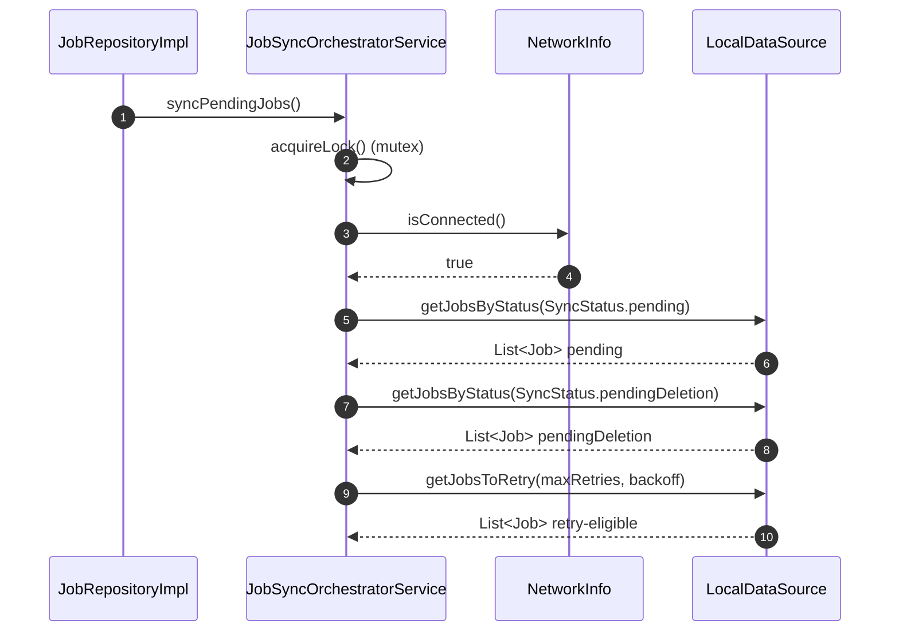
```mermaid
sequenceDiagram
    autonumber
    participant JobRepo as JobRepositoryImpl
    participant Orchestrator as JobSyncOrchestratorService
    participant Network as NetworkInfo
    participant LocalDS as LocalDataSource
    
    JobRepo->>Orchestrator: syncPendingJobs()
    Orchestrator->>Orchestrator: acquireLock() (mutex)
    Orchestrator->>Network: isConnected()
    Network-->>Orchestrator: true
    
    Orchestrator->>LocalDS: getJobsByStatus(SyncStatus.pending)
    LocalDS-->>Orchestrator: List<Job> pending
    
    Orchestrator->>LocalDS: getJobsByStatus(SyncStatus.pendingDeletion)
    LocalDS-->>Orchestrator: List<Job> pendingDeletion
    
    Orchestrator->>LocalDS: getJobsToRetry(maxRetries, backoff)
    LocalDS-->>Orchestrator: List<Job> retry-eligible
```

### Sync Orchestration - Delegation

This diagram illustrates the orchestrator delegating the processing of collected jobs to the appropriate processor methods.
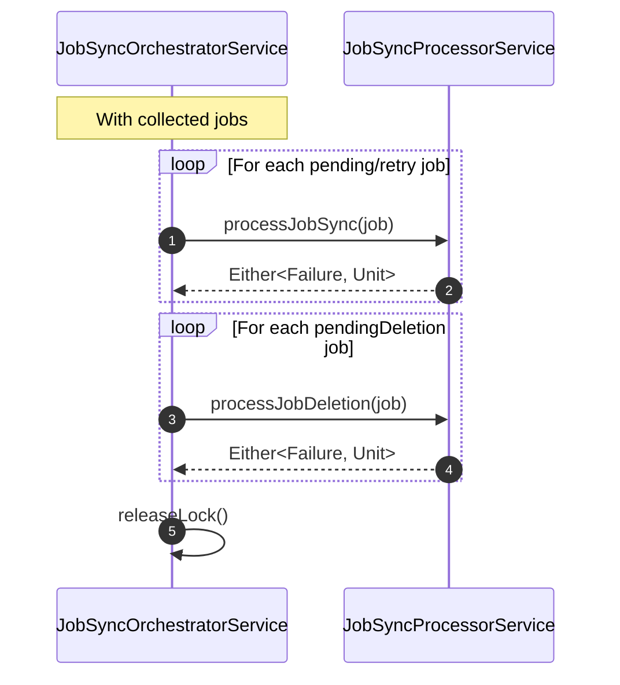
```mermaid
sequenceDiagram
    autonumber
    participant Orchestrator as JobSyncOrchestratorService
    participant Processor as JobSyncProcessorService
    
    Note over Orchestrator: With collected jobs
    
    loop For each pending/retry job
        Orchestrator->>Processor: processJobSync(job)
        Processor-->>Orchestrator: Either<Failure, Unit>
    end
    
    loop For each pendingDeletion job
        Orchestrator->>Processor: processJobDeletion(job)
        Processor-->>Orchestrator: Either<Failure, Unit>
    end
    
    Orchestrator->>Orchestrator: releaseLock()
```

### Processor - New Job Creation 

This diagram details the flow for creating a new job on the remote server and updating the local status upon success.
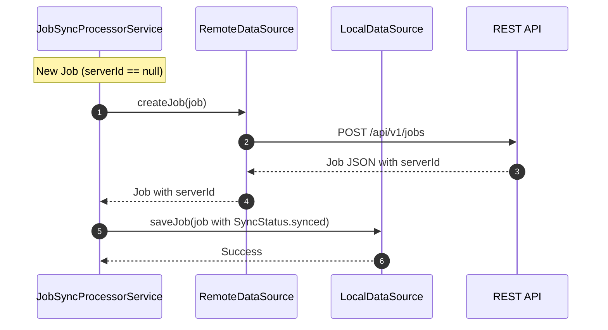
```mermaid
sequenceDiagram
    autonumber
    participant Processor as JobSyncProcessorService
    participant RemoteDS as RemoteDataSource
    participant LocalDS as LocalDataSource
    participant API as REST API

    Note over Processor: New Job (serverId == null)
    
    Processor->>RemoteDS: createJob(job)
    RemoteDS->>API: POST /api/v1/jobs
    API-->>RemoteDS: Job JSON with serverId
    RemoteDS-->>Processor: Job with serverId
    
    Processor->>LocalDS: saveJob(job with SyncStatus.synced)
    LocalDS-->>Processor: Success
```

### Processor - Job Update

This diagram shows the process of sending job updates to the remote server and updating the local status.
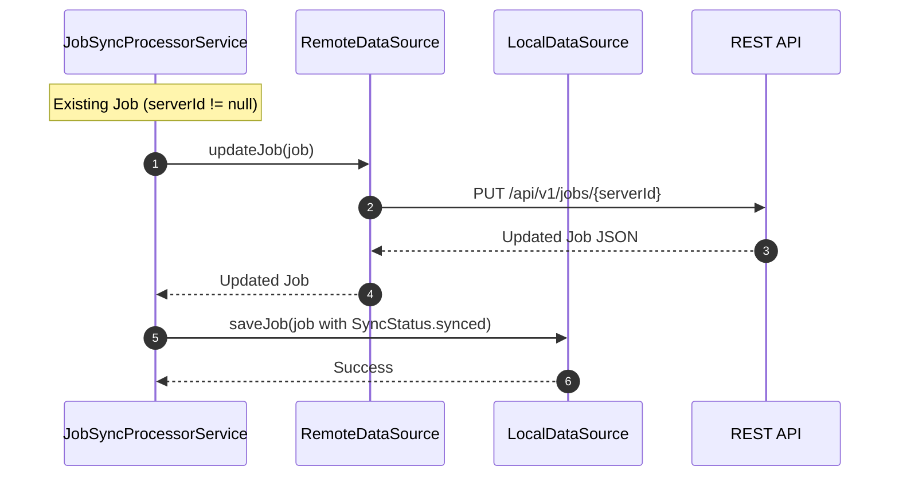
```mermaid
sequenceDiagram
    autonumber
    participant Processor as JobSyncProcessorService
    participant RemoteDS as RemoteDataSource
    participant LocalDS as LocalDataSource
    participant API as REST API

    Note over Processor: Existing Job (serverId != null)
    
    Processor->>RemoteDS: updateJob(job)
    RemoteDS->>API: PUT /api/v1/jobs/{serverId}
    API-->>RemoteDS: Updated Job JSON
    RemoteDS-->>Processor: Updated Job
    
    Processor->>LocalDS: saveJob(job with SyncStatus.synced)
    LocalDS-->>Processor: Success
```

### Processor - Sync Error Handling

This diagram outlines how synchronization failures are handled by updating the job's retry count and status.
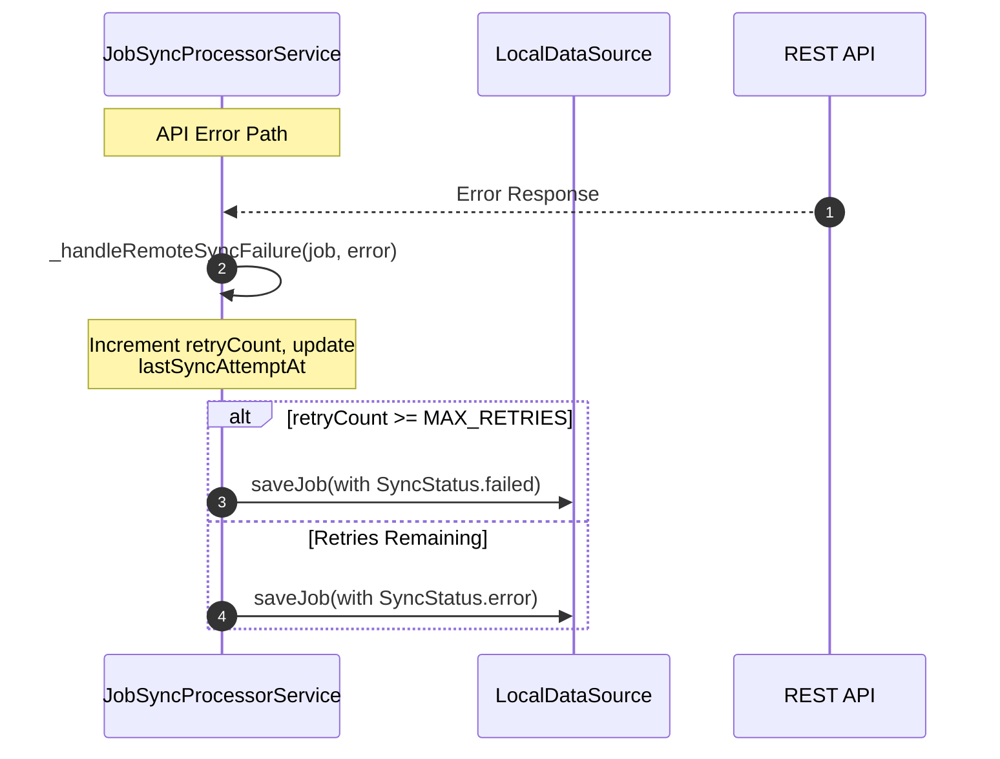
```mermaid
sequenceDiagram
    autonumber
    participant Processor as JobSyncProcessorService
    participant LocalDS as LocalDataSource
    participant API as REST API

    Note over Processor: API Error Path
    
    API-->>Processor: Error Response
    
    Processor->>Processor: _handleRemoteSyncFailure(job, error)
    Note over Processor: Increment retryCount, update<br/>lastSyncAttemptAt
    
    alt retryCount >= MAX_RETRIES
        Processor->>LocalDS: saveJob(with SyncStatus.failed)
    else Retries Remaining
        Processor->>LocalDS: saveJob(with SyncStatus.error)
    end
```

### Processor - Job Deletion

This diagram details the steps for deleting a job on the remote server and then removing it locally.
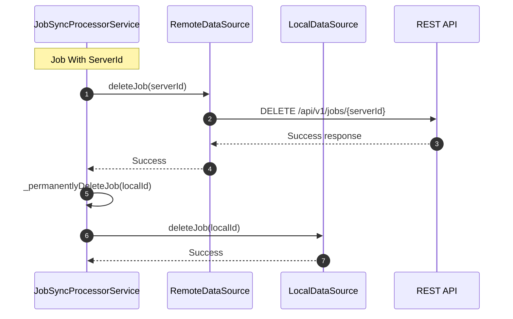
```mermaid
sequenceDiagram
    autonumber
    participant Processor as JobSyncProcessorService
    participant RemoteDS as RemoteDataSource
    participant LocalDS as LocalDataSource
    participant API as REST API

    Note over Processor: Job With ServerId
    
    Processor->>RemoteDS: deleteJob(serverId)
    RemoteDS->>API: DELETE /api/v1/jobs/{serverId}
    API-->>RemoteDS: Success response
    RemoteDS-->>Processor: Success
    
    Processor->>Processor: _permanentlyDeleteJob(localId)
    Processor->>LocalDS: deleteJob(localId)
    LocalDS-->>Processor: Success
```

### Processor - Local File Cleanup

This diagram illustrates the cleanup process for deleting the associated local audio file after a job is successfully deleted.
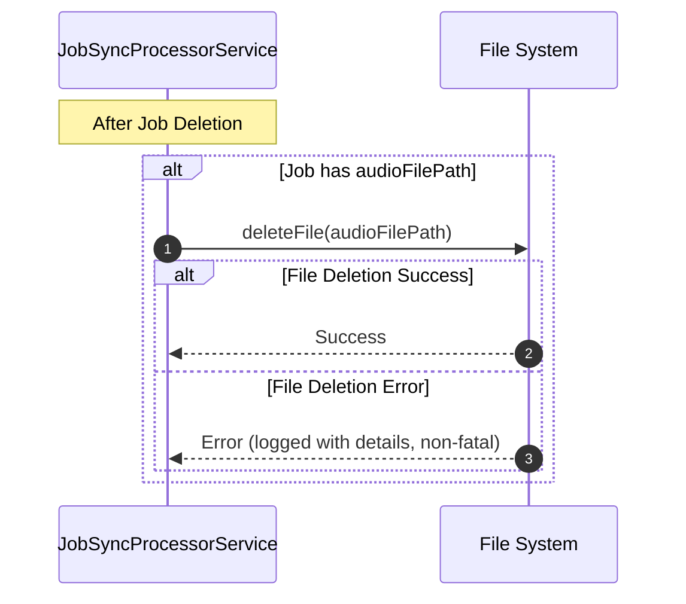
```mermaid
sequenceDiagram
    autonumber
    participant Processor as JobSyncProcessorService
    participant FileSystem as File System

    Note over Processor: After Job Deletion

    alt Job has audioFilePath
        Processor->>FileSystem: deleteFile(audioFilePath)
        alt File Deletion Success
            FileSystem-->>Processor: Success
        else File Deletion Error
            FileSystem-->>Processor: Error (logged with details, non-fatal)
        end
    end
```

### Manual Reset of Failed Job

This diagram shows the flow initiated by a user to reset a job's status from `failed` back to `pending` for another sync attempt.
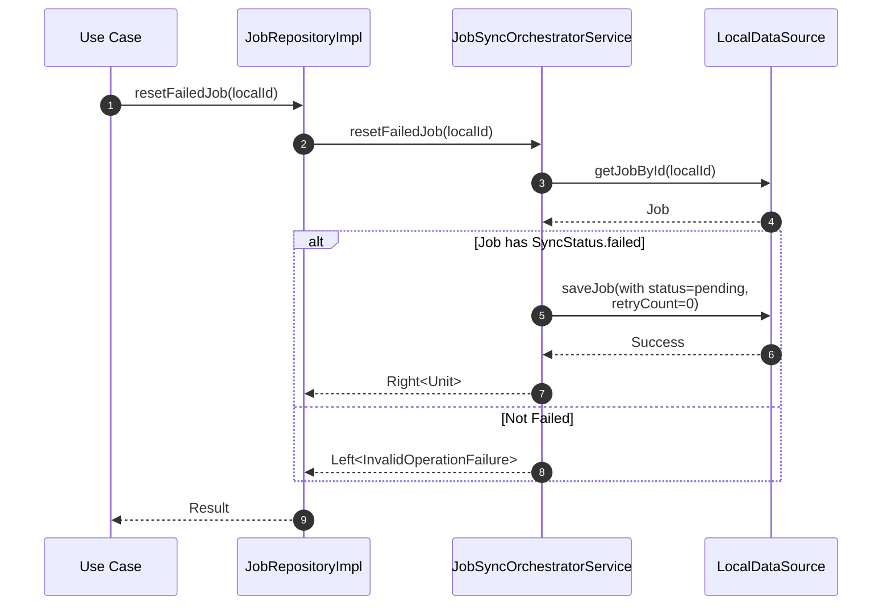
```mermaid
sequenceDiagram
    autonumber
    participant UseCase as Use Case
    participant JobRepo as JobRepositoryImpl
    participant Orchestrator as JobSyncOrchestratorService
    participant LocalDS as LocalDataSource
    
    UseCase->>JobRepo: resetFailedJob(localId)
    JobRepo->>Orchestrator: resetFailedJob(localId)
    Orchestrator->>LocalDS: getJobById(localId)
    LocalDS-->>Orchestrator: Job
    
    alt Job has SyncStatus.failed
        Orchestrator->>LocalDS: saveJob(with status=pending,<br/>retryCount=0)
        LocalDS-->>Orchestrator: Success
        Orchestrator-->>JobRepo: Right<Unit>
    else Not Failed
        Orchestrator-->>JobRepo: Left<InvalidOperationFailure>
    end
    JobRepo-->>UseCase: Result
```

## Local-First Operations Flow

This section illustrates the data flow for creating, updating, and deleting jobs locally before they are synchronized with the backend.

### Job Creation Flow

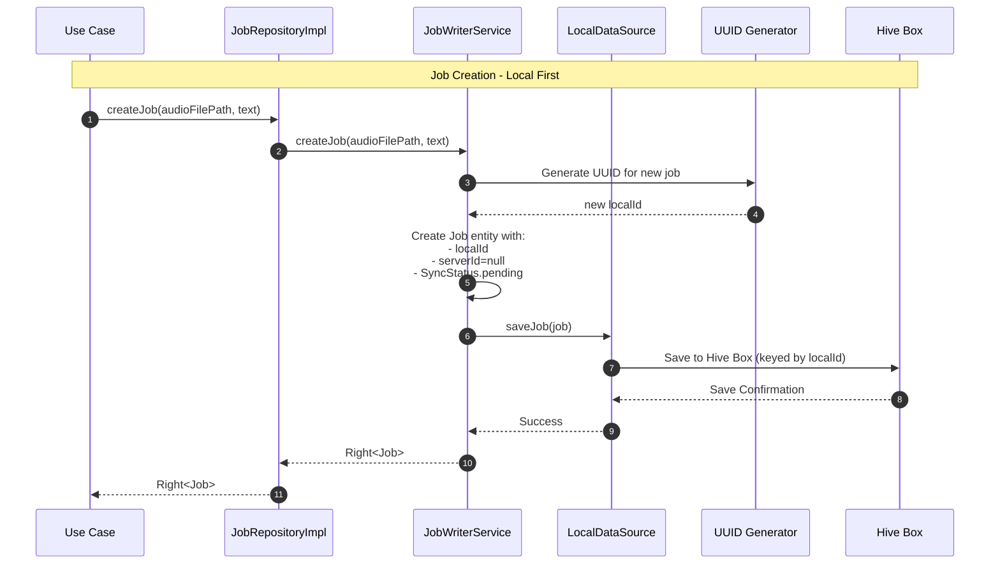
```mermaid
sequenceDiagram
    autonumber
    participant UseCase as Use Case
    participant JobRepo as JobRepositoryImpl
    participant WriterSvc as JobWriterService
    participant LocalDS as LocalDataSource
    participant UUID as UUID Generator
    participant Hive as Hive Box
    
    Note over UseCase, Hive: Job Creation - Local First
    UseCase->>JobRepo: createJob(audioFilePath, text)
    JobRepo->>WriterSvc: createJob(audioFilePath, text)
    WriterSvc->>UUID: Generate UUID for new job
    UUID-->>WriterSvc: new localId
    WriterSvc->>WriterSvc: Create Job entity with:<br/>- localId<br/>- serverId=null<br/>- SyncStatus.pending
    WriterSvc->>LocalDS: saveJob(job)
    LocalDS->>Hive: Save to Hive Box (keyed by localId)
    Hive-->>LocalDS: Save Confirmation
    LocalDS-->>WriterSvc: Success
    WriterSvc-->>JobRepo: Right<Job>
    JobRepo-->>UseCase: Right<Job>
```

### Job Update Flow

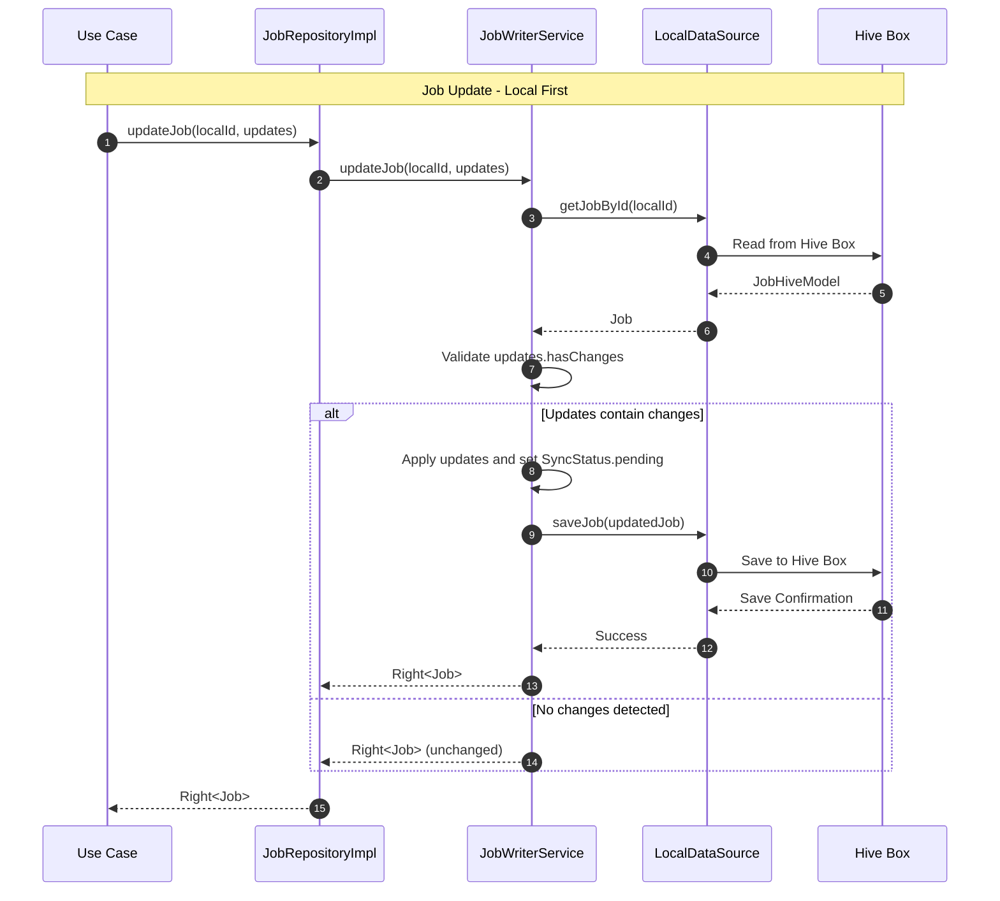
```mermaid
sequenceDiagram
    autonumber
    participant UseCase as Use Case
    participant JobRepo as JobRepositoryImpl
    participant WriterSvc as JobWriterService
    participant LocalDS as LocalDataSource
    participant Hive as Hive Box
    
    Note over UseCase, Hive: Job Update - Local First
    UseCase->>JobRepo: updateJob(localId, updates)
    JobRepo->>WriterSvc: updateJob(localId, updates)
    WriterSvc->>LocalDS: getJobById(localId)
    LocalDS->>Hive: Read from Hive Box
    Hive-->>LocalDS: JobHiveModel
    LocalDS-->>WriterSvc: Job
    
    WriterSvc->>WriterSvc: Validate updates.hasChanges
    
    alt Updates contain changes
        WriterSvc->>WriterSvc: Apply updates and set SyncStatus.pending
        WriterSvc->>LocalDS: saveJob(updatedJob)
        LocalDS->>Hive: Save to Hive Box
        Hive-->>LocalDS: Save Confirmation
        LocalDS-->>WriterSvc: Success
        WriterSvc-->>JobRepo: Right<Job>
    else No changes detected
        WriterSvc-->>JobRepo: Right<Job> (unchanged)
    end
    
    JobRepo-->>UseCase: Right<Job>
```

### Job Deletion Flow

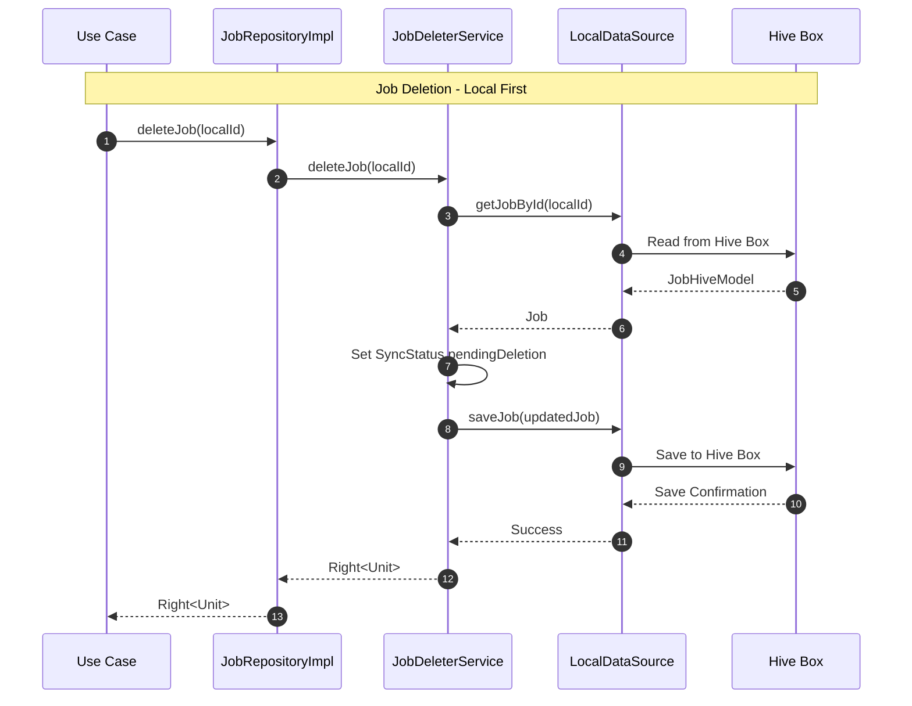
```mermaid
sequenceDiagram
    autonumber
    participant UseCase as Use Case
    participant JobRepo as JobRepositoryImpl
    participant DeleterSvc as JobDeleterService
    participant LocalDS as LocalDataSource
    participant Hive as Hive Box
    
    Note over UseCase, Hive: Job Deletion - Local First
    UseCase->>JobRepo: deleteJob(localId)
    JobRepo->>DeleterSvc: deleteJob(localId)
    DeleterSvc->>LocalDS: getJobById(localId)
    LocalDS->>Hive: Read from Hive Box
    Hive-->>LocalDS: JobHiveModel
    LocalDS-->>DeleterSvc: Job
    
    DeleterSvc->>DeleterSvc: Set SyncStatus.pendingDeletion
    DeleterSvc->>LocalDS: saveJob(updatedJob)
    LocalDS->>Hive: Save to Hive Box
    Hive-->>LocalDS: Save Confirmation
    LocalDS-->>DeleterSvc: Success
    DeleterSvc-->>JobRepo: Right<Unit>
    JobRepo-->>UseCase: Right<Unit>
``` 