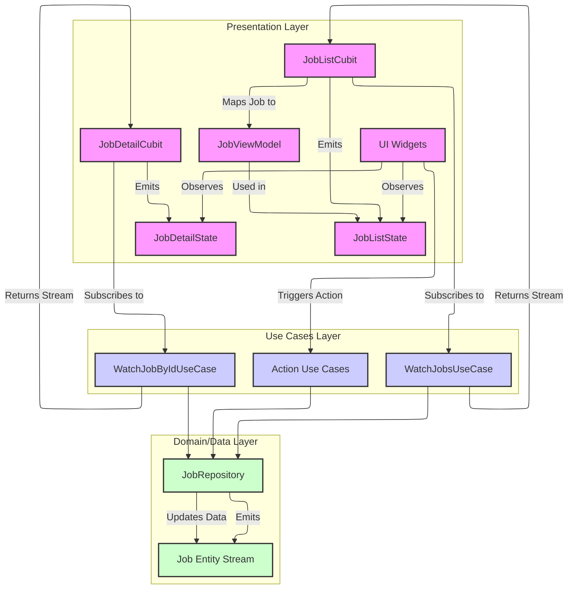

# Job Feature: Presentation Layer Architecture

This document outlines the architecture for the presentation layer of the Job feature, focusing on state management and its interaction with the underlying Use Cases.

## Key Components

- **UI Widgets:** (Not detailed here) Standard Flutter widgets responsible for rendering the job list and job details based on the state provided by the Cubits.
- **Cubits:** Manage the state for specific UI sections.
- **States:** Immutable objects representing the different states the UI can be in (loading, loaded, error, etc.).
- **Use Cases:** Provide the data streams or perform actions requested by the Cubits/UI.

## State Management Flow

The presentation layer leverages Cubits (`bloc` library) to manage state reactively.

### 1. Job List (`JobListCubit`)

- **Purpose:** Manages the state for the main job list view.
- **Dependencies:** `WatchJobsUseCase`.
- **Functionality:**
    - Subscribes to the `Stream<List<Job>>` provided by `WatchJobsUseCase` upon initialization.
    - Listens for updates to the job list (creations, updates, deletions, sync status changes).
    - Maps the incoming `List<Job>` (or errors) to `JobListState` instances.
    - Emits states like `JobListLoading`, `JobListLoaded(List<JobViewModel>)`, `JobListError`.
- **ViewModel:** Uses a `JobViewModel` (potentially created via a mapper) to prepare job data specifically for UI display (e.g., formatted dates, status text, derived properties like `hasPendingFileDeletionIssue`).

### 2. Job Detail (`JobDetailCubit`)

- **Purpose:** Manages the state for a single job detail view.
- **Dependencies:** `WatchJobByIdUseCase`.
- **Initialization:** Requires the `localId` of the job to observe (passed via `@factoryParam`).
- **Functionality:**
    - Subscribes to the `Stream<Job?>` provided by `WatchJobByIdUseCase` using the initial `jobId`.
    - Listens for updates to the specific job.
    - Maps the incoming `Job?` (or errors) to `JobDetailState` instances. Note: The `JobDetailLoaded` state currently contains the raw `Job` entity, not a mapped `JobViewModel`.
    - Emits states like `JobDetailLoading`, `JobDetailLoaded(Job)`, `JobDetailNotFound`, `JobDetailError`.

## Interaction with Use Cases

- **Reactive Data:** The Cubits primarily rely on the `Watch...` use cases (`StreamUseCase`) to get notified of data changes originating from the data layer (e.g., local Hive changes, sync updates).
- **Actions:** User actions initiated from the UI (e.g., create, update, delete, reset failed job) typically trigger calls to the corresponding single-action Use Cases (e.g., `CreateJobUseCase`, `DeleteJobUseCase`). These actions modify the data layer, which in turn causes the `Watch...` use cases to emit updates, closing the reactive loop and updating the UI via the Cubits.
- **Authentication Context:** User context (like User ID or the User entity) is **never** passed down from the UI layer. The data layer (specifically, services like `JobWriterService` or the `JobRepository`) obtains the necessary authenticated user information by interacting with the `AuthService` or potentially observing the application's central `AuthNotifier` / `AuthState`. Alternatively, if only the ID is needed and stored securely, the `AuthCredentialsProvider` might be queried directly. This ensures the UI/Presentation layer remains decoupled from authentication details.

## Job Creation Flow

When a user creates a new job, the flow is:

1.  **UI** initiates job creation with content parameters only (no user ID).
2.  **CreateJobUseCase** passes parameters to the `JobRepository`.
3.  **JobRepository** delegates to relevant services (e.g., `JobWriterService`).
4.  **JobWriterService** (or `JobRepository`) obtains the current authenticated user's context (e.g., User ID) from the central authentication system (`AuthService`, `AuthNotifier`, or `AuthCredentialsProvider` as appropriate).
5.  Service creates the job entity, associating it with the obtained user context.
6.  Creation is persisted, triggering updates through the reactive stream via `WatchJobsUseCase`, ultimately updating the UI.

## Handling File System Issues (Example)

This architecture supports notifying the UI about issues like failed audio deletions:

1.  The `Job` entity contains `failedAudioDeletionAttempts > 0`.
2.  The `WatchJobsUseCase` / `WatchJobByIdUseCase` streams emit updated `Job` objects when this counter changes.
3.  The `JobListCubit` / `JobDetailCubit` receive the updated `Job`.
4.  For the list view, the mapper creating the `JobViewModel` includes logic to expose a flag like `viewModel.hasFileDeletionIssue` based on the counter.
5.  The `JobListCubit` emits a new `JobListLoaded` state containing the updated `JobViewModel`. The `JobDetailCubit` emits a `JobDetailLoaded` state containing the updated raw `Job` entity.
6.  The UI rebuilds and can display an indicator based on `viewModel.hasFileDeletionIssue` (in the list view) or by accessing the corresponding property directly from the `Job` entity (in the detail view). 