FIRST ORDER OF BUSINESS:
**READ THIS FIRST, MOTHERFUCKER, AND CONFIRM:**[hard-bob-workflow.mdc](../../../.cursor/rules/hard-bob-workflow.mdc)

# TODO: Implement Offline User Profile Caching

**Goal:** Refactor the authentication flow to cache the user profile, allowing users to remain logged in (in an offline state) if the profile fetch fails after a successful token exchange, instead of being kicked back to the login screen.

## Target Flow

```mermaid
%%{init: {'flowchart': {'defaultRenderer': 'elk'}}}%%
graph TD
    Start((App Launch)) --> CheckAuth{Initial Auth Check}

    CheckAuth -- Authenticated --> NavigateHomeInitial[Navigate to HomeScreen]
    NavigateHomeInitial --> ShowHomeOnlineInitial[HomeScreen: Show Online UI]
    ShowHomeOnlineInitial --> EndFlow((Authenticated Session))

    CheckAuth -- Needs Login --> ShowLogin[Show LoginScreen]

    ShowLogin --> UserAction{User Taps Login}
    UserAction --> SetLoadingState[AuthNotifier: Set Loading]
    SetLoadingState --> ShowLoadingUI[LoginScreen: Show Loading]
    ShowLoadingUI --> CallLogin{AuthNotifier: Call login}

    CallLogin -- Login API Fails --> SetLoginErrorState[AuthNotifier: Set Error&#40;Login Failed&#41;]
    SetLoginErrorState --> ShowLoginErrorUI[LoginScreen: Show Error]
    ShowLoginErrorUI --> ShowLogin

    CallLogin -- Login API OK --> CallProfile{AuthNotifier: Call getProfile}

    CallProfile -- Profile API OK --> SetOnlineState[AuthNotifier: Set Auth&#40;Online&#41;]
    SetOnlineState --> NavigateHome[Navigate to HomeScreen]
    NavigateHome --> ShowHomeOnline[HomeScreen: Show Online UI]
    ShowHomeOnline --> EndFlow

    CallProfile -- Profile API Fails --> NetworkError{Failure due to Network/Offline?}

    NetworkError -- Yes --> SetOfflineState[AuthNotifier: Set Auth&#40;Offline&#41;]
    SetOfflineState --> NavigateHomeOffline[Navigate to HomeScreen]
    NavigateHomeOffline --> ShowHomeOffline[HomeScreen: Show Offline UI]
    ShowHomeOffline --> EndFlow

    NetworkError -- No --> SetProfileErrorState[AuthNotifier: Set Error&#40;Profile Failed&#41;]
    SetProfileErrorState --> ShowProfileErrorUI[LoginScreen: Show Error]
    ShowProfileErrorUI --> ShowLogin
```



## Sequence Diagram with Offline Caching

```mermaid
sequenceDiagram
    participant UI as UI
    participant AuthNotifier as AuthNotifier
    participant AuthService as AuthService
    participant ProfileCache as UserProfileCache
    participant CredProvider as CredentialsProvider
    participant ApiClient as ApiClient
    participant API as API

    %% Successful Login with Cache
    Note over UI,API: Successful Login (Online)
    UI->>AuthNotifier: login(email, password)
    AuthNotifier->>AuthService: login(email, password)
    AuthService->>ApiClient: login(email, password)
    ApiClient->>API: POST /api/v1/auth/login
    API-->>ApiClient: {access_token, refresh_token, user_id}
    ApiClient-->>AuthService: AuthResponse
    AuthService->>CredProvider: setTokens(access_token, refresh_token)
    AuthService-->>AuthNotifier: Successful login
    AuthNotifier->>AuthService: getUserProfile(acceptOfflineProfile=true)
    AuthService->>ApiClient: getUserProfile()
    ApiClient->>API: GET /api/v1/users/profile
    API-->>ApiClient: {id, name, email, ...}
    ApiClient-->>AuthService: UserProfileDto
    AuthService->>ProfileCache: saveProfile(userProfileDto, timestamp)
    ProfileCache-->>AuthService: Profile stored
    AuthService-->>AuthNotifier: User entity
    AuthNotifier->>UI: Update state(authenticated, online)
    
    %% Login With Profile Fetch Failure
    Note over UI,API: Profile Fetch Fails (Offline)
    UI->>AuthNotifier: login(email, password)
    AuthNotifier->>AuthService: login(email, password)
    AuthService->>ApiClient: login(email, password)
    ApiClient->>API: POST /api/v1/auth/login
    API-->>ApiClient: {access_token, refresh_token, user_id}
    ApiClient-->>AuthService: AuthResponse
    AuthService->>CredProvider: setTokens(access_token, refresh_token)
    AuthService-->>AuthNotifier: Successful login
    AuthNotifier->>AuthService: getUserProfile(acceptOfflineProfile=true)
    AuthService->>ApiClient: getUserProfile()
    ApiClient--x API: Network error/offline
    ApiClient-->>AuthService: AuthException.offlineOperation
    AuthService->>CredProvider: isAccessTokenValid()
    CredProvider-->>AuthService: true
    AuthService->>CredProvider: isRefreshTokenValid()
    CredProvider-->>AuthService: true
    AuthService->>ProfileCache: getProfile(userId)
    ProfileCache-->>AuthService: UserProfileDto from cache
    AuthService-->>AuthNotifier: User entity (from cached profile)
    AuthNotifier->>UI: Update state(authenticated, offline)
    
    %% App Restart With Cached Profile
    Note over UI,API: App Restart (With Cache)
    UI->>AuthNotifier: App starts, check auth
    AuthNotifier->>AuthService: isAuthenticated()
    AuthService->>CredProvider: getAccessToken()
    CredProvider-->>AuthService: [valid token]
    AuthService-->>AuthNotifier: true (authenticated)
    AuthNotifier->>AuthService: getUserProfile(acceptOfflineProfile=true)
    AuthService->>ApiClient: getUserProfile()
    ApiClient--x API: Network error/offline
    ApiClient-->>AuthService: AuthException.offlineOperation
    AuthService->>CredProvider: isAccessTokenValid()
    CredProvider-->>AuthService: true
    AuthService->>CredProvider: isRefreshTokenValid()
    CredProvider-->>AuthService: true
    AuthService->>ProfileCache: getProfile(userId)
    ProfileCache->>ProfileCache: Check if profile is stale (time-based)
    ProfileCache-->>AuthService: [cached user profile]
    AuthService-->>AuthNotifier: User entity
    AuthNotifier->>UI: Update state(authenticated, offline)
    
    %% Cache Expiry Handling
    Note over UI,API: Token Expiry (Both Expired)
    UI->>AuthNotifier: App starts, check auth
    AuthNotifier->>AuthService: isAuthenticated()
    AuthService->>CredProvider: getAccessToken()
    CredProvider-->>AuthService: [expired token]
    AuthService-->>AuthNotifier: false (token expired)
    AuthNotifier->>UI: Update state(unauthenticated)
    
    %% Tokens Invalid But Cache Available
    Note over UI,API: Profile Fetch With Stale Tokens
    UI->>AuthNotifier: Some action needing profile
    AuthNotifier->>AuthService: getUserProfile(acceptOfflineProfile=true)
    AuthService->>ApiClient: getUserProfile()
    ApiClient--x API: Network error/offline
    ApiClient-->>AuthService: AuthException.offlineOperation
    AuthService->>CredProvider: isAccessTokenValid()
    CredProvider-->>AuthService: false
    AuthService->>CredProvider: isRefreshTokenValid()
    CredProvider-->>AuthService: false
    AuthService->>ProfileCache: clearProfile(userId)
    ProfileCache-->>AuthService: Cache cleared
    AuthService-->>AuthNotifier: AuthException.unauthenticated
    AuthNotifier->>UI: Update state(unauthenticated)
    
    %% Online to Offline Transition
    Note over UI,API: Online to Offline Transition
    UI->>AuthNotifier: User in authenticated state (online)
    Note over API: Network becomes unavailable
    UI->>AuthNotifier: User action requiring network
    AuthNotifier->>AuthService: Some authenticated action
    AuthService-->>AuthNotifier: AuthException.offlineOperation
    AuthNotifier->>AuthNotifier: Update state(authenticated, offline)
    AuthNotifier->>UI: Update UI to show offline indicator
```



---

## Cycle 0: Add shared_preferences and Evaluate User Entity

* 0.1. [X] **Add Dependency:** Add `shared_preferences` to pubspec.yaml and run `flutter pub get`.
    * Command: `flutter pub add shared_preferences`
    * Findings: Dependency added successfully.
* 0.2. [X] **User Entity Evaluation:** Examine the current `User` entity and determine what we can cache meaningfully.
    * Check: `UserProfileDto` in `lib/core/user/infrastructure/dtos/user_profile_dto.dart`
    * Check: Actual API response from `/api/v1/users/profile` endpoint during debugging
    * Options:
        * Option A: Expand the `User` entity to include more fields
        * Option B: Keep the `User` entity minimal, but enhance the cache to store a serialized `UserProfileDto` and convert to `User` when needed
    * Findings: `User` entity (`lib/core/auth/entities/user.dart`) contains only `id`. `UserProfileDto` (`lib/core/user/infrastructure/dtos/user_profile_dto.dart`) contains `id`, `email`, `name`, `settings`.
* 0.3. [X] **Update Plan:** Decide between Option A or B based on findings.
    * Option Selected: **Option B - Store serialized UserProfileDto in cache** 
    * Justification: This maintains proper separation of domain and data concerns. The `User` entity remains a clean domain object while we gain the flexibility to cache all profile data without bloating the domain model.

---

## Cycle 1: Define Cache Interface & Implement User Serialization

* 1.1. [X] **Define Interface:** Create the `IUserProfileCache` interface in the domain layer (`lib/core/auth/domain/repositories`) with methods:
   * `Future<void> saveProfile(UserProfileDto profileDto, DateTime timestamp)` - Added timestamp parameter
   * `Future<UserProfileDto?> getProfile(String userId)` 
   * `Future<void> clearProfile(String userId)` 
   * `Future<void> clearAllProfiles()`
   * `Future<bool> isProfileStale(String userId, {required bool isAccessTokenValid, required bool isRefreshTokenValid, Duration? maxAge})` - Added maxAge parameter
   * Findings: Interface `lib/core/auth/domain/repositories/i_user_profile_cache.dart` created successfully.
* 1.2. [X] **Implement User Serialization:** Update the caching mechanism to handle serialization of `UserProfileDto` with timestamp information.
   * Findings: `UserProfileDto` already uses `json_serializable` and supports `fromJson`/`toJson`. No changes needed for serialization itself.
* 1.3. [X] **Initial Test Setup:** Add basic test file for the future implementation.
   * Findings: Placeholder test file `test/core/auth/data/repositories/shared_preferences_user_profile_cache_test.dart` created.
* 1.4. [ ] **Run Tests:** Execute relevant tests.
   * Findings: No specific cache tests implemented yet to run.
* 1.5. [ ] **Handover Brief:**
   * Status: Interface defined, User serialization confirmed, placeholder test file created.
   * Gotchas: None.
   * Recommendations: Proceed to Cycle 2 for implementation and actual testing.

---

## Cycle 2: Implement SharedPreferences Cache (Data Layer)

* 2.1. [X] **Write Tests (RED):** Create `shared_preferences_user_profile_cache_test.dart`. Write tests covering `saveProfile`, `getProfile` (found/not found), `clearProfile`, `clearAllProfiles`, and `isProfileStale` using mock `SharedPreferences`. Ensure tests fail.
   * Test time-based expiry with the `maxAge` parameter
   * Test combined token validity and time-based staleness checks
   * Findings: Tests written, mock generation done. Initial run failed as expected due to missing implementation and logger issues.
* 2.2. [X] **Implement Cache (GREEN):** Create `SharedPreferencesUserProfileCache` in the data layer (`lib/core/auth/data/repositories`) implementing `IUserProfileCache`.
   * Key features:
     * Use prefix like `cached_profile_${userId}` for profile keys
     * Store profiles with:
       * Full serialized `UserProfileDto` JSON 
       * `lastUpdated` timestamp for expiry checks
     * Implement `isProfileStale()` to check:
       * Token validity (both access and refresh)
       * Optional time-based expiry via `maxAge` parameter
   * Findings: Implementation created in `lib/core/auth/data/repositories/shared_preferences_user_profile_cache.dart`.
* 2.3. [X] **Refactor:** Clean up the implementation and tests.
   * Findings: Fixed logger initialization issues in tests. Removed one fragile test case for `isProfileStale` checking exactly `maxAge` due to microsecond timing variations.
* 2.4. [X] **Run Tests:** Execute tests for the cache implementation.
   * Findings: All 14 tests in `shared_preferences_user_profile_cache_test.dart` pass.
* 2.5. [X] **Handover Brief:**
   * Status: Cache implementation complete and unit-tested.
   * Gotchas: Initial logger setup in tests was incorrect. `isProfileStale` test for exact `maxAge` boundary was fragile and removed; adjacent boundary tests cover the logic sufficiently.
   * Recommendations: Ready for integration into `AuthService` in Cycle 3.

---

## Cycle 3: Integrate Cache into AuthService (Data Layer)

* 3.1. [ ] **Research:** Examine `AuthServiceImpl` (`lib/core/auth/data/auth_service_impl.dart`). Identify precisely where `getUserProfile` is called internally.
   * Findings:
* 3.2. [ ] **Update AuthService Interface:** Add a parameter to the `getUserProfile` method to indicate if cached profiles are acceptable when offline.
   * `Future<User> getUserProfile({bool acceptOfflineProfile = true});` - Renamed for clarity
   * Findings:
* 3.3. [ ] **Inject Dependency:** Update DI setup in `lib/core/auth/infrastructure/auth_module.dart`:
   * First register `SharedPreferences` in core module (if not already there)
   * Then register `IUserProfileCache` implementation 
   * Update `AuthServiceImpl` registration to inject cache dependency
   * Findings:
* 3.4. [ ] **Write/Update Tests (RED):** Update `auth_service_impl_test.dart`. Add/modify tests for:
   * Successful profile fetch saves to cache with current timestamp
   * Profile fetch failure (network) retrieves from cache when `acceptOfflineProfile=true`
   * Profile fetch failure (network) propagates error when `acceptOfflineProfile=false`
   * Token expiry clears cache
   * Time-based expiry behavior (profiles older than TTL)
   * `logout` clears the cache
   * Findings:
* 3.5. [ ] **Implement Integration (GREEN):** Modify `AuthServiceImpl`:
   * Add cache dependency via constructor
   * Add cache save after successful profile fetch, including timestamp:
     ```dart
     // Save profile to cache with current timestamp
     await _userProfileCache.saveProfile(profileDto, DateTime.now());
     ```
   * Update `getUserProfile` to handle offline profiles internally:
     ```dart
     @override
     Future<User> getUserProfile({bool acceptOfflineProfile = true}) async {
       try {
         // Always try network first
         final profileDto = await _userApiClient.getUserProfile();
         
         // On success, save to cache with current timestamp
         await _userProfileCache.saveProfile(profileDto, DateTime.now());
         
         // Return domain entity from DTO
         return User(id: profileDto.id, /* other properties */);
       } on AuthException catch (e) {
         // Only check cache if network error AND offline profiles are acceptable
         if (e.type == AuthErrorType.offlineOperation && acceptOfflineProfile) {
           final userId = await getCurrentUserId();
           
           // Check token validity
           final accessValid = await _credentialsProvider.isAccessTokenValid();
           final refreshValid = await _credentialsProvider.isRefreshTokenValid();
           
           // If both tokens expired, clear cache and throw
           if (!accessValid && !refreshValid) {
             await _userProfileCache.clearProfile(userId);
             throw AuthException.unauthenticated('Both tokens expired');
           }
           
           // Check for cached profile
           final cachedProfileDto = await _userProfileCache.getProfile(userId);
           if (cachedProfileDto != null) {
             _logger.i('Using cached profile for offline operation');
             // Convert DTO to domain entity
             return User(id: cachedProfileDto.id, /* other properties */);
           }
         }
         
         // Either not a network error, offline profiles not accepted, or no cached profile found
         _logger.w('Failed to fetch profile: ${e.message}');
         throw e; // Rethrow the original exception
       }
     }
     ```
   * Add cache clearing in logout method:
     ```dart
     // In logout method:
     final userId = await getCurrentUserId();
     await _userProfileCache.clearProfile(userId);
     ```
   * Add proper logging with log helpers throughout
   * Findings:
* 3.6. [ ] **Refactor:** Clean up `AuthServiceImpl` and its tests.
   * Findings:
* 3.7. [ ] **Run Tests:** Execute tests for `AuthServiceImpl`.
   * Findings:
* 3.8. [ ] **Handover Brief:**
   * Status: `AuthService` now uses the profile cache.
   * Gotchas: Complexity in error handling? DI issues?
   * Recommendations: Ready to update `AuthNotifier` state logic.

---

## Cycle 4: Update AuthNotifier State Logic (Presentation Layer)

* 4.1. [ ] **Research:** Re-read `AuthNotifier` (`lib/core/auth/presentation/auth_notifier.dart`). Focus on `login` and `_checkAuthStatus` methods' `try/catch` blocks. Also check existing event bus usage.
   * Findings:
* 4.2. [ ] **Write/Update Tests (RED):** Update `auth_notifier_test.dart`. Add/modify tests for scenarios:
   * Login API OK, Profile API Fail (Network): State becomes `authenticated` with `isOffline=true` and cached `user`.
   * Login API OK, Profile API Fail (Other Error): State becomes `error` (unauthenticated).
   * Initial Check OK (cached/live profile): State becomes `authenticated`.
   * Initial Check Fail (Network but cached exists): State becomes `authenticated` with `isOffline=true`.
   * Online → Offline transition: Test that state updates correctly when network becomes unavailable.
   * **NEW:** Test `AuthEvent.onlineRestored` handling: State transitions from `authenticated(isOffline=true)` to `authenticated(isOffline=false)` after event and successful profile re-fetch.
   * **NEW:** Test `AuthEvent.onlineRestored` handling: State remains `authenticated(isOffline=true)` if profile re-fetch fails *again* after the event.
   * Findings:
* 4.3. [ ] **Implement State Logic (GREEN):** Modify `AuthNotifier`'s handling of auth states:
   ```dart
   // ... existing try/catch logic for login/initial check ...
   try {
     // Get profile - AuthService.getUserProfile now handles the "try network, then cache if offline" flow internally
     final userProfile = await _authService.getUserProfile(acceptOfflineProfile: true);

     // Check if the call succeeded but via offline profile
     final isOffline = false; // We need to determine this somehow - see step 4.4 below

     // Update authenticated state with offline flag if needed
     state = AuthState.authenticated(userProfile, isOffline: isOffline);
     _logger.i('$_tag User profile retrieved' + (isOffline ? ' (offline mode)' : ''));

     // **NEW:** Emit onlineRestored event if transitioning from offline to online
     if (_wasPreviouslyOffline && !isOffline) { // Requires tracking previous state
        _authEventBus.fire(AuthEvent.onlineRestored);
     }
     _wasPreviouslyOffline = isOffline; // Update tracking variable

   } on AuthException catch (e) {
     // No need for complex offline retry logic - AuthService already tried that if acceptOfflineProfile=true
     // Just handle the exception appropriately here
     final errorType = AuthErrorMapper.getErrorTypeFromException(e);
     state = AuthState.error(errorType, e.message);
     _logger.w('$_tag Failed to get user profile: ${e.message}');

     // **NEW:** Emit offlineDetected event if transitioning to offline
     if (!_wasPreviouslyOffline && e.type == AuthErrorType.offlineOperation) { // Or based on the result of 4.4
        _authEventBus.fire(AuthEvent.offlineDetected);
        _wasPreviouslyOffline = true; // Update tracking variable
     } else {
       _wasPreviouslyOffline = false; // Reset if error is not offline related
     }
   }
   ```
   * Add a field like `bool _wasPreviouslyOffline = false;` to track state transitions for event firing.
   * Findings:
* 4.4. [ ] **Detect Offline Status:** Implement a way to detect if the profile came from cache (offline mode) vs. network:
   * **Option A (Preferred):** Modify `AuthService.getUserProfile()` to return a tuple/wrapper containing both the User and an `isOffline` flag. Update `AuthServiceImpl` and tests.
   * **Option B:** Add a method like `isNetworkAvailable()` to AuthService or inject a NetworkInfoService.
   * **Option C:** Add a specific exception type that includes information about falling back to cached profile.
   * Implement the selected approach (Option A) and update tests.
   * Findings:
* 4.5. [ ] **Implement Event Subscription (GREEN):**
   * **NEW:** Inject `AuthEventBus` into `AuthNotifier` if not already done.
   * **NEW:** Add `StreamSubscription<AuthEvent>? _authEventSubscription;` field.
   * **NEW:** In `AuthNotifier`'s constructor or an init method, subscribe to the `AuthEventBus`:
     ```dart
     _authEventSubscription = _authEventBus.on<AuthEvent>().listen((event) {
       if (event == AuthEvent.onlineRestored) {
         _logger.i('$_tag Received onlineRestored event, attempting profile refresh.');
         // Re-fetch profile to confirm online status and get fresh data
         // Use a separate internal method to avoid loops/state issues
         _refreshProfileOnConnectivityChange();
       }
       // Optional: Handle offlineDetected if needed for specific UI logic beyond isOffline flag
     });
     ```
   * **NEW:** Implement the `_refreshProfileOnConnectivityChange` method:
     ```dart
     Future<void> _refreshProfileOnConnectivityChange() async {
        // Only attempt refresh if currently authenticated but marked offline
        if (state.status == AuthStatus.authenticated && state.isOffline) {
           try {
              // Attempt to get profile, *requiring* online (acceptOfflineProfile: false)
              // Or use the primary method and check the 'isOffline' flag in the result from 4.4
              final userProfile = await _authService.getUserProfile(acceptOfflineProfile: false); // Or use updated method from 4.4
              state = AuthState.authenticated(userProfile, isOffline: false);
              _logger.i('$_tag Profile refreshed successfully after regaining connectivity.');
              _wasPreviouslyOffline = false; // Update tracking
           } catch (e) {
               // If refresh fails again (e.g., transient network issue), stay offline
               _logger.w('$_tag Profile refresh failed after onlineRestored event: $e. Remaining offline.');
               // State remains authenticated(isOffline=true)
           }
        }
     }
     ```
   * **NEW:** Ensure the subscription is cancelled in the `dispose()` method of the notifier.
   * Findings:
* 4.6. [ ] **Refactor:** Clean up `AuthNotifier` (state logic, event handling, subscription) and its tests.
   * Findings:
* 4.7. [ ] **Run Tests:** Execute tests for `AuthNotifier`, including new event handling tests.
   * Findings:
* 4.8. [ ] **Handover Brief:**
   * Status: `AuthNotifier` now handles offline profiles and reacts to `onlineRestored` events to update UI state.
   * Gotchas: Complexity in state/event interaction? Correct subscription lifecycle?
   * Recommendations: Ready for UI adjustments. Cycle 7 still needed to define/implement the events themselves if not already done.

---

## Cycle 5: UI Adjustments & Testing (Presentation Layer)

* 5.1. [ ] **Research:** Identify screens observing `AuthNotifier` state (likely `LoginScreen`, `HomeScreen`, and the initial routing logic in `main.dart`).
   * Findings:
* 5.2. [ ] **Write/Update Tests (RED):** Add/modify widget/integration tests for offline states.
   * Findings:
* 5.3. [ ] **Implement UI Changes (GREEN):** Modify UI widgets to handle offline states:
   * Add explicit offline indicator banner on authenticated screens:
     * Red banner at top of screen with "OFFLINE MODE" text
     * Icon showing disconnected network
     * Banner only appears when `authState.isOffline == true`
   * Update `HomeScreen` to show appropriate offline UI variants:
     * Disable network-dependent actions 
     * Show cached data with "offline" label
   * Ensure routing logic directs to `HomeScreen` when `state.status == AuthStatus.authenticated`, regardless of `isOffline`
   * Findings:
* 5.4. [ ] **Refactor:** Clean up UI code and tests.
   * Findings:
* 5.5. [ ] **Manual Testing:** Perform manual tests for the key scenarios:
   * Login online → success → force offline → restart app → check state/UI
   * Login online → success → trigger action needing profile → check state/UI
   * Start app offline → login → check state/UI
   * Online → Offline transition: Test UI update when network becomes unavailable
   * Offline → Online transition: Test UI update when network is restored
   * Findings:
* 5.6. [ ] **Run Tests:** Execute relevant widget/integration tests.
   * Findings:
* 5.7. [ ] **Handover Brief:**
   * Status: UI correctly handles authenticated offline state.
   * Gotchas: Routing complexity? Offline indicator display issues?
   * Recommendations: Ready for final cleanup and broader testing.

---

## Cycle 6: Final Integration Testing & Cleanup

* 6.1. [ ] **Run Lint & Format:** Run `dart analyze` and `./scripts/format.sh`. Fix any reported issues.
   * Findings:
* 6.2. [ ] **Run All Tests:** Execute *all* tests. `./scripts/list_failed_tests.dart`
   * Findings:
* 6.3. [ ] **Code Review:** Thoroughly review all staged changes (`git diff --staged | cat`). Check architecture, naming, logic.
   * Findings:
* 6.4. [ ] **Update Docs:** Update `feature-auth-architecture.md` to reflect the new caching mechanism.
   * Add section about UserProfileCache and its role in offline authentication
   * Update sequence diagram to show offline profile fetch from cache
   * Add section documenting the offline UI indicators
   * Findings:
* 6.5. [ ] **Additional Documentation Updates:**
   * [ ] Update `architecture-overview.md` to mention the offline profile caching capability
   * [ ] Update `feature-auth-testing.md` to include testing strategies for offline profile scenarios
   * [ ] Update `feature-job-dataflow.md` to reference how the offline authentication enhancement benefits job operations
   * [ ] Create a standalone `offline-authentication.md` documentation file with comprehensive guidance on working with offline capabilities
   * Findings:
* 6.6. [ ] **Run Tests:** Final check. `./scripts/list_failed_tests.dart`
   * Findings:
* 6.7. [ ] **Handover Brief:**
   * Status: Feature complete, tested, documented.
   * Gotchas: Any lingering concerns or edge cases found?
   * Recommendations: Ready for merge. Consider future enhancements like user-initiated refresh button for forcing online check.

---

## Cycle 7: Implement AuthEventBus Offline Detection Events (TDD)

* 7.1. [ ] **Research:** Review the existing `AuthEventBus` implementation and usage patterns.
   * Check: `lib/core/auth/events/auth_event_bus.dart` and `lib/core/auth/events/auth_events.dart`
   * Find all current subscribers and emitters of auth events
   * Findings:

* 7.2. [ ] **Write Tests (RED):** Create failing tests for the new events:
   * Update `auth_events_test.dart` to include new enum values
   * Update `auth_notifier_test.dart` to test event emission:
     * Test that `AuthEvent.offlineDetected` is emitted when network errors occur
     * Test that `AuthEvent.onlineRestored` is emitted when connection is restored
   * Create a mock event subscriber to verify events are received
   * Run tests and confirm they fail (RED phase)
   * Findings:

* 7.3. [ ] **Implement Events (GREEN):** Update code to make tests pass:
   * Update `auth_events.dart` with new event types:
     ```dart
     enum AuthEvent {
       loggedIn,
       loggedOut,
       offlineDetected,  // New: emitted when offline mode is detected
       onlineRestored,   // New: emitted when online mode is restored
     }
     ```
   * Modify `AuthNotifier` to emit the new events at appropriate points: (Already covered in Cycle 4.3)
   * Run tests to confirm they now pass (GREEN phase)
   * Findings:

* 7.4. [ ] **Refactor Implementation:** Clean up the implementation:
   * Extract common offline detection logic into a helper method
   * Add proper logging with log helpers
   * Ensure consistent coding patterns with existing code
   * Run tests again to verify refactoring didn't break functionality
   * Findings:

* 7.5. [ ] **Documentation:**
   * Update `feature-auth-architecture.md` to document the new events:
     * Document the new event types and their purpose
     * Document when each event is triggered
     * Provide general guidance on subscribing to events
   * Findings:

* 7.6. [ ] **Run Tests:** Run auth module tests to ensure everything works together.
   * Findings:

* 7.7. [ ] **Handover Brief:**
   * Status: AuthEventBus enhanced with offline detection events following TDD
   * Gotchas: Any subtle timing issues with event emission?
   * Recommendations: Ready for integration with job features in Cycle 8.

---

## Cycle 8: Job Feature Integration with Offline Events (TDD)

* 8.1. [ ] **Research:** Analyze the `JobSyncOrchestratorService` for integration points.
   * Find existing network connectivity checks
   * Identify where to add event subscription logic
   * Findings:

* 8.2. [ ] **Integration Tests (RED):** Write failing tests for integration with Job feature:
   * Create/update `job_sync_orchestrator_test.dart`:
     * Test that orchestrator subscribes to the event bus correctly
     * Test reaction to `AuthEvent.offlineDetected` (should pause sync attempts)
     * Test reaction to `AuthEvent.onlineRestored` (should trigger sync)
   * Test proper cleanup of event subscriptions on dispose
   * Run tests and confirm they fail
   * Findings:

* 8.3. [ ] **Integration Implementation (GREEN):** Add code to make integration tests pass:
   * Update `JobSyncOrchestratorService`:
     * Add field for event subscription: `StreamSubscription<AuthEvent>? _authEventSubscription;`
     * Add subscription to auth events in constructor or init method
     * Implement handling of `offlineDetected` event (pause sync)
     * Implement handling of `onlineRestored` event (trigger sync)
     * Ensure subscription is canceled on dispose
   * Run tests to confirm they now pass
   * Findings:

* 8.4. [ ] **Integration Refactor:** Clean up and optimize integration:
   * Extract event handling logic into separate methods
   * Add comprehensive logging for offline/online transitions
   * Ensure clean cancellation of subscriptions
   * Run tests to verify refactoring didn't break functionality
   * Findings:

* 8.5. [ ] **Documentation:**
   * Update `feature-job-dataflow.md` to document auth event integration:
     * Add new section explaining how the job feature responds to auth events
     * Document the offline detection mechanism
     * Explain how job synchronization handles network transitions
   * Add usage examples for other components that might need similar integration
   * Findings:

* 8.6. [ ] **Run All Tests:** Execute integration tests and full test suite.
   * Findings:

* 8.7. [ ] **Manual Testing:** Test actual behavior on device/emulator:
   * Test offline behavior with real network disconnection
   * Test transition from offline to online
   * Test transition from online to offline
   * Findings:

* 8.8. [ ] **Handover Brief:**
   * Status: Job Feature now properly integrated with auth events
   * Gotchas: Any unexpected interactions between auth and job components?
   * Recommendations: Consider adding a dedicated connectivity service for more fine-grained control in the future.

---

## Cycle 9: Final Full-Feature Integration & Testing

* 9.1. [ ] **Run Lint & Format:** Run `dart analyze` and `./scripts/format.sh` on all modified files.
   * Findings:

* 9.2. [ ] **Run All Tests:** Execute *all* tests with `./scripts/list_failed_tests.dart`
   * Test both profile caching and event bus features together
   * Ensure all integration points work correctly
   * Findings:

* 9.3. [ ] **Cross-Feature Testing:** Specifically test interactions between profile caching and offline events:
   * Test offline profile cache retrieval + event emission
   * Test event subscribers responding during offline authentication
   * Test transitions between online/offline with cached profiles
   * Findings:

* 9.4. [ ] **Code Review:** Thoroughly review all staged changes (`git diff --staged | cat`):
   * Verify architecture alignment across both features
   * Check naming consistency between profile caching and event bus code
   * Ensure error handling is consistent 
   * Findings:

* 9.5. [ ] **Documentation Completeness:** Verify all documentation has been updated:
   * `feature-auth-architecture.md` - Both profile caching and event bus documented
   * `architecture-overview.md` - Offline capabilities referenced
   * `feature-auth-testing.md` - Testing strategies for both features
   * `feature-job-dataflow.md` - Integration with auth events documented
   * `offline-authentication.md` (if created) - Comprehensive documentation
   * Findings:

* 9.6. [ ] **Manual Full-Flow Testing:** Test complete end-to-end scenarios:
   * Login → Force offline → Verify cached profile used + offline events emitted
   * Start offline → Attempt login → Verify appropriate failure handling
   * Offline → Online transition → Verify proper state recovery
   * Verify Job feature responds correctly to all auth states and transitions
   * Findings:

* 9.7. [ ] **Performance Review:** Check for any performance implications:
   * Verify event listeners don't introduce unnecessary overhead
   * Check cache operations for efficiency
   * Ensure no memory leaks from event subscriptions
   * Findings:

* 9.8. [ ] **Handover Brief:**
   * Status: Full feature integration complete - offline profile caching + event bus
   * Gotchas: Any edge cases or interactions discovered during final testing?
   * Recommendations: Consider extracting common network detection into a dedicated service for reuse in future features. 