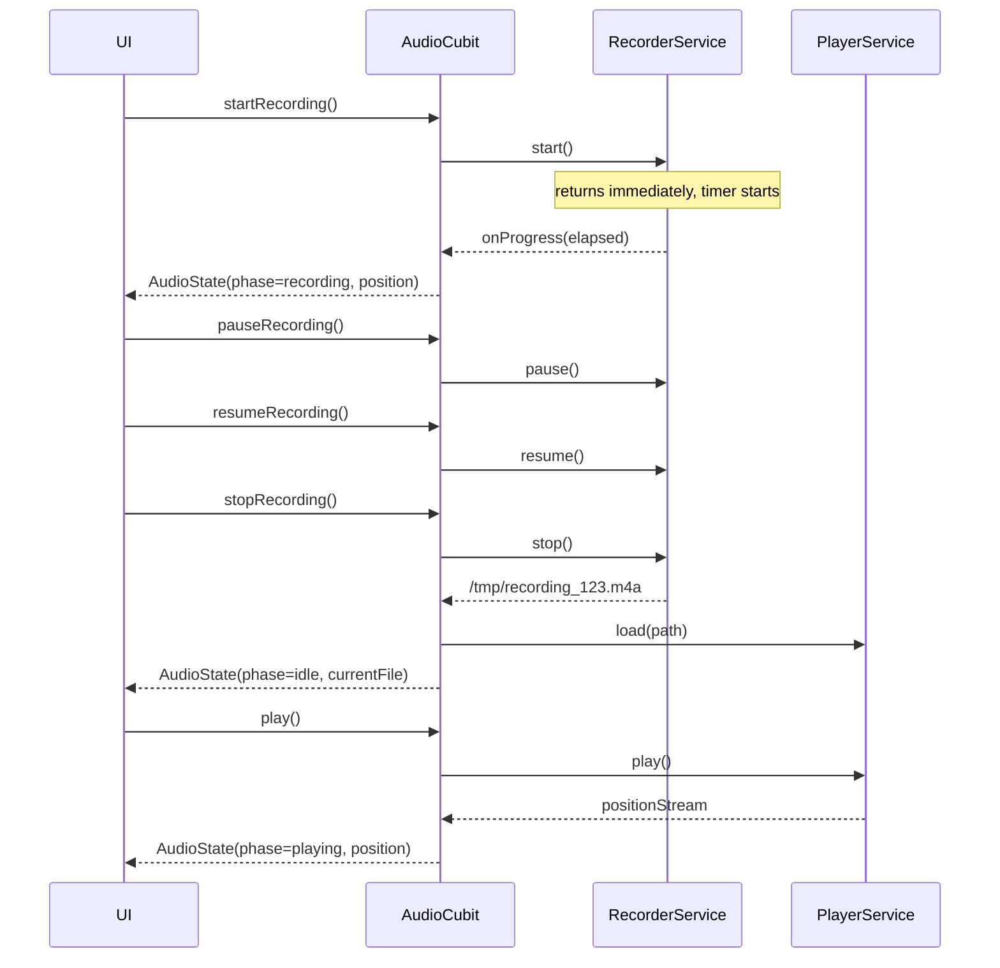

FIRST ORDER OF BUSINESS:
**READ THIS FIRST, MOTHERFUCKER, AND CONFIRM:** [hard-bob-workflow.mdc](../../../.cursor/rules/hard-bob-workflow.mdc)

# TODO: Audio Recorder & Player Feature

**Goal:** Enable in-app audio recording and immediate playback. From the Job List Playground, tapping the BIG RED record button opens a bottom-sheet "Recorder Modal Playground". The modal provides:
* Central Record button (● REC → ‖ PAUSE → ● RESUME).
* Stop button (■) appears only **after** the first recording start.
* After stop, a slick reusable `AudioPlayerWidget` appears: Play/Pause toggle, seek slider with live position updates and drag-to-seek.
* Recorded file path is returned to calling UI for later job creation.
* Uses `record` (recording) + `just_audio` (playback) behind our `AudioFacade` (RecorderService + PlayerService + AudioCubit) to avoid "stream hell".
* Components & state management are fully unit/integration tested; UI in Playground gets pragmatic widget tests.
* **File-Path Discipline**: `record` gives an **absolute** path. Convert it to a **relative** path inside the app-docs directory **before** passing it to `CreateJobParams` so that `FileSystem.resolvePath()` doesn't nuke you for path traversal.
* **Stream Hygiene**: Every outgoing stream **must** use `.distinct()`; apply exactly **one** `.debounceTime()` – inside the Cubit when you merge streams. Zero double-debounce bullshit.
* **Throttle Cadence**: Recorder emits every **250 ms**; Player streams throttle to **200 ms** – aligns with the `architecture-audio-reactive-guide.md` commandments.
* **iOS Pause Quirk**: On iOS < 13 the `record` plugin silently no-ops on `pause()`. RecorderService must emit a consistent *paused* state manually.
* **Facade Optionality**: If `AudioCubit` ends up being a thin façade, we'll delete `audio_facade.dart` in Cycle 3. Simplicity over dogma.

---

## Target Flow / Architecture (Optional but Recommended)

```mermaid
graph TD
    UI[JobList Playground / Recorder Modal] -->|tap record| AudioCubit
    AudioCubit --> RecorderSvc[AudioRecorderService (record pkg)]
    AudioCubit --> PlayerSvc[AudioPlayerService (just_audio)]
    RecorderSvc -->|file path| AudioCubit
    PlayerSvc -->|position / duration streams (throttled)| AudioCubit
    AudioCubit -->|AudioState stream| UI
```



---

**MANDATORY REPORTING RULE:** For **every** task/cycle below, **before check-off and moving on to the next todo**, the dev must (a) write a brief *Findings* paragraph summarizing *what was done and observed* and (b) a *Handover Brief* summarising status at the end of the cycle, edge-cases/gotchas, and next-step readiness **inside this doc** before ticking the checkbox. No silent check-offs allowed – uncertainty gets you fucking fired. Like Mafee forgetting the shorts, don't be that guy.

---

## Cycle 0: Setup & Prerequisite Checks (If Applicable)

**Goal** Add required dependencies, verify platform setup, and lay down skeleton interfaces so that the project compiles and tests run green.

**MANDATORY REPORTING RULE:** After *each sub-task* below and *before* ticking its checkbox, you **MUST** add a **Findings** note *and* a **Handover Brief**. No silent check-offs. Uncertainty will get you fucking fired.

**APPLY MODEL ATTENTION**: The apply model is a bit tricky to work with! For large files, edits can take up to 20s; so you might need to double check if you don't get an affirmative answer right away. Go in smaller edits.

* 0.1. [x] **Task:** Add dependencies `record`, `just_audio`, `audio_session`
    * Action: `flutter pub add record just_audio audio_session`
    * Note: **Do _NOT_** add `just_audio_background` yet – keep the dep tree lean until background playback is a real requirement.
    * Findings: Successfully added all three dependencies. No conflicts detected with existing packages. These packages brought in several platform-specific implementations (Android, iOS, web, etc.) which should handle cross-platform compatibility well.
* 0.2. [x] **Task:** Create abstract interfaces
    * Files: `lib/core/audio/audio_recorder_service.dart`, `lib/core/audio/audio_player_service.dart`, `lib/core/audio/audio_facade.dart`
    * Action: add minimal method signatures + TODO comments
    * Findings: Created all three interfaces with comprehensive method signatures and documentation. AudioRecorderService handles recording with required methods (start, pause, resume, stop) and elapsed time stream. AudioPlayerService manages playback with position and duration streams. AudioFacade combines both services into a unified interface with clear separation of concerns.
* 0.3. [x] **Update Plan:**
    * Validate no conflicting packages.
    * **Document platform permissions** – mic (iOS & Android), storage (Android < Q).
    * Specify the file-path normalisation rule (absolute → relative) in README so future devs don't screw it up.
    * Findings: Confirmed no package conflicts with `flutter pub outdated`. Updated README.md with comprehensive platform permissions documentation for both iOS and Android. Added detailed documentation on file path normalization to convert absolute paths to relative paths within the app's document directory. Verified that platform permissions are already in place in AndroidManifest.xml and Info.plist.
* 0.4. [x] **Handover Brief:**
    * Status: Cycle 0 completed successfully. All required dependencies are installed, abstract interfaces are defined with comprehensive documentation, and platform-specific requirements are documented in the README. Following code review feedback, interfaces were improved to use Duration instead of raw int milliseconds, specify broadcast stream requirements, and make dispose methods async.
    * Gotchas: iOS < 13 has a quirk with pause functionality where the record plugin silently no-ops on pause(). We've documented this in the service interface and will need to handle it in the implementation.
    * Recommendations: Ready to proceed to Cycle 1 (Implement Core Recorder Service). The interfaces provide a solid foundation for implementation. Maintain strict adherence to the stream throttling requirements (250ms for recorder, 200ms for player) as specified in the plan.

---

## Cycle 1: Implement Core Recorder Service via TDD

**Goal** Provide `AudioRecorderService` that can start, pause, resume, stop, and emit elapsed recording time via a throttled stream.

**MANDATORY REPORTING RULE:** After *each sub-task* below and *before* ticking its checkbox, you **MUST** add a **Findings** note *and* a **Handover Brief** at the end of the cycle. No silent check-offs. Uncertainty will get you fucking fired.

**APPLY MODEL ATTENTION**: The apply model is a bit tricky to work with! For large files, edits can take up to 20s; so you might need to double check if you don't get an affirmative answer right away. Go in smaller edits.

* 1.1. [ ] **Research:** Study `record` API specifics (pause support timing, path retrieval)
    * Findings: [ ]
* 1.2. [ ] **Tests RED:** `test/core/audio/audio_recorder_service_test.dart`
    * should emit elapsed time every 250 ms (mock timer)
    * should return final file path on stop
    * Findings: [ ]
* 1.3. [ ] **Implement GREEN:** `lib/core/audio/audio_recorder_service_impl.dart`
    * Throttle elapsed emission to 250 ms.
    * Handle the **iOS pause quirk**: if `pause()` doesn't change plugin state, emit our own `paused` phase so UI stays in sync.
    * Findings: [ ]
* 1.4. [ ] **Refactor:** ensure no lints, add docs
    * Findings: [ ]
* 1.5. [ ] **Run Cycle-Specific Tests:** `./scripts/list_failed_tests.dart test/core/audio/audio_recorder_service_test.dart --except`
    * Findings: [ ]
* 1.6. [ ] **Run ALL Unit/Integration Tests:** `./scripts/list_failed_tests.dart --except`
    * Findings: [ ]
* 1.7. [ ] **Format, Analyze, and Fix:** `./scripts/fix_format_analyze.sh`
    * Findings: [ ]
* 1.8. [ ] **Run ALL E2E & Stability Tests:** `./scripts/run_all_tests.sh`
    * Findings: [ ]
* 1.9. [ ] **Handover Brief:**
    * Status: [ ]
    * Gotchas: [ ]
    * Recommendations: [ ]

---

## Cycle 2: Implement Core Player Service via TDD

**Goal** Provide `AudioPlayerService` wrapper around `just_audio` with play, pause, reset, seek, and position/duration streams throttled to 200 ms.

**MANDATORY REPORTING RULE:** After *each sub-task* below and *before* ticking its checkbox, you **MUST** add a **Findings** note *and* a **Handover Brief** at the end of the cycle. No silent check-offs. Uncertainty will get you fucking fired.

**APPLY MODEL ATTENTION**: The apply model is a bit tricky to work with! For large files, edits can take up to 20s; so you might need to double check if you don't get an affirmative answer right away. Go in smaller edits.

* 2.1. [ ] **Research:** Review `just_audio` positionStream quirks & buffering states
    * Findings: [ ]
* 2.2. [ ] **Tests RED:** `test/core/audio/audio_player_service_test.dart`
    * emits duration & position correctly (mocked JustAudio)
    * supports seek and reset
    * Findings: [ ]
* 2.3. [ ] **Implement GREEN:** `lib/core/audio/audio_player_service_impl.dart`
    * Expose **BehaviourSubjects** `position$` & `duration$`; wrap underlying plugin streams with `.distinct().throttleTime(200 ms)` before piping into them.
    * Findings: [ ]
* 2.4. [ ] **Refactor:** docs, error handling
    * Findings: [ ]
* 2.5. [ ] **Run Cycle-Specific Tests:** …
    * Findings: [ ]
* 2.6. [ ] **Run ALL Unit/Integration Tests:** …
    * Findings: [ ]
* 2.7. [ ] **Format, Analyze, and Fix:** …
    * Findings: [ ]
* 2.8. [ ] **Run ALL E2E & Stability Tests:** …
    * Findings: [ ]
* 2.9. [ ] **Handover Brief:**
    * Status: [ ]
    * Gotchas: [ ]
    * Recommendations: [ ]

---

## Cycle 3: Integrate AudioCubit & State

**Goal** Combine Recorder & Player services under `AudioCubit`, exposing a single `AudioState` stream for UI; ensure sequence logic (record→pause→resume→stop→play) works.

**MANDATORY REPORTING RULE:** After *each sub-task* below and *before* ticking its checkbox, you **MUST** add a **Findings** note *and* a **Handover Brief** at the end of the cycle. No silent check-offs. Uncertainty will get you fucking fired.

**APPLY MODEL ATTENTION**: The apply model is a bit tricky to work with! For large files, edits can take up to 20s; so you might need to double check if you don't get an affirmative answer right away. Go in smaller edits.

* 3.1. [ ] **Research:** Define `AudioState` model fields (phase, position, duration, flags)
    * Findings: [ ]
* 3.2. [ ] **Tests RED:** `test/core/audio/audio_cubit_test.dart`
    * recording flow sequence emits expected AudioState list (use `blocTest`)
    * playing flow sequence emits expected AudioState list
    * Findings: [ ]
* 3.3. [ ] **Implement GREEN:** `lib/core/audio/audio_cubit.dart`
    * Merge `RecorderService.elapsed$`, `PlayerService.position$`, and `PlayerService.duration$` using `Rx.combineLatest3`.
    * Apply `.distinct()` and **one** `.debounceTime()` (50-80 ms) on the **combined** stream only.
    * Provide minimal public API: `startRec() / pauseRec() / resumeRec() / stopRec() / play() / pause() / seek()`.
    * Findings: [ ]
* 3.4. [ ] **Refactor:** docs, ensure dispose cleans subs
    * Findings: [ ]
* 3.5.–3.8. [ ] **Tests / Analyze / E2E / Format** (same pattern as above)
* 3.9. [ ] **Handover Brief:**
    * Status: [ ]
    * Gotchas: [ ]
    * Recommendations: [ ]

---

## Cycle 4: Reusable AudioPlayerWidget

**Goal** Build slick, reusable Flutter widget displaying Play/Pause button & seek slider tied to `AudioState`, usable anywhere in app.

* 4.1. [ ] **Widget Test RED:** `test/widgets/audio_player_widget_test.dart`
    * thumb moves with state updates; drag emits seek
* 4.2. [ ] **Implement GREEN:** `lib/widgets/audio_player_widget.dart`
* 4.3.–4.9. [ ] Follow same TDD / Refactor / Test pattern

---

## Cycle 5: Recorder Modal Playground Integration

**Goal** Wire `JobListPlayground`'s RecordButton to open bottom-sheet modal that hosts Record/Pause/Stop controls and, after stop, the `AudioPlayerWidget`.

* 5.1. [ ] **UI Test RED:** pragmatic widget test that taps record → modal shows, stop reveals player
* 5.2. [ ] **Implement GREEN:** update `lib/features/jobs/presentation/pages/job_list_playground.dart` + new `RecorderModal` widget
    * Replace dummy empty-file creation: wait for `AudioCubit` to return the **relative** recorded path, then call `CreateJob`.
    * Findings: [ ]
* 5.3.–5.9. [ ] Run tests / analyze / polish

---

## Cycle N: Final Polish, Documentation & Cleanup

*(Keep existing template tasks; fill as work progresses)*

---

## DONE

[Summarize the key accomplishments once all cycles are complete.]

With these cycles we:
1. Implemented robust audio recording & playback.
2. Delivered reusable `AudioPlayerWidget`.
3. Integrated seamless recording workflow in Job List Playground.

No bullshit, no uncertainty – "I'm not renting space to uncertainty." – Dollar Bill 