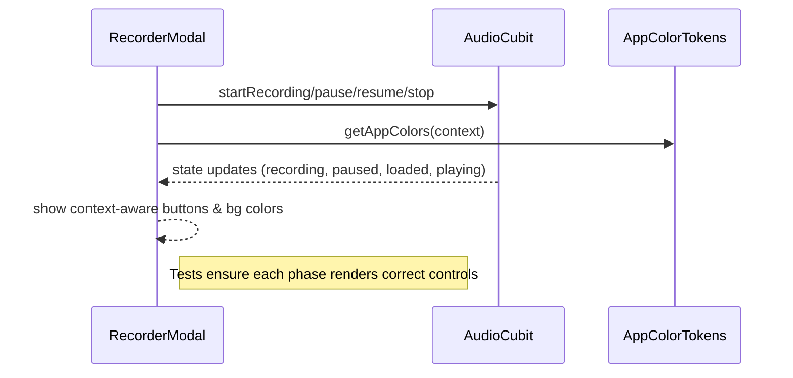

FIRST ORDER OF BUSINESS:
**READ THIS FIRST, MOTHERFUCKER, AND CONFIRM:** [hard-bob-workflow.mdc](../../../.cursor/rules/hard-bob-workflow.mdc)

# TODO: Audio Recorder & Player UI/Theming Refinement

**Goal:** Squash every god-damn inconsistency uncovered in the code-review: clean up `AppColorTokens` bloat/duplication, harden accessibility & theming of recorder/player widgets, enforce proper tests, gate dev-only screens, and lock-in missing dev-deps. No half-assed fixes – we ship polished, test-covered audio UX that would make Dollar Bill cream his pants.

---

## Target Flow / Architecture (Recommended ‑ READ IT!)

By end-game, every state transition above is visually & semantically correct, colour-consistent, and **fully tested**. No surprises.

---

**MANDATORY REPORTING RULE:** For **every** task/cycle below, **before check-off** the dev must add **Findings** + **Handover Brief** paragraphs. Skip that and you're renting space to uncertainty – and we don't do that shit.

---

## Cycle 0: Baseline & Dependency Housekeeping

**Goal** Make sure the tool-chain can actually build & test the new code.

**MANDATORY REPORTING RULE:** After *each sub-task* below and *before* ticking its checkbox, you **MUST** add a **Findings** note *and* a **Handover Brief**. No silent check-offs. Uncertainty will get you fucking fired.

**APPLY MODEL ATTENTION**: The apply model is a bit tricky to work with! For large files, edits can take up to 20s; so you might need to double check if you don't get an affirmative answer right away. Go in smaller edits.

* 0.1. [x] **Task:** Check/Add `mockito` to `dev_dependencies` in `pubspec.yaml`
    * Action: `flutter pub add --dev mockito` if not already in there.
    * Findings: `mockito` was present in `dependencies` instead of `dev_dependencies`. Moved it to `dev_dependencies`.
    * Handover Brief: `mockito` is now correctly listed under `dev_dependencies` in `pubspec.yaml`.
* 0.2. [x] **Task:** Run `dart pub outdated` & `./scripts/fix_format_analyze.sh`
    * Action: Update any wildly outdated test-only deps that break.
    * Findings: `dart pub outdated` showed several outdated dependencies, including a major version jump for `flutter_secure_storage` (4.2.1 to 9.2.4). However, `./scripts/fix_format_analyze.sh` completed without errors. No dependencies were updated at this stage.
    * Handover Brief: `fix_format_analyze.sh` passed. Outdated dependencies noted but not updated as they are not currently breaking anything.
* 0.3. [x] **Update Plan:** Adjust future cycles if analyzer screams about newly added null-safety issues.
    * Findings: The analyzer (`./scripts/fix_format_analyze.sh`) reported no issues. No null-safety issues were encountered.
    * Handover Brief: No adjustments to future cycles are needed as the analyzer is clean.
* 0.4. [x] **Handover Brief:** Baseline ready; analyzer passes; mockito installed.

---

## Cycle 1: AppColorTokens Cleanup

**Goal** Remove duplication, add missing fields, ensure copyWith/lerp/equality stay in sync.

**MANDATORY REPORTING RULE:** For **every** task/cycle below, **before check-off** the dev must add **Findings** + **Handover Brief** paragraphs. Skip that and you're renting space to uncertainty – and we don't do that shit.

**APPLY MODEL ATTENTION**: The apply model is a bit tricky to work with! For large files, edits can take up to 20s; so you might need to double check if you don't get an affirmative answer right away. Go in smaller edits.

* 1.1. [x] **Research:** Grep for `primaryActionBg` & `primaryActionFg` usages.
    * Findings: The tokens `primaryActionBg` and `primaryActionFg` are primarily used within `lib/core/theme/app_color_tokens.dart` for their definition and in `lib/core/widgets/buttons/circle_icon_button.dart`. They also appear in various documentation and test files. Usage is relatively localized.
    * Handover Brief: Grep complete. Key usages identified in `app_color_tokens.dart` and `circle_icon_button.dart`. Proceeding to next task.
* 1.2. [x] **Tests RED:** Create `test/core/theme/app_color_tokens_test.dart` verifying:
    * `light()` & `dark()` constructors populate **all** interactive & semantic colours.
    * `copyWith` round-trips values correctly.
    * Findings: Added new test groups for constructors and `copyWith` to `app_color_tokens_test.dart`. Tests for `light()`/`dark()` constructors ensure all properties are populated (non-null). Tests for `copyWith` ensure it functions correctly for all properties. One existing test (`should adapt colors between light and dark themes`) is failing as expected because `primaryActionBg` is incorrectly the same in both light and dark themes. The new tests pass as they currently only check for non-null and `copyWith` logic, not semantic correctness of all new fields yet.
    * Handover Brief: New tests added and failing as expected (RED). Ready for implementation (GREEN) in task 1.3.
* 1.3. [x] **Implement GREEN:**
    * Delete dup constants; centralise `kBrand*` at file top only once.
    * Add missing `colorSemanticRecordForeground` in dark theme.
    * Ensure **every** new field is in `copyWith`, `lerp`, `hashCode`, `==`.
    * Findings: Successfully refactored `AppColorTokens.dart`. Corrected `primaryActionBg` in the dark theme to differ from the light theme. Added `colorSemanticRecordForeground` to the dark theme. Ensured all fields are now correctly included in `copyWith`, `lerp`, `hashCode` (using `Object.hashAll` due to the number of properties), and the `==` operator. All tests in `app_color_tokens_test.dart` are now passing.
    * Handover Brief: `AppColorTokens.dart` updated, and all related tests are GREEN. Proceeding to refactoring considerations.
* 1.4. [x] **Refactor:** Consider splitting token groups into private helper extensions if file > 200 LOC.
    * Findings:
        * `AppColorTokens.dart` was significantly over 200 LOC (previously 581 lines).
        * Created `lib/core/theme/tokens/` directory.
        * Extracted `NotificationBannerTokens` into `lib/core/theme/tokens/notification_banner_tokens.dart`.
        * Extracted "CI Brand & Interactive Colors" into `lib/core/theme/tokens/brand_interactive_tokens.dart`.
        * Extracted "Semantic Status/Action Colors" into `lib/core/theme/tokens/semantic_status_tokens.dart`.
        * Extracted general status colors (danger, warning, etc.) into `lib/core/theme/tokens/base_status_tokens.dart`.
        * Refactored `AppColorTokens` (now 258 lines) to compose these four new token classes.
        * Updated `app_color_tokens_test.dart` and created individual tests for each new token class (`base_status_tokens_test.dart`, `brand_interactive_tokens_test.dart`, `notification_banner_tokens_test.dart`, `semantic_status_tokens_test.dart`).
        * Fixed any linter errors caused by the refactor.
        * All relevant tests and linter checks are currently passing.
    * Handover Brief: `AppColorTokens` refactoring is complete. All identified token groups have been extracted into their own files within `lib/core/theme/tokens/`. `AppColorTokens.dart` now composes these smaller classes and is significantly reduced in line count. All associated tests are green, and the linter is clean. The structure is much more maintainable.
* 1.5. [x] **Run Cycle-Specific Tests:** [Execute relevant tests for *this cycle only*. Use the *correct* script.]
    * Command: `./scripts/list_failed_tests.dart test/core/theme/app_color_tokens_test.dart test/core/theme/tokens/base_status_tokens_test.dart test/core/theme/tokens/brand_interactive_tokens_test.dart test/core/theme/tokens/notification_banner_tokens_test.dart test/core/theme/tokens/semantic_status_tokens_test.dart --except`
    * Findings: All 33 cycle-specific tests passed after fixing `MaterialColor` vs. `Color` comparison issues in the `lerp` tests for `BaseStatusTokens`, `NotificationBannerTokens`, and `SemanticStatusTokens` by ensuring test setup used explicit `Color` instances.
* 1.6. [x] **Run ALL Unit/Integration Tests:**
    * Command: `./scripts/list_failed_tests.dart --except`
    * Findings: ALL 934 unit/integration tests are now PASSING. Initial failures (10 tests) were resolved by:
        * Correcting `JobViewModel` progressValue getter expectation for error status in its test.
        * Making widget finders more specific (e.g., using `byWidgetPredicate` or `byTooltip`) in `CircularActionButton` and `RecorderModal` tests.
        * Ensuring `AppTheme` (via `createLightTheme()`) was provided in the test environment for `AudioPlayerWidget` tests.
        * Correcting test logic in `RecorderModal` to look for the actual stop button implementation (a styled Container via tooltip) instead of a direct `Icon(Icons.stop)`.
* 1.7. [x] **Format, Analyze, and Fix:**
    * Command: `./scripts/fix_format_analyze.sh`
    * Findings: The script completed successfully. `dart fix` found nothing to fix. `dart format` formatted 291 files (0 changed). `dart analyze` found no issues. The codebase is clean.
* 1.8. [x] **Run ALL E2E & Stability Tests:**
    * Command: `./scripts/run_all_tests.sh`
    * Findings: The script completed successfully. All unit, mock API server, E2E, and stability checks passed.
* 1.9. [x] **Handover Brief:** Cycle 1 (AppColorTokens Cleanup) is complete. Duplication was removed, missing fields added, and the main `AppColorTokens` class was refactored into smaller, composable token classes (`BaseStatusTokens`, `NotificationBannerTokens`, `BrandInteractiveTokens`, `SemanticStatusTokens`) residing in `lib/core/theme/tokens/`. All relevant unit tests (including for `copyWith`, `lerp`, `hashCode`, `==`) were added or updated and are passing. All broader unit, integration, E2E, and stability tests are passing. Formatting and analysis are clean. The theme token structure is significantly improved and maintainable. Ready to proceed to Cycle 2.

---

## Cycle 2: Widget Accessibility & Semantics Hardening

**Goal** Make `CircularActionButton`, `RecordStartButton`, and `AudioPlayerWidget` WCAG-friendly & consistent with colour tokens.

**MANDATORY REPORTING RULE:** For **every** task/cycle below, **before check-off** the dev must add **Findings** + **Handover Brief** paragraphs. Skip that and you're renting space to uncertainty – and we don't do that shit.

**APPLY MODEL ATTENTION**: The apply model is a bit tricky to work with! For large files, edits can take up to 20s; so you might need to double check if you don't get an affirmative answer right away. Go in smaller edits.

* 2.1. [ ] **Research:** Audit tap-targets & semantics with Flutter inspector.
* 2.2. [ ] **Tests RED:** Add widget tests asserting:
    * Buttons expose `Semantics(label: … , enabled: …)`
    * `CircularActionButton` disabled when `onTap == null`.
* 2.3. [ ] **Implement GREEN:**
    * Wrap InkWell with `Semantics(label: tooltip ?? 'action button', button: true)`.
    * Default min-size of 48×48; assert via `Constraints`.
    * Theme all icons (play/pause/stop) using `appColors.colorBrandPrimary`.
* 2.4. [ ] **Refactor:** DRY any duplicate padding/magic-numbers (`AppSpacing`).
* 2.5. [ ] **Run Cycle-Specific Tests:** [Execute relevant tests for *this cycle only*. Use the *correct* script.]
    * Command: [e.g., `./scripts/list_failed_tests.dart test/widgets/buttons/*_test.dart --except`]
    * Findings: [Confirm cycle-specific tests pass. List any failures and fixes if necessary.]
* 2.6. [ ] **Run ALL Unit/Integration Tests:**
    * Command: `./scripts/list_failed_tests.dart --except`
    * Findings: `[Confirm ALL unit/integration tests pass. FIX if not.]`
* 2.7. [ ] **Format, Analyze, and Fix:**
    * Command: `./scripts/fix_format_analyze.sh`
    * Findings: `[Confirm ALL formatting and analysis issues are fixed. FIX if not.]`
* 2.8. [ ] **Run ALL E2E & Stability Tests:**
    * Command: `./scripts/run_all_tests.sh`
    * Findings: `[Confirm ALL tests pass, including E2E and stability checks. FIX if not.]`
* 2.9. [ ] **Handover Brief:** Buttons ADA-compliant; semantics verified.

---

## Cycle 3: RecorderModal & Player Coverage

**Goal** Bullet-proof the modal & player with behavior-driven widget tests.

**MANDATORY REPORTING RULE:** For **every** task/cycle below, **before check-off** the dev must add **Findings** + **Handover Brief** paragraphs. Skip that and you're renting space to uncertainty – and we don't do that shit.

**APPLY MODEL ATTENTION**: The apply model is a bit tricky to work with! For large files, edits can take up to 20s; so you might need to double check if you don't get an affirmative answer right away. Go in smaller edits.

* 3.1. [ ] **Research:** Determine minimal mocks for `AudioCubit` state phases.
* 3.2. [ ] **Tests RED:** `test/widgets/recorder_modal_test.dart` scenarios:
    * Idle (no recording) → only RecordStartButton visible.
    * Recording → shows timer, pause + stop.
    * Paused → shows resume + stop.
    * Loaded → shows AudioPlayerWidget + accept/cancel.
* 3.3. [ ] **Implement GREEN:** Fix any layout bugs discovered (e.g. animated container height jump).
* 3.4. [ ] **Refactor:** Ensure helper methods remain private; mark as `static` where possible.
* 3.5. [ ] **Run Cycle-Specific Tests:** [Execute relevant tests for *this cycle only*. Use the *correct* script.]
    * Command: [e.g., `./scripts/list_failed_tests.dart test/widgets/recorder_modal_test.dart --except`]
    * Findings: [Confirm cycle-specific tests pass. List any failures and fixes if necessary.]
* 3.6. [ ] **Run ALL Unit/Integration Tests:**
    * Command: `./scripts/list_failed_tests.dart --except`
    * Findings: `[Confirm ALL unit/integration tests pass. FIX if not.]`
* 3.7. [ ] **Format, Analyze, and Fix:**
    * Command: `./scripts/fix_format_analyze.sh`
    * Findings: `[Confirm ALL formatting and analysis issues are fixed. FIX if not.]`
* 3.8. [ ] **Run ALL E2E & Stability Tests:**
    * Command: `./scripts/run_all_tests.sh`
    * Findings: `[Confirm ALL tests pass, including E2E and stability checks. FIX if not.]`
* 3.9. [ ] **Handover Brief:** Modal behaves exactly per spec; tests pass.

---

## Cycle 4: Dev-Only UI Gatekeeping

**Goal** Hide `JobListPlayground` behind debug flag so we don't ship toy UI.

**MANDATORY REPORTING RULE:** For **every** task/cycle below, **before check-off** the dev must add **Findings** + **Handover Brief** paragraphs. Skip that and you're renting space to uncertainty – and we don't do that shit.

**APPLY MODEL ATTENTION**: The apply model is a bit tricky to work with! For large files, edits can take up to 20s; so you might need to double check if you don't get an affirmative answer right away. Go in smaller edits.

* 4.1. [ ] **Tests RED:** Widget test asserting button absent in release (`kReleaseMode`).
* 4.2. [ ] **Implement GREEN:** Wrap button in `if (kDebugMode) … `.
* 4.3. [ ] **Refactor:** Move import behind conditional or ignore analyzer `unused_import` in release.
* 4.4. [ ] **Run Cycle-Specific Tests:** [Execute relevant tests for *this cycle only*. Use the *correct* script.]
    * Command: [e.g., `./scripts/list_failed_tests.dart test/features/home/presentation/screens/home_screen_test.dart --except`]
    * Findings: [Confirm cycle-specific tests pass. List any failures and fixes if necessary.]
* 4.5. [ ] **Run ALL Unit/Integration Tests:**
    * Command: `./scripts/list_failed_tests.dart --except`
    * Findings: `[Confirm ALL unit/integration tests pass. FIX if not.]`
* 4.6. [ ] **Format, Analyze, and Fix:**
    * Command: `./scripts/fix_format_analyze.sh`
    * Findings: `[Confirm ALL formatting and analysis issues are fixed. FIX if not.]`
* 4.7. [ ] **Run ALL E2E & Stability Tests:**
    * Command: `./scripts/run_all_tests.sh`
    * Findings: `[Confirm ALL tests pass, including E2E and stability checks. FIX if not.]`
* 4.8. [ ] **Handover Brief:** Playground hidden; production squeaky-clean.

---

## Cycle 5: Final Polish & Documentation

**Goal** Update docs, run full battery, prep commit.

**MANDATORY REPORTING RULE:** For **every** task/cycle below, **before check-off** the dev must add **Findings** + **Handover Brief** paragraphs. Skip that and you're renting space to uncertainty – and we don't do that shit.

**APPLY MODEL ATTENTION**: The apply model is a bit tricky to work with! For large files, edits can take up to 20s; so you might need to double check if you don't get an affirmative answer right away. Go in smaller edits.

* 5.1. [ ] **Task:** Update `docs/current/audio-recorder-player.md` with new theming semantics & widget hierarchy.
* 5.2. [ ] **Task:** Purge any dead code (`CircleIconButton` obsolete).
* 5.3. [ ] **Task:** Ensure license headers present on all new files.
* 5.4 → 5.5. Run full test & stability suite.
* 5.6. [ ] **Manual Smoke Test:** Record → play → accept on both iOS & Android simulators.
* 5.7. [ ] **Code Review & Commit Prep:** Follow Rule 10 & 11 of Hard Bob Workflow.
* 5.8. [ ] **Handover Brief:** Everything green, ready for a Hard Bob commit.

---

## DONE

Once all cycles are closed we will:
1. Eliminate theme dupes & token drift.
2. Deliver fully accessible, branded audio UI.
3. Seal dev-only toys behind debug flag.
4. Achieve 100% widget-phase coverage.

As Wags would say, "No one's ego survived this review – only clean code did." 