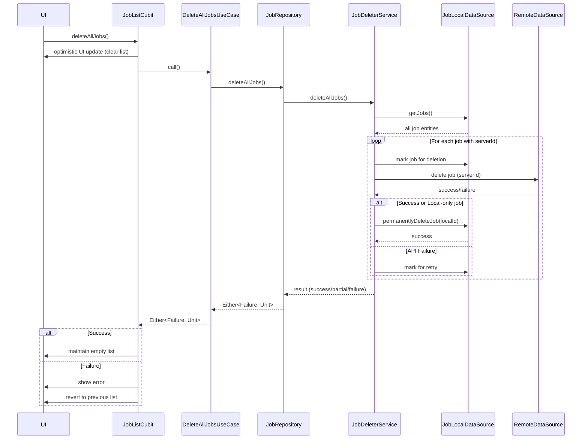

FIRST ORDER OF BUSINESS:
**READ THIS FIRST, MOTHERFUCKER, AND CONFIRM:** [hard-bob-workflow.mdc](../../../.cursor/rules/hard-bob-workflow.mdc)

# TODO: Implement Delete All Jobs Feature

**Goal:** Add the ability for users to delete all their jobs in one operation, rather than having to delete them one by one. This improves user experience by streamlining cleanup operations and provides a clean slate without forcing logout/login.

---

## Target Flow / Architecture

---

**MANDATORY REPORTING RULE:** For **every** task/cycle below, **before check-off and moving on to the next todo**, the dev must (a) write a brief *Findings* paragraph summarizing *what was done and observed* and (b) a *Handover Brief* summarising status at the end of the cycle, edge-cases/gotchas, and next-step readiness **inside this doc** before ticking the checkbox. No silent check-offs allowed – uncertainty gets you fucking fired. Like Mafee forgetting the shorts, don't be that guy.

---

## Cycle 1: Implement DeleteAllJobsUseCase via TDD

**Goal:** Create the core use case that will handle the deletion of all jobs, following clean architecture principles and TDD methodology.

**MANDATORY REPORTING RULE:** After *each sub-task* below and *before* ticking its checkbox, you **MUST** add a **Findings** note *and* a **Handover Brief** at the end of the cycle. No silent check-offs. Uncertainty will get you fucking fired.

**APPLY MODEL ATTENTION**: The apply model is a bit tricky to work with! For large files, edits can take up to 20s; so you might need to double check if you don't get an affirmative answer right away. Go in smaller edits.

* 1.1. [ ] **Research:** Understand current job deletion flow and repository interface
    * Findings: 
* 1.2. [ ] **Tests RED:** Create unit test for DeleteAllJobsUseCase
    * Test File: `test/features/jobs/domain/usecases/delete_all_jobs_use_case_test.dart`
    * Test Description: Should call repository.deleteAllJobs() and return the repository result
    * Run the tests: ./scripts/list_failed_tests.dart --except
    * Findings: 
* 1.3. [ ] **Implement GREEN:** Create DeleteAllJobsUseCase class
    * Implementation File: `lib/features/jobs/domain/usecases/delete_all_jobs_use_case.dart`
    * Findings: 
* 1.4. [ ] **Refactor:** Clean up code and ensure it follows project patterns
    * Findings: 
* 1.5. [ ] **Run Cycle-Specific Tests:** Execute tests specific to DeleteAllJobsUseCase
    * Command: `./scripts/list_failed_tests.dart test/features/jobs/domain/usecases/delete_all_jobs_use_case_test.dart --except`
    * Findings: 
* 1.6. [ ] **Run ALL Unit/Integration Tests:**
    * Command: `./scripts/list_failed_tests.dart --except`
    * Findings: 
* 1.7. [ ] **Format, Analyze, and Fix:**
    * Command: `./scripts/fix_format_analyze.sh`
    * Findings: 
* 1.8. [ ] **Run ALL E2E & Stability Tests:**
    * Command: `./scripts/run_all_tests.sh`
    * Findings: 
* 1.9. [ ] **Handover Brief:**
    * Status: 
    * Gotchas: 
    * Recommendations: 

---

## Cycle 2: Extend JobRepository Interface and Implementation

**Goal:** Add deleteAllJobs method to JobRepository interface and implement it in JobRepositoryImpl. This connects our use case to the actual deletion service.

**MANDATORY REPORTING RULE:** After *each sub-task* below and *before* ticking its checkbox, you **MUST** add a **Findings** note *and* a **Handover Brief** at the end of the cycle. No silent check-offs. Uncertainty will get you fucking fired.

**APPLY MODEL ATTENTION**: The apply model is a bit tricky to work with! For large files, edits can take up to 20s; so you might need to double check if you don't get an affirmative answer right away. Go in smaller edits.

* 2.1. [ ] **Research:** Review JobRepository implementation and deleter service
    * Findings: 
* 2.2. [ ] **Tests RED:** Add test for JobRepositoryImpl.deleteAllJobs()
    * Test File: `test/features/jobs/data/repositories/job_repository_impl_test.dart`
    * Test Description: Should delegate to JobDeleterService.deleteAllJobs()
    * Run the tests: ./scripts/list_failed_tests.dart --except
    * Findings: 
* 2.3. [ ] **Implement GREEN:** 
    * Implementation File: `lib/features/jobs/domain/repositories/job_repository.dart` (add method)
    * Implementation File: `lib/features/jobs/data/repositories/job_repository_impl.dart` (implement method)
    * Findings: 
* 2.4. [ ] **Refactor:** Ensure code is clean and follows patterns
    * Findings: 
* 2.5. [ ] **Run Cycle-Specific Tests:** Execute tests for repository only
    * Findings: 
* 2.6. [ ] **Run ALL Unit/Integration Tests:**
    * Command: `./scripts/list_failed_tests.dart --except`
    * Findings: 
* 2.7. [ ] **Format, Analyze, and Fix:**
    * Command: `./scripts/fix_format_analyze.sh`
    * Findings: 
* 2.8. [ ] **Run ALL E2E & Stability Tests:**
    * Command: `./scripts/run_all_tests.sh`
    * Findings: 
* 2.9. [ ] **Handover Brief:**
    * Status: 
    * Gotchas: 
    * Recommendations: 

---

## Cycle 3: Implement JobDeleterService.deleteAllJobs() Method

**Goal:** Add functionality to JobDeleterService to handle bulk deletion of all jobs, either by marking them all for deletion or implementing a more efficient bulk operation.

**MANDATORY REPORTING RULE:** After *each sub-task* below and *before* ticking its checkbox, you **MUST** add a **Findings** note *and* a **Handover Brief** at the end of the cycle. No silent check-offs. Uncertainty will get you fucking fired.

**APPLY MODEL ATTENTION**: The apply model is a bit tricky to work with! For large files, edits can take up to 20s; so you might need to double check if you don't get an affirmative answer right away. Go in smaller edits.

* 3.1. [ ] **Research:** Review JobDeleterService and local data source capabilities
    * Findings: 
* 3.2. [ ] **Tests RED:** Create test for JobDeleterService.deleteAllJobs()
    * Test File: `test/features/jobs/data/services/job_deleter_service_test.dart`
    * Test Description: Should retrieve all jobs and mark each for deletion
    * Run the tests: ./scripts/list_failed_tests.dart --except
    * Findings: 
* 3.3. [ ] **Implement GREEN:** Add deleteAllJobs() method to JobDeleterService
    * Implementation File: `lib/features/jobs/data/services/job_deleter_service.dart`
    * Findings: 
* 3.4. [ ] **Refactor:** Ensure code is clean and optimized
    * Findings: 
* 3.5. [ ] **Run Cycle-Specific Tests:** Execute tests for the service only
    * Findings: 
* 3.6. [ ] **Run ALL Unit/Integration Tests:**
    * Command: `./scripts/list_failed_tests.dart --except`
    * Findings: 
* 3.7. [ ] **Format, Analyze, and Fix:**
    * Command: `./scripts/fix_format_analyze.sh`
    * Findings: 
* 3.8. [ ] **Run ALL E2E & Stability Tests:**
    * Command: `./scripts/run_all_tests.sh`
    * Findings: 
* 3.9. [ ] **Handover Brief:**
    * Status: 
    * Gotchas: 
    * Recommendations: 

---

## Cycle 4: Extend JobListCubit with deleteAllJobs() Method

**Goal:** Add a method to JobListCubit that will handle the bulk deletion with optimistic UI updates, error handling, and rollback capabilities.

**MANDATORY REPORTING RULE:** After *each sub-task* below and *before* ticking its checkbox, you **MUST** add a **Findings** note *and* a **Handover Brief** at the end of the cycle. No silent check-offs. Uncertainty will get you fucking fired.

**APPLY MODEL ATTENTION**: The apply model is a bit tricky to work with! For large files, edits can take up to 20s; so you might need to double check if you don't get an affirmative answer right away. Go in smaller edits.

* 4.1. [ ] **Research:** Review JobListCubit implementation and understand its state management
    * Findings: 
* 4.2. [ ] **Tests RED:** Create test for JobListCubit.deleteAllJobs()
    * Test File: `test/features/jobs/presentation/cubit/job_list_cubit_test.dart`
    * Test Description: Should optimistically update UI, call use case, and handle results
    * Run the tests: ./scripts/list_failed_tests.dart --except
    * Findings: 
* 4.3. [ ] **Implement GREEN:** Add deleteAllJobs() method to JobListCubit
    * Implementation File: `lib/features/jobs/presentation/cubit/job_list_cubit.dart`
    * Findings: 
* 4.4. [ ] **Refactor:** Ensure code is clean and follows patterns
    * Findings: 
* 4.5. [ ] **Run Cycle-Specific Tests:** Execute tests for the cubit only
    * Findings: 
* 4.6. [ ] **Run ALL Unit/Integration Tests:**
    * Command: `./scripts/list_failed_tests.dart --except`
    * Findings: 
* 4.7. [ ] **Format, Analyze, and Fix:**
    * Command: `./scripts/fix_format_analyze.sh`
    * Findings: 
* 4.8. [ ] **Run ALL E2E & Stability Tests:**
    * Command: `./scripts/run_all_tests.sh`
    * Findings: 
* 4.9. [ ] **Handover Brief:**
    * Status: 
    * Gotchas: 
    * Recommendations: 

---

## Cycle 5: Update Dependency Injection and Register New Use Case

**Goal:** Register the DeleteAllJobsUseCase in the dependency injection container and ensure it's properly injected into JobListCubit.

**MANDATORY REPORTING RULE:** After *each sub-task* below and *before* ticking its checkbox, you **MUST** add a **Findings** note *and* a **Handover Brief** at the end of the cycle. No silent check-offs. Uncertainty will get you fucking fired.

**APPLY MODEL ATTENTION**: The apply model is a bit tricky to work with! For large files, edits can take up to 20s; so you might need to double check if you don't get an affirmative answer right away. Go in smaller edits.

* 5.1. [ ] **Research:** Review jobs_module.dart for DI registration pattern
    * Findings: 
* 5.2. [ ] **Implement:** Register DeleteAllJobsUseCase in DI container
    * Implementation File: `lib/features/jobs/di/jobs_module.dart`
    * Findings: 
* 5.3. [ ] **Implement:** Update JobListCubit factory to inject the new use case
    * Implementation File: `lib/features/jobs/di/jobs_module.dart`
    * Findings: 
* 5.4. [ ] **Run ALL Unit/Integration Tests:**
    * Command: `./scripts/list_failed_tests.dart --except`
    * Findings: 
* 5.5. [ ] **Format, Analyze, and Fix:**
    * Command: `./scripts/fix_format_analyze.sh`
    * Findings: 
* 5.6. [ ] **Run ALL E2E & Stability Tests:**
    * Command: `./scripts/run_all_tests.sh`
    * Findings: 
* 5.7. [ ] **Handover Brief:**
    * Status: 
    * Gotchas: 
    * Recommendations: 

---

## Cycle 6: Implement UI Integration and Confirmation Dialog

**Goal:** Add a UI element (likely a button) to trigger the delete all jobs action, with a confirmation dialog to prevent accidental deletion.

**MANDATORY REPORTING RULE:** After *each sub-task* below and *before* ticking its checkbox, you **MUST** add a **Findings** note *and* a **Handover Brief** at the end of the cycle. No silent check-offs. Uncertainty will get you fucking fired.

**APPLY MODEL ATTENTION**: The apply model is a bit tricky to work with! For large files, edits can take up to 20s; so you might need to double check if you don't get an affirmative answer right away. Go in smaller edits.

* 6.1. [ ] **Research:** Review JobListPage UI to determine best location for delete all button
    * Findings: 
* 6.2. [ ] **Implement:** Add delete all jobs button to JobListPage
    * Implementation File: `lib/features/jobs/presentation/pages/job_list_page.dart`
    * Findings: 
* 6.3. [ ] **Implement:** Create confirmation dialog component
    * Implementation File: `lib/features/jobs/presentation/widgets/delete_all_confirmation_dialog.dart` (new file)
    * Findings: 
* 6.4. [ ] **Implement:** Connect button action to confirmation dialog and cubit method
    * Findings: 
* 6.5. [ ] **Run ALL Unit/Integration Tests:**
    * Command: `./scripts/list_failed_tests.dart --except`
    * Findings: 
* 6.6. [ ] **Format, Analyze, and Fix:**
    * Command: `./scripts/fix_format_analyze.sh`
    * Findings: 
* 6.7. [ ] **Run ALL E2E & Stability Tests:**
    * Command: `./scripts/run_all_tests.sh`
    * Findings: 
* 6.8. [ ] **Manual Smoke Test:** Test the delete all jobs functionality
    * Findings: 
* 6.9. [ ] **Handover Brief:**
    * Status: 
    * Gotchas: 
    * Recommendations: 

---

## Cycle 7: Final Polish, Documentation & Cleanup

**Goal:** Update documentation, ensure code is clean, and finalize the feature for production use.

**MANDATORY REPORTING RULE:** After *each sub-task* below and *before* ticking its checkbox, you **MUST** add a **Findings** note *and* a **Handover Brief** at the end of the cycle. No silent check-offs. Uncertainty will get you fucking fired.

**APPLY MODEL ATTENTION**: The apply model is a bit tricky to work with! For large files, edits can take up to 20s; so you might need to double check if you don't get an affirmative answer right away. Go in smaller edits.

* 7.1. [ ] **Task:** Update Job Data Flow documentation
    * File: `docs/current/feature-job-dataflow.md`
    * Findings: 
* 7.2. [ ] **Task:** Update Job Presentation Layer documentation
    * File: `docs/current/feature-job-presentation.md`
    * Findings: 
* 7.3. [ ] **Run ALL Unit/Integration Tests:**
    * Command: `./scripts/list_failed_tests.dart --except`
    * Findings: 
* 7.4. [ ] **Format, Analyze, and Fix:**
    * Command: `./scripts/fix_format_analyze.sh`
    * Findings: 
* 7.5. [ ] **Run ALL E2E & Stability Tests:**
    * Command: `./scripts/run_all_tests.sh`
    * Findings: 
* 7.6. [ ] **Manual Smoke Test:** Perform a final E2E check of the feature
    * Findings: 
* 7.7. [ ] **Code Review & Commit Prep:** Review staged changes, ensure adherence to guidelines
    * Findings: 
* 7.8. [ ] **Handover Brief:**
    * Status: 
    * Gotchas: 
    * Recommendations: 

---

## DONE

With these cycles we:
1. Created a DeleteAllJobsUseCase following clean architecture principles
2. Extended the JobRepository interface and implementation with deleteAllJobs method
3. Implemented the bulk deletion logic in JobDeleterService
4. Added deleteAllJobs method to JobListCubit with optimistic UI updates
5. Integrated the feature into the UI with proper confirmation dialogs
6. Updated documentation to reflect the new functionality

No bullshit, no uncertainty – "We're not destroying their world, we're improving it." 