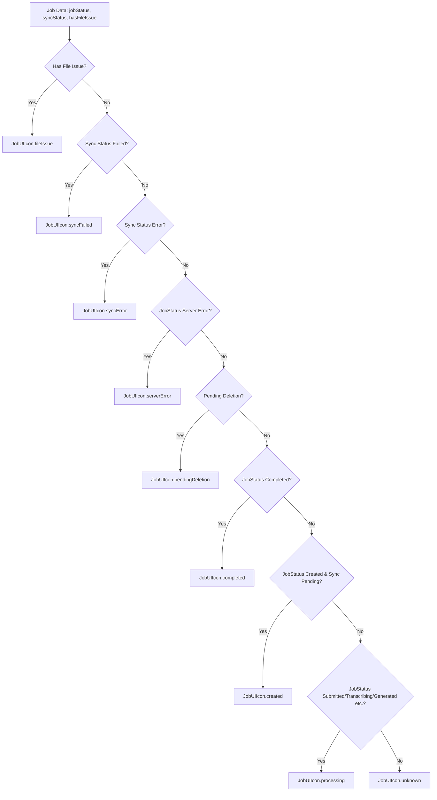

FIRST ORDER OF BUSINESS:
**READ THIS FIRST, MOTHERFUCKER, AND CONFIRM:** [hard-bob-workflow.mdc](../../../.cursor/rules/hard-bob-workflow.mdc)

# TODO: Implement Enhanced Job List Item Icon States

**Goal:** Refactor the `JobListItem` to display a dynamic icon representing the comprehensive status of a job, including its creation, sync progress, server processing state, completion, and various error conditions. This will provide users with clear, at-a-glance information about each job's lifecycle and any issues, replacing ambiguous or missing visual cues.

---

## Target Flow / Architecture

1.  **`JobUIIcon` Enum**: Define a new enum `JobUIIcon` in `lib/features/jobs/presentation/models/job_ui_icon.dart` (new file) that clearly represents all possible icon states (e.g., `created`, `pendingSync`, `syncError`, `syncFailed`, `fileIssue`, `processing`, `serverError`, `completed`, `pendingDeletion`, `unknown`).
2.  **`JobViewModel.uiIcon` Getter**: Implement a getter `uiIcon` within `lib/features/jobs/presentation/models/job_view_model.dart`. This getter will contain the logic to determine the correct `JobUIIcon` based on the job's `jobStatus`, `syncStatus`, and `hasFileIssue`. This logic will have a clear order of precedence for error states, using early returns rather than nested if-else statements for clarity and maintainability.
3.  **`JobListItem` Integration**: Modify `lib/features/jobs/presentation/widgets/job_list_item.dart` to:
    *   Consume `jobViewModel.uiIcon` instead of using the existing `_getJobItemIcon` and `_getIconColor` methods.
    *   Implement a private helper method `_buildIcon(JobUIIcon uiIcon)` that maps each `JobUIIcon` to a specific `Widget` (using `Icon` with appropriate `CupertinoIcons` and colors).
    *   Ensure the `unknown` state has a sensible fallback icon (e.g., `CupertinoIcons.question_circle`) so the UI never crashes.
4.  **Playground Verification**: Update `lib/features/jobs/presentation/pages/job_list_playground.dart` to include examples of jobs in all new icon states for easy visual verification.

**Mermaid Diagram of `uiIcon` Logic Precedence (Conceptual):**

---

**MANDATORY REPORTING RULE:** For **every** task/cycle below, **before check-off and moving on to the next todo**, the dev must (a) write a brief *Findings* paragraph summarizing *what was done and observed* and (b) a *Handover Brief* summarising status at the end of the cycle, edge-cases/gotchas, and next-step readiness **inside this doc** before ticking the checkbox. No silent check-offs allowed – uncertainty gets you fucking fired. Like Mafee forgetting the shorts, don't be that guy.

---

## Cycle 0: Setup & Prerequisite Definition

**Goal:** Define the core `JobUIIcon` enum and finalize the strategy for error icon granularity (specific vs. generic). This sets the foundation for all subsequent logic.

**MANDATORY REPORTING RULE:** After *each sub-task* below and *before* ticking its checkbox, you **MUST** add a **Findings** note *and* a **Handover Brief**. No silent check-offs. Uncertainty will get you fucking fired.

**APPLY MODEL ATTENTION**: The apply model is a bit tricky to work with! For large files, edits can take up to 20s; so you might need to double check if you don't get an affirmative answer right away. Go in smaller edits.

*   0.1. [ ] **Task:** Define `JobUIIcon` Enum.
    *   Action: Create `lib/features/jobs/presentation/models/job_ui_icon.dart` and define the `JobUIIcon` enum with the following initial values: `created`, `pendingSync`, `syncError`, `syncFailed`, `fileIssue`, `processing`, `serverError`, `completed`, `pendingDeletion`, `unknown` (as a fallback).
    *   Remember to use proper documentation for each enum value.
    *   Findings:
*   0.2. [ ] **Task:** Confirm Error Icon Strategy.
    *   Action: Review the proposed specific error icons (`syncError`, `syncFailed`, `fileIssue`, `serverError`). Decide if this level of granularity is desired or if a single generic `error` icon (merging these) is preferred. For now, we proceed with specific icons.
    *   Findings:
*   0.3. [ ] **Update Plan:** Based on findings (especially from 0.2), confirm or adjust the plan for subsequent cycles. The current plan assumes specific error icons.
    *   Findings:
*   0.4. [ ] **Handover Brief:**
    *   Status:
    *   Gotchas:
    *   Recommendations:

---

## Cycle 1: Implement `JobViewModel.uiIcon` Getter - Happy Paths & Basic States (TDD)

**Goal:** Implement the core logic in `JobViewModel.uiIcon` for non-error states: `created`, `processing` (covering server-side in-progress states), and `completed`. Ensure full test coverage for these paths.

**MANDATORY REPORTING RULE:** After *each sub-task* below and *before* ticking its checkbox, you **MUST** add a **Findings** note *and* a **Handover Brief** at the end of the cycle. No silent check-offs. Uncertainty will get you fucking fired.

*   1.1. [ ] **Research:** Review `JobStatus` and `SyncStatus` enums to ensure accurate mapping to `JobUIIcon.created`, `JobUIIcon.processing`, and `JobUIIcon.completed`.
    *   Findings:
*   1.2. [ ] **Tests RED:** Write unit tests for `JobViewModel.uiIcon`.
    *   Test File: `test/features/jobs/presentation/models/job_view_model_test.dart` (create if it doesn't exist, or add to it).
    *   Add a new test group `'JobViewModel - uiIcon Getter'` to clearly separate from existing tests.
    *   Test Description:
        *   `uiIcon should return JobUIIcon.created when jobStatus is created and syncStatus is pending or null`
        *   `uiIcon should return JobUIIcon.processing when jobStatus is submitted`
        *   `uiIcon should return JobUIIcon.processing when jobStatus is transcribing`
        *   `uiIcon should return JobUIIcon.processing when jobStatus is transcribed`
        *   `uiIcon should return JobUIIcon.processing when jobStatus is generating`
        *   `uiIcon should return JobUIIcon.processing when jobStatus is generated`
        *   `uiIcon should return JobUIIcon.completed when jobStatus is completed and no errors`
    *   Use absolute imports: `import 'package:docjet_mobile/features/jobs/presentation/models/job_ui_icon.dart';`
    *   Run the tests: `./scripts/list_failed_tests.dart test/features/jobs/presentation/models/job_view_model_test.dart --except`
    *   Findings:
*   1.3. [ ] **Implement GREEN:** Add the `uiIcon` getter to `JobViewModel` in `lib/features/jobs/presentation/models/job_view_model.dart`. Implement the *minimum* logic to make the tests pass.
    *   Use early returns for clearer precedence rather than nested if-else statements.
    *   Add proper documentation explaining the getter's purpose and logic.
    *   Implementation File: `lib/features/jobs/presentation/models/job_view_model.dart`
    *   Remember to use absolute imports for `job_ui_icon.dart`.
    *   Findings:
*   1.4. [ ] **Refactor:** Clean up the `uiIcon` getter logic and tests. Ensure clarity and adherence to style guides.
    *   Findings:
*   1.5. [ ] **Run Cycle-Specific Tests:**
    *   Command: `./scripts/list_failed_tests.dart test/features/jobs/presentation/models/job_view_model_test.dart --except`
    *   Findings:
*   1.6. [ ] **Run ALL Unit/Integration Tests:**
    *   Command: `./scripts/list_failed_tests.dart --except`
    *   Findings:
*   1.7. [ ] **Format, Analyze, and Fix:**
    *   Command: `./scripts/fix_format_analyze.sh`
    *   Findings:
*   1.8. [ ] **Handover Brief:**
    *   Status:
    *   Gotchas:
    *   Recommendations:

---

## Cycle 2: Implement `JobViewModel.uiIcon` Getter - Error & Edge States (TDD)

**Goal:** Extend `JobViewModel.uiIcon` to correctly identify and prioritize all error states (`fileIssue`, `syncFailed`, `syncError`, `serverError`) and other edge cases like `pendingDeletion`. Ensure robust test coverage for precedence.

**MANDATORY REPORTING RULE:** After *each sub-task* below and *before* ticking its checkbox, you **MUST** add a **Findings** note *and* a **Handover Brief** at the end of the cycle. No silent check-offs. Uncertainty will get you fucking fired.

*   2.1. [ ] **Tests RED:** Add unit tests for error states and precedence to `JobViewModel.uiIcon`.
    *   Test File: `test/features/jobs/presentation/models/job_view_model_test.dart`
    *   Group these tests by precedence categories for better organization:
        *   Basic error states
        *   Edge cases
        *   Precedence rules
    *   Test Description:
        *   `uiIcon should return JobUIIcon.fileIssue if hasFileIssue is true (highest priority)`
        *   `uiIcon should return JobUIIcon.syncFailed if syncStatus is failed (overrides other jobStatus)`
        *   `uiIcon should return JobUIIcon.syncError if syncStatus is error (overrides other jobStatus)`
        *   `uiIcon should return JobUIIcon.serverError if jobStatus is error (and no higher priority local errors)`
        *   `uiIcon should return JobUIIcon.pendingDeletion if jobStatus is pendingDeletion`
        *   `uiIcon should return JobUIIcon.pendingDeletion if syncStatus is pendingDeletion`
        *   `uiIcon should correctly prioritize fileIssue over syncFailed`
        *   `uiIcon should correctly prioritize syncFailed over syncError`
        *   `uiIcon should correctly prioritize syncError over serverError (jobStatus.error)`
        *   `uiIcon should return JobUIIcon.unknown for unhandled state combinations`
    *   Run the tests: `./scripts/list_failed_tests.dart test/features/jobs/presentation/models/job_view_model_test.dart --except`
    *   Findings:
*   2.2. [ ] **Implement GREEN:** Update the `uiIcon` getter in `JobViewModel` to handle error states, precedence, and fallbacks.
    *   Ensure you follow the precedence orders from the mermaid diagram.
    *   Use early returns for clearer precedence.
    *   Remember to handle the fallback `unknown` case.
    *   Implementation File: `lib/features/jobs/presentation/models/job_view_model.dart`
    *   Findings:
*   2.3. [ ] **Refactor:** Refine the error handling logic and precedence rules in `uiIcon`. Ensure the code is clean and testable.
    *   Add detailed documentation explaining the precedence rules for future reference.
    *   Findings:
*   2.4. [ ] **Run Cycle-Specific Tests:**
    *   Command: `./scripts/list_failed_tests.dart test/features/jobs/presentation/models/job_view_model_test.dart --except`
    *   Findings:
*   2.5. [ ] **Run ALL Unit/Integration Tests:**
    *   Command: `./scripts/list_failed_tests.dart --except`
    *   Findings:
*   2.6. [ ] **Format, Analyze, and Fix:**
    *   Command: `./scripts/fix_format_analyze.sh`
    *   Findings:
*   2.7. [ ] **Handover Brief:**
    *   Status:
    *   Gotchas:
    *   Recommendations:

---

## Cycle 3: Integrate `uiIcon` into `JobListItem`

**Goal:** Visually represent the derived `JobUIIcon` in the `JobListItem` by adding the icon mapping logic and displaying it.

**MANDATORY REPORTING RULE:** After *each sub-task* below and *before* ticking its checkbox, you **MUST** add a **Findings** note *and* a **Handover Brief** at the end of the cycle. No silent check-offs. Uncertainty will get you fucking fired.

*   3.1. [ ] **Research:** Identify suitable `CupertinoIcons` and appropriate semantic colors for each `JobUIIcon` state.
    *   Findings:
*   3.2. [ ] **Implement:** Add a private helper method `_buildIcon(JobUIIcon uiIcon)` to `JobListItem` that returns a `Widget` based on the `JobUIIcon`.
    *   Implementation File: `lib/features/jobs/presentation/widgets/job_list_item.dart`
    *   Make sure to handle each icon state including the `unknown` fallback.
    *   Use semantic colors from `AppColorTokens` for consistent styling.
    *   Findings:
*   3.3. [ ] **Implement:** Modify the `JobListItem`'s `build` method to call `jobViewModel.uiIcon` and use the result with `_buildIcon` to display the icon. Place it appropriately in the list item layout (e.g., leading widget).
    *   Remove the old `_getJobItemIcon` and `_getIconColor` methods that are being replaced.
    *   Implementation File: `lib/features/jobs/presentation/widgets/job_list_item.dart`
    *   Findings:
*   3.4. [ ] **Refactor:** Clean up the `JobListItem` code.
    *   Findings:
*   3.5. [ ] **Format, Analyze, and Fix:**
    *   Command: `./scripts/fix_format_analyze.sh`
    *   Findings:
*   3.6. [ ] **Handover Brief:**
    *   Status:
    *   Gotchas:
    *   Recommendations:

---

## Cycle 4: Update `JobListPlayground` for Visual Verification & Testing

**Goal:** Thoroughly test and visually verify all `JobUIIcon` states by updating the `JobListPlayground` with representative job examples.

**MANDATORY REPORTING RULE:** After *each sub-task* below and *before* ticking its checkbox, you **MUST** add a **Findings** note *and* a **Handover Brief** at the end of the cycle. No silent check-offs. Uncertainty will get you fucking fired.

*   4.1. [ ] **Task:** Modify `_mockJobs` in `JobListPlayground`.
    *   Action: Add new `JobViewModel` instances to the `_mockJobs` list in `lib/features/jobs/presentation/pages/job_list_playground.dart` to cover all defined `JobUIIcon` states. Ensure each mock job has the necessary `jobStatus`, `syncStatus`, and `hasFileIssue` to trigger the desired icon.
    *   Create at least one example for each icon state.
    *   Comment each mock job to clearly indicate which icon state it's demonstrating.
    *   Findings:
*   4.2. [ ] **Task:** (Optional) Add debug buttons/methods to `JobListPlayground`.
    *   Action: Consider adding temporary buttons or functions in the playground to create jobs that will specifically result in each error state (e.g., a "Create Job with Sync Fail" button) if static mocks are insufficient for dynamic testing.
    *   Findings:
*   4.3. [ ] **Manual Smoke Test:** Visually inspect the `JobListPlayground`.
    *   Action: Run the app and navigate to the `JobListPlayground`. Verify that each mock job (or dynamically created job) displays the correct icon and color according to its state. Check for visual consistency and clarity.
    *   Findings:
*   4.4. [ ] **Format, Analyze, and Fix:**
    *   Command: `./scripts/fix_format_analyze.sh`
    *   Findings:
*   4.5. [ ] **Handover Brief:**
    *   Status:
    *   Gotchas:
    *   Recommendations:

---

## Cycle N: Final Polish, Documentation & Cleanup

**Goal:** Ensure all code is pristine, documentation is updated, and all tests pass before considering the feature complete.

**MANDATORY REPORTING RULE:** After *each sub-task* below and *before* ticking its checkbox, you **MUST** add a **Findings** note *and* a **Handover Brief** at the end of the cycle. No silent check-offs. Uncertainty will get you fucking fired.

*   N.1. [ ] **Task:** Update Architecture Docs.
    *   File: Add a section to `docs/current/feature-job-presentation.md` about the new `uiIcon` pattern and icon state derivation.
    *   Include information about how `JobUIIcon` maps to UI components and the precedence rules used.
    *   Findings:
*   N.2. [ ] **Task:** Remove any temporary debug code (e.g., from Cycle 4.2 if applicable).
    *   Action: Clean up `JobListPlayground` or other temporary test helpers.
    *   Findings:
*   N.3. [ ] **Run ALL Unit/Integration Tests:**
    *   Command: `./scripts/list_failed_tests.dart --except`
    *   Findings:
*   N.4. [ ] **Format, Analyze, and Fix:**
    *   Command: `./scripts/fix_format_analyze.sh`
    *   Findings:
*   N.5. [ ] **Run ALL E2E & Stability Tests (if applicable and icons affect E2E):**
    *   Command: `./scripts/run_all_tests.sh`
    *   Findings:
*   N.6. [ ] **Code Review & Commit Prep:** Review staged changes (`git diff --staged | cat`), ensure adherence to guidelines.
    *   Findings:
*   N.7. [ ] **Handover Brief:**
    *   Status:
    *   Gotchas:
    *   Recommendations:

---

## DONE

With these cycles we:
1.  Defined a clear and extensible `JobUIIcon` enum for all job visual states.
2.  Centralized the complex state-to-icon mapping logic within `JobViewModel.uiIcon`, backed by comprehensive unit tests.
3.  Integrated the dynamic icons into `JobListItem` for clear visual feedback.
4.  Visually validated all icon states in the `JobListPlayground`.

No bullshit, no uncertainty – "This is what we do. We adapt. We survive. We win." - Bobby Axelrod 