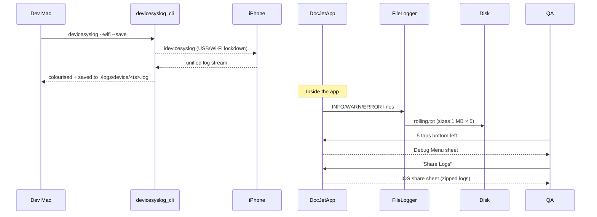

FIRST ORDER OF BUSINESS:
**READ THIS FIRST, MOTHERFUCKER, AND CONFIRM:** [hard-bob-workflow.mdc](../../../.cursor/rules/hard-bob-workflow.mdc)

# TODO: Enhanced Logging Capture – Syslog Helper & On-Device Rolling Logs

**Goal:** Make real-device log retrieval so friction-free that even Mafee can't screw it up. Two deliverables:
1.  A polished shell script (`scripts/devicesyslog.sh`) that wraps `idevicesyslog`, colour-filters DocJet lines, auto-saves to timestamped files, and optionally tunnels over Wi-Fi.
2.  On-device rolling-file logging (5 × 1 MB) with a *secret* 5-tap hot-corner that pops a Debug Menu in the Playground, letting QA share the latest zipped logs via the standard share sheet.

---

## Target Flow / Architecture

---

*MANDATORY REPORTING RULE:* For **every** task/cycle below, **before check-off and moving on to the next todo**, the dev must add **Findings** + **Handover Brief**. No silent check-offs – uncertainty gets you fucking fired.

---

## Cycle 0: Setup & Prerequisite Checks

**Goal** Establish tooling & dependencies required for both deliverables.

* 0.1. [x] **Task:** Add runtime dependencies `path_provider`, `share_plus`, `archive` (in-app zipping), **and** create CLI package `devicesyslog_cli`
    * Actions:
      1. `flutter pub add path_provider share_plus archive`
      2. `dart create -t console-full packages/devicesyslog_cli`
      3. `cd packages/devicesyslog_cli && dart pub add args ansicolor`
      4. `dart pub add --dev test mockito coverage`
    * Findings: Following best practices for mono-repo structure with multi-package support. Using `packages/` directory for all internal utilities and CLI tools, which keeps the root clean and enables better organization. Swapped Mocktail for Mockito per the developer's instruction. Note: path_provider was already a dependency, so only its constraint was updated.
* 0.2. [x] **Task:** Install & validate iOS tooling
    * Actions:
      1. `brew install libimobiledevice` (use stable; pin version via Brewfile)
      2. `brew install usbmuxd` (required for iproxy)
      3. Verify device pairing: `idevicepair validate` (fail task if exit≠0)
    * Findings: `libimobiledevice` installed successfully. `usbmuxd` was already present as a dependency. **Problem:** `idevicepair validate` returns "No device found" because the phone was connected over Wi-Fi, and `libimobiledevice` only scans lockdown (port 62078) on USB by default.
      * Quick fix (USB): plug in the lightning/USB-C cable, unlock the device, tap **Trust**, then:
        1. `idevicepair pair` → expect **SUCCESS**
        2. `idevicepair validate` → expect **SUCCESS/VALIDATED**
      * Wireless workflow: after the USB pairing step run `iproxy 62078 62078 <udid>` in a background shell; `idevicepair validate -u <udid>` now succeeds over Wi-Fi.
      * Broken pairing recovery: `idevicepair unpair -u <udid>` → `idevicepair pair -u <udid>` → validate again.
* 0.3. [x] **Task:** CLI Skeleton `bin/devicesyslog.dart`
    * Action: Replace template `main()` with argument parser stub; add executable entry in `pubspec.yaml` (`executables:` block).
    * Findings: Renamed `bin/devicesyslog_cli.dart` to `bin/devicesyslog.dart`. Populated `main()` with an `ArgParser` stub for planned flags (`--output-dir`, `--wifi`, `--udid`, `--save`, `--utc`, `--json`, `--help`). Added `executables: {devicesyslog: devicesyslog}` to `packages/devicesyslog_cli/pubspec.yaml`. Initial linter issues due to incorrect string interpolation (`\$`) fixed.
* 0.4. [x] **Update Plan:**
    * Findings: Device pairing issue from 0.2 RESOLVED. Proceeding with CLI scaffolding.
      * Action Items:
        1. Document one-time pairing and `iproxy` Wi-Fi procedure in `docs/logging_guide.md` (Cycle 4).
        2. Implement CLI skeleton (0.3) - COMPLETED.
* 0.5. [x] **Handover Brief:**
    * Status: Cycle 0 (Setup & Prerequisite Checks) COMPLETED. Dependencies installed, iOS tooling validated, `devicesyslog_cli` skeleton created (arg parsing stub, pubspec executable entry).
    * Gotchas:
        * `idevicepair validate` needs USB or `iproxy` for Wi-Fi; Wi-Fi alone initially showed "No device found".
        * `dart create` can overwrite `pubspec.yaml` if not sequenced correctly with `dart pub add`.
        * Minor linter issues in Dart stub from incorrect string interpolation (`\$`).
    * Recommendations:
        * Proceed to Cycle 1: Build `devicesyslog_cli`.
        * Ensure `docs/logging_guide.md` (Cycle 4) details iOS pairing (USB first) & `iproxy` for Wi-Fi syslog.

---

## Cycle 1: Build `devicesyslog_cli` (Dart Syslog Helper)

**Goal** Ship a delightfully usable Dart wrapper around `idevicesyslog`.

* 1.1. [ ] **Research:**
    * Explore `Process.start` vs `process_run` for streaming stdout.
    * Evaluate `ansicolor`/`ansi_styles` for colour output.
    * Derive bundle ID via `plutil` using `Process.run`.
    * Multi-device detection: invoke `idevice_id -l`; expose `--udid` or error if >1.
    * Wi-Fi streaming: start `iproxy 44 44` via `Process.start` with teardown.
    * Determine timestamp timezone (local default, `--utc` flag).
    * Findings:
* 1.2. [ ] **Tests RED:** Dart unit tests in `packages/devicesyslog_cli/test/devicesyslog_cli_test.dart` verifying:
    * Non-zero exit when no device paired **or** >1 device without `--udid`.
    * `--wifi` spawns & kills `iproxy` (mocked `Process`).
    * `--save` creates `./logs/device/YYYY-MM-DD_HH-MM-SS.log`; respects `--output-dir`.
    * Stream filters only bundle-ID lines, handling multiline payloads.
    * Colourises LEVEL tokens (INFO/WARN/ERROR) via ANSI.
    * Findings:
* 1.3. [ ] **Implement GREEN:**
    * Implement `CliRunner` class encapsulating logic; dependency-inject `ProcessManager` for tests.
    * Ensure `SIGINT` & `SIGTERM` traps for clean child-process shutdown.
    * Findings:
* 1.4. [ ] **Refactor:**
    * Add flags `--wifi`, `--udid`, `--output-dir`, `--utc`, `--json` (optional structured output).
    * Compile native binary: `dart compile exe bin/devicesyslog.dart -o ../../tools/devicesyslog`.
    * Findings:
* 1.5. [ ] **Run Cycle-Specific Tests:** `cd packages/devicesyslog_cli && dart test -r expanded`
    * Findings:
* 1.6. [ ] **Run ALL Unit/Integration Tests:**
    * Command: `./scripts/list_failed_tests.dart --except`
    * Findings:
* 1.7. [ ] **Format, Analyze, and Fix:**
    * Commands:
      1. `dart analyze .` (CLI package)
      2. `flutter pub run dart_style:format .` (root)
    * Findings:
* 1.8. [ ] **Handover Brief:**
    * Status:
    * Gotchas:
    * Recommendations:

---

## Cycle 2: Rolling-File Logger Implementation

**Goal** Persist last ~5 MB of app logs on-device using existing `LoggerFactory`.

* 2.1. [ ] **Research:**
    * Explore `logger`'s `FileOutput` + `MultiOutput` for custom sinks.
    * Prototype buffered writes on background isolate via `Isolate.spawn` or `compute`.
    * Confirm path from `getApplicationSupportDirectory()` and required iOS entitlements.
    * Findings:
* 2.2. [ ] **Tests RED:** Unit test `RollingFileOutput` ensuring:
    * rotation after 1 MB & max 5 files.
    * correct rollover when a single write crosses boundary.
    * graceful handling of `FileSystemException` (disk full / permission).
    * Findings:
* 2.3. [ ] **Implement GREEN:**
    * Create `RollingFileOutput` with buffered async writes on dedicated isolate.
    * Wire into `LoggerFactory._createLogger` alongside `ConsoleOutput`.
    * Findings:
* 2.4. [ ] **Refactor:**
    * Size & count via `const int.fromEnvironment` fallbacks (`LOG_MAX_FILES`, `LOG_MAX_BYTES`).
    * Release builds default to `Level.info`; honor runtime override via debug menu.
    * Findings:
* 2.5. [ ] **Run Cycle-Specific Tests**
    * Command: `./scripts/list_failed_tests.dart test/core/logging/rolling_file_output_test.dart --except`
    * Findings:
* 2.6. [ ] **Run ALL Unit/Integration Tests:**
    * Command: `./scripts/list_failed_tests.dart --except`
    * Findings:
* 2.7. [ ] **Format, Analyze, and Fix:**
    * Command: `./scripts/fix_format_analyze.sh`
    * Findings:
* 2.8. [ ] **Handover Brief:**
    * Status:
    * Gotchas:
    * Recommendations:

---

## Cycle 3: Secret Debug Menu & Share Sheet

**Goal** Provide QA with a gesture-activated menu in the Playground to export zipped logs.

* 3.1. [ ] **Research:**
    * Evaluate `RawGestureDetector` with custom recognizer to avoid stealing taps.
    * Study `Share.shareXFiles()` + iOS file-URL sandbox quirks.
    * Findings:
* 3.2. [ ] **Tests RED:** Widget tests verify:
    * 5 taps bottom-left triggers overlay **without** blocking underlying widgets when inactive.
    * `DebugMenuOverlay` respects `assert(kDebugMode)` (absent in release builds).
    * Findings:
* 3.3. [ ] **Implement GREEN:**
    * Add invisible `RawGestureDetector` sized 44×44 pt bottom-left.
    * Create `DebugMenuOverlay` with options: "Share Logs" (zips & invokes share), "Toggle Timestamp", "Reset Log Levels".
    * Findings:
* 3.4. [ ] **Refactor:** Extract gesture logic, ensure menu excluded in release via `assert(kDebugMode)` gate.
    * Findings:
* 3.5. [ ] **Run Cycle-Specific Tests:**
    * Command: `./scripts/list_failed_tests.dart test/ui/debug_menu/debug_menu_trigger_test.dart --except`
    * Findings:
* 3.6. [ ] **Run ALL Unit/Integration Tests:**
    * Command: `./scripts/list_failed_tests.dart --except`
    * Findings:
* 3.7. [ ] **Format, Analyze, and Fix:**
    * Command: `./scripts/fix_format_analyze.sh`
    * Findings:
* 3.8. [ ] **Handover Brief:**
    * Status:
    * Gotchas:
    * Recommendations:

---

## Cycle 4: Documentation & Final Polish

**Goal** Cement knowledge, ensure devs & QA know how to wield the new toys.

* 4.1. [ ] **Task:** Update `docs/logging_guide.md` with:
    * Syslog usage examples & troubleshooting (Wi-Fi, `iproxy`, pairing).
    * Screenshots/GIFs of Debug Menu & share flow.
    * Table of compile-time constants.
    * Findings:
* 4.2. [ ] **Task:** Add screenshot GIFs to `docs/assets/logging/`.
    * Findings:
* 4.3. [ ] **Run ALL Unit/Integration Tests:**
    * Command: `./scripts/list_failed_tests.dart --except`
    * Findings:
* 4.4. [ ] **Format, Analyze, and Fix:**
    * Command: `./scripts/fix_format_analyze.sh`
    * Findings:
* 4.5. [ ] **Run ALL E2E & Stability Tests:**
    * Command: `./scripts/run_all_tests.sh`
    * Findings:
* 4.6. [ ] **Manual Smoke Test:** Verify logs share successfully on physical device.
    * Findings:
* 4.7. [ ] **Code Review & Commit Prep:**
    * Findings:
* 4.8. [ ] **Handover Brief:**
    * Status:
    * Gotchas:
    * Recommendations:

---

## DONE

With these cycles we:
1. Delivered a badass `devicesyslog.sh` that makes tailing iOS logs a JOY.
2. Added bullet-proof on-device rolling logs surviving app murder & reboots.
3. Empowered QA with a spy-movie style 5-tap secret menu to share logs.

Dollar Bill would be proud – "I'm not renting space to uncertainty." 