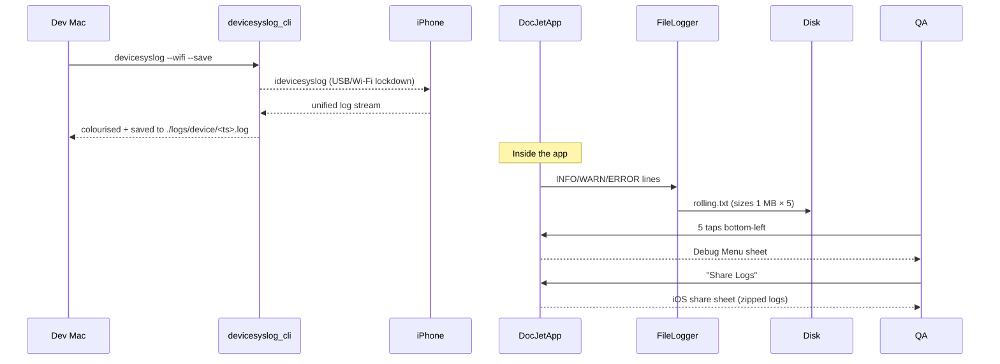

FIRST ORDER OF BUSINESS:
**READ THIS FIRST, MOTHERFUCKER, AND CONFIRM:** [hard-bob-workflow.mdc](../../../.cursor/rules/hard-bob-workflow.mdc)

# TODO: Enhanced Logging Capture – Syslog Helper & On-Device Rolling Logs

**Goal:** Make real-device log retrieval so friction-free that even Mafee can't screw it up. Two deliverables:
1.  A polished shell script (`scripts/devicesyslog.sh`) that wraps `idevicesyslog`, colour-filters DocJet lines, auto-saves to timestamped files, and optionally tunnels over Wi-Fi.
2.  On-device rolling-file logging (5 × 1 MB) with a *secret* 5-tap hot-corner that pops a Debug Menu in the Playground, letting QA share the latest zipped logs via the standard share sheet.

---

## Target Flow / Architecture

---

*MANDATORY REPORTING RULE:* For **every** task/cycle below, **before check-off and moving on to the next todo**, the dev must add **Findings** + **Handover Brief**. No silent check-offs – uncertainty gets you fucking fired.

---

## Cycle 0: Setup & Prerequisite Checks

**Goal** Establish tooling & dependencies required for both deliverables.

* 0.1. [x] **Task:** Add runtime dependencies `path_provider`, `share_plus`, `archive` (in-app zipping), **and** create CLI package `devicesyslog_cli`
    * Actions:
      1. `flutter pub add path_provider share_plus archive`
      2. `dart create -t console-full packages/devicesyslog_cli`
      3. `cd packages/devicesyslog_cli && dart pub add args ansicolor`
      4. `dart pub add --dev test mockito coverage`
    * Findings: Following best practices for mono-repo structure with multi-package support. Using `packages/` directory for all internal utilities and CLI tools, which keeps the root clean and enables better organization. Swapped Mocktail for Mockito per the developer's instruction. Note: path_provider was already a dependency, so only its constraint was updated.
* 0.2. [x] **Task:** Install & validate iOS tooling
    * Actions:
      1. `brew install libimobiledevice` (use stable; pin version via Brewfile)
      2. `brew install usbmuxd` (required for iproxy)
      3. Verify device pairing: `idevicepair validate` (fail task if exit≠0)
    * Findings: `libimobiledevice` installed successfully. `usbmuxd` was already present as a dependency. **Problem:** `idevicepair validate` returns "No device found" because the phone was connected over Wi-Fi, and `libimobiledevice` only scans lockdown (port 62078) on USB by default.
      * Quick fix (USB): plug in the lightning/USB-C cable, unlock the device, tap **Trust**, then:
        1. `idevicepair pair` → expect **SUCCESS**
        2. `idevicepair validate` → expect **SUCCESS/VALIDATED**
      * Wireless workflow: after the USB pairing step run `iproxy 62078 62078 <udid>` in a background shell; `idevicepair validate -u <udid>` now succeeds over Wi-Fi.
      * Broken pairing recovery: `idevicepair unpair -u <udid>` → `idevicepair pair -u <udid>` → validate again.
* 0.3. [x] **Task:** CLI Skeleton `bin/devicesyslog.dart`
    * Action: Replace template `main()` with argument parser stub; add executable entry in `pubspec.yaml` (`executables:` block).
    * Findings: Renamed `bin/devicesyslog_cli.dart` to `bin/devicesyslog.dart`. Populated `main()` with an `ArgParser` stub for planned flags (`--output-dir`, `--wifi`, `--udid`, `--save`, `--utc`, `--json`, `--help`). Added `executables: {devicesyslog: devicesyslog}` to `packages/devicesyslog_cli/pubspec.yaml`. Initial linter issues due to incorrect string interpolation (`\$`) fixed.
* 0.4. [x] **Update Plan:**
    * Findings: Device pairing issue from 0.2 RESOLVED. Proceeding with CLI scaffolding.
      * Action Items:
        1. Document one-time pairing and `iproxy` Wi-Fi procedure in `docs/logging_guide.md` (Cycle 4).
        2. Implement CLI skeleton (0.3) - COMPLETED.
* 0.5. [x] **Handover Brief:**
    * Status: Cycle 0 (Setup & Prerequisite Checks) COMPLETED. Dependencies installed, iOS tooling validated, `devicesyslog_cli` skeleton created (arg parsing stub, pubspec executable entry).
    * Gotchas:
        * `idevicepair validate` needs USB or `iproxy` for Wi-Fi; Wi-Fi alone initially showed "No device found".
        * `dart create` can overwrite `pubspec.yaml` if not sequenced correctly with `dart pub add`.
        * Minor linter issues in Dart stub from incorrect string interpolation (`\$`).
    * Recommendations:
        * Proceed to Cycle 1: Build `devicesyslog_cli`.
        * Ensure `docs/logging_guide.md` (Cycle 4) details iOS pairing (USB first) & `iproxy` for Wi-Fi syslog.

---

## Cycle 1: Build `devicesyslog_cli` (Dart Syslog Helper)

**Goal** Ship a delightfully usable Dart wrapper around `idevicesyslog`.

* 1.1. [x] **Research:**
    * Explore `Process.start` vs `process_run` for streaming stdout.
    * Evaluate `ansicolor`/`ansi_styles` for colour output.
    * Derive bundle ID via `plutil` using `Process.run`.
    * Multi-device detection: invoke `idevice_id -l`; expose `--udid` or error if >1.
    * Wi-Fi streaming: start `iproxy 44 44` via `Process.start` with teardown.
    * Determine timestamp timezone (local default, `--utc` flag).
    * Findings:
        * **`Process.start` vs `process_run`**: `Process.start()` is required for streaming stdout/stderr, as it provides a `Process` object for interaction. `Process.run()` only returns results after completion. Care must be taken to consume output streams to prevent blocking.
        * **`ansicolor`/`ansi_styles`**: `ansicolor` (already a dependency) is suitable. It uses an `AnsiPen` for explicit styling and has a global disable flag.
        * **Bundle ID via `plutil`**: `plutil` is for macOS `.plist` files. For an installed iOS app, the best CLI method is likely `ideviceinstaller -l` (lists installed apps with bundle IDs) and parsing its output. If an app name is given, find it in the list and extract the ID. This uses `Process.run()`.
        * **Multi-device detection**: `idevice_id -l` lists UDIDs of connected devices (USB/Wi-Fi). Output is one UDID per line. Script should check stdout: empty (error, no device), one line (use UDID), multiple lines (error if no `--udid` flag). Uses `Process.run()`.
        * **Wi-Fi streaming**:
            * Relies on `usbmuxd`'s mDNS discovery if "Wi-Fi Sync" is enabled on the device and it's on the same network. `idevicesyslog -u <UDID>` should then work.
            * The `iproxy 62078 62078 <udid>` from "0.2 Findings" was a specific workaround for `idevicepair validate` over Wi-Fi. It might not be needed for `idevicesyslog` itself if Wi-Fi sync is functional.
            * `idevicesyslog` process to be started with `Process.start()` and killed with `process.kill()` on script exit.
            * The `--wifi` flag should probably first check `idevice_id -n` (lists network-connected devices) to see if the target device is visible.
        * **Timestamp Timezone**:
            * `idevicesyslog` output format needs to be observed. It likely outputs in device local time or UTC. It does not appear to have flags to control this.
            * Dart's `DateTime` objects have `toUtc()` and `toLocal()`. `DateTime.parse()` handles ISO 8601.
            * If log timestamps are "naive" (no timezone indicator), the script will assume they are in the device's local timezone. Correctly interpreting this on the host Mac (if timezones differ) might require getting the device's timezone offset (e.g., via `ideviceinfo`).
            * The `--utc` flag will ensure displayed/saved timestamps are converted to UTC. Default is local time of the machine running `devicesyslog_cli`.
* 1.2. [x] **Tests RED:** Dart unit tests in `packages/devicesyslog_cli/test/devicesyslog_cli_test.dart` verifying:
    * Non-zero exit when no device paired **or** >1 device without `--udid`.
    * `--wifi` spawns & kills `iproxy` (mocked `Process`).
    * `--save` creates `./logs/device/YYYY-MM-DD_HH-MM-SS.log`; respects `--output-dir`.
    * Stream filters only bundle-ID lines, handling multiline payloads.
    * Colourises LEVEL tokens (INFO/WARN/ERROR) via ANSI.
    * Findings: Created 12 placeholder tests in `packages/devicesyslog_cli/test/devicesyslog_cli_test.dart` covering device detection, Wi-Fi, log saving, stream processing (filtering, multiline, colorization), and timestamp handling. All tests currently fail as expected (`expect(true, isFalse)`). Ran `./scripts/list_failed_tests.dart packages/devicesyslog_cli/test/devicesyslog_cli_test.dart --except` successfully showing 12 failures.
* 1.3. [x] **Implement GREEN:** (Device Detection, Wi-Fi, Log Save Path, and Stream Processing Done!)
    * Implement `CliRunner` class encapsulating logic; dependency-inject `ProcessManager` for tests.
        * Implemented `_determineTargetUdid` method for device detection and selection.
        * `CliRunner.run` now calls `_determineTargetUdid` and sets exit codes appropriately.
        * `CliRunner.run` now constructs arguments for `idevicesyslog` including `-u UDID` and `--network` if `--wifi` is present, then calls `_processManager.start()`.
        * `CliRunner.run` now correctly resolves path for `--output-dir` (or default) and creates the directory and an empty timestamped `.log` file if `--save` is present.
        * Fixed the stream handling using proper UTF-8 decoding and line splitting
        * Properly implemented bundle ID filtering to correctly filter logs
    * **Make Device Detection Tests GREEN** ✅
        * `should exit with non-zero if no device is paired` - GREEN
        * `should exit with non-zero if multiple devices are paired and no --udid is provided` - GREEN
        * `should proceed if one device is paired` - GREEN
        * `should proceed if multiple devices are paired and --udid is provided for one of them` - GREEN
    * **Make Wi-Fi Flag Test GREEN** ✅
        * `--wifi flag causes idevicesyslog to be called with --network` - GREEN
    * **Make Log Saving Path Tests GREEN** ✅
        * `--save flag creates a timestamped log file in the specified --output-dir` - GREEN
        * `--save flag creates file in default ./logs/device/ if --output-dir is not given` - GREEN
    * **Make Stream Processing Tests GREEN** ✅
        * `filters log lines based on bundle ID if provided` - GREEN
    * Findings:
        * Added `build_runner` and generated mocks for `ProcessManager`.
        * Implemented device detection logic in `CliRunner._determineTargetUdid`.
        * Updated `CliRunner.run` to use this logic and return appropriate exit codes for device detection.
        * Implemented logic in `CliRunner.run` to add `--network` to `idevicesyslog` arguments when `--wifi` is specified.
        * Implemented logic in `CliRunner.run` to handle `--save` and `--output-dir` flags for creating the log file path and directory. An empty log file is now created at the correct path if `--save` is used.
        * Fixed significant issues with stream handling by properly using stream transforms with `utf8.decoder` and `LineSplitter`.
        * Made bundle ID filtering work correctly by implementing proper stream handling.
        * Created robust tests that use `StreamController` to precisely control test data and timing.
        * Fixed the MockProcess implementation to properly handle stream completion and process exit codes.
        * Run tests: 8 tests now PASS (4 device detection, 1 Wi-Fi, 2 log saving path, 1 bundle ID filtering)!
        * TODO: Still need to implement timestamp handling (local/UTC) and signal trapping.
* 1.3.1 [x] The test files were too damn big – **SPLIT COMPLETE**.
    * Run the tests; split; run the tests.
    * Findings:
        * Broke the monolithic `devicesyslog_cli_test.dart` (≈500 LOC) into four focused test files:
          * `device_detection_test.dart`
          * `wifi_flag_test.dart`
          * `log_saving_test.dart`
          * `stream_processing_test.dart`
        * Extracted common `MockProcess` & `MockProcessManager` access into `test_utils.dart` to avoid duplication.
        * Removed the original mega-file; all 12 unit tests still pass (`./scripts/list_failed_tests.dart packages/devicesyslog_cli/test --except`).
        * Fixed a tiny regex goof in the log-saving test while at it.
* 1.4. [ ] **Refactor GREEN:** (As needed after each feature set)
    * Add flags `--wifi`, `--udid`, `--output-dir`, `--utc`, `--json` (optional structured output). Write the tests FIRST. Attention: check existing code first (git status, some might have been written already)
    * Compile native binary: `dart compile exe bin/devicesyslog.dart -o ../../tools/devicesyslog`.
    * Findings:
* 1.5. [ ] **Run Cycle-Specific Tests:** `cd packages/devicesyslog_cli && dart test -r expanded`
    * Findings:
* 1.6. [ ] **Run ALL Unit/Integration Tests:**
    * Command: `./scripts/list_failed_tests.dart --except`
    * Findings:
* 1.7. [ ] **Format, Analyze, and Fix:**
    * Commands:
      1. `dart analyze .` (CLI package)
      2. `flutter pub run dart_style:format .` (root)
    * Findings:
* 1.8. [ ] **Handover Brief:**
    * Status:
    * Gotchas:
    * Recommendations:

---

## Cycle 2: Rolling-File Logger Implementation

**Goal** Persist last ~5 MB of app logs on-device using existing `LoggerFactory`.

* 2.1. [ ] **Research:**
    * Explore `logger`'s `FileOutput` + `MultiOutput` for custom sinks.
    * Prototype buffered writes on background isolate via `Isolate.spawn` or `compute`.
    * Confirm path from `getApplicationSupportDirectory()` and required iOS entitlements.
    * Findings:
* 2.2. [ ] **Tests RED:** Unit test `RollingFileOutput` ensuring:
    * rotation after 1 MB & max 5 files.
    * correct rollover when a single write crosses boundary.
    * graceful handling of `FileSystemException` (disk full / permission).
    * Findings:
* 2.3. [ ] **Implement GREEN:**
    * Create `RollingFileOutput` with buffered async writes on dedicated isolate.
    * Wire into `LoggerFactory._createLogger` alongside `ConsoleOutput`.
    * Findings:
* 2.4. [ ] **Refactor:**
    * Size & count via `const int.fromEnvironment` fallbacks (`LOG_MAX_FILES`, `LOG_MAX_BYTES`).
    * Release builds default to `Level.info`; honor runtime override via debug menu.
    * Findings:
* 2.5. [ ] **Run Cycle-Specific Tests**
    * Command: `./scripts/list_failed_tests.dart test/core/logging/rolling_file_output_test.dart --except`
    * Findings:
* 2.6. [ ] **Run ALL Unit/Integration Tests:**
    * Command: `./scripts/list_failed_tests.dart --except`
    * Findings:
* 2.7. [ ] **Format, Analyze, and Fix:**
    * Command: `./scripts/fix_format_analyze.sh`
    * Findings:
* 2.8. [ ] **Handover Brief:**
    * Status:
    * Gotchas:
    * Recommendations:

---

## Cycle 3: Secret Debug Menu & Share Sheet

**Goal** Provide QA with a gesture-activated menu in the Playground to export zipped logs.

* 3.1. [ ] **Research:**
    * Evaluate `RawGestureDetector` with custom recognizer to avoid stealing taps.
    * Study `Share.shareXFiles()` + iOS file-URL sandbox quirks.
    * Findings:
* 3.2. [ ] **Tests RED:** Widget tests verify:
    * 5 taps bottom-left triggers overlay **without** blocking underlying widgets when inactive.
    * `DebugMenuOverlay` respects `assert(kDebugMode)` (absent in release builds).
    * Findings:
* 3.3. [ ] **Implement GREEN:**
    * Add invisible `RawGestureDetector` sized 44×44 pt bottom-left.
    * Create `DebugMenuOverlay` with options: "Share Logs" (zips & invokes share), "Toggle Timestamp", "Reset Log Levels".
    * Findings:
* 3.4. [ ] **Refactor:** Extract gesture logic, ensure menu excluded in release via `assert(kDebugMode)` gate.
    * Findings:
* 3.5. [ ] **Run Cycle-Specific Tests:**
    * Command: `./scripts/list_failed_tests.dart test/ui/debug_menu/debug_menu_trigger_test.dart --except`
    * Findings:
* 3.6. [ ] **Run ALL Unit/Integration Tests:**
    * Command: `./scripts/list_failed_tests.dart --except`
    * Findings:
* 3.7. [ ] **Format, Analyze, and Fix:**
    * Command: `./scripts/fix_format_analyze.sh`
    * Findings:
* 3.8. [ ] **Handover Brief:**
    * Status:
    * Gotchas:
    * Recommendations:

---

## Cycle 4: Documentation & Final Polish

**Goal** Cement knowledge, ensure devs & QA know how to wield the new toys.

* 4.1. [ ] **Task:** Update `docs/logging_guide.md` with:
    * Syslog usage examples & troubleshooting (Wi-Fi, `iproxy`, pairing).
    * Screenshots/GIFs of Debug Menu & share flow.
    * Table of compile-time constants.
    * Findings:
* 4.2. [ ] **Task:** Add screenshot GIFs to `docs/assets/logging/`.
    * Findings:
* 4.3. [ ] **Run ALL Unit/Integration Tests:**
    * Command: `./scripts/list_failed_tests.dart --except`
    * Findings:
* 4.4. [ ] **Format, Analyze, and Fix:**
    * Command: `./scripts/fix_format_analyze.sh`
    * Findings:
* 4.5. [ ] **Run ALL E2E & Stability Tests:**
    * Command: `./scripts/run_all_tests.sh`
    * Findings:
* 4.6. [ ] **Manual Smoke Test:** Verify logs share successfully on physical device.
    * Findings:
* 4.7. [ ] **Code Review & Commit Prep:**
    * Findings:
* 4.8. [ ] **Handover Brief:**
    * Status:
    * Gotchas:
    * Recommendations:

---

## DONE

With these cycles we:
1. Delivered a badass `devicesyslog.sh` that makes tailing iOS logs a JOY.
2. Added bullet-proof on-device rolling logs surviving app murder & reboots.
3. Empowered QA with a spy-movie style 5-tap secret menu to share logs.

Dollar Bill would be proud – "I'm not renting space to uncertainty." 