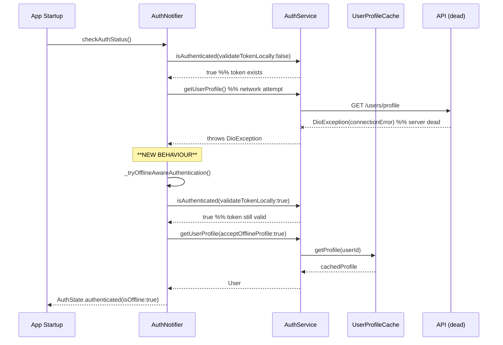

# TODO: Fix Offline Authentication Fallback Logic

**Date:** 2025-05-03
**Status:** Open
**Reporter:** Hard Bob (via Analysis)

**Related Documents:**
*   `docs/current/refactoring/offline-profile-cache-todo_done.md` (Specifically Issue #4 and Cycle 10)
*   `docs/current/feature-auth-architecture.md`

## 1. Problem Description

Users encounter an authentication failure when restarting the app under specific offline conditions, even with valid cached credentials.

**Scenario:**

1.  User runs the app with a working backend (e.g., using `scripts/run_with_mock.sh`).
2.  User logs in successfully. Authentication tokens and user profile are cached locally.
3.  The backend server becomes unavailable (e.g., mock server process is killed, network connection lost).
4.  User closes and restarts the mobile app.
5.  **Result:** Instead of being logged in using the cached credentials and profile (in an offline state), the user is presented with the Login screen and an error message like "Failed to fetch user profile".

This directly contradicts the intended offline-first authentication behavior, where cached credentials should allow the user to remain authenticated.

## 2. Root Cause Analysis

🚨 **New Evidence (2025-05-03 19:46 log tail)** proves the control-flow in `AuthNotifier` **does** fall back correctly *if* it receives an `offlineOperation` error or a raw `DioException`.  The failure is born **earlier** – inside the service layer.

### Where it really breaks

1.  `AuthNotifier.checkAuthStatus()` → calls `_authService.getUserProfile()`.
2.  `UserApiClient.getUserProfile()` makes the network request → the socket blows up (`DioExceptionType.connectionError`).
3.  **UserApiClient / AuthServiceImpl** catch that *connectivity* `DioException` and wrap it **blindly** as:

    ```dart
    throw AuthException.userProfileFetchFailed(
      'Network error while fetching user profile: ...',
    );
    ```

4.  That exception reaches `AuthNotifier`, but **it isn't classified as `offlineOperation`**, so the notifier treats it as a "real" error and maps to `AuthState.error` → Login screen.

### Smoking-gun log lines

```
[DioException] connection refused
[UserApiClient] Network error …
[AuthServiceImpl] … throws AuthException.userProfileFetchFailed
[AuthNotifier] Caught AuthException … type: userProfileFetchFailed
[AuthNotifier] mapping to error state
```

So the notifier's fallback wiring is healthy; the upstream error-mapper mis-labels connectivity failures.

---

## 3. Impact

This bug severely undermines the offline authentication capabilities of the application:

*   **Poor User Experience:** Users with intermittent network connectivity or who restart the app while temporarily offline are unnecessarily forced to log in again.
*   **Broken Offline Promise:** It negates the benefit of caching credentials and profiles if they cannot be used reliably during startup when the network is down.
*   **Reduced App Resilience:** The app becomes less resilient to temporary server outages or network issues.

---

## 4. Proposed Fix – **Correct Error Classification In Service Layer**

1. **When** any network call in `UserApiClient` / `AuthServiceImpl._fetchProfileFromNetworkAndCache` catches `DioException` whose `type` is one of:
   `connectionError | sendTimeout | receiveTimeout | connectionTimeout`
   → throw **`AuthException.offlineOperation()`** (with a helpful message) instead of `userProfileFetchFailed`.

2. Keep `userProfileFetchFailed` for genuine 4xx/5xx or malformed data scenarios.

3. No change needed in `AuthNotifier`: it already recognises `offlineOperation` and triggers `_tryOfflineAwareAuthentication()`.

4. Add unit tests for:
   * **Service layer**: connection-error → `offlineOperation`.
   * **Notifier** integration: cached token + service throws `offlineOperation` → final state is `authenticated` + `isOffline == true`.

---

# THE PLAN (re-targeted)

FIRST ORDER OF BUSINESS:
**READ THIS FIRST, MOTHERFUCKER, AND CONFIRM:** [hard-bob-workflow.mdc](../../../.cursor/rules/hard-bob-workflow.mdc)

# TODO: Fix Offline Authentication Fallback Logic

**Goal:** Ensure the app **always** authenticates with cached tokens & profile when the backend is unreachable on startup. Users with valid creds must land in an **authenticated-offline** state, *never* on the login screen with a bullshit "Failed to fetch profile" error.

---

## Target Flow / Architecture



The offline fallback is triggered **only** for network-type `DioException`s or `AuthException.offlineOperation` during the initial profile fetch.

---

**MANDATORY REPORTING RULE:** For **every** task/cycle below, **before check-off**, add a *Findings* + *Handover Brief* paragraph **inside this doc**. No silent check-offs – uncertainty gets you fucking fired.

---

## Cycle 0: Baseline Verification & Safety Net

* 0.1. [ ] **Task:** Replicate bug on-device
    * Action: Run `./scripts/run_with_mock.sh`, login, kill server, restart app.
    * Findings:
* 0.2. [ ] **Task:** Snapshot current `AuthNotifier.checkAuthStatus()`
    * Action: Read `lib/core/auth/presentation/auth_notifier.dart` lines around the try/catch.
    * Findings:
* 0.3. [ ] **Task:** Ensure test infra ready
    * Action: Locate / create `test/core/auth/presentation/auth_notifier_test.dart` with mock helpers.
    * Findings:
* 0.4. [ ] **Handover Brief:**
    * Status: …
    * Gotchas: …
    * Recommendations: …

---

## Cycle 1: RED – Reproduce Failure in **Service Layer**

* 1.1. [ ] **Research:** Identify catch-points:
    * `UserApiClient.getUserProfile()`
    * `AuthServiceImpl._fetchProfileFromNetworkAndCache`
* 1.2. [ ] **Tests RED:**
    * File: `test/core/auth/infrastructure/auth_service_offline_test.dart`
    * Cases:
      1. `UserApiClient` throws `DioException(connectionError)` → expect **`AuthException.offlineOperation`**.
      2. `DioException.badCertificate` or HTTP 500 → expect **`AuthException.userProfileFetchFailed`** (control).
* 1.3. [ ] **Run tests:** Confirm they fail (currently returns `userProfileFetchFailed`).
* 1.4. [ ] **Handover Brief:** …

---

## Cycle 2: GREEN – Patch **UserApiClient / AuthServiceImpl**

* 2.1. [ ] **Implement:**
    * In the `catch` blocks where `DioException` is mapped, add:
      ```dart
      if (_isConnectivityError(e.type)) {
        throw AuthException.offlineOperation('Network unavailable: ${e.message}');
      }
      ```
    * Keep existing mapping for other cases.
* 2.2. [ ] **Refactor:** Extract `_isConnectivityError` into a shared util if needed.
* 2.3. [ ] **Run Cycle-specific tests:** The new service tests turn GREEN.
* 2.4. [ ] **Notifier Sanity Test:** Cached token + service now throws `offlineOperation` → expect `authenticated / isOffline` (reuse or extend existing notifier test file).
* 2.5. [ ] **Run ALL Unit/Integration Tests:** `./scripts/list_failed_tests.dart --except`
* 2.6. [ ] **Format / Analyze:** `./scripts/fix_format_analyze.sh`
* 2.7. [ ] **Handover Brief:** …

---

## Cycle 3: Hardening & Regression Nets

* 3.1. [ ] **Stress Tests:** Re-run E2E with flaky network script (toggle server up/down).
* 3.2. [ ] **Docs:** Amend `feature-auth-architecture.md` – add note that service layer classifies connectivity as `offlineOperation`.
* 3.3. [ ] **DONE checklist:** Full test suite + manual smoke.
* 3.4. [ ] **Handover Brief:** …

---

## DONE

When all cycles green we:
1. Guarantee offline startup using cached creds when the server is AWOL.
2. Cement a test harness reproducing the edge-case so it never regresses.
3. Tighten AuthNotifier logging & error-type hygiene.

No bullshit, no uncertainty – *"I'm not renting space to uncertainty."* – Dollar Bill. 