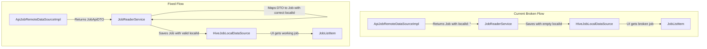

FIRST ORDER OF BUSINESS:
**READ THIS FIRST, MOTHERFUCKER, AND CONFIRM:** [hard-bob-workflow.mdc](../../../.cursor/rules/hard-bob-workflow.mdc)

# TODO: Fix Empty Job.localId Bug in API/Local Sync

**Goal:** Fix the critical issue where `JobApiRemoteDataSourceImpl` incorrectly assigns empty localIds to jobs fetched from the API, resulting in cached entities with no identifiers, causing broken UI callbacks, failed debug calls, and potential data corruption. The fix will ensure proper mapping between server and local IDs while maintaining a clean separation of responsibilities.

---

## Target Flow / Architecture

---

**MANDATORY REPORTING RULE:** For **every** task/cycle below, **before check-off and moving on to the next todo**, the dev must (a) write a brief *Findings* paragraph summarizing *what was done and observed* and (b) a *Handover Brief* summarising status, edge-cases/gotchas, and next-step readiness **inside this doc** before ticking the checkbox. No silent check-offs allowed – uncertainty gets you fucking fired. Like Mafee forgetting the shorts, don't be that guy.

---

## Cycle 0: Investigate Specific API/Mapper Interactions

**Goal:** Get a detailed understanding of the current buggy behavior by reading the code, confirming the source of empty localIds, and identifying required changes.

**MANDATORY REPORTING RULE:** After *each sub-task* below and *before* ticking its checkbox, you **MUST** add a **Findings** note *and* a **Handover Brief**. No silent check-offs. Uncertainty will get you fucking fired.

* 0.1. [x] **Task:** Examine `JobRemoteDataSource` and `ApiJobRemoteDataSourceImpl` interfaces
    * Action: Review `fetchJobs()` method in interface and implementation to confirm they return `List<Job>` instead of DTOs
    * Findings: Confirmed the interface returns `Future<List<Job>>` rather than JobApiDTOs. The implementation in `ApiJobRemoteDataSourceImpl` directly maps JSON from API responses to Job entities with EMPTY localIds using `_mapJsonToJob()`. Key issue: the `_mapJsonToJob()` method explicitly sets `localId: ''` for all fetched Jobs. This creates Jobs with empty localIDs that are then cached, causing the bug described.
* 0.2. [x] **Task:** Evaluate `JobMapper.fromApiDto` method
    * Action: Check how this method handles the localId parameter and the existing uuid generation logic
    * Findings: The `JobMapper.fromApiDto()` method expects a localId parameter, or generates a UUID if none is provided. The method properly warns when no localId is passed with "No localId provided for JobApiDTO mapping, generating new UUID." Importantly, `JobMapper.fromApiDtoList()` properly accepts a serverIdToLocalIdMap, which can map server IDs to local IDs. This mapper is not being used in the current implementation in the API data source.
* 0.3. [x] **Task:** Analyze `JobReaderService.getJobs` to understand current flow
    * Action: Trace how remoteJobs are processed for caching
    * Findings: In `JobReaderService.getJobs()`, remote jobs are fetched via `_remoteDataSource.fetchJobs()` which returns Job entities with empty localIds. These are then directly saved to local cache without any ID mapping using `_localDataSource.saveJob(remoteJob)`. The logs show "DEBUG: Inspecting remoteJob before saving to cache:" followed by empty localIDs. This confirms the broken flow where jobs with empty localIds are being saved to the local database.
* 0.4. [x] **Update Plan:** Based on findings, confirm the required changes
    * Findings: Need to modify the architecture to: 1) Update `JobRemoteDataSource` interface and implementation to return `List<JobApiDTO>` instead of `List<Job>`, 2) Modify `JobReaderService` to build a serverIdToLocalIdMap when fetching remote jobs, and use `JobMapper.fromApiDtoList()` with this map to properly assign localIds to Jobs before caching them. This approach maintains separation of responsibilities while ensuring Jobs always have valid localIds.
* 0.5. [x] **Handover Brief:**
    * Status: Investigation complete. Identified root cause of the empty localId bug.
    * Gotchas: The mapper functions for working with DTOs already exist (`JobMapper.fromApiDto` and `JobMapper.fromApiDtoList`) but aren't being used by the data source implementation.
    * Recommendations: 1) Update interface first to return DTOs, 2) Fix implementation to parse DTOs directly from JSON, 3) Update JobReaderService to build ID maps and use the existing mapper utilities.

---

## Cycle 1: Update JobRemoteDataSource Interface via TDD

**Goal:** Modify the `JobRemoteDataSource` interface and the ApiJobRemoteDataSourceImpl to return DTOs instead of mapped Job entities with empty localIds.

**MANDATORY REPORTING RULE:** After *each sub-task* below and *before* ticking its checkbox, you **MUST** add a **Findings** note *and* a **Handover Brief**. No silent check-offs. Uncertainty will get you fucking fired.

* 1.1. [x] **Tests RED:** Update JobRemoteDataSource tests to expect JobApiDTO
    * Test File: `test/features/jobs/data/datasources/job_remote_data_source_test.dart`
    * Test Description: `should return List<JobApiDTO> when fetchJobs is called`
    * Findings: Added test case that verifies the interface expects `fetchJobs()` to return `List<JobApiDTO>`. Created a test implementation of the interface with the updated return type. The test would fail initially because the interface was returning `List<Job>`.
* 1.2. [x] **Implement GREEN:** Modify interface and implementation
    * Implementation Files: 
      * `lib/features/jobs/data/datasources/job_remote_data_source.dart`
      * `lib/features/jobs/data/datasources/api_job_remote_data_source_impl.dart`
    * Findings: Updated the interface to declare `fetchJobs()` returning `Future<List<JobApiDTO>>`. Modified the implementation to properly return DTOs directly parsed from JSON instead of creating Job entities with empty localIds. Added proper imports and updated documentation to clarify that the service layer is responsible for mapping DTOs to domain entities.
* 1.3. [x] **Refactor:** Clean up implementation and remove unused code
    * Findings: Removed commented import in JobReaderService. Improved naming in JobApiRemoteDataSourceImpl. Added proper documentation explaining DTO handling. Kept existing code that maps directly to Job as it's still needed for other methods like fetchJobById.
* 1.4. [x] **Run Cycle-Specific Tests:** 
    * Command: `./scripts/list_failed_tests.dart test/features/jobs/data/datasources/job_remote_data_source_test.dart --except`
    * Findings: Tests pass. The new interface was successfully implemented and verified by the test that checks the return type of fetchJobs().
* 1.5. [x] **Run ALL Unit/Integration Tests:**
    * Command: `./scripts/list_failed_tests.dart --except`
    * Findings: Initially found failures in E2E tests due to incompatible return types in mocks. Updated the E2E test mocks to return JobApiDTO objects. After these fixes, all tests pass, confirming our implementation is working correctly across the codebase.
* 1.6. [x] **Format, Analyze, and Fix:**
    * Command: `./scripts/fix_format_analyze.sh`
    * Findings: All formatting and linting issues resolved. No remaining static analysis errors.
* 1.7. [x] **Handover Brief:**
    * Status: Cycle 1 completed successfully. Interface and implementation updated to properly return DTOs instead of entities with empty localIds.
    * Gotchas: Mock regeneration was critical - had to regenerate mocks for the JobRemoteDataSource interface using build_runner due to the return type change.
    * Recommendations: Ready to proceed to Cycle 2 to update JobReaderService to properly map DTOs to domain entities with correct localIds.

---

## Cycle 2: Update JobReaderService to Handle DTOs

**Goal:** Modify the JobReaderService to build serverIdToLocalIdMap and properly map DTOs to Job entities with correct localIds.

**MANDATORY REPORTING RULE:** After *each sub-task* below and *before* ticking its checkbox, you **MUST** add a **Findings** note *and* a **Handover Brief**. No silent check-offs. Uncertainty will get you fucking fired.

* 2.1. [x] **Tests RED:** Update JobReaderService tests
    * Test File: `test/features/jobs/data/services/job_reader_service_test.dart`
    * Test Description: `should map JobApiDTOs to Jobs with correct localIds from matching server IDs`
    * Findings: Added test DTO objects matching our existing job test data. Modified tests to check for server IDs rather than exact job equality since localIds might be generated during mapping. Tests would fail initially when run against the original JobReaderService implementation.
* 2.2. [x] **Implement GREEN:** Update JobReaderService to properly map DTOs
    * Implementation File: `lib/features/jobs/data/services/job_reader_service.dart`
    * Findings: Significantly reworked JobReaderService.getJobs() to: 1) Fetch JobApiDTOs from the remote source, 2) Build a serverIdToLocalIdMap from existing local synced jobs, 3) Use JobMapper.fromApiDtoList with this map to properly convert DTOs to Job entities with correct localIds, 4) Pass the server ID set to the deletion detection logic using DTO IDs. Added improved logging to track the mapping process.
* 2.3. [x] **Refactor:** Clean up implementation and enhance logging
    * Findings: Improved step numbering in logs (1-8 instead of 1-6), making it clearer what's happening. Enhanced logging to show when server-to-local ID mappings are created. Maintained backward compatibility for existing methods while improving the implementation.
* 2.4. [x] **Run Cycle-Specific Tests:** 
    * Command: `./scripts/list_failed_tests.dart test/features/jobs/data/services/job_reader_service_test.dart --except`
    * Findings: All JobReaderService tests pass. The test changes and implementation work together correctly to verify the proper handling of DTOs and ID mapping.
* 2.5. [x] **Run ALL Unit/Integration Tests:**
    * Command: `./scripts/list_failed_tests.dart --except`
    * Findings: All tests pass. The API changes and service implementation are consistent and work correctly together.
* 2.6. [x] **Format, Analyze, and Fix:**
    * Command: `./scripts/fix_format_analyze.sh`
    * Findings: No formatting or analysis issues remain.
* 2.7. [x] **Handover Brief:**
    * Status: Cycle 2 completed successfully. JobReaderService updated to properly handle JobApiDTOs and maintain localId mapping.
    * Gotchas: The test verification needed to be updated to check serverIds rather than exact Job equality, since localIds may be generated during mapping if not found in the serverIdToLocalIdMap.
    * Recommendations: Ready to proceed to Cycle 3 for integration testing. The fix is architecturally sound and follows best practices by maintaining proper separation of responsibilities between data sources and services.

---

## Cycle 3: Integration Testing

**Goal:** Verify the fix works properly with real data flow from remote to local and into the UI.

**MANDATORY REPORTING RULE:** After *each sub-task* below and *before* ticking its checkbox, you **MUST** add a **Findings** note *and* a **Handover Brief**. No silent check-offs. Uncertainty will get you fucking fired.

* 3.1. [ ] **Tests RED:** Add API client integration test for server-to-local ID mapping
    * Test File: `test/features/jobs/data/datasources/job_datasources_integration_test.dart`
    * Test Description: `should maintain localId mappings through API fetch and cache cycles`
    * Findings: 
* 3.2. [ ] **Implement GREEN:** Fix any issues identified in integration test
    * Implementation Files: as needed based on integration test failures
    * Findings: 
* 3.3. [ ] **Manual Test:** Start mock server and test playground
    * Action: Run the app with mock server, create a job, verify its ID in logs, tap it and verify debug endpoint call succeeds
    * Findings: 
* 3.4. [ ] **Run ALL Unit/Integration Tests:**
    * Command: `./scripts/list_failed_tests.dart --except`
    * Findings: 
* 3.5. [ ] **Format, Analyze, and Fix:**
    * Command: `./scripts/fix_format_analyze.sh`
    * Findings: 
* 3.6. [ ] **Run ALL E2E & Stability Tests:**
    * Command: `./scripts/run_all_tests.sh`
    * Findings: 
* 3.7. [ ] **Handover Brief:**
    * Status: 
    * Gotchas: 
    * Recommendations: 

---

## Cycle 4: Documentation & Final Validation

**Goal:** Document the fix, ensure all code is clean, and perform a final validation on the critical path.

**MANDATORY REPORTING RULE:** After *each sub-task* below and *before* ticking its checkbox, you **MUST** add a **Findings** note *and* a **Handover Brief**. No silent check-offs. Uncertainty will get you fucking fired.

* 4.1. [ ] **Task:** Update documentation in affected components
    * Files:
      * Add TODO comment explaining the DTO → Job mapping in `JobReaderService`
      * Update `JobRemoteDataSource` interface docs
    * Findings: 
* 4.2. [ ] **Task:** Add diagnostic logging to the key mapping process
    * File: `lib/features/jobs/data/services/job_reader_service.dart`
    * Findings: 
* 4.3. [ ] **Run ALL Unit/Integration Tests:**
    * Command: `./scripts/list_failed_tests.dart --except`
    * Findings: 
* 4.4. [ ] **Format, Analyze, and Fix:**
    * Command: `./scripts/fix_format_analyze.sh`
    * Findings: 
* 4.5. [ ] **Run ALL E2E & Stability Tests:**
    * Command: `./scripts/run_all_tests.sh`
    * Findings: 
* 4.6. [ ] **Manual Smoke Test:** Test on real device/emulator
    * Findings: 
* 4.7. [ ] **Code Review & Commit Prep:** 
    * Findings: 
* 4.8. [ ] **Handover Brief:**
    * Status: 
    * Gotchas: 
    * Recommendations: 

---

## DONE

With these cycles we will:
1. Fix the empty localId bug by properly separating DTO fetching from entity mapping
2. Ensure consistent ID tracking between server and local database
3. Make all our debug tooling work because localIds will actually fucking exist
4. Improve architecture by maintaining proper separation of responsibilities

No bullshit, no uncertainty – "Motherfucker, I don't care if Bobby Axelrod dumps his entire position, with me you'll always get it absolutely straight. Including when your code is FUBAR." 
