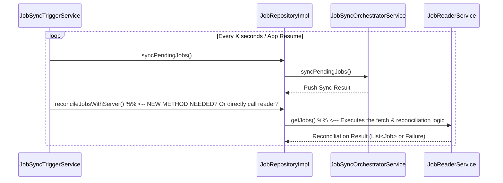

FIRST ORDER OF BUSINESS:
**READ THIS FIRST, MOTHERFUCKER, AND CONFIRM:** [hard-bob-workflow.mdc](../../../.cursor/rules/hard-bob-workflow.mdc)

# TODO: Fix Job Sync Reconciliation & Server-Side Deletion Detection

**Goal:** Ensure the local job cache accurately reflects the server's state, specifically handling jobs deleted on the server. The current system only *pushes* local changes (`pending`, `pendingDeletion`) but lacks a reliable trigger for *pulling* the full server state and reconciling (which is done by `JobReaderService.getJobs`). This leads to ghost jobs persisting locally after being deleted server-side. We need to implement a proper trigger for this reconciliation logic.

---

## Target Flow / Architecture (Proposed)

The `JobReaderService.getJobs` method contains the logic to compare local synced jobs with the full server list and detect deletions. This method needs to be invoked reliably. Potential triggers:

1.  **Periodic Trigger:** Integrate the `JobReaderService.getJobs` call into the existing `JobSyncTriggerService` timer loop, alongside the push sync (`syncPendingJobs`).
2.  **App Lifecycle Trigger:** Call `JobReaderService.getJobs` when the app comes to the foreground.
3.  **Manual Trigger:** Implement pull-to-refresh on the job list UI to explicitly trigger `JobReaderService.getJobs`.

**Option 1 (Periodic Trigger) seems most robust for background consistency:**



---

**MANDATORY REPORTING RULE:** For **every** task/cycle below, **before check-off and moving on to the next todo**, the dev must (a) write a brief *Findings* paragraph summarizing *what was done and observed* and (b) a *Handover Brief* summarising status, edge-cases/gotchas, and next-step readiness **inside this doc** before ticking the checkbox. No silent check-offs allowed – uncertainty gets you fucking fired. Like Mafee forgetting the shorts, don't be that guy.

---

## Cycle 0: Investigation & Confirmation

**Goal** Confirm the exact points where reconciliation *should* be triggered but isn't, and finalize the chosen trigger strategy.

**MANDATORY REPORTING RULE:** After *each sub-task* below and *before* ticking its checkbox, you **MUST** add a **Findings** note *and* a **Handover Brief**. No silent check-offs. Uncertainty will get you fucking fired.

* 0.1. [x] **Task:** Review `JobSyncTriggerService` & `JobSyncOrchestratorService`.
    * Findings: Confirmed. `JobSyncTriggerService` periodically calls `JobRepository.syncPendingJobs()`, which delegates to `JobSyncOrchestratorService.syncPendingJobs()`. This orchestrator method *only* gathers local jobs marked `pending`, `pendingDeletion`, or `error` and passes them to `JobSyncProcessorService` for API interaction. It *does not* call `JobReaderService.getJobs` to pull the full server state or perform reconciliation for server-side deletions.
* 0.2. [x] **Task:** Review App Lifecycle Observers (if any interact with job sync).
    * Action: Search for `WidgetsBindingObserver` implementations or similar lifecycle hooks that might relate to job data.
    * Findings: No other `WidgetsBindingObserver` implementations were found outside of `JobSyncTriggerService`. The existing lifecycle hook in `JobSyncTriggerService` only triggers `syncPendingJobs` (push) on app resume, it does not invoke `JobReaderService.getJobs` (pull/reconcile).
* 0.3. [x] **Task:** Review Job List UI Refresh Logic.
    * Action: Check the code for the Job List page/cubit to see how data is loaded/refreshed (e.g., initial load, pull-to-refresh).
    * Findings: Confirmed. The `JobListCubit` uses `WatchJobsUseCase` to get a stream of jobs. It calls `refreshJobs` (which subscribes to the stream) on initialization and potentially on pull-to-refresh. However, `WatchJobsUseCase` reflects the data currently held by `JobReaderService`/`JobLocalDataSource`. Neither the Cubit nor the likely `WatchJobsUseCase` implementation triggers the full server fetch and reconciliation performed by `JobReaderService.getJobs`. The UI *depends* on reconciliation happening elsewhere; it doesn't trigger it.
* 0.4. [x] **Task:** Decide on Trigger Strategy.
    * Action: Based on findings, select the best trigger(s) (Periodic, Lifecycle, Manual, Combination?). Periodic seems best for consistency.
    * Findings: Investigation confirms no existing trigger invokes `JobReaderService.getJobs` for reconciliation. The optimal strategy is to modify `JobSyncTriggerService` to invoke the reconciliation logic (`JobReaderService.getJobs`, possibly via a new repository method) periodically within its timer callback, in addition to the existing `syncPendingJobs` call. This provides consistent background reconciliation.
* 0.5. [x] **Update Plan:** [Based on findings, confirm or adjust the plan for subsequent cycles.]
    * Findings: Plan confirmed. Cycle 1 will focus on implementing the periodic reconciliation trigger within `JobSyncTriggerService` as decided in 0.4. No change required.
* 0.6. [x] **Handover Brief:**
    * Status: Investigation complete. Confirmed via code review that server reconciliation (`JobReaderService.getJobs`) is not currently triggered by the periodic sync timer, app lifecycle events, or UI refresh logic. The existing sync only pushes local changes. Periodic trigger strategy chosen and plan for Cycle 1 confirmed.
    * Gotchas: Need to consider potential race conditions or performance implications of running `syncPendingJobs` (push) and the new reconciliation logic (pull) within the same timer tick. `JobSyncOrchestratorService` uses a mutex for `syncPendingJobs`; the reconciliation logic might need similar protection or careful sequential execution within the `JobSyncTriggerService` callback.
    * Recommendations: Proceed with Cycle 1 to implement the periodic trigger in `JobSyncTriggerService`. Add a new method to `JobRepository` (e.g., `reconcileJobsWithServer`) that calls `JobReaderService.getJobs`, and invoke this new method from the trigger service's timer callback, likely right after `syncPendingJobs` (ensuring error handling for both). Address potential locking/coordination in Task 1.1.

---

## 💥 Consolidated Findings (2025-05-05)
*   **Root Cause:** The pull/reconciliation path (`JobReaderService.getJobs`) is *only* executed when somebody explicitly calls `JobRepository.getJobs()`. Neither the periodic timer, the lifecycle-observer, nor the UI's `WatchJobsUseCase` triggers it. Result: server-deleted jobs remain in Hive forever.
*   **Proof:**
    * `JobSyncTriggerService._triggerSync()` delegates solely to `syncPendingJobs()` (push) – see cite lines 50-80 of the file.
    * Unit tests for the trigger service expect *only* that call.
    * E2E `job_sync_server_deletion_detection_e2e_test.dart` must manually call `getJobs()` to make the deletion detection run.
*   **Implementation Constraints & Pitfalls:**
    1.  Run **push first**, then **pull** sequentially to avoid concurrent Hive writes.
    2.  Guard against overlapping ticks with a lightweight `_inProgress` flag or reuse the orchestrator mutex.
    3.  Expect test fallout: every trigger-service unit test needs to stub & verify the new `reconcileJobsWithServer()` (or `getJobs`) call.
    4.  Production battery/data-usage: pull every 15 s is acceptable for now; fine-tune later.

---

## Cycle 1: [Implement Periodic Reconciliation Trigger via JobReaderService.getJobs]

**Goal** Modify the periodic sync mechanism to include a call to `JobReaderService.getJobs`, ensuring server state is reconciled regularly.

**Implementation Rules (reflecting consolidated findings):**
1.  **Sequence (MUST-FOLLOW):** Inside `JobSyncTriggerService._triggerSync()` do **exactly**:
    ```dart
    await _jobRepository.syncPendingJobs();
    await _jobRepository.reconcileJobsWithServer(); // NEW METHOD – MUST await
    ```
    Do **not** swap the order, do **not** wrap them in `Future.wait`.
2.  **Guard:** Introduce a private `Mutex _triggerMutex` **in `JobSyncTriggerService` itself** (re-use `package:mutex`). Wrap the entire body of `_triggerSync()` with `await _triggerMutex.acquire()/release();` so overlapping timer fires or lifecycle events are skipped.
3.  **API:**
    * Add `Future<Either<Failure, Unit>> reconcileJobsWithServer()` **to**:
        * `JobRepository` interface (`lib/features/jobs/domain/repositories/job_repository.dart`)
        * `JobRepositoryImpl` implementation – delegate to `_readerService.getJobs()` and ignore the returned list (only log failures).
    * Update DI `jobs_module.dart` – nothing extra needed because same singleton.
4.  **Logging (NO EXCEPTIONS):**
    * Tag: `JobSyncTriggerService` → log `Sync-Pull OK` or `Sync-Pull FAILURE: $failure` **after** await.
    * Tag: `JobRepositoryImpl` → log when `reconcileJobsWithServer` is entered/exited.
5.  **Error handling:** If `reconcileJobsWithServer()` returns `Left`, log **warning**, do **not** rethrow.
6.  **Testing (red → green):**
    * Update `test/features/jobs/data/services/job_sync_trigger_service_test.dart`:
        * Expect **both** `syncPendingJobs()` and `reconcileJobsWithServer()` calls in timer & lifecycle tests.
    * Create `test/features/jobs/data/repositories/job_repository_reconcile_test.dart` (new) – verify impl delegates to `_readerService.getJobs()`.
7.  **Docs:**
    * Update **`docs/current/feature-job-dataflow.md`** – add subsection *"Periodic Pull/Reconciliation"* and tweak sequence diagrams.
    * Update **`docs/current/architecture-overview.md`** – note dual push/pull sync trigger.
    * Add new ADR **`docs/adr/2025-05-05_job-sync-periodic-pull.md`** capturing the decision.

(The sub-task checklist below now follows the full Hard-Bob template.)

* 1.1. [ ] **Research:** Evaluate if using the orchestrator's existing `_syncMutex` is sufficient or if a **new** mutex in `JobSyncTriggerService` is required (hint: use a new one – keep responsibilities separate).
    * Findings: [...]
* 1.2. [ ] **Tests RED:**
    *   File 1: `test/features/jobs/data/services/job_sync_trigger_service_test.dart`
        *   `timer callback should invoke syncPendingJobs AND reconcileJobsWithServer`
        *   `app resume should invoke both calls`
    *   File 2: `test/features/jobs/data/repositories/job_repository_reconcile_test.dart`
        *   `should delegate to readerService.getJobs()`
    * Findings: [...]
* 1.3. [ ] **Implement GREEN:** Follow Implementation Rules §1-§5 exactly.
    * Code touched: `job_repository.dart`, `job_repository_impl.dart`, `job_sync_trigger_service.dart`
    * Findings: [...]
* 1.4. [ ] **Refactor:** Clean code, rename vars, ensure no duplication.
    * Findings: [...]
* 1.5. [ ] **Run Cycle-Specific Tests:** `./scripts/list_failed_tests.dart test/features/jobs/data/services/job_sync_trigger_service_test.dart --except`
    * Findings: [...]
* 1.6. [ ] **Manual Test (Crucial):** Simulate server deletion; confirm local ghost is removed w/o manual refresh.
    * Findings: [...]
* 1.7. [ ] **Update Documentation:**
    * 1.7.1 **feature-job-dataflow.md** – add "Periodic Pull/Reconciliation" section & update diagrams.
    * 1.7.2 **architecture-overview.md** – describe push-then-pull flow.
    * 1.7.3 **ADR 2025-05-05_job-sync-periodic-pull.md** – record decision.
    * Findings: [...]
* 1.8. [ ] **Run ALL Unit/Integration Tests:** `./scripts/list_failed_tests.dart --except`
* 1.9. [ ] **Format, Analyze, Fix:** `./scripts/fix_format_analyze.sh`
* 1.10. [ ] **Run ALL E2E & Stability Tests:** `./scripts/run_all_tests.sh`
* 1.11. [ ] **Handover Brief:** Status, gotchas, perf impact, next steps.