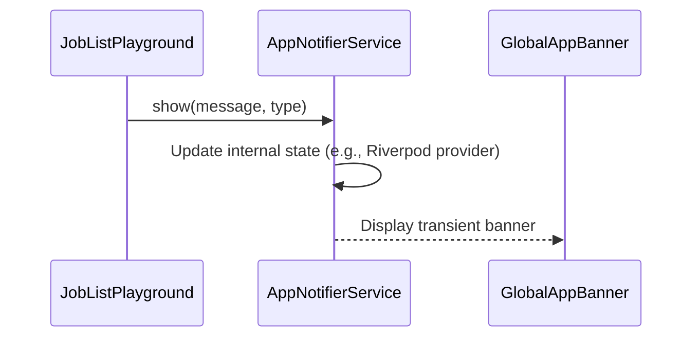

FIRST ORDER OF BUSINESS:
**READ THIS FIRST, MOTHERFUCKER, AND CONFIRM:** [hard-bob-workflow.mdc](../../../.cursor/rules/hard-bob-workflow.mdc)

# TODO: Fix `JobListPlayground` Crash by Replacing `ScaffoldMessenger` with `AppNotifierService`

**Goal:** Eliminate the `_scaffolds.isNotEmpty` assertion crash in `JobListPlayground` when creating a job from an audio recording. This happens because `CupertinoPageScaffold` doesn't provide a Material `Scaffold` ancestor for `ScaffoldMessenger.showSnackBar`. We will replace the direct `ScaffoldMessenger` calls with our robust, app-wide `AppNotifierService` to display user feedback, ensuring UI consistency and stability. This isn't just about fixing a crash; it's about adhering to our own damn notification patterns!

---

## Target Flow / Architecture

The `JobListPlayground` currently attempts to show a `SnackBar` like this:

```dart
// In _JobListPlaygroundContentState._createJobFromAudioFile
// ...
final messenger = ScaffoldMessenger.maybeOf(context);
messenger?.showSnackBar(
  const SnackBar(
    content: Text('Creating new job from recording... Check status!'),
    // ...
  ),
);
// ... similar call for error
```

This will be replaced by invoking the `AppNotifierService`:

```dart
// In _JobListPlaygroundContentState._createJobFromAudioFile
// ...
// Assuming _appNotifierService is available in the state class
_appNotifierService.show(
  message: 'Creating new job from recording... Check status!',
  type: MessageType.info, // Or success, as appropriate
);
// ... similar call for error, using MessageType.error
```

**Sequence Diagram (Simplified):**


---

**MANDATORY REPORTING RULE:** For **every** task/cycle below, **before check-off and moving on to the next todo**, the dev must (a) write a brief *Findings* paragraph summarizing *what was done and observed* and (b) a *Handover Brief* summarising status at the end of the cycle, edge-cases/gotchas, and next-step readiness **inside this doc** before ticking the checkbox. No silent check-offs allowed – uncertainty gets you fucking fired. Like Mafee forgetting the shorts, don't be that guy.

---

## Cycle 0: Setup & Prerequisite Checks

**Goal:** Ensure `AppNotifierService` is accessible within `_JobListPlaygroundContentState` and understand its API for showing informational and error messages. We're not guessing here; we're verifying the tools before we swing the hammer.

**MANDATORY REPORTING RULE:** After *each sub-task* below and *before* ticking its checkbox, you **MUST** add a **Findings** note *and* a **Handover Brief**. No silent check-offs. Uncertainty will get you fucking fired.

**APPLY MODEL ATTENTION**: The apply model is a bit tricky to work with! For large files, edits can take up to 20s; so you might need to double check if you don't get an affirmative answer right away. Go in smaller edits.

* 0.1. [ ] **Task:** Verify `AppNotifierService` Availability in `_JobListPlaygroundContentState`.
    * Action: Review `lib/features/jobs/presentation/pages/job_list_playground.dart`. Determine how `AppNotifierService` can be accessed. It's likely available via `ref.read(appNotifierServiceProvider.notifier)` if `_JobListPlaygroundContentState` is converted to a `ConsumerStatefulWidget` / `ConsumerState`, or passed down from `JobListPlayground` if we keep it a `StatefulWidget`.
    * Findings: [Record how `AppNotifierService` will be accessed. Note any necessary refactoring to make it available (e.g., converting widget type, constructor dependency).]
* 0.2. [ ] **Task:** Review `AppNotifierService` API.
    * Action: Examine `lib/core/common/notifiers/app_notifier_service.dart` and `lib/core/common/models/app_message.dart`. Confirm the method signature for `show()` and the available `MessageType` enum values (e.g., `info`, `success`, `error`, `warning`).
    * Findings: [Confirm method signature and relevant `MessageType` values. E.g., `show(message: String, type: MessageType, duration: Duration?)`.]
* 0.3. [ ] **Update Plan:** Confirm chosen method for accessing `AppNotifierService` and that its API is suitable for replacing the `SnackBar` calls.
    * Findings: [e.g., "Plan confirmed. Will convert `_JobListPlaygroundContent` to `ConsumerStatefulWidget` to access `AppNotifierService` via `ref`."]
* 0.4. [ ] **Handover Brief:**
    * Status: Setup complete. Clear path to accessing and using `AppNotifierService`.
    * Gotchas: [Any immediate concerns about widget lifecycle or state management due to accessing the notifier?]
    * Recommendations: Proceed to Cycle 1.

---

## Cycle 1: Implement `AppNotifierService` for Feedback in `JobListPlayground`

**Goal:** Replace the crash-prone `ScaffoldMessenger.showSnackBar` calls in `_JobListPlaygroundContentState._createJobFromAudioFile` with `AppNotifierService.show()` for both success and error feedback. Make it robust, make it clean.

**MANDATORY REPORTING RULE:** After *each sub-task* below and *before* ticking its checkbox, you **MUST** add a **Findings** note *and* a **Handover Brief** at the end of the cycle. No silent check-offs. Uncertainty will get you fucking fired.

**APPLY MODEL ATTENTION**: The apply model is a bit tricky to work with! For large files, edits can take up to 20s; so you might need to double check if you don't get an affirmative answer right away. Go in smaller edits.

* 1.1. [ ] **Research:** (Covered by Cycle 0 - we know our tools).
    * Findings: N/A.
* 1.2. [ ] **Tests RED:** (Manual for this UI change – the existing crash IS our red state. We will verify by manually testing the scenario that previously crashed.)
    * Test File: N/A (Manual verification)
    * Test Description: Manually trigger audio recording and job creation in `JobListPlayground` on an iOS Simulator. Observe for crashes and ensure appropriate feedback is displayed via the `AppNotifierService`'s banner.
    * Findings: [Current state: Crash occurs due to `ScaffoldMessenger` assertion.]
* 1.3. [ ] **Implement GREEN:** Modify `_JobListPlaygroundContentState._createJobFromAudioFile` in `lib/features/jobs/presentation/pages/job_list_playground.dart`.
    * Action 1: If necessary (based on Cycle 0.1 Findings), refactor `_JobListPlaygroundContent` to `ConsumerStatefulWidget` and `_JobListPlaygroundContentState` to `ConsumerState` to access `ref`. Get an instance of `AppNotifierService` (e.g., `final appNotifier = ref.read(appNotifierServiceProvider.notifier);`).
    * Action 2: Replace the `ScaffoldMessenger.maybeOf(context)?.showSnackBar(...)` call for the success message (around line 176) with `appNotifier.show(message: 'Creating new job from recording... Check status!', type: MessageType.info);`.
    * Action 3: Replace the `ScaffoldMessenger.maybeOf(context)?.showSnackBar(...)` call for the error message (around line 188) with `appNotifier.show(message: 'Error creating job from audio: $e', type: MessageType.error);`.
    * Findings: [Confirm code changes are made. Note any challenges during implementation.]
* 1.4. [ ] **Refactor:** Clean up the code. Ensure imports are correct.
    * Findings: [Describe refactoring. Confirm no new linter issues via `dart analyze`.]
* 1.5. [ ] **Run Cycle-Specific Tests:** (Manual Verification)
    * Command: Manually test on iOS Simulator:
        1. Go to `JobListPlayground`.
        2. Tap the "+" button.
        3. Record a short audio.
        4. Confirm and save the recording.
        5. Verify that an `AppNotifierService` banner appears for "Creating new job..." (info/success).
        6. (Optional, harder to force) If an error occurs during job creation, verify an error banner appears.
    * Findings: [Confirm no crash. Confirm appropriate `AppNotifierService` messages are displayed for success and (if tested) error scenarios.]
* 1.6. [ ] **Run ALL Unit/Integration Tests:** (Likely no impact, but good practice)
    * Command: `./scripts/list_failed_tests.dart --except`
    * Findings: `[Confirm ALL unit/integration tests pass. FIX if not.]`
* 1.7. [ ] **Format, Analyze, and Fix:**
    * Command: `./scripts/fix_format_analyze.sh`
    * Findings: `[Confirm ALL formatting and analysis issues are fixed. FIX if not.]`
* 1.8. [ ] **Run ALL E2E & Stability Tests:**
    * Command: `./scripts/run_all_tests.sh`
    * Findings: `[Confirm ALL tests pass, including E2E and stability checks. FIX if not.]`
* 1.9. [ ] **Handover Brief:**
    * Status: `ScaffoldMessenger` calls replaced with `AppNotifierService` in `JobListPlayground`. Crash on job creation from audio is resolved. Feedback is now consistent with the rest of the app.
    * Gotchas: [Any unexpected behavior with `AppNotifierService` or UI updates?]
    * Recommendations: This fix is solid. Commit it like you mean it.

---

## Cycle N: Final Polish, Documentation & Cleanup

**Goal:** Ensure everything is pristine. This is a small fix, so this cycle is mostly a sanity check.

**MANDATORY REPORTING RULE:** After *each sub-task* below and *before* ticking its checkbox, you **MUST** add a **Findings** note *and* a **Handover Brief** at the end of the cycle. No silent check-offs. Uncertainty will get you fucking fired.

* N.1. [ ] **Task:** Update Architecture Docs (If `JobListPlayground` is considered a key UI component in any docs, this might warrant a mention, but likely not for a playground fix).
    * File: N/A unless specific playground documentation exists and needs updating.
    * Findings: [Confirm if any docs needed an update, and if so, that they were updated.]
* N.2. [ ] **Task:** Remove Deprecated Code (No deprecated code from this change).
    * Action: N/A.
    * Findings: N/A.
* N.3. [ ] **Run ALL Unit/Integration Tests:**
    * Command: `./scripts/list_failed_tests.dart --except`
    * Findings: `[Confirm ALL unit/integration tests pass. FIX if not.]`
* N.4. [ ] **Format, Analyze, and Fix:**
    * Command: `./scripts/fix_format_analyze.sh`
    * Findings: `[Confirm ALL formatting and analysis issues are fixed. FIX if not.]`
* N.5. [ ] **Run ALL E2E & Stability Tests:**
    * Command: `./scripts/run_all_tests.sh`
    * Findings: `[Confirm ALL tests pass, including E2E and stability checks. FIX if not.]`
* N.6. [ ] **Manual Smoke Test:** Re-verify the fix on an iOS Simulator and, if feeling frisky, a real device.
    * Findings: [Confirm fix holds up.]
* N.7. [ ] **Code Review & Commit Prep:** Review staged changes (`git diff --staged | cat`), ensure adherence to guidelines.
    * Findings: [Confirm code is clean, follows principles, ready for Hard Bob Commit. The change should be localized to `job_list_playground.dart`.]
* N.8. [ ] **Handover Brief:**
    * Status: Playground crash fixed, notifications standardized. Code is tighter than a gnat's ass.
    * Gotchas: None expected.
    * Recommendations: Ship this motherfucker.

---

## DONE

With these cycles we:
1. Identified the root cause of the `ScaffoldMessenger` crash in `JobListPlayground` (Cupertino vs. Material scaffold context).
2. Replaced the problematic `SnackBar` calls with the app's standard `AppNotifierService`.
3. Ensured the `JobListPlayground` provides user feedback reliably and consistently with the application's UI patterns.

No bullshit, no uncertainty – "Certainty is a big part of this job." - Bobby Axelrod. 