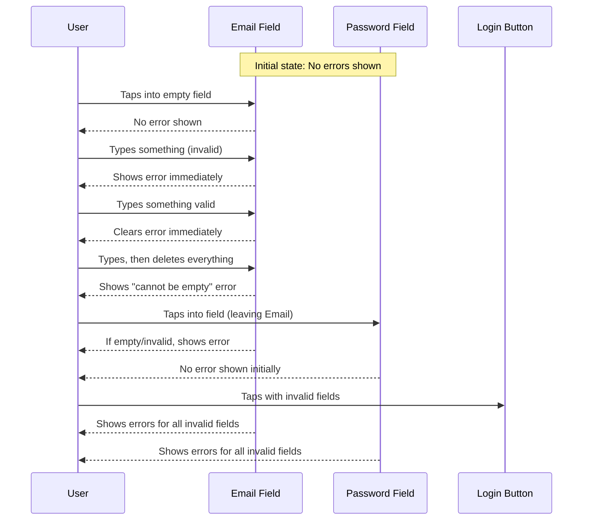

FIRST ORDER OF BUSINESS:
**READ THIS FIRST, MOTHERFUCKER, AND CONFIRM:** [hard-bob-workflow.mdc](../../../.cursor/rules/hard-bob-workflow.mdc)

# TODO: Improve Login Form Validation UX

**Goal:** Enhance the login form validation UX to provide immediate feedback when users interact with fields, showing errors only at appropriate times, resulting in clearer user guidance and reduced frustration.

---

## Target Flow / Architecture

---

**MANDATORY REPORTING RULE:** For **every** task/cycle below, **before check-off and moving on to the next todo**, the dev must (a) write a brief *Findings* paragraph summarizing *what was done and observed* and (b) a *Handover Brief* summarising status at the end of the cycle, edge-cases/gotchas, and next-step readiness **inside this doc** before ticking the checkbox. No silent check-offs allowed – uncertainty gets you fucking fired. Like Mafee forgetting the shorts, don't be that guy.

---

## Cycle 0: Understanding Current Validation Logic

**Goal:** Analyze the current implementation to fully understand the validation flow, identify what needs to be changed, and ensure we have a clear picture of what we're working with.

**MANDATORY REPORTING RULE:** After *each sub-task* below and *before* ticking its checkbox, you **MUST** add a **Findings** note *and* a **Handover Brief**. No silent check-offs. Uncertainty will get you fucking fired.

**APPLY MODEL ATTENTION**: The apply model is a bit tricky to work with! For large files, edits can take up to 20s; so you might need to double check if you don't get an affirmative answer right away. Go in smaller edits.

* 0.1. [ ] **Task:** Analyze current validation implementation in `login_screen.dart`
    * Action: Review the `_validateForm` method and identify its triggers
    * Findings: [Record how validation works currently, how errors are shown/hidden]
* 0.2. [ ] **Task:** Analyze error display logic in widget build method
    * Action: Review how errors are displayed in the UI based on state variables
    * Findings: [Document how errors connect to the UI elements]
* 0.3. [ ] **Update Plan:** Based on findings, confirm or adjust the plan for subsequent cycles
    * Findings: [Confirm or adjust the validation implementation plan]
* 0.4. [ ] **Handover Brief:**
    * Status: [Analysis complete, ready for implementation phase]
    * Gotchas: [Any complexities or edge cases discovered]
    * Recommendations: [Any adjustments to the implementation approach]

---

## Cycle 1: Implement FocusNode-based Validation

**Goal:** Add FocusNodes to both fields and implement the core validation logic that shows errors when appropriate (on typing after initial input, on field exit, and on login attempt).

**MANDATORY REPORTING RULE:** After *each sub-task* below and *before* ticking its checkbox, you **MUST** add a **Findings** note *and* a **Handover Brief** at the end of the cycle. No silent check-offs. Uncertainty will get you fucking fired.

**APPLY MODEL ATTENTION**: The apply model is a bit tricky to work with! For large files, edits can take up to 20s; so you might need to double check if you don't get an affirmative answer right away. Go in smaller edits.

* 1.1. [ ] **Research:** Check if FocusNode is already used elsewhere in the app
    * Findings: [Document any existing FocusNode usage patterns]
* 1.2. [ ] **Implementation:** Add FocusNode instances and field tracking
    * Actions: 
      * Add FocusNode instances for email and password fields
      * Add state variables to track if fields have been interacted with
    * Findings: [Document the additions and any challenges]
* 1.3. [ ] **Implementation:** Split validation logic into separate functions
    * Actions:
      * Create separate validation functions for email and password
      * Ensure they return appropriate error messages or null
    * Findings: [Document the validation function implementation]
* 1.4. [ ] **Implementation:** Update focus listeners
    * Actions:
      * Add listeners to clear errors on focus
      * Add listeners to validate on blur (focus lost)
    * Findings: [Document the focus listener implementation]
* 1.5. [ ] **Implementation:** Update text change listeners
    * Actions: 
      * Modify text listeners to validate immediately when a field has been interacted with
      * Ensure they update error state appropriately
    * Findings: [Document the text change listener implementation]
* 1.6. [ ] **Implementation:** Update login handler
    * Actions:
      * Ensure login attempt validates all fields
      * Mark fields as interacted with when login is attempted
    * Findings: [Document login handler changes]
* 1.7. [ ] **Format, Analyze, and Fix:**
    * Command: `./scripts/fix_format_analyze.sh`
    * Findings: `[Confirm ALL formatting and analysis issues are fixed. FIX if not.]`
* 1.8. [ ] **Implementation:** Update UI connection in the build method
    * Actions:
      * Ensure FocusNodes are assigned to the fields
      * Ensure error display is connected to the updated error state
    * Findings: [Document UI connection changes]
* 1.9. [ ] **Handover Brief:**
    * Status: [e.g., Core validation logic implemented with FocusNodes]
    * Gotchas: [Any tricky bits or edge cases]
    * Recommendations: [Next steps or testing approach]

---

## Cycle 2: Manual Testing & Refinement

**Goal:** Test all validation scenarios manually, refine the implementation to match the exact requirements, and ensure a polished user experience.

**MANDATORY REPORTING RULE:** After *each sub-task* below and *before* ticking its checkbox, you **MUST** add a **Findings** note *and* a **Handover Brief** at the end of the cycle. No silent check-offs. Uncertainty will get you fucking fired.

**APPLY MODEL ATTENTION**: The apply model is a bit tricky to work with! For large files, edits can take up to 20s; so you might need to double check if you don't get an affirmative answer right away. Go in smaller edits.

* 2.1. [ ] **Test Scenario:** Initial field entry (empty)
    * Action: Enter empty fields, observe no errors
    * Findings: [Document behavior and any issues]
* 2.2. [ ] **Test Scenario:** Typing invalid content
    * Action: Type invalid content in fields, observe immediate errors
    * Findings: [Document behavior and any issues]
* 2.3. [ ] **Test Scenario:** Typing then deleting all content
    * Action: Type something then delete everything, observe errors
    * Findings: [Document behavior and any issues]
* 2.4. [ ] **Test Scenario:** Moving between fields
    * Action: Move from email to password and vice versa, observe error behavior
    * Findings: [Document behavior and any issues]
* 2.5. [ ] **Test Scenario:** Attempting login with errors
    * Action: Try to login with invalid fields, observe errors
    * Findings: [Document behavior and any issues]
* 2.6. [ ] **Refinement:** Fix any issues found during testing
    * Actions: Make any necessary adjustments to the implementation
    * Findings: [Document changes made and why]
* 2.7. [ ] **Format, Analyze, and Fix:**
    * Command: `./scripts/fix_format_analyze.sh`
    * Findings: `[Confirm ALL formatting and analysis issues are fixed. FIX if not.]`
* 2.8. [ ] **Run ALL E2E & Stability Tests:**
    * Command: `./scripts/run_all_tests.sh`
    * Findings: `[Confirm ALL tests pass, including E2E and stability checks. FIX if not.]`
* 2.9. [ ] **Handover Brief:**
    * Status: [Implementation tested and refined]
    * Gotchas: [Any remaining edge cases or potential issues]
    * Recommendations: [Final cleanup needs or readiness for review]

---

## Cycle 3: Final Review & Cleanup

**Goal:** Perform a final review of the implementation, clean up any remaining issues, and ensure the code is clean, well-structured, and ready for production.

**MANDATORY REPORTING RULE:** After *each sub-task* below and *before* ticking its checkbox, you **MUST** add a **Findings** note *and* a **Handover Brief** at the end of the cycle. No silent check-offs. Uncertainty will get you fucking fired.

**APPLY MODEL ATTENTION**: The apply model is a bit tricky to work with! For large files, edits can take up to 20s; so you might need to double check if you don't get an affirmative answer right away. Go in smaller edits.

* 3.1. [ ] **Task:** Code review & cleanup
    * Action: Review final implementation for cleanliness and best practices
    * Findings: [Document any final cleanup or improvements]
* 3.2. [ ] **Task:** Add code comments if needed
    * Action: Add any necessary explanatory comments for complex logic
    * Findings: [Document any comments added and their purpose]
* 3.3. [ ] **Run ALL Unit/Integration Tests:**
    * Command: `./scripts/list_failed_tests.dart --except`
    * Findings: `[Confirm ALL unit/integration tests pass. FIX if not.]`
* 3.4. [ ] **Format, Analyze, and Fix:**
    * Command: `./scripts/fix_format_analyze.sh`
    * Findings: `[Confirm ALL formatting and analysis issues are fixed. FIX if not.]`
* 3.5. [ ] **Run ALL E2E & Stability Tests:**
    * Command: `./scripts/run_all_tests.sh`
    * Findings: `[Confirm ALL tests pass, including E2E and stability checks. FIX if not.]`
* 3.6. [ ] **Manual Smoke Test:** Test login screen validation on a real device or emulator
    * Findings: [Describe test steps and results]
* 3.7. [ ] **Code Review & Commit Prep:** Review staged changes, ensure adherence to guidelines
    * Findings: [Confirm code is clean, follows principles, ready for Hard Bob Commit]
* 3.8. [ ] **Handover Brief:**
    * Status: [e.g., Feature complete, tested, documented, ready for commit]
    * Gotchas: [Any final caveats or observations]
    * Recommendations: [Merge it, ship it, or burn it?]

---

## DONE

With these cycles we:
1. Improved the login form validation UX by showing errors at appropriate times
2. Provided immediate feedback when users interact with fields
3. Ensured a clean and professional user experience during form validation
4. Implemented proper focus management to control error visibility

No bullshit, no uncertainty – "Like Dollar Bill says, we don't confuse the scoreboard with the game." 