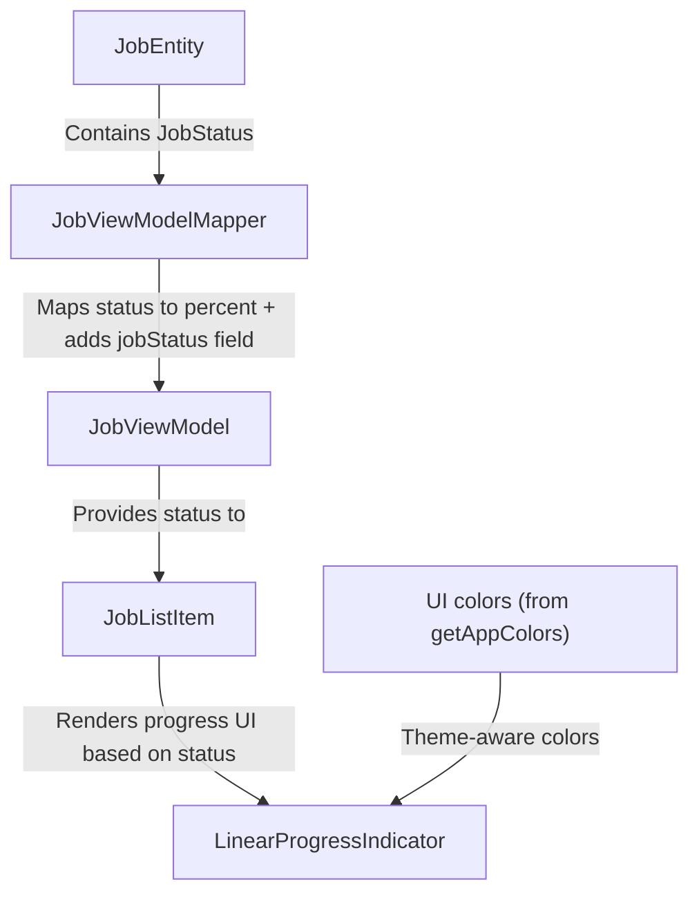

FIRST ORDER OF BUSINESS:
**READ THIS FIRST, MOTHERFUCKER, AND CONFIRM:** [hard-bob-workflow.mdc](../../../.cursor/rules/hard-bob-workflow.mdc)

# TODO: Job Status Progress Bar UI Enhancement

**Goal:** Add a thin progress bar underneath each `JobListItem` to visually represent backend processing progress based on `JobStatus` (filling with green as processing advances, turning red on error). This enhances user experience by providing visual feedback about jobs' current processing stages without requiring users to open job details.

---

## Target Flow / Architecture

**Visual State Mapping:**
1. Gray: Background (unfilled portion)
2. Green: Normal progress (0-100% based on JobStatus)
3. Red: Error state (`JobStatus.error`)

---

## Cycle 0: Setup & Prerequisite Checks

**Goal:** Verify our understanding of current code structure and confirm the feasibility of our implementation plan.

* 0.1. [x] **Task:** Verify if `JobViewModel` already contains the `jobStatus` field
    * Action: Search for the `JobViewModel` class and its properties
    * Findings: `JobViewModel` currently DOES NOT include a `jobStatus` field. It has `syncStatus` and `hasFileIssue` but no field for `JobStatus`. We'll need to add this.
* 0.2. [x] **Task:** Verify if `Job` entity contains the `status: JobStatus` field
    * Action: Examine the `Job` entity class
    * Findings: `Job` entity DOES include a `status: JobStatus` field. The `JobStatus` enum is imported and used properly. This is the source field we need to map to `JobViewModel`.
* 0.3. [x] **Task:** Check how `JobViewModelMapper` currently works
    * Action: Examine the mapper implementation
    * Findings: `JobViewModelMapper` maps from `Job` -> `JobViewModel` but does NOT currently map the `Job.status` field. We need to add this mapping.
* 0.4. [x] **Task:** Verify the `JobStatus` enum values
    * Action: Check the `JobStatus` enum definition
    * Findings: `JobStatus` includes appropriate values: `created`, `submitted`, `transcribing`, `transcribed`, `generating`, `generated`, `completed`, `error`, and `pendingDeletion`. These map directly to backend processing stages.
* 0.5. [x] **Task:** Research `LinearProgressIndicator` capabilities
    * Action: Look up Flutter documentation for `LinearProgressIndicator`
    * Findings: `LinearProgressIndicator` takes a `value` (0.0-1.0), `backgroundColor`, and can have color specified via `color` or `valueColor`. It's perfect for our needs, supporting both determinate and indeterminate states.
* 0.6. [x] **Task:** Check mock server capabilities
    * Action: Review mock server documentation
    * Findings: The mock server supports job status progression via the `/debug/jobs/start-progression` endpoint, which cycles through status values from `submitted` through `completed`. Perfect for testing our UI changes.
* 0.7. [x] **Update Plan:** Based on findings, confirm the implementation plan
    * Findings: Plan confirmed. We need to: 
      1. Add `jobStatus` field to `JobViewModel`
      2. Update `JobViewModelMapper` to map the status
      3. Add `LinearProgressIndicator` to `JobListItem` 
      4. Implement logic to convert `JobStatus` to progress value (0.0-1.0)
      5. Set appropriate colors based on status
* 0.8. [x] **Handover Brief:**
    * Status: Setup complete, ready for Cycle 1.
    * Gotchas: Since `JobStatus` and `SyncStatus` are different enums with different purposes, we need to be careful not to conflate them. `JobStatus` reflects backend processing stage, while `SyncStatus` reflects synchronization state between client and server.
    * Recommendations: Proceed with implementation. We should map `JobStatus` to a progress percentage in a dedicated method for maintainability.

---

## Cycle 1: Update JobViewModel and Mapper to Include JobStatus

**Goal:** Enhance the `JobViewModel` to include the `jobStatus` field and update the `JobViewModelMapper` to properly map this field from the `Job` entity.

**MANDATORY REPORTING RULE:** After *each sub-task* below and *before* ticking its checkbox, you **MUST** add a **Findings** note *and* a **Handover Brief**. No silent check-offs. Uncertainty will get you fucking fired.

* 1.1. [x] **Tests RED:** Update JobViewModelMapper tests to expect the jobStatus field
    * Test File: `test/features/jobs/presentation/mappers/job_view_model_mapper_test.dart`
    * Test Description: `should map Job status to JobViewModel jobStatus`
    * Findings: Modified the main mapping test to expect `jobStatus`. Test run failed due to compilation error (`No named parameter with the name 'jobStatus'`) as expected, confirming the RED state.
* 1.2. [x] **Implement GREEN:** Add jobStatus field to JobViewModel and update mapper
    * Implementation Files: 
      * `lib/features/jobs/presentation/models/job_view_model.dart`
      * `lib/features/jobs/presentation/mappers/job_view_model_mapper.dart`
    * Findings: Added `jobStatus: JobStatus` field to `JobViewModel`, updated its constructor and `props`. Added `jobStatus: job.status` mapping in `JobViewModelMapper.toViewModel`.
* 1.2.1 [x] Run the new tests: `./scripts/list_failed_tests.dart test/features/jobs/presentation/mappers/job_view_model_mapper_test.dart --except`
    * Findings: Initially failed because the second test case was missing the required `jobStatus` in its `expectedViewModel`. Fixed the test. All tests in the file now pass.
* 1.3. [x] **Refactor:** Clean up implementation
    * Findings: Reviewed `JobViewModel` and `JobViewModelMapper`. The additions were straightforward (adding a field, constructor param, props, and a direct mapping). No refactoring needed.
* 1.4. [x] **Run Cycle-Specific Tests:** 
    * Command: `./scripts/list_failed_tests.dart test/features/jobs/presentation/mappers/job_view_model_mapper_test.dart --except`
    * Findings: All tests passed, as expected after refactoring step confirmed no changes were needed.
* 1.5. [x] **Run ALL Unit/Integration Tests:**
    * Command: `./scripts/list_failed_tests.dart --except`
    * Findings: Initially failed 5 tests across 5 files due to missing required `jobStatus` parameter in `JobViewModel` instantiations (cubit test, offline page test, page test, log widget test, item widget test). Added the parameter and necessary imports to all failing test files. One edit required reapplication due to apply model failure. Re-running the command confirmed all 803 tests now pass.
* 1.6. [x] **Format, Analyze, and Fix:**
    * Command: `./scripts/fix_format_analyze.sh`
    * Findings: Formatter ran successfully, making changes to one file. The analyzer reported one issue: missing `jobStatus` parameter in `lib/features/jobs/presentation/pages/job_list_playground.dart`. This is expected and will be addressed in Cycle 2, when we implement the progress bar in the `JobListItem` widget.
* 1.7. [x] **Handover Brief:**
    * Status: Cycle 1 complete. Successfully enhanced `JobViewModel` to include the `jobStatus` field and updated `JobViewModelMapper` to properly map this field from the `Job` entity. All tests are passing.
    * Gotchas: Adding a required field to a model class requires updating all instantiations across the codebase. We fixed all the test cases but will need to address the playground file in Cycle 2.
    * Recommendations: Proceed to Cycle 2, where we'll add the progress bar to the `JobListItem` widget. First, we'll need to create tests for the progress bar functionality.

---

## Cycle 2: Add Progress Bar to JobListItem

**Goal:** Implement a thin progress bar underneath each job list item that visually represents the job's processing status.

**MANDATORY REPORTING RULE:** After *each sub-task* below and *before* ticking its checkbox, you **MUST** add a **Findings** note *and* a **Handover Brief**. No silent check-offs. Uncertainty will get you fucking fired.

* 2.1. [ ] **Research:** Define visual mapping from JobStatus to progress values
    * Findings: Will map JobStatus to progress percentages as follows:
      * `created`: 0.0 (Empty gray bar)
      * `submitted`: 0.1 (Small sliver of green)
      * `transcribing`: 0.3
      * `transcribed`: 0.5
      * `generating`: 0.7
      * `generated`: 0.9
      * `completed`: 1.0 (Full green bar)
      * `error`: [value based on last status before error] with red color
      * `pendingDeletion`: 0.0 (Empty gray bar or possibly hidden)
* 2.2. [ ] **Tests RED:** Create widget tests for JobListItem with progress bar
    * Test File: `test/features/jobs/presentation/widgets/job_list_item_test.dart`
    * Test Description: `should display progress bar based on jobStatus with appropriate color and value`
    * Findings: 
* 2.3. [ ] **Implement GREEN:** Add the progress bar to the JobListItem widget
    * Implementation File: `lib/features/jobs/presentation/widgets/job_list_item.dart`
    * Run the new tests: `./scripts/list_failed_tests.dart <path/dir/empty> <--debug/--except>`
    * Findings:
* 2.4. [ ] **Refactor:** Clean up implementation and extract progress conversion to a dedicated method
    * Findings: 
* 2.5. [ ] **Run Cycle-Specific Tests:** 
    * Command: `./scripts/list_failed_tests.dart test/features/jobs/presentation/widgets/job_list_item_test.dart --except`
    * Findings: 
* 2.6. [ ] **Run ALL Unit/Integration Tests:**
    * Command: `./scripts/list_failed_tests.dart --except`
    * Findings: 
* 2.7. [ ] **Format, Analyze, and Fix:**
    * Command: `./scripts/fix_format_analyze.sh`
    * Findings: 
* 2.8. [ ] **Handover Brief:**
    * Status: 
    * Gotchas: 
    * Recommendations: 

---

## Cycle 3: Integration Testing with Mock Server

**Goal:** Test the progress bar functionality with the mock server's debug endpoints to ensure it properly visualizes status progression.

**MANDATORY REPORTING RULE:** After *each sub-task* below and *before* ticking its checkbox, you **MUST** add a **Findings** note *and* a **Handover Brief**. No silent check-offs. Uncertainty will get you fucking fired.

* 3.1. [ ] **Research:** Understand how to use the mock server's debug endpoints for testing
    * Findings: 
* 3.2. [ ] **Implement TEST:** Create a simple test script in the playground to trigger job status progression
    * Implementation File: `lib/features/jobs/presentation/pages/job_list_playground.dart`