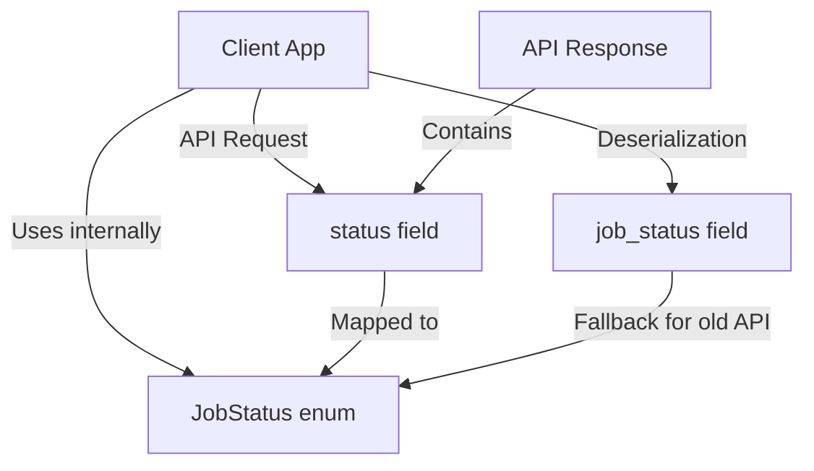

FIRST ORDER OF BUSINESS:
**READ THIS FIRST, MOTHERFUCKER, AND CONFIRM:** [hard-bob-workflow.mdc](../../../.cursor/rules/hard-bob-workflow.mdc)

# TODO: API Field Refactoring - Replace "job_status" with "status"

**Goal:** Refactor our API interaction layer to use "status" instead of "job_status" for job status data, maintaining backward compatibility while minimizing codebase changes. This standardizes our API field naming convention without requiring a full-scale internal code refactoring, making the API more intuitive while keeping the project's internal structure intact.

---

## Target Flow / Architecture

---

**MANDATORY REPORTING RULE:** For **every** task/cycle below, **before check-off and moving on to the next todo**, the dev must (a) write a brief *Findings* paragraph summarizing *what was done and observed* and (b) a *Handover Brief* summarising status at the end of the cycle, edge-cases/gotchas, and next-step readiness **inside this doc** before ticking the checkbox. No silent check-offs allowed – uncertainty gets you fucking fired. Like Mafee forgetting the shorts, don't be that guy.

---

## Cycle 0: Setup & Analysis

**Goal:** Thoroughly identify all locations where "job_status" is used in API interactions to ensure a complete understanding of the refactoring scope and establish a testing baseline before making any changes.

**MANDATORY REPORTING RULE:** After *each sub-task* below and *before* ticking its checkbox, you **MUST** add a **Findings** note *and* a **Handover Brief**. No silent check-offs. Uncertainty will get you fucking fired.

**APPLY MODEL ATTENTION**: The apply model is a bit tricky to work with! For large files, edits can take up to 20s; so you might need to double check if you don't get an affirmative answer right away. Go in smaller edits.

* 0.1. [ ] **Task:** Identify and catalog all code locations where "job_status" is used in API interactions
    * Action: Execute grep search for "job_status" in all Dart files
    * Action: Sort findings into categories (API DTOs, data sources, tests, mock server)
    * Findings: 
* 0.2. [ ] **Task:** Run the current test suite to establish baseline
    * Action: Run `./scripts/list_failed_tests.dart test/features/jobs/data/models/job_api_dto_test.dart --except`
    * Action: Run `./scripts/list_failed_tests.dart test/features/jobs/data/datasources/api_job_remote_data_source_impl_test.dart --except`
    * Findings: 
* 0.3. [ ] **Task:** Review mock server implementation for "job_status" usage
    * Action: Examine `mock_api_server/lib/src/handlers/job_handlers.dart` for request/response handling
    * Action: Check `mock_api_server/lib/src/job_store.dart` for job data storage
    * Findings: 
* 0.4. [ ] **Update Plan:** Finalize the implementation strategy based on findings
    * Action: Determine if we need backward compatibility and prioritize change sequence
    * Findings: 
* 0.5. [ ] **Handover Brief:**
    * Status: 
    * Gotchas: 
    * Recommendations: 

---

## Cycle 1: Update Mock Server Implementation

**Goal:** Update the Mock API Server to use "status" instead of "job_status" in all API responses while maintaining backward compatibility for clients, ensuring the source of truth for our API contract is updated first.

**MANDATORY REPORTING RULE:** After *each sub-task* below and *before* ticking its checkbox, you **MUST** add a **Findings** note *and* a **Handover Brief**. No silent check-offs. Uncertainty will get you fucking fired.

**APPLY MODEL ATTENTION**: The apply model is a bit tricky to work with! For large files, edits can take up to 20s; so you might need to double check if you don't get an affirmative answer right away. Go in smaller edits.

* 1.1. [ ] **Tests RED:** Update mock server tests to expect "status" field
    * Test Files: `mock_api_server/test/job_handlers_test.dart` and related tests
    * Test Description: Update expected API response format in tests
    * Run the tests: `cd mock_api_server && dart test`
    * Findings: 
* 1.2. [ ] **Implement GREEN:** Update Job Handler implementation
    * Implementation File: `mock_api_server/lib/src/handlers/job_handlers.dart`
    * Action: Modify response JSON construction to include "status" field
    * Action: Maintain "job_status" field for backward compatibility if needed
    * Run tests: `cd mock_api_server && dart test`
    * Findings: 
* 1.3. [ ] **Implement GREEN:** Update Job Store implementation
    * Implementation File: `mock_api_server/lib/src/job_store.dart`
    * Action: Update internal data structure and serialization methods
    * Run tests: `cd mock_api_server && dart test`
    * Findings: 
* 1.4. [ ] **Refactor:** Ensure clean implementation across mock server
    * Action: Verify consistent field usage in related handlers
    * Action: Check for any helper methods or utility functions that may use the field
    * Findings: 
* 1.5. [ ] **Validation:** Run mock server and verify API responses with both fields
    * Command: `cd mock_api_server && dart bin/server.dart`
    * Action: Use cURL or Postman to verify responses contain "status" field
    * Action: Verify backward compatibility with "job_status" field if needed
    * Findings: 
* 1.6. [ ] **Format, Analyze, and Fix:**
    * Command: `cd mock_api_server && dart format . && dart analyze`
    * Findings: 
* 1.7. [ ] **Handover Brief:**
    * Status: 
    * Gotchas: 
    * Recommendations: 

---

## Cycle 2: Update Job API DTO

**Goal:** Modify the JobApiDTO class to use "status" as the API field name while maintaining internal data structure consistency, ensuring serialization/deserialization works correctly with the new field name.

**MANDATORY REPORTING RULE:** After *each sub-task* below and *before* ticking its checkbox, you **MUST** add a **Findings** note *and* a **Handover Brief**. No silent check-offs. Uncertainty will get you fucking fired.

**APPLY MODEL ATTENTION**: The apply model is a bit tricky to work with! For large files, edits can take up to 20s; so you might need to double check if you don't get an affirmative answer right away. Go in smaller edits.

* 2.1. [ ] **Research:** Review other API DTOs for field naming patterns
    * Action: Examine other API DTO classes in the project for field naming conventions
    * Findings: 
* 2.2. [ ] **Tests RED:** Update JobApiDTO tests to reflect new field name
    * Test File: `test/features/jobs/data/models/job_api_dto_test.dart`
    * Test Description: Update JSON test data to use "status" instead of "job_status"
    * Run the tests: `./scripts/list_failed_tests.dart test/features/jobs/data/models/job_api_dto_test.dart --except`
    * Findings: 
* 2.3. [ ] **Implement GREEN:** Update JobApiDTO class to use "status" field name
    * Implementation File: `lib/features/jobs/data/models/job_api_dto.dart`
    * Action: Change `@JsonKey(name: 'job_status')` to `@JsonKey(name: 'status')`
    * Action: Regenerate serialization code with `flutter pub run build_runner build`
    * Findings: 
* 2.4. [ ] **Refactor:** Ensure clean implementation and consistency
    * Action: Verify field naming consistency across related classes
    * Action: Check class documentation is up to date
    * Findings: 
* 2.5. [ ] **Run Cycle-Specific Tests:** Ensure JobApiDTO works correctly with new field name
    * Command: `./scripts/list_failed_tests.dart test/features/jobs/data/models/job_api_dto_test.dart --except`
    * Findings: 
* 2.6. [ ] **Run ALL Unit/Integration Tests:**
    * Command: `./scripts/list_failed_tests.dart --except`
    * Findings: 
* 2.7. [ ] **Format, Analyze, and Fix:**
    * Command: `./scripts/fix_format_analyze.sh`
    * Findings: 
* 2.8. [ ] **Handover Brief:**
    * Status: 
    * Gotchas: 
    * Recommendations: 

---

## Cycle 3: Update API Remote Data Source Implementation

**Goal:** Modify the ApiJobRemoteDataSourceImpl class to use "status" in API interactions while implementing backward compatibility for any potentially connected clients still using "job_status".

**MANDATORY REPORTING RULE:** After *each sub-task* below and *before* ticking its checkbox, you **MUST** add a **Findings** note *and* a **Handover Brief** at the end of the cycle. No silent check-offs. Uncertainty will get you fucking fired.

**APPLY MODEL ATTENTION**: The apply model is a bit tricky to work with! For large files, edits can take up to 20s; so you might need to double check if you don't get an affirmative answer right away. Go in smaller edits.

* 3.1. [ ] **Research:** Review current implementation for field accessing patterns
    * Action: Examine `api_job_remote_data_source_impl.dart` for all "job_status" usages
    * Findings: 
* 3.2. [ ] **Tests RED:** Update remote data source tests to expect "status" field
    * Test File: `test/features/jobs/data/datasources/api_job_remote_data_source_impl_test.dart`
    * Test Description: Update mock responses and verification logic
    * Run the tests: `./scripts/list_failed_tests.dart test/features/jobs/data/datasources/api_job_remote_data_source_impl_test.dart --except`
    * Findings: 
* 3.3. [ ] **Implement GREEN:** Update field access in Remote Data Source implementation
    * Implementation File: `lib/features/jobs/data/datasources/api_job_remote_data_source_impl.dart`
    * Action: Modify `_mapJsonToJob` method to handle both fields for backward compatibility
    * Action: Update any request construction to use "status" field
    * Findings: 
* 3.4. [ ] **Refactor:** Clean up implementation for robustness
    * Action: Verify edge case handling for missing fields
    * Action: Ensure consistent logging messages
    * Findings: 
* 3.5. [ ] **Run Cycle-Specific Tests:** Test data source with updated field names
    * Command: `./scripts/list_failed_tests.dart test/features/jobs/data/datasources/api_job_remote_data_source_impl_test.dart --except`
    * Findings: 
* 3.6. [ ] **Run ALL Unit/Integration Tests:**
    * Command: `./scripts/list_failed_tests.dart --except`
    * Findings: 
* 3.7. [ ] **Format, Analyze, and Fix:**
    * Command: `./scripts/fix_format_analyze.sh`
    * Findings: 
* 3.8. [ ] **Handover Brief:**
    * Status: 
    * Gotchas: 
    * Recommendations: 

---

## Cycle 4: Update Tests and Mock Data

**Goal:** Update all remaining tests and mock data throughout the codebase to use "status" consistently while ensuring all test cases pass with the refactored implementation.

**MANDATORY REPORTING RULE:** After *each sub-task* below and *before* ticking its checkbox, you **MUST** add a **Findings** note *and* a **Handover Brief** at the end of the cycle. No silent check-offs. Uncertainty will get you fucking fired.

**APPLY MODEL ATTENTION**: The apply model is a bit tricky to work with! For large files, edits can take up to 20s; so you might need to double check if you don't get an affirmative answer right away. Go in smaller edits.

* 4.1. [ ] **Research:** Identify all test files with API response mocks
    * Action: Grep for "job_status" in test files
    * Findings: 
* 4.2. [ ] **Update Job Repository Tests:** Fix response mocks in repository tests
    * Test Files: Various job repository test files
    * Action: Update mock API responses to use "status" field
    * Run tests: `./scripts/list_failed_tests.dart test/features/jobs/data/repositories/ --except`
    * Findings: 
* 4.3. [ ] **Update Integration Tests:** Fix any e2e or integration tests
    * Test Files: E2E and integration test files
    * Action: Update mock responses and verification expectations
    * Run tests: `./scripts/list_failed_tests.dart test/features/jobs/e2e/ --except`
    * Findings: 
* 4.4. [ ] **Run ALL Unit/Integration Tests:**
    * Command: `./scripts/list_failed_tests.dart --except`
    * Findings: 
* 4.5. [ ] **Format, Analyze, and Fix:**
    * Command: `./scripts/fix_format_analyze.sh`
    * Findings: 
* 4.6. [ ] **Run ALL E2E & Stability Tests:**
    * Command: `./scripts/run_all_tests.sh`
    * Findings: 
* 4.7. [ ] **Handover Brief:**
    * Status: 
    * Gotchas: 
    * Recommendations: 

---

## Cycle 5: Final Validation and Documentation

**Goal:** Perform final validation of the refactoring, update documentation to reflect the API field change, and prepare for deployment, ensuring a smooth transition for all API consumers.

**MANDATORY REPORTING RULE:** After *each sub-task* below and *before* ticking its checkbox, you **MUST** add a **Findings** note *and* a **Handover Brief** at the end of the cycle. No silent check-offs. Uncertainty will get you fucking fired.

**APPLY MODEL ATTENTION**: The apply model is a bit tricky to work with! For large files, edits can take up to 20s; so you might need to double check if you don't get an affirmative answer right away. Go in smaller edits.

* 5.1. [ ] **Task:** Update API documentation references
    * File: `docs/current/feature-job-dataflow.md` and any other API documentation
    * Action: Update field references from "job_status" to "status"
    * Findings: 
* 5.2. [ ] **Task:** Run application with local API to verify functionality
    * Action: Test job operations (create, update, delete) with the refactored code
    * Findings: 
* 5.3. [ ] **Run ALL Unit/Integration Tests:**
    * Command: `./scripts/list_failed_tests.dart --except`
    * Findings: 
* 5.4. [ ] **Format, Analyze, and Fix:**
    * Command: `./scripts/fix_format_analyze.sh`
    * Findings: 
* 5.5. [ ] **Run ALL E2E & Stability Tests:**
    * Command: `./scripts/run_all_tests.sh`
    * Findings: 
* 5.6. [ ] **Manual Smoke Test:** Perform quick E2E check of job features
    * Action: Test job creation, status changes, and deletion through the UI
    * Findings: 
* 5.7. [ ] **Code Review & Commit Prep:** Review staged changes and verify compliance
    * Action: `git diff --staged | cat`
    * Findings: 
* 5.8. [ ] **Handover Brief:**
    * Status: 
    * Gotchas: 
    * Recommendations: 

---

## DONE

With these cycles we:
1. Updated the Mock API Server first as the authoritative source of the API contract
2. Refactored the API interaction layer to use "status" instead of "job_status" while maintaining internal consistency
3. Implemented backward compatibility to ensure smooth transition 
4. Updated all tests and documentation to reflect the field name change
5. Verified the refactoring works correctly with comprehensive testing

No bullshit, no uncertainty – "Like Dollar Bill says, 'A rose by any other name better fucking smell the same way.'" We cleaned up that API without introducing a clusterfuck of internal changes. 