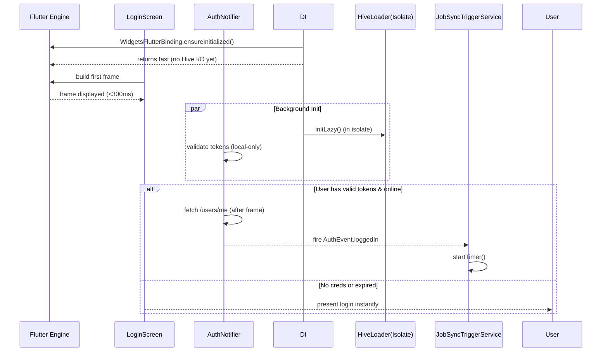

FIRST ORDER OF BUSINESS:
**READ THIS FIRST, MOTHERFUCKER, AND CONFIRM:** [hard-bob-workflow.mdc](../../../.cursor/rules/hard-bob-workflow.mdc)

# TODO: Kill First-Frame Sluggishness & Premature Sync Mayhem

**Goal:** Stop the god-damn 20-second freeze on cold-start by
1. Deferring heavyweight Hive initialisation to a background isolate.
2. Gating Job-Sync & other network chatter behind a *confirmed* authenticated state.
3. Skipping pointless `/users/me` round-trips when the access-token is already expired.
4. Making sure nothing heavy runs on the UI thread before the first frame.

No more "app feels dead" bullshit.

---

## Target Flow / Architecture

---

**MANDATORY REPORTING RULE:** For **every** task/cycle below, **before check-off and moving on to the next todo**, the dev must (a) write a brief *Findings* paragraph summarizing *what was done and observed* and (b) a *Handover Brief* summarising status, edge-cases/gotchas, and next-step readiness **inside this doc**. No silent check-offs. Uncertainty gets you fucking fired.

---

## Cycle 0: Baseline & Instrumentation

**Goal** Establish hard numbers on current cold-start times and freeze duration. Add performance timers so we can prove ROI.

* 0.1. [ ] **Task:** Instrument `main.dart` with `Timeline.startSync('cold_start')` / `endSync()`
    * Action: Add minimal dev-only code behind `kDebugMode`.
    * Findings:
* 0.2. [ ] **Task:** Measure startup without changes
    * Action: Run `flutter run --trace-startup`, capture `startup.json`.
    * Findings:
* 0.3. [ ] **Update Plan:** Confirm pain points (Hive open, job sync, login).
    * Findings:
* 0.4. [ ] **Handover Brief:**
    * Status:
    * Gotchas:
    * Recommendations:

---

## Cycle 1: Gate Job-Sync Behind Auth

**Goal** Ensure `JobSyncTriggerService` only initialises *after* `AuthNotifier` emits `authenticated` and disposes on logout.

* 1.1. [ ] **Research:** Inspect `JobSyncInitializer` and `AuthNotifier` events
    * Findings:
* 1.2. [ ] **Tests RED:** `job_sync_trigger_service` should **not** start when unauthenticated
    * Test File: `test/features/jobs/data/services/job_sync_trigger_service_auth_gate_test.dart`
    * Test Description: lazy service remains dormant until loggedIn event
    * Findings:
* 1.3. [ ] **Implement GREEN:** Move initialisation to an `AuthNotifier` listener OR provide wrapper that subscribes to auth events
    * Findings:
* 1.4. [ ] **Refactor:** Remove call in `main.dart` that starts sync unconditionally
    * Findings:
* 1.5. [ ] **Run Cycle-Specific Tests:**
    * Findings:
* 1.6-1.8. … (follow template)
* 1.9. [ ] **Handover Brief:**
    * Status:
    * Gotchas:
    * Recommendations:

---

## Cycle 2: Lazy & Isolated Hive Initialisation

**Goal** Open boxes in a background isolate; UI thread must not block.

* 2.1. [ ] **Research:** Check `hive_flutter` support for isolates & evaluate `hive/fast_adapters` branch.
    * Findings:
* 2.2. [ ] **Tests RED:** New `HiveLoader` returns box reference via `compute()` without blocking.
    * Test File: `test/core/di/hive_loader_test.dart`
* 2.3. [ ] **Implement GREEN:** Introduce `LazyHiveService` with `Future<Box<T>> getBox<T>()` that internally queues open requests and spawns isolate once.
    * Findings:
* 2.4. [ ] **Refactor:** Replace direct `Hive.openBox` calls in DI with service.
    * Findings:
* … follow template …

---

## Cycle 3: Smarter Token Validation

**Goal** Eliminate useless `/users/me` hit when access-token already expired.

* 3.1. [ ] **Research:** Where `AuthService.isAuthenticated(validateTokenLocally: false)` gets called.
* 3.2. [ ] **Tests RED:** Expect no network call when `isAccessTokenValid()` returns false & expired.
* 3.3. [ ] **Implement GREEN:** Add fast path: if `isAccessTokenValid()` == false → skip remote fetch & treat as unauth.
* 3.4. [ ] **Refactor:** tighten logging.
* …

---

## Cycle 4: Defer First Sync Timer & Background Work

**Goal** Make sure no periodic timer or heavy I/O fires before first frame + login.

* 4.1-4.9. Follow TDD loop: introduce back-off start after `WidgetsBinding.instance.endOfFrame` & auth.

---

## Cycle 5: Performance Validation & Cleanup

**Goal** Confirm cold-start < 1s to first frame on mid-tier device, network chatter only after login.

* N.1. Update architecture docs etc.

---

## DONE

With these cycles we:
1. Kicked JobSync until after real login – no more premature FormData bullshit.
2. Shoved Hive I/O into an isolate, letting the UI breathe.
3. Added token sanity checks to avoid pointless 401 → refresh loops.

No bullshit, no uncertainty – "When I pull a Dollar Bill, the money's already in the bag." 