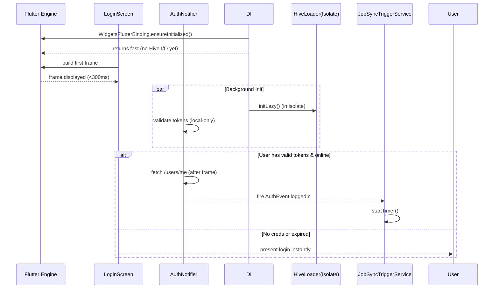

FIRST ORDER OF BUSINESS:
**READ THIS FIRST, MOTHERFUCKER, AND CONFIRM:** [hard-bob-workflow.mdc](../../../.cursor/rules/hard-bob-workflow.mdc)

# TODO: Kill First-Frame Sluggishness & Premature Sync Mayhem

**Goal:** Stop the god-damn 20-second freeze on cold-start by
1. Deferring heavyweight Hive initialisation to a background isolate.
2. Gating Job-Sync & other network chatter behind a *confirmed* authenticated state.
3. Skipping pointless `/users/me` round-trips when the access-token is already expired.
4. Making sure nothing heavy runs on the UI thread before the first frame.

No more "app feels dead" bullshit.

---

## Target Flow / Architecture



---

**MANDATORY REPORTING RULE:** For **every** task/cycle below, **before check-off and moving on to the next todo**, the dev must (a) write a brief *Findings* paragraph summarizing *what was done and observed* and (b) a *Handover Brief* summarising status at the end of the cycle, edge-cases/gotchas, and next-step readiness **inside this doc** before ticking the checkbox. No silent check-offs allowed – uncertainty gets you fucking fired. Like Mafee forgetting the shorts, don't be that guy.

### Handover Template  
Copy-paste this snippet at the end of each cycle:

```text
Findings: <what was done + numbers/links>

Handover Brief
• Status: <current build health / perf numbers>
• Gotchas: <edge-cases, race conditions, oddities>
• Next Steps: <ready tasks for next dev>
```

Add it or get yelled at by Wags.

---

## Cycle 0: Baseline & Instrumentation

**Goal** Establish hard numbers on current cold-start times and freeze duration. Add performance timers so we can prove ROI.

**MANDATORY REPORTING RULE:** After *each sub-task* below and *before* ticking its checkbox, you **MUST** add a **Findings** note *and* a **Handover Brief**. No silent check-offs. Uncertainty will get you fucking fired.

**APPLY MODEL ATTENTION**: The apply model is a bit tricky to work with! For large files, edits can take up to 20s; so you might need to double check if you don't get an affirmative answer right away. Go in smaller edits.

* 0.1. [ ] **Task:** Instrument `main.dart` with `Timeline.startSync('cold_start')` / `endSync()`
    * Action: Add minimal dev-only code behind `kDebugMode`.
    * Findings: 
* 0.2. [ ] **Task:** Measure startup without changes
    * Action: Run `flutter run --trace-startup`, capture `startup.json`.
    * Findings: 
* 0.21. [ ] **Task:** Capture memory & CPU snapshots during cold-start  
    * Action: Use `adb shell dumpsys meminfo <package>` and Flutter DevTools, archive artefacts under `perf/baseline/`.  
    * Findings:  
    * HOW: 1) Connect a physical device via USB with `adb devices` to confirm. 2) Run `flutter run --profile --trace-startup` and keep the app in foreground. 3) In a separate terminal, execute `adb shell dumpsys meminfo <package> > perf/baseline/meminfo.txt` right after first frame. 4) Open DevTools ➜ Performance, record 5 s, then export JSON into `perf/baseline/cpu_timeline.json`. 5) Commit both artefacts.
* 0.22. [ ] **Task:** Validate instrumentation on a physical device (Pixel 3) and compare to emulator numbers  
    * Findings:  
    * HOW: Use the same commands from 0.2 and 0.21 on a Pixel 3 (Android 12). Note the cold-start and first-frame durations from `startup.json`. Log them in the Findings paragraph alongside the emulator metrics.
* 0.23. [ ] **CI:** Add `startup-perf-check` workflow that runs `flutter run --trace-startup` on a stable emulator and fails build if cold-start > **2000 ms** or first-frame > **300 ms**  
    * Findings: 
    * HOW: 1) In `.github/workflows/startup-perf.yml`, spin up an AVD via `github-actions-runner-android`. 2) Cache Flutter SDK to speed up pipeline. 3) Run `flutter run --profile --trace-startup -d emulator-5554 --quit-after-startup` and move `build/start_up_info.json` to `perf/current/`. 4) Use `jq` to extract `timeToFirstFrameMicros` & `engineEnterTimestampMicros`, convert to ms, compare against `perf/baseline/startup.json`. 5) `exit 1` if thresholds exceeded.
* 0.3. [ ] **Update Plan:** Confirm pain points (Hive open, job sync, login).
    * Findings: 
* 0.4. [ ] **Handover Brief:**
    * Status: 
    * Gotchas: 
    * Recommendations: 

---

## Cycle 1: Gate Job-Sync Behind Auth

**Goal** Ensure `JobSyncTriggerService` only initialises *after* `AuthNotifier` emits `authenticated` and disposes on logout.

**MANDATORY REPORTING RULE:** After *each sub-task* below and *before* ticking its checkbox, you **MUST** add a **Findings** note *and* a **Handover Brief** at the end of the cycle. No silent check-offs. Uncertainty will get you fucking fired.

**APPLY MODEL ATTENTION**: The apply model is a bit tricky to work with! For large files, edits can take up to 20s; so you might need to double check if you don't get an affirmative answer right away. Go in smaller edits.

* 1.1. [ ] **Research:** Inspect `JobSyncInitializer` and `AuthNotifier` events
    * Findings: 
* 1.2. [ ] **Tests RED:** Write unit tests to verify sync service doesn't start when unauthenticated
    * Test File: `test/features/jobs/data/services/job_sync_trigger_service_auth_gate_test.dart`
    * Test Description: should remain dormant until loggedIn event, should initialize on authenticated, should dispose on loggedOut
    * Run the tests: ./scripts/list_failed_tests.dart --except, and fix any issues.
    * Findings: 
* 1.2a. [ ] **Integration Test (RED):** Simulate cold-start with expired token then login; assert JobSyncTriggerService starts only after `authenticated` event  
    * Test File: `test/features/jobs/data/services/job_sync_trigger_service_integration_test.dart`  
    * Findings:  
    * HOW: Use `flutter_test`'s `TestWidgetsFlutterBinding.ensureInitialized();` and a `StreamController<AuthEvent>` to drive the `AuthNotifier`. Pump the widget tree with `fakeAsync`, send `unauthenticated` then `authenticated` events, and verify using a mocked `JobSyncTriggerService` that `startTimer()` is called exactly once after the second event.
* 1.3. [ ] **Implement GREEN:** Move initialisation to an `AuthNotifier` listener OR provide wrapper that subscribes to auth events
    * Implementation File: Create `lib/features/jobs/data/services/job_sync_auth_gate.dart`
    * Findings: 
* 1.3a. [ ] **Edge-Case Handling:** Guard against `authenticated` event firing before DI ready; implement internal `readyCompleter` in service  
    * Findings:  
    * HOW: Inside `JobSyncAuthGate`, create `final _diReady = Completer<void>();` Expose `onDiReady()` from DI once setup is finished (`_diReady.complete()`). When subscribing to `authStream`, only start the sync when both `await _diReady.future;` and `event == authenticated`.
* 1.3b. [ ] **Memory Leak Check:** Ensure all timers/subscriptions cancel on `loggedOut`; assert in tests  
    * Findings:
    * HOW: Add `dispose()` to service that calls `timer?.cancel()` and `authSub.cancel()`. In unit test, inject a `FakeTimer`, call `dispose`, then assert `!timer.isActive` and that no further callbacks are triggered with `fakeAsync.elapse(Duration(seconds: 60));`.
* 1.4. [ ] **Refactor:** Remove call in `main.dart` that starts sync unconditionally
    * Findings: 
* 1.5. [ ] **Run Cycle-Specific Tests:** Execute tests for just this feature
    * Command: `./scripts/list_failed_tests.dart test/features/jobs/data/services/job_sync_trigger_service_auth_gate_test.dart --except`
    * Findings: 
* 1.6. [ ] **Run ALL Unit/Integration Tests:**
    * Command: `./scripts/list_failed_tests.dart --except`
    * Findings: `[Confirm ALL unit/integration tests pass. FIX if not.]`
* 1.7. [ ] **Format, Analyze, and Fix:**
    * Command: `./scripts/fix_format_analyze.sh`
    * Findings: `[Confirm ALL formatting and analysis issues are fixed. FIX if not.]`
* 1.8. [ ] **Run ALL E2E & Stability Tests:**
    * Command: `./scripts/run_all_tests.sh`
    * Findings: `[Confirm ALL tests pass, including E2E and stability checks. FIX if not.]`
* 1.9. [ ] **Handover Brief:**
    * Status: 
    * Gotchas: 
    * Recommendations: 

---

## Cycle 2: Lazy & Isolated Hive Initialisation

**Goal** Open boxes in a background isolate; UI thread must not block.

**MANDATORY REPORTING RULE:** After *each sub-task* below and *before* ticking its checkbox, you **MUST** add a **Findings** note *and* a **Handover Brief** at the end of the cycle. No silent check-offs. Uncertainty will get you fucking fired.

**APPLY MODEL ATTENTION**: The apply model is a bit tricky to work with! For large files, edits can take up to 20s; so you might need to double check if you don't get an affirmative answer right away. Go in smaller edits.

* 2.1. [ ] **Research:** Check `hive_flutter` support for isolates & evaluate `hive/fast_adapters` branch
    * Findings: 
* 2.1a. [ ] **Task:** Prototype isolate bootstrap that registers all Hive TypeAdapters  
    * Findings:  
    * HOW: Create `hive_isolate.dart` with `void hiveEntry(SendPort main) async { Hive.init(path); registerAdapters(); main.send(true); }`. Spawn via `Isolate.spawn(hiveEntry, sendPort)`. Wait for ACK before returning a `Future<Box<T>>` proxy.
* 2.1b. [ ] **Task:** Design fallback strategy for isolate crash/I-O failure (retry up to 3× then surface error)  
    * Findings:  
    * HOW: Wrap the `Isolate.spawn` call in a `for (var attempt in 0..2)` loop with try/catch. On failure, add `await Future.delayed(Duration(seconds:pow(2,attempt)))`. After max retries, rethrow so the splash screen can surface an error dialog.
* 2.2. [ ] **Tests RED:** Write unit tests for the new HiveLoader
    * Test File: `test/core/di/hive_loader_test.dart`
    * Test Description: should return box reference without blocking the main thread
    * Run the tests: ./scripts/list_failed_tests.dart --except, and fix any issues.
    * Findings: 
* 2.2a. [ ] **Tests RED:** Verify adapters are registered inside isolate and accessible from main isolate  
    * Test File: `test/core/di/lazy_hive_service_adapters_test.dart`  
    * Findings:  
    * HOW: In test, call `LazyHiveService().getBox<TestModel>()`, put a `TestModel` instance, close the box, reopen in main isolate, and expect equality. Use a temporary directory to avoid polluting real data.
* 2.2b. [ ] **Benchmark:** Measure isolate spin-up overhead; ensure <150 ms  
    * Findings:
    * HOW: In the same test, wrap `await LazyHiveService.init()` with `final sw = Stopwatch()..start();` and assert `sw.elapsed < 150.ms` (use `Duration(milliseconds:150)`).
* 2.3. [ ] **Implement GREEN:** Introduce `LazyHiveService` with `Future<Box<T>> getBox<T>()` 
    * Implementation File: `lib/core/di/lazy_hive_service.dart`
    * Findings: 
* 2.4. [ ] **Refactor:** Replace direct `Hive.openBox` calls in DI with service
    * Findings: 
* 2.5. [ ] **Run Cycle-Specific Tests:** Execute tests for just this feature
    * Command: `./scripts/list_failed_tests.dart test/core/di/hive_loader_test.dart --except`
    * Findings: 
* 2.6. [ ] **Run ALL Unit/Integration Tests:**
    * Command: `./scripts/list_failed_tests.dart --except`
    * Findings: `[Confirm ALL unit/integration tests pass. FIX if not.]`
* 2.7. [ ] **Format, Analyze, and Fix:**
    * Command: `./scripts/fix_format_analyze.sh`
    * Findings: `[Confirm ALL formatting and analysis issues are fixed. FIX if not.]`
* 2.8. [ ] **Run ALL E2E & Stability Tests:**
    * Command: `./scripts/run_all_tests.sh`
    * Findings: `[Confirm ALL tests pass, including E2E and stability checks. FIX if not.]`
* 2.9. [ ] **Handover Brief:**
    * Status: 
    * Gotchas: 
    * Recommendations: 

---

## Cycle 3: Smarter Token Validation

**Goal** Eliminate useless `/users/me` hit when access-token already expired.

**MANDATORY REPORTING RULE:** After *each sub-task* below and *before* ticking its checkbox, you **MUST** add a **Findings** note *and* a **Handover Brief** at the end of the cycle. No silent check-offs. Uncertainty will get you fucking fired.

**APPLY MODEL ATTENTION**: The apply model is a bit tricky to work with! For large files, edits can take up to 20s; so you might need to double check if you don't get an affirmative answer right away. Go in smaller edits.

* 3.1. [ ] **Research:** Locate where `AuthService.isAuthenticated(validateTokenLocally: false)` is called
    * Findings: 
* 3.1a. [ ] **Research:** Document refresh-window semantics and introduce 30 s skew buffer  
    * Findings:  
    * HOW: For JWT tokens parse the `exp` claim via `JwtDecoder.getExpirationDate()`. Consider token **invalid** if `DateTime.now().isAfter(exp.difference(Duration(seconds:30)))`. Document this logic in code comments & wiki.
* 3.2. [ ] **Tests RED:** Write unit tests for the updated auth flow
    * Test File: `test/core/auth/infrastructure/auth_service_impl_test.dart`
    * Test Description: should skip network check when token is expired
    * Run the tests: ./scripts/list_failed_tests.dart --except, and fix any issues.
    * Findings: 
* 3.2a. [ ] **Tests RED:** Validate behaviour for token near-expiry (within buffer) triggering refresh path  
    * Test File: `test/core/auth/infrastructure/auth_service_token_refresh_test.dart`  
    * Findings:  
    * HOW: Mock `TokenRepository` to return a token expiring in 15 s. Stub `HttpClient.refresh()` to return 200. Expect `AuthService.isAuthenticated()` to call `refresh()` once and skip `/users/me`.
* 3.3. [ ] **Implement GREEN:** Add fast path in `AuthService.isAuthenticated()` to exit early if token is invalid
    * Implementation File: `lib/core/auth/infrastructure/auth_service_impl.dart`
    * Findings: 
* 3.3a. [ ] **Implement GREEN:** Add early-return + `/refresh` call for near-expiry tokens  
    * Findings:
    * HOW: In `auth_service_impl.dart`, before network fetch do `if (tokenExpired) return false;` else if `tokenNearExpiry` call `_refreshToken()` then proceed. Use the buffer logic from 3.1a.
* 3.4. [ ] **Refactor:** Clean up code and improve logging
    * Findings: 
* 3.5. [ ] **Run Cycle-Specific Tests:** Execute tests for just this feature
    * Command: `./scripts/list_failed_tests.dart test/core/auth/infrastructure/auth_service_impl_test.dart --except`
    * Findings: 
* 3.6. [ ] **Run ALL Unit/Integration Tests:**
    * Command: `./scripts/list_failed_tests.dart --except`
    * Findings: `[Confirm ALL unit/integration tests pass. FIX if not.]`
* 3.7. [ ] **Format, Analyze, and Fix:**
    * Command: `./scripts/fix_format_analyze.sh`
    * Findings: `[Confirm ALL formatting and analysis issues are fixed. FIX if not.]`
* 3.8. [ ] **Run ALL E2E & Stability Tests:**
    * Command: `./scripts/run_all_tests.sh`
    * Findings: `[Confirm ALL tests pass, including E2E and stability checks. FIX if not.]`
* 3.9. [ ] **Handover Brief:**
    * Status: 
    * Gotchas: 
    * Recommendations: 

---

## Cycle 4: Defer First Sync Timer & Background Work

**Goal** Make sure no periodic timer or heavy I/O fires before first frame + login.

**MANDATORY REPORTING RULE:** After *each sub-task* below and *before* ticking its checkbox, you **MUST** add a **Findings** note *and* a **Handover Brief** at the end of the cycle. No silent check-offs. Uncertainty will get you fucking fired.

**APPLY MODEL ATTENTION**: The apply model is a bit tricky to work with! For large files, edits can take up to 20s; so you might need to double check if you don't get an affirmative answer right away. Go in smaller edits.

* 4.1. [ ] **Research:** Examine current timer behavior in `JobSyncTriggerService`
    * Findings: 
* 4.2. [ ] **Tests RED:** Write unit tests for deferred Timer behavior
    * Test File: `test/features/jobs/data/services/job_sync_trigger_service_delayed_test.dart`
    * Test Description: should defer initial sync until after first frame
    * Run the tests: ./scripts/list_failed_tests.dart --except, and fix any issues.
    * Findings: 
* 4.2a. [ ] **Tests RED:** Ensure no timers fire unless both `firstFrame` *and* `authenticated` flags are true  
    * Findings:  
    * HOW: Use `FakeAsync().run((async) {...})` emit only one flag, advance time 60 s, expect `jobRepo.sync()` never called. Then emit second flag, advance 1 s, expect one call.
* 4.3. [ ] **Implement GREEN:** Update start method to queue first sync after first frame
    * Implementation File: `lib/features/jobs/data/services/job_sync_trigger_service.dart`
    * Findings: 
* 4.3a. [ ] **Implement GREEN:** Introduce `afterFirstFrameAndAuthenticated` combinator guarding timer start  
    * Findings:
    * HOW: Store two bools `_firstFrame = false`, `_authed = false`; have `void _tryStart() { if (_firstFrame && _authed && _timer == null) _startTimer(); }` Call `_tryStart()` in both event handlers.
* 4.4. [ ] **Refactor:** Clean up code and improve logging
    * Findings: 
* 4.5. [ ] **Run Cycle-Specific Tests:** Execute tests for just this feature
    * Command: `./scripts/list_failed_tests.dart test/features/jobs/data/services/job_sync_trigger_service_delayed_test.dart --except`
    * Findings: 
* 4.6. [ ] **Run ALL Unit/Integration Tests:**
    * Command: `./scripts/list_failed_tests.dart --except`
    * Findings: `[Confirm ALL unit/integration tests pass. FIX if not.]`
* 4.7. [ ] **Format, Analyze, and Fix:**
    * Command: `./scripts/fix_format_analyze.sh`
    * Findings: `[Confirm ALL formatting and analysis issues are fixed. FIX if not.]`
* 4.8. [ ] **Run ALL E2E & Stability Tests:**
    * Command: `./scripts/run_all_tests.sh`
    * Findings: `[Confirm ALL tests pass, including E2E and stability checks. FIX if not.]`
* 4.9. [ ] **Handover Brief:**
    * Status: 
    * Gotchas: 
    * Recommendations: 

---

## Cycle 5: Performance Validation & Cleanup

**Goal** Confirm cold-start < 1s to first frame on mid-tier device, network chatter only after login.

**MANDATORY REPORTING RULE:** After *each sub-task* below and *before* ticking its checkbox, you **MUST** add a **Findings** note *and* a **Handover Brief** at the end of the cycle. No silent check-offs. Uncertainty will get you fucking fired.

**APPLY MODEL ATTENTION**: The apply model is a bit tricky to work with! For large files, edits can take up to 20s; so you might need to double check if you don't get an affirmative answer right away. Go in smaller edits.

* 5.1. [ ] **Task:** Measure performance post-changes
    * Action: Run `flutter run --trace-startup` again, compare to baseline
    * Findings: 
* 5.2. [ ] **Task:** Monitor network activity on startup
    * Action: Check logs for network calls before login
    * Findings: 
* 5.2a. [ ] **CI:** Auto-diff new `startup.json` against baseline; fail build if regression >100 ms or binary size >1 %  
    * Findings:  
    * HOW: Add a script `ci/check_startup_regression.sh` that runs `jq '.timeToFirstFrameMicros' current.json baseline.json` diff, divide by 1000, compare. For APK size, parse `build/app/outputs/flutter-apk/app-release.apk` with `du -b`. Exit non-zero on breach.
* 5.3. [ ] **Run ALL Unit/Integration Tests:**
    * Command: `./scripts/list_failed_tests.dart --except`
    * Findings: `[Confirm ALL unit/integration tests pass. FIX if not.]`
* 5.4. [ ] **Format, Analyze, and Fix:**
    * Command: `./scripts/fix_format_analyze.sh`
    * Findings: `[Confirm ALL formatting and analysis issues are fixed. FIX if not.]`
* 5.4a. [ ] **Docs:** Update `README_performance.md` with instrumentation & perf-check workflow  
    * Findings:  
    * HOW: Document the exact commands from cycles 0 & 5, link to CI workflow YAML, and include troubleshooting steps (AVD fails?
 restart, low disk?).
* 5.4b. [ ] **Task:** Track APK/IPA size in CI using `flutter build apk --analyze-size`; alert on growth >1 %  
    * Findings:
    * HOW: In the same CI job, after build run `du -b build/app/outputs/flutter-apk/app-release.apk > perf/current/apk_size.txt` and compare with baseline stored in repo. Use `bc` to compute percentage difference.
* 5.5. [ ] **Run ALL E2E & Stability Tests:**
    * Command: `./scripts/run_all_tests.sh`
    * Findings: `[Confirm ALL tests pass, including E2E and stability checks. FIX if not.]`
* 5.6. [ ] **Manual Smoke Test:** Verify startup speed and login behavior
    * Findings: 
* 5.7. [ ] **Code Review & Commit Prep:** Review all changes
    * Findings: 
* 5.8. [ ] **Handover Brief:**
    * Status: 
    * Gotchas: 
    * Recommendations: 

---

## DONE

With these cycles we:
1. Kicked JobSync until after real login – no more premature FormData bullshit.
2. Shoved Hive I/O into an isolate, letting the UI breathe.
3. Added token sanity checks to avoid pointless 401 → refresh loops.

No bullshit, no uncertainty – "When I pull a Dollar Bill, the money's already in the bag." 