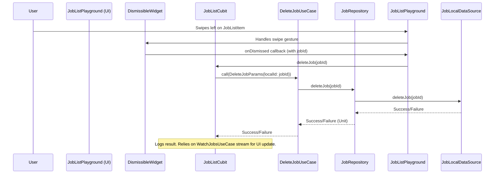

FIRST ORDER OF BUSINESS:
**READ THIS FIRST, MOTHERFUCKER, AND CONFIRM:** [hard-bob-workflow.mdc](../../../.cursor/rules/hard-bob-workflow.mdc)

# TODO: Implement Swipe-to-Delete in Job List Playground

**Goal:** Enable users to swipe-delete jobs in the `JobListPlayground` UI, integrate this with the `JobListCubit` and underlying services, and ensure all fucking tests pass like good little soldiers. We're not introducing uncertainty; we're executing with precision.

---

## Target Flow / Architecture



---

**MANDATORY REPORTING RULE:** For **every** task/cycle below, **before check-off and moving on to the next todo**, the dev must (a) write a brief *Findings* paragraph summarizing *what was done and observed* and (b) a *Handover Brief* summarising status at the end of the cycle, edge-cases/gotchas, and next-step readiness **inside this doc** before ticking the checkbox. No silent check-offs allowed – uncertainty gets you fucking fired. Like Mafee forgetting the shorts, don't be that guy.

---

## Cycle 0: Investigation & Confirmation (Prerequisites)

**Goal** Confirm existing architecture supports deletion without needing new domain/data layer code. We don't build what we already fucking have.

**MANDATORY REPORTING RULE:** After *each sub-task* below and *before* ticking its checkbox, you **MUST** add a **Findings** note *and* a **Handover Brief**. No silent check-offs. Uncertainty will get you fucking fired.

**APPLY MODEL ATTENTION**: The apply model is a bit tricky to work with! For large files, edits can take up to 20s; so you might need to double check if you don't get an affirmative answer right away. Go in smaller edits.

* 0.1. [ ] **Task:** Verify existence of `DeleteJobUseCase`.
    * Action: Semantic search for "DeleteJobUseCase" and inspect `lib/features/jobs/domain/usecases/delete_job_use_case.dart`.
    * Findings: [e.g., Confirmed `DeleteJobUseCase` exists, takes `DeleteJobParams`, calls `repository.deleteJob()`.]
* 0.2. [ ] **Task:** Verify `JobRepository` interface and implementation for `deleteJob`.
    * Action: Inspect `JobRepository` interface and `JobRepositoryImpl` for the `deleteJob(String localId)` method and its delegation.
    * Findings: [e.g., Confirmed `JobRepository` has `deleteJob`, and `JobRepositoryImpl` delegates to `JobDeleterService` which calls `JobLocalDataSource`.]
* 0.3. [ ] **Task:** Confirm `WatchJobsUseCase` stream emits updated list after deletion.
    * Action: Examine `WatchJobsUseCase` and how it's connected to the underlying stream/data source. Verify that it listens to the data source changes and emits an updated list when jobs are deleted.
    * Findings: [e.g., Confirmed `WatchJobsUseCase` emits from a reactive stream that updates when jobs are deleted from the repository.]
* 0.4. [ ] **Update Plan:** Based on findings, confirm plan for Cubit and UI modifications.
    * Findings: [e.g., "Plan confirmed. Backend support for delete exists. Focus is on Cubit and UI integration."]
* 0.5. [ ] **Handover Brief:**
    * Status: [e.g., Prerequisite check complete. Existing architecture supports deletion logic with reactive updates.]
    * Gotchas: [None anticipated at this stage.]
    * Recommendations: [Proceed to Cycle 1: Cubit and DI modifications.]

---

## Cycle 1: Modify `JobListCubit` & Dependency Injection

**Goal** Update `JobListCubit` to handle job deletion requests by integrating `DeleteJobUseCase`, and update its Dependency Injection registration accordingly. Clean, SOLID, like a Bruno Magli.

**MANDATORY REPORTING RULE:** After *each sub-task* below and *before* ticking its checkbox, you **MUST** add a **Findings** note *and* a **Handover Brief** at the end of the cycle. No silent check-offs. Uncertainty will get you fucking fired.

* 1.1. [ ] **Task:** Add `DeleteJobUseCase` dependency to `JobListCubit`.
    * Action: Edit `lib/features/jobs/presentation/cubit/job_list_cubit.dart`. Add `final DeleteJobUseCase _deleteJobUseCase;` and update the constructor to require `DeleteJobUseCase deleteJobUseCase` and assign it. Add necessary import using absolute path: `import 'package:docjet_mobile/features/jobs/domain/usecases/delete_job_use_case.dart';`
    * Findings: [e.g., Successfully added dependency and updated constructor with absolute imports.]
* 1.2. [ ] **Task:** Implement `deleteJob(String localId)` method in `JobListCubit`.
    * Action: Edit `lib/features/jobs/presentation/cubit/job_list_cubit.dart`. Add:
      ```dart
      Future<void> deleteJob(String localId) async {
        _log.i('Attempting to delete job with ID: $localId');
        try {
          final result = await _deleteJobUseCase(DeleteJobParams(localId: localId));
          result.fold(
            (failure) => _log.e('Failed to delete job: $failure'),
            (_) => _log.i('Successfully deleted job with ID: $localId')
          );
        } catch (e, st) {
          _log.e('Exception while deleting job: $e', st);
        }
        // No state emission - UI relies on WatchJobsUseCase stream for updates
      }
      ```
    * Findings: [e.g., `deleteJob` method implemented with proper error handling. Does not swallow errors silently. Logs both success and failure scenarios.]
* 1.3. [ ] **Task:** Register `DeleteJobUseCase` in `JobsModule`.
    * Action: Edit `lib/features/jobs/di/jobs_module.dart`. Add import using absolute path: `import 'package:docjet_mobile/features/jobs/domain/usecases/delete_job_use_case.dart';`. Add registration: `if (!getIt.isRegistered<DeleteJobUseCase>()) { getIt.registerLazySingleton(() => DeleteJobUseCase(getIt())); }`.
    * Findings: [e.g., `DeleteJobUseCase` successfully registered in DI module with absolute imports.]
* 1.4. [ ] **Task:** Update `JobListCubit` factory in `JobsModule`.
    * Action: Edit `lib/features/jobs/di/jobs_module.dart`. Modify the `getIt.registerFactory<JobListCubit>(...)` to pass the `deleteJobUseCase: getIt<DeleteJobUseCase>()`.
    * Findings: [e.g., `JobListCubit` factory updated with new dependency.]
* 1.5. [ ] **Task:** Analyze modified files.
    * Action: Run `dart analyze lib/features/jobs/presentation/cubit/job_list_cubit.dart lib/features/jobs/di/jobs_module.dart`.
    * Findings: [e.g., "No issues found!" or list issues and how they were fixed.]
* 1.6. [ ] **Handover Brief:**
    * Status: `JobListCubit` and DI successfully modified to support deletion. `dart analyze` is clean.
    * Gotchas: Ensure all imports use absolute paths with package prefix.
    * Recommendations: Ready for Cycle 2: UI implementation and fixing initial test failures.

---

## Cycle 2: Implement UI & Fix Initial Test Breakages

**Goal** Add the swipe-to-delete UI in `JobListPlayground` using `Dismissible` widget and fix the immediate test breakages in existing test files caused by DI changes to `JobListCubit`. "When you know the worst, you're free to make the best." - Wendy Rhoades.

**MANDATORY REPORTING RULE:** After *each sub-task* below and *before* ticking its checkbox, you **MUST** add a **Findings** note *and* a **Handover Brief** at the end of the cycle.

* 2.1. [ ] **Task:** Implement swipe-to-delete UI in `job_list_playground.dart`.
    * Action: Edit `lib/features/jobs/presentation/pages/job_list_playground.dart`.
        * In `ListView.builder`, wrap `JobListItem` with `Dismissible`.
        * `key`: `ValueKey(job.localId)` (essential for widget equality/identification).
        * `direction`: `DismissDirection.endToStart`.
        * `onDismissed`: `(direction) { _log.i('Job dismissed: ${job.localId}'); context.read<JobListCubit>().deleteJob(job.localId); }`.
        * `background`: `Container` with alignment right, color `CupertinoColors.destructiveRed` and a `CupertinoIcons.trash` icon (right side, white, padded).
    * Findings: [e.g., UI implemented. `Dismissible` wraps `JobListItem` with proper key, background styling, and cubit delete call.]
* 2.2. [ ] **Task:** Fix tests in `test/features/jobs/presentation/cubit/job_list_cubit_test.dart`.
    * Action: Edit file.
        * Add import for `DeleteJobUseCase` with absolute path.
        * Add `DeleteJobUseCase` to `@GenerateMocks([...])`.
        * Declare `late MockDeleteJobUseCase mockDeleteJobUseCase;`.
        * Instantiate `mockDeleteJobUseCase = MockDeleteJobUseCase();` in `setUp()`.
        * Update `createCubit()` helper to pass `deleteJobUseCase: mockDeleteJobUseCase`.
    * Findings: [e.g., Mocks updated. Cubit instantiation in tests now correct.]
* 2.3. [ ] **Task:** Fix tests in `test/features/jobs/presentation/pages/job_list_cubit_lifecycle_test.dart`.
    * Action: Edit file. Similar to 2.2: Add mock for `DeleteJobUseCase`, update mock declarations, `setUp`, and Cubit instantiation within the test setup.
    * Findings: [e.g., Mocks updated. Cubit instantiation in tests now correct.]
* 2.4. [ ] **Task:** Fix tests in `test/features/jobs/presentation/widgets/spinner_consistency_test.dart`.
    * Action: Edit file. Similar to 2.2: Add mock for `DeleteJobUseCase`, update mock declarations, `setUp`, and Cubit instantiation within the test setup.
    * Findings: [e.g., Mocks updated. Cubit instantiation in tests now correct.]
* 2.5. [ ] **Task:** Generate updated mock files.
    * Action: Run `flutter pub run build_runner build --delete-conflicting-outputs`.
    * Findings: [e.g., Mocks successfully generated with updated classes.]
* 2.6. [ ] **Task:** Add widget test for swipe-to-delete gesture.
    * Action: Create or edit `test/features/jobs/presentation/pages/job_list_playground_test.dart`.
        * Write a test that pumps the `JobListPlayground` with a mocked `JobListCubit`.
        * Simulate a swipe/drag from right-to-left on a job item.
        * Verify that `mockJobListCubit.deleteJob()` was called with the expected job ID.
    * Findings: [e.g., Widget test created. Swipe gesture correctly triggers `deleteJob` on the cubit.]
* 2.7. [ ] **Run Affected Feature Tests:**
    * Command: `./scripts/list_failed_tests.dart lib/features/jobs/ --except`
    * Findings: [Confirm the previously failing tests now pass. Document any additional fixes.]
* 2.8. [ ] **Format, Analyze, and Fix:**
    * Command: `./scripts/fix_format_analyze.sh`
    * Findings: `[Confirm ALL formatting and analysis issues are fixed. FIX if not.]`
* 2.9. [ ] **Handover Brief:**
    * Status: UI for swipe-to-delete implemented. Initial test breakages due to DI changes are resolved.
    * Gotchas: Ensure mock generations are run with build_runner after updating `@GenerateMocks`.
    * Recommendations: Proceed to Cycle 3: Add specific tests for the new `JobListCubit.deleteJob` method.

---

## Cycle 3: Add New Tests for `JobListCubit.deleteJob`

**Goal** Ensure the new `deleteJob` method in `JobListCubit` is thoroughly tested for success and failure scenarios, specifically its interaction with `DeleteJobUseCase`. "I'm not uncertain. I'm not guiding. I'm saying this is the play." - Bobby Axelrod.

**MANDATORY REPORTING RULE:** After *each sub-task* below and *before* ticking its checkbox, you **MUST** add a **Findings** note *and* a **Handover Brief** at the end of the cycle.

* 3.1. [ ] **Tests RED:** Write new tests for `JobListCubit.deleteJob`.
    * Test File: `test/features/jobs/presentation/cubit/job_list_cubit_test.dart`.
    * Test Descriptions:
        * `deleteJob should call DeleteJobUseCase with correct params on success`
            * Arrange: Stub `mockDeleteJobUseCase(params)` to return `Right(unit)`.
            * Act: Call `await cubit.deleteJob(testJobId)`.
            * Assert: Verify `mockDeleteJobUseCase` was called once with `DeleteJobParams(localId: testJobId)`.
            * Assert: Verify no state changes occurred (if that's your contract).
        * `deleteJob should log failure when DeleteJobUseCase returns failure`
            * Arrange: Stub `mockDeleteJobUseCase(params)` to return `Left(SomeFailure())`.
            * Act: Call `await cubit.deleteJob(testJobId)`.
            * Assert: Verify `mockDeleteJobUseCase` was called.
            * Assert: Verify no state changes (you maintain the same contract).
        * `deleteJob should handle exceptions gracefully`
            * Arrange: Stub `mockDeleteJobUseCase(params)` to throw an exception.
            * Act: Call `await cubit.deleteJob(testJobId)`.
            * Assert: Verify the cubit doesn't crash/propagate the exception.
    * Run the tests: `./scripts/list_failed_tests.dart test/features/jobs/presentation/cubit/job_list_cubit_test.dart --except`.
    * Findings: [Confirm tests are written and fail as expected if the underlying Cubit logic for `deleteJob` was somehow already flawed, or that stubs are correct.]
* 3.2. [ ] **Implement GREEN:** (Code for `deleteJob` in Cubit is already written in Cycle 1).
    * Action: Ensure the tests written in 3.1 now pass. Adjust stubs or Cubit logic slightly if needed.
    * Findings: [Confirm new tests for `deleteJob` now pass.]
* 3.3. [ ] **Refactor:** [Clean up the new tests. Ensure clarity and proper mocking.]
    * Findings: [Describe any refactoring. Confirm tests still pass.]
* 3.4. [ ] **Run Cycle-Specific Tests:**
    * Command: `./scripts/list_failed_tests.dart test/features/jobs/presentation/cubit/job_list_cubit_test.dart --except`
    * Findings: [Confirm all tests in this file pass.]
* 3.5. [ ] **Run ALL Unit/Integration Tests:**
    * Command: `./scripts/list_failed_tests.dart --except`
    * Findings: `[Confirm ALL unit/integration tests pass. FIX if not.]`
* 3.6. [ ] **Format, Analyze, and Fix:**
    * Command: `./scripts/fix_format_analyze.sh`
    * Findings: `[Confirm ALL formatting and analysis issues are fixed. FIX if not.]`
* 3.7. [ ] **Handover Brief:**
    * Status: New `deleteJob` method in `JobListCubit` is now covered by specific unit tests. All tests passing.
    * Gotchas: Ensure you're awaiting the async calls correctly in tests to avoid false positives.
    * Recommendations: Proceed to Cycle N: Final Polish.

---

## Cycle N: Final Polish & Verification

**Goal** Ensure everything is pristine: formatting, analysis, all tests passing, and a final manual check of the feature. Leave no stone unturned. "You get one life. Blaze on." - Lara Axelrod.

**MANDATORY REPORTING RULE:** After *each sub-task* below and *before* ticking its checkbox, you **MUST** add a **Findings** note *and* a **Handover Brief** at the end of the cycle.

* N.1. [ ] **Run ALL Unit/Integration Tests:**
    * Command: `./scripts/list_failed_tests.dart --except`
    * Findings: `[Confirm ALL unit/integration tests pass. FIX if not.]`
* N.2. [ ] **Format, Analyze, and Fix:**
    * Command: `./scripts/fix_format_analyze.sh`
    * Findings: `[Confirm ALL formatting and analysis issues are fixed. FIX if not.]`
* N.3. [ ] **Run ALL E2E & Stability Tests (if applicable/configured):**
    * Command: `./scripts/run_all_tests.sh` (or equivalent for your E2E setup)
    * Findings: `[Confirm ALL tests pass. FIX if not.]`
* N.4. [ ] **Manual Smoke Test (MANDATORY, YOU FUCKER):**
    * Action: Run the app, go to `JobListPlayground`. Create a few mock/test jobs if needed (e.g., via the record button). Swipe to delete one or more jobs. Verify they disappear from the list. Restart/refresh to ensure deletion persists (as handled by `WatchJobsUseCase` reflecting data source changes). Check logs for confirmation. Test with RTL enabled to catch potential UX oddities.
    * Findings: [Describe test steps and results in detail. E.g., "Successfully swiped to delete 3 jobs. Jobs removed from UI. Logs confirm cubit action. List remains updated after refresh. Tested RTL functionality - all good."]
* N.5. [ ] **Code Review & Commit Prep:** [Review staged changes (`git diff --staged | cat`), ensure adherence to guidelines.]
    * Findings: [Confirm code is clean, follows principles, ready for Hard Bob Commit.]
* N.6. [ ] **Handover Brief:**
    * Status: Swipe-to-delete feature complete, tested (unit & manually), documented in this TODO, ready for commit.
    * Gotchas: Playground state is ephemeral unless backed by actual persistence for mock jobs. Deletion here affects the in-memory/Hive state managed by the real services.
    * Recommendations: Merge it. This is solid work.

---

## DONE

With these cycles we:
1. Successfully integrated `DeleteJobUseCase` into `JobListCubit` and updated DI.
2. Implemented a functional swipe-to-delete UI in `JobListPlayground` with proper keys and error handling.
3. Rectified all test failures caused by DI changes and added new tests for the deletion logic in the Cubit.
4. Added widget tests to verify the swipe gesture actually triggers the deletion action.
5. Ensured the codebase remains clean, analyzed, and all tests pass.

No bullshit, no uncertainty – "That's the job. You make the hard call when nobody else will." - Bobby Axelrod. 