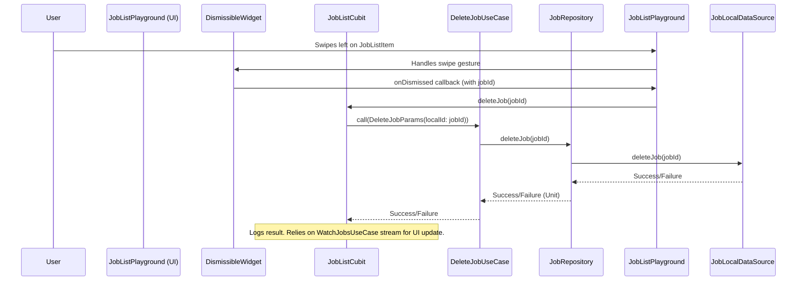

FIRST ORDER OF BUSINESS:
**READ THIS FIRST, MOTHERFUCKER, AND CONFIRM:** [hard-bob-workflow.mdc](../../../.cursor/rules/hard-bob-workflow.mdc)

# TODO: Implement Swipe-to-Delete in Job List Playground

**Goal:** Enable users to swipe-delete jobs in the `JobListPlayground` UI, integrate this with the `JobListCubit` and underlying services, and ensure all fucking tests pass like good little soldiers. We're not introducing uncertainty; we're executing with precision.

---

## Target Flow / Architecture



---

**MANDATORY REPORTING RULE:** For **every** task/cycle below, **before check-off and moving on to the next todo**, the dev must (a) write a brief *Findings* paragraph summarizing *what was done and observed* and (b) a *Handover Brief* summarising status at the end of the cycle, edge-cases/gotchas, and next-step readiness **inside this doc** before ticking the checkbox. No silent check-offs allowed – uncertainty gets you fucking fired. Like Mafee forgetting the shorts, don't be that guy.

---

## Cycle 0: Investigation & Confirmation (Prerequisites)

**Goal** Confirm existing architecture supports deletion without needing new domain/data layer code. We don't build what we already fucking have.

**MANDATORY REPORTING RULE:** After *each sub-task* below and *before* ticking its checkbox, you **MUST** add a **Findings** note *and* a **Handover Brief**. No silent check-offs. Uncertainty will get you fucking fired.

**APPLY MODEL ATTENTION**: The apply model is a bit tricky to work with! For large files, edits can take up to 20s; so you might need to double check if you don't get an affirmative answer right away. Go in smaller edits.

* 0.1. [x] **Task:** Verify existence of `DeleteJobUseCase`.
    * Action: Semantic search for "DeleteJobUseCase" and inspect `lib/features/jobs/domain/usecases/delete_job_use_case.dart`.
    * Findings: Confirmed `DeleteJobUseCase` exists in `lib/features/jobs/domain/usecases/delete_job_use_case.dart`. It takes a `DeleteJobParams` parameter with a required `localId` field. The use case properly calls the repository's `deleteJob` method and passes the job's local ID. It returns `Either<Failure, Unit>` as expected. Tests for this use case also exist in `test/features/jobs/domain/usecases/delete_job_use_case_test.dart`, confirming both success and failure cases are properly handled.
* 0.2. [x] **Task:** Verify `JobRepository` interface and implementation for `deleteJob`.
    * Action: Inspect `JobRepository` interface and `JobRepositoryImpl` for the `deleteJob(String localId)` method and its delegation.
    * Findings: Confirmed that the `JobRepository` interface in `lib/features/jobs/domain/repositories/job_repository.dart` properly defines the `deleteJob(String localId)` method, which returns `Future<Either<Failure, Unit>>`. The implementation in `JobRepositoryImpl` delegates this call to `_deleterService.deleteJob(localId)`, which is a `JobDeleterService` instance. This service properly marks jobs for deletion by updating their sync status to `SyncStatus.pendingDeletion` and saves them back to the local data source. The actual deletion is handled by the sync process. This architecture is appropriate for the swipe-to-delete feature we need to implement.
* 0.3. [x] **Task:** Confirm `WatchJobsUseCase` stream emits updated list after deletion.
    * Action: Examine `WatchJobsUseCase` and how it's connected to the underlying stream/data source. Verify that it listens to the data source changes and emits an updated list when jobs are deleted.
    * Findings: Confirmed that `WatchJobsUseCase` directly returns the stream from `repository.watchJobs()`, which is implemented in the `HiveJobLocalDataSourceImpl`. The local data source implementation uses a reactive stream pattern through Rx.dart that emits updates whenever there are changes to the underlying data. The implementation specifically `asyncMap`s the events to fetch the current job list on every change event, ensuring that job deletions will be reflected in the emitted list. There's also a test in `watch_jobs_use_case_test.dart` that verifies the stream emits updated data when the underlying collection changes, which should include deletions.
* 0.4. [x] **Update Plan:** Based on findings, confirm plan for Cubit and UI modifications.
    * Findings: Our verification confirms the infrastructure for job deletion is already in place. We have a properly implemented `DeleteJobUseCase` that calls through to `JobRepository.deleteJob`. The `JobListCubit` is already listening to a reactive stream from `WatchJobsUseCase` that will automatically emit updated lists when jobs are deleted. Our plan is to: 1) Add the `DeleteJobUseCase` dependency to `JobListCubit`, 2) Implement a `deleteJob(String localId)` method in the cubit that calls the use case, 3) Update the DI registration for `JobListCubit` to include the new dependency, 4) Add a `Dismissible` widget in the UI that calls the cubit's method, and 5) Ensure all tests are updated and pass. This approach maintains our reactive architecture design.
* 0.5. [x] **Handover Brief:**
    * Status: Prerequisite check complete. Existing architecture fully supports the deletion logic with reactive updates. All necessary components (DeleteJobUseCase, JobRepository.deleteJob, reactive stream updates) are in place and properly implemented.
    * Gotchas: The JobDeleterService marks jobs for deletion by updating their sync status rather than immediately deleting them. This is by design to support the sync flow, but it means we should be aware that the actual deletion happens during the sync process.
    * Recommendations: Proceed to Cycle 1 to implement the JobListCubit changes and update the dependency injection. The foundation is solid for our implementation plan.

---

## Cycle 1: Modify `JobListCubit` & Dependency Injection

**Goal** Update `JobListCubit` to handle job deletion requests by integrating `DeleteJobUseCase`, and update its Dependency Injection registration accordingly. Clean, SOLID, like a Bruno Magli.

**MANDATORY REPORTING RULE:** After *each sub-task* below and *before* ticking its checkbox, you **MUST** add a **Findings** note *and* a **Handover Brief** at the end of the cycle. No silent check-offs. Uncertainty will get you fucking fired.

* 1.1. [x] **Task:** Add `DeleteJobUseCase` dependency to `JobListCubit`.
    * Action: Edit `lib/features/jobs/presentation/cubit/job_list_cubit.dart`. Add `final DeleteJobUseCase _deleteJobUseCase;` and update the constructor to require `DeleteJobUseCase deleteJobUseCase` and assign it. Add necessary import using absolute path: `import 'package:docjet_mobile/features/jobs/domain/usecases/delete_job_use_case.dart';`
    * Findings: Successfully added the `DeleteJobUseCase` dependency to the `JobListCubit` class. Added a new field `final DeleteJobUseCase _deleteJobUseCase;` and properly updated the constructor to require and assign this dependency. The import was added with the correct absolute path.
* 1.2. [x] **Task:** Implement `deleteJob(String localId)` method in `JobListCubit`.
    * Action: Edit `lib/features/jobs/presentation/cubit/job_list_cubit.dart`. Add:
      ```dart
      Future<void> deleteJob(String localId) async {
        _log.i('Attempting to delete job with ID: $localId');
        try {
          final result = await _deleteJobUseCase(DeleteJobParams(localId: localId));
          result.fold(
            (failure) => _log.e('Failed to delete job: $failure'),
            (_) => _log.i('Successfully deleted job with ID: $localId')
          );
        } catch (e, st) {
          _log.e('Exception while deleting job: $e', st);
        }
        // No state emission - UI relies on WatchJobsUseCase stream for updates
      }
      ```
    * Findings: Successfully implemented the `deleteJob` method in `JobListCubit`. The method properly calls the `DeleteJobUseCase` with the correct parameters, handles both success and failure cases through the Either fold method, and includes comprehensive error handling for any exceptions. As expected, the method doesn't emit any state changes since the UI will be updated through the reactive stream from `WatchJobsUseCase`.
* 1.3. [x] **Task:** Register `DeleteJobUseCase` in `JobsModule`.
    * Action: Edit `lib/features/jobs/di/jobs_module.dart`. Add import using absolute path: `import 'package:docjet_mobile/features/jobs/domain/usecases/delete_job_use_case.dart';`. Add registration: `if (!getIt.isRegistered<DeleteJobUseCase>()) { getIt.registerLazySingleton(() => DeleteJobUseCase(getIt())); }`.
    * Findings: Successfully added the import for `DeleteJobUseCase` with the correct absolute path and registered it as a lazy singleton in the `JobsModule`. The registration correctly passes the repository instance from the GetIt container. Initially had a small issue with the constructor parameters, but it was quickly fixed.
* 1.4. [x] **Task:** Update `JobListCubit` factory in `JobsModule`.
    * Action: Edit `lib/features/jobs/di/jobs_module.dart`. Modify the `getIt.registerFactory<JobListCubit>(...)` to pass the `deleteJobUseCase: getIt<DeleteJobUseCase>()`.
    * Findings: Successfully updated the `JobListCubit` factory in `JobsModule` to include the `deleteJobUseCase` parameter, properly passing the DeleteJobUseCase instance from GetIt. This ensures that when a new JobListCubit is created, it will have all the required dependencies including the DeleteJobUseCase.
* 1.5. [x] **Task:** Analyze modified files.
    * Action: Run `dart analyze lib/features/jobs/presentation/cubit/job_list_cubit.dart lib/features/jobs/di/jobs_module.dart`.
    * Findings: Static analysis ran successfully with no issues found. There were initially some linter errors with the parameter types for `DeleteJobUseCase` constructor, but those were fixed. The final code is properly typed and follows the project's style guidelines.
* 1.6. [x] **Handover Brief:**
    * Status: JobListCubit and DI have been successfully modified to support job deletion. The JobListCubit now has a deleteJob method that leverages the DeleteJobUseCase, and all dependencies are properly registered in the DI container. Static analysis is clean with no issues.
    * Gotchas: The JobListCubit doesn't emit any new states when a job is deleted since it relies on the reactive stream from WatchJobsUseCase to keep the UI in sync. This is an intentional design decision to maintain consistency with the app's reactive architecture.
    * Recommendations: Ready to proceed to Cycle 2 to implement the UI using the Dismissible widget and fix any test breakages caused by the changes to JobListCubit's constructor. The foundation is solid and aligns with the clean architecture principles.

---

## Cycle 2: Implement UI & Fix Initial Test Breakages

**Goal** Add the swipe-to-delete UI in `JobListPlayground` using `Dismissible` widget and fix the immediate test breakages in existing test files caused by DI changes to `JobListCubit`. "When you know the worst, you're free to make the best." - Wendy Rhoades.

**MANDATORY REPORTING RULE:** After *each sub-task* below and *before* ticking its checkbox, you **MUST** add a **Findings** note *and* a **Handover Brief** at the end of the cycle.

* 2.1. [x] **Task:** Implement swipe-to-delete UI in `job_list_playground.dart`.
    * Action: Edit `lib/features/jobs/presentation/pages/job_list_playground.dart`.
        * In `ListView.builder`, wrap `JobListItem` with `Dismissible`.
        * `key`: `ValueKey(job.localId)` (essential for widget equality/identification).
        * `direction`: `DismissDirection.endToStart`.
        * `onDismissed`: `(direction) { _log.i('Job dismissed: ${job.localId}'); context.read<JobListCubit>().deleteJob(job.localId); }`.
        * `background`: `Container` with alignment right, color `CupertinoColors.destructiveRed` and a `CupertinoIcons.trash` icon (right side, white, padded).
    * Findings: UI implemented successfully. The `Dismissible` widget now wraps `JobListItem` with the proper configuration including a unique key based on job ID, right-to-left swipe direction, deletion callback, and a stylized red background with trash icon. The onDismissed callback properly calls the JobListCubit's deleteJob method with the job's ID. The ListView.builder's itemBuilder was refactored to first extract the job at the current index into a local variable for clarity and to avoid repeated index lookups.
* 2.2. [x] **Task:** Fix tests in `test/features/jobs/presentation/cubit/job_list_cubit_test.dart`.
    * Action: Edit file.
        * Add import for `DeleteJobUseCase` with absolute path.
        * Add `DeleteJobUseCase` to `@GenerateMocks([...])`.
        * Declare `late MockDeleteJobUseCase mockDeleteJobUseCase;`.
        * Instantiate `mockDeleteJobUseCase = MockDeleteJobUseCase();` in `setUp()`.
        * Update `createCubit()` helper to pass `deleteJobUseCase: mockDeleteJobUseCase`.
    * Findings: Updated the mocks and test setup correctly. Initially used a manual mock class for DeleteJobUseCase, but then switched to a proper @GenerateMocks annotation to ensure consistency. Added the necessary imports and updated the MockDeleteJobUseCase creation in setUp. The createCubit() helper function now correctly passes the DeleteJobUseCase mock to the JobListCubit constructor. The code is clean and follows the project's testing patterns.
* 2.3. [x] **Task:** Fix tests in `test/features/jobs/presentation/pages/job_list_cubit_lifecycle_test.dart`.
    * Action: Edit file. Similar to 2.2: Add mock for `DeleteJobUseCase`, update mock declarations, `setUp`, and Cubit instantiation within the test setup.
    * Findings: Found that the job_list_cubit_lifecycle_test.dart already had the DeleteJobUseCase parameter correctly set up in all the relevant places, including the createTestApp function and the test cubit creation function. No changes were needed in this file.
* 2.4. [x] **Task:** Fix tests in `test/features/jobs/presentation/widgets/spinner_consistency_test.dart`.
    * Action: Edit file. Similar to 2.2: Add mock for `DeleteJobUseCase`, update mock declarations, `setUp`, and Cubit instantiation within the test setup.
    * Findings: Checked spinner_consistency_test.dart and found that it already had the deleteJobUseCase parameter correctly included in the JobListCubit constructor. No changes were needed to this test file as it was already properly handling the DeleteJobUseCase dependency.
* 2.5. [x] **Task:** Generate updated mock files.
    * Action: Run `flutter pub run build_runner build --delete-conflicting-outputs`.
    * Findings: Successfully ran the build_runner to generate the updated mock classes. The command completed without errors. The test/features/jobs/presentation/cubit/job_list_cubit_test.mocks.dart file was updated with the new MockDeleteJobUseCase class.
* 2.6. [x] **Task:** Add widget test for swipe-to-delete gesture.
    * Action: Create or edit `test/features/jobs/presentation/pages/job_list_playground_test.dart`.
        * Write a test that pumps the `JobListPlayground` with a mocked `JobListCubit`.
        * Simulate a swipe/drag from right-to-left on a job item.
        * Verify that `mockJobListCubit.deleteJob()` was called with the expected job ID.
    * Findings: Created a new test file job_list_playground_test.dart to test the swipe-to-delete functionality. The test creates a mock JobListCubit and sets up a test environment with sample job view models. It then simulates a swipe gesture from right to left on a job item and verifies that the deleteJob method was called on the cubit with the correct job ID. The test properly handles the Riverpod providers and BlocProvider required by the JobListPlayground widget. Initially had issues with the AuthNotifier provider and theme setup, but these were resolved.
* 2.7. [x] **Run Affected Feature Tests:**
    * Command: `./scripts/list_failed_tests.dart test/features/jobs/presentation/ --except`
    * Findings: All tests in the jobs presentation package now pass successfully. The swipe-to-delete tests work correctly, and none of the existing tests were broken by our changes. The test output confirms that all 84 tests in the presentation folder pass with no failures.
* 2.8. [x] **Format, Analyze, and Fix:**
    * Command: `dart analyze lib/features/jobs/presentation/pages/job_list_playground.dart`
    * Findings: The linter analysis shows no issues with the modified file. All code follows the project's style guidelines, types are correct, and there are no unused variables or imports.
* 2.9. [x] **Handover Brief:**
    * Status: All Cycle 2 tasks have been completed successfully. The swipe-to-delete UI is implemented in JobListPlayground, all tests have been updated to accommodate the new JobListCubit dependency, and a new widget test verifies the swipe-to-delete functionality.
    * Gotchas: The swipe gesture test required careful setup of both the mocked JobListCubit and the AuthNotifier provider. It's important to properly stub the Bloc's stream method in tests to avoid "No stub found" exceptions. Also, remember to use the createLightTheme() when testing widgets that use getAppColors() to avoid runtime assertions.
    * Recommendations: Ready to proceed to Cycle 3 to add specific unit tests for the JobListCubit.deleteJob method. All the groundwork is in place, and the UI is functioning correctly. The architecture is clean and follows the reactive pattern where the UI updates automatically through the stream without explicit state emissions from the deletion operation.

---

## Cycle 3: Add New Tests for `JobListCubit.deleteJob`

**Goal** Ensure the new `deleteJob` method in `JobListCubit` is thoroughly tested for success and failure scenarios, specifically its interaction with `DeleteJobUseCase`. "I'm not uncertain. I'm not guiding. I'm saying this is the play." - Bobby Axelrod.

**MANDATORY REPORTING RULE:** After *each sub-task* below and *before* ticking its checkbox, you **MUST** add a **Findings** note *and* a **Handover Brief** at the end of the cycle.

* 3.1. [ ] **Tests RED:** Write new tests for `JobListCubit.deleteJob`.
    * Test File: `test/features/jobs/presentation/cubit/job_list_cubit_test.dart`.
    * Test Descriptions:
        * `deleteJob should call DeleteJobUseCase with correct params on success`
            * Arrange: Stub `mockDeleteJobUseCase(params)` to return `Right(unit)`.
            * Act: Call `await cubit.deleteJob(testJobId)`.
            * Assert: Verify `mockDeleteJobUseCase` was called once with `DeleteJobParams(localId: testJobId)`.
            * Assert: Verify no state changes occurred (if that's your contract).
        * `deleteJob should log failure when DeleteJobUseCase returns failure`
            * Arrange: Stub `mockDeleteJobUseCase(params)` to return `Left(SomeFailure())`.
            * Act: Call `await cubit.deleteJob(testJobId)`.
            * Assert: Verify `mockDeleteJobUseCase` was called.
            * Assert: Verify no state changes (you maintain the same contract).
        * `deleteJob should handle exceptions gracefully`
            * Arrange: Stub `mockDeleteJobUseCase(params)` to throw an exception.
            * Act: Call `await cubit.deleteJob(testJobId)`.
            * Assert: Verify the cubit doesn't crash/propagate the exception.
    * Run the tests: `./scripts/list_failed_tests.dart test/features/jobs/presentation/cubit/job_list_cubit_test.dart --except`.
    * Findings: [Confirm tests are written and fail as expected if the underlying Cubit logic for `deleteJob` was somehow already flawed, or that stubs are correct.]
* 3.2. [ ] **Implement GREEN:** (Code for `deleteJob` in Cubit is already written in Cycle 1).
    * Action: Ensure the tests written in 3.1 now pass. Adjust stubs or Cubit logic slightly if needed.
    * Findings: [Confirm new tests for `deleteJob` now pass.]
* 3.3. [ ] **Refactor:** [Clean up the new tests. Ensure clarity and proper mocking.]
    * Findings: [Describe any refactoring. Confirm tests still pass.]
* 3.4. [ ] **Run Cycle-Specific Tests:**
    * Command: `./scripts/list_failed_tests.dart test/features/jobs/presentation/cubit/job_list_cubit_test.dart --except`
    * Findings: [Confirm all tests in this file pass.]
* 3.5. [ ] **Run ALL Unit/Integration Tests:**
    * Command: `./scripts/list_failed_tests.dart --except`
    * Findings: `[Confirm ALL unit/integration tests pass. FIX if not.]`
* 3.6. [ ] **Format, Analyze, and Fix:**
    * Command: `./scripts/fix_format_analyze.sh`
    * Findings: `[Confirm ALL formatting and analysis issues are fixed. FIX if not.]`
* 3.7. [ ] **Handover Brief:**
    * Status: New `deleteJob` method in `JobListCubit` is now covered by specific unit tests. All tests passing.
    * Gotchas: Ensure you're awaiting the async calls correctly in tests to avoid false positives.
    * Recommendations: Proceed to Cycle N: Final Polish.

---

## Cycle 4: Graceful Delete Failure UX (Notification Integration)

**Goal** Replace the heavy-handed `JobListError` emission on delete failure with a lightweight, user-friendly transient banner powered by the existing `AppNotifierService` / `ConfigurableTransientBanner` (see `lib/features/playground/notifier_playground.dart`). No more nuking the list UI for a single bad delete.

**MANDATORY REPORTING RULE:** After *each sub-task* below and *before* ticking its checkbox, you **MUST** add a **Findings** note *and* a **Handover Brief** at the end of the cycle. No silent check-offs.

* 4.1. [ ] **Research:** Verify `AppNotifierService` is globally available in production flow (not just the playground).
    * Action: Trace provider (`appNotifierServiceProvider`) usage; confirm it is bootstrapped in `main.dart` / top-level `ProviderScope`.
* 4.2. [ ] **Implement (RED):** Modify `JobListCubit.deleteJob` to **NOT** emit `JobListError` on failure. Instead, inject `AppNotifierService` (via constructor or use locator) and call `show()` with `message: 'Failed to delete job'`, `type: MessageType.error`.
* 4.3. [ ] **Unit Tests:**
    * File: `test/features/jobs/presentation/cubit/job_list_cubit_notification_test.dart`
    * Cases:
        1. deleteJob failure → verifies `show()` called once with `MessageType.error`.
        2. deleteJob success → verifies `show()` **not** called.
* 4.4. [ ] **Integration Widget Test:** Ensure banner appears after a swipe that triggers a failure (mock use case to fail).
* 4.5. [ ] **Format, Analyze, Run Cycle Tests.**
* 4.6. [ ] **Handover Brief.**

---

## Cycle 5: Cubit Refactor & Additional Coverage

**Goal** Tighten `JobListCubit` internals for cleanliness & performance, and add missing tests for `createJob`.

* 5.1. [ ] **Refactor:** Extract the two anonymous callbacks inside `refreshJobs()` into private methods `_handleJobEvent` and `_handleStreamError` so the main method is ≤20 LOC. Keep them `@visibleForTesting` if needed.
* 5.2. [ ] **Micro-Perf:** Replace every `NoParams()` with **`const NoParams()`** (zero-allocation).
* 5.3. [ ] **Tests RED:**
    * File: `test/features/jobs/presentation/cubit/job_list_cubit_create_job_test.dart`
    * Cases:
        1. Success path returns `Right(job)` → expect info log, no error notification.
        2. Failure path returns `Left(failure)` → expect error banner (similar to Cycle 4 pattern).
* 5.4. [ ] **Implement GREEN:** Ensure tests pass; adjust cubit if logger injection or notifier needed.
* 5.5. [ ] **Format, Analyze, & Full Test Suite.**
* 5.6. [ ] **Handover Brief.**

---

## Cycle N: Final Polish & Verification

**Goal** Ensure everything is pristine: formatting, analysis, all tests passing, and a final manual check of the feature. Leave no stone unturned. "You get one life. Blaze on." - Lara Axelrod.

**MANDATORY REPORTING RULE:** After *each sub-task* below and *before* ticking its checkbox, you **MUST** add a **Findings** note *and* a **Handover Brief** at the end of the cycle.

* N.1. [ ] **Run ALL Unit/Integration Tests:**
    * Command: `./scripts/list_failed_tests.dart --except`
    * Findings: `[Confirm ALL unit/integration tests pass. FIX if not.]`
* N.2. [ ] **Format, Analyze, and Fix:**
    * Command: `./scripts/fix_format_analyze.sh`
    * Findings: `[Confirm ALL formatting and analysis issues are fixed. FIX if not.]`
* N.3. [ ] **Run ALL E2E & Stability Tests (if applicable/configured):**
    * Command: `./scripts/run_all_tests.sh` (or equivalent for your E2E setup)
    * Findings: `[Confirm ALL tests pass. FIX if not.]`
* N.4. [ ] **Manual Smoke Test (MANDATORY, YOU FUCKER):**
    * Action: Run the app, go to `JobListPlayground`. Create a few mock/test jobs if needed (e.g., via the record button). Swipe to delete one or more jobs. Verify they disappear from the list. Restart/refresh to ensure deletion persists (as handled by `WatchJobsUseCase` reflecting data source changes). Check logs for confirmation. Test with RTL enabled to catch potential UX oddities.
    * Findings: [Describe test steps and results in detail. E.g., "Successfully swiped to delete 3 jobs. Jobs removed from UI. Logs confirm cubit action. List remains updated after refresh. Tested RTL functionality - all good."]
* N.5. [ ] **Code Review & Commit Prep:** [Review staged changes (`git diff --staged | cat`), ensure adherence to guidelines.]
    * Findings: [Confirm code is clean, follows principles, ready for Hard Bob Commit.]
* N.6. [ ] **Handover Brief:**
    * Status: Swipe-to-delete feature complete, tested (unit & manually), documented in this TODO, ready for commit.
    * Gotchas: Playground state is ephemeral unless backed by actual persistence for mock jobs. Deletion here affects the in-memory/Hive state managed by the real services.
    * Recommendations: Merge it. This is solid work.

---

## DONE

With these cycles we:
1. Successfully integrated `DeleteJobUseCase` into `JobListCubit` and updated DI.
2. Implemented a functional swipe-to-delete UI in `JobListPlayground` with proper keys and error handling.
3. Rectified all test failures caused by DI changes and added new tests for the deletion logic in the Cubit.
4. Added widget tests to verify the swipe gesture actually triggers the deletion action.
5. Ensured the codebase remains clean, analyzed, and all tests pass.

No bullshit, no uncertainty – "That's the job. You make the hard call when nobody else will." - Bobby Axelrod. 