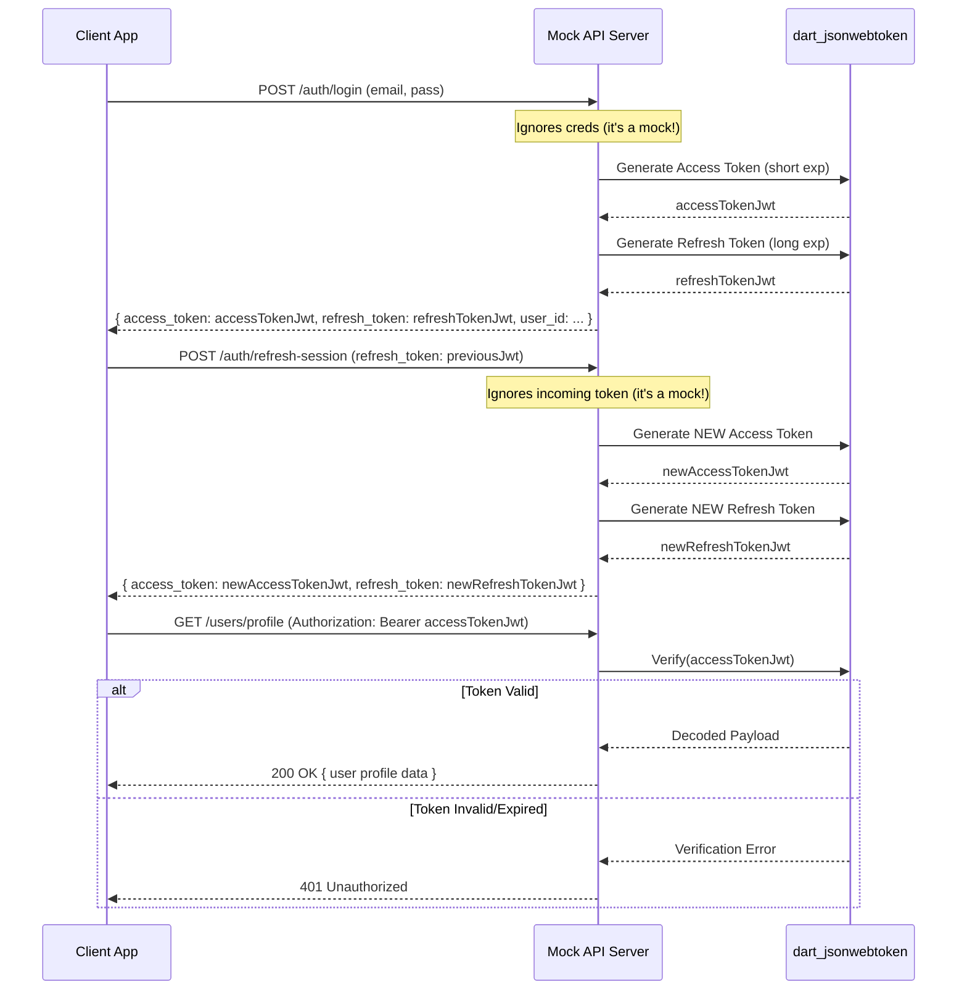

FIRST ORDER OF BUSINESS:
**READ THIS FIRST, MOTHERFUCKER, AND CONFIRM:** [hard-bob-workflow.mdc](../../../.cursor/rules/hard-bob-workflow.mdc)

# TODO: Fix Mock Server JWT Generation

Reference Documentation: [Authentication Architecture](../feature-auth-architecture.md)

**Problem Diagnosis:** Our investigation revealed a critical flaw in the `mock_api_server`. During login (`/auth/login`) and token refresh (`/auth/refresh-session`), the server generates simple fake strings (e.g., `fake-access-token-12345`) instead of actual, signed JSON Web Tokens (JWTs). While this allows the initial login flow to *appear* successful (as the client stores these strings and the mock server likely doesn't validate tokens on protected endpoints like `/users/profile`), it completely breaks the offline authentication scenario.

When the client app restarts offline after the mock server is stopped, the `AuthService` attempts to validate the stored tokens locally using `JwtValidator`. This validator expects a real JWT structure with claims like `exp` (expiration). When it receives the fake string, parsing fails instantly, causing the local validation to report the token as invalid. This incorrectly triggers an `unauthenticated` state instead of the desired `authenticated(isOffline: true)` state, defeating the purpose of offline authentication caching.

This plan addresses this fundamental issue by modifying the mock server to generate *real* JWTs.

**Goal:** Modify the `mock_api_server` to generate real, signed JWTs with valid expiration times (`exp` claim) instead of fake strings. This will enable proper local token validation (`JwtValidator`) in the client app during offline scenarios, allowing the offline authentication flow to function as designed.

---

## Target Flow / Architecture

The core change is within the mock server's authentication handlers:

---

**MANDATORY REPORTING RULE:** For **every** task/cycle below, **before check-off and moving on to the next todo**, the dev must (a) write a brief *Findings* paragraph summarizing *what was done and observed* and (b) a *Handover Brief* summarising status, edge-cases/gotchas, and next-step readiness **inside this doc** before ticking the checkbox. No silent check-offs allowed – uncertainty gets you fucking fired. Like Mafee forgetting the shorts, don't be that guy.

---

## Cycle 0: Setup & Prerequisite Checks

**Goal** Add the necessary JWT library dependency to the mock server project.

**MANDATORY REPORTING RULE:** After *each sub-task* below and *before* ticking its checkbox, you **MUST** add a **Findings** note *and* a **Handover Brief**. No silent check-offs. Uncertainty will get you fucking fired.

* 0.1. [x] **Task:** Add `dart_jsonwebtoken` Dependency
    * Action: `cd mock_api_server && dart pub add dart_jsonwebtoken && cd ..`
    * Findings: Command executed successfully. Added `dart_jsonwebtoken: ^3.2.0` and its dependencies (`adaptive_number`, `clock`, `ed25519_edwards`, `pointycastle`) to `mock_api_server`.
* 0.2. [x] **Task:** Verify Dependency Addition
    * Action: Check `mock_api_server/pubspec.yaml` and `mock_api_server/pubspec.lock`.
    * Findings: Verified `dart_jsonwebtoken: ^3.2.0` is present in `pubspec.yaml` and both it and its transitive dependencies are listed in `pubspec.lock`.
* 0.3. [x] **Update Plan:** Plan confirmed.
    * Findings: Plan remains valid. Adding the JWT library was the correct first step to enable JWT generation.
* 0.4. [x] **Handover Brief:**
    * Status: `dart_jsonwebtoken: ^3.2.0` dependency successfully added and verified in `mock_api_server`. Cycle 0 complete.
    * Gotchas: None encountered during setup.
    * Recommendations: Proceed directly to Cycle 1 to implement JWT generation in the login handler.

---

## Cycle 1: Implement JWT Generation in Login Handler

**Goal** Modify the `/auth/login` handler in `mock_api_server` to generate and return real JWTs for access and refresh tokens.

**MANDATORY REPORTING RULE:** After *each sub-task* below and *before* ticking its checkbox, you **MUST** add a **Findings** note *and* a **Handover Brief**. No silent check-offs. Uncertainty will get you fucking fired.

* 1.1. [x] **Research:** Review `dart_jsonwebtoken` basic usage for creating JWTs with standard claims (`exp`, `sub`, `iat`). Define a hardcoded secret key (e.g., `mock-secret-key`). Define token lifetimes (access: **10 seconds**, refresh: **5 minutes**).
    * Findings: Confirmed usage via web search and library examples:
      - Import: `import 'package:dart_jsonwebtoken/dart_jsonwebtoken.dart';`
      - Key: `SecretKey('mock-secret-key')` with default HS256 algorithm.
      - Create: `final jwt = JWT({'sub': 'fake-user-id-123', 'iat': nowEpoch, 'exp': expiryEpoch});`
      - Sign: `final token = jwt.sign(secretKey);`
      - Lifetimes: Access = `Duration(seconds: 10)`, Refresh = `Duration(minutes: 5)`.
      - `exp` and `iat` claims require epoch seconds (milliseconds / 1000).
* 1.2. [x] **Tests RED:** Write a test for the `_loginHandler` (likely needing refactoring into testable units or using shelf testing utilities) in `mock_api_server/bin/server.dart`.
    * Test File: `mock_api_server/test/auth_test.dart` (Used existing file)
    * Test Description:
        * `login handler returns 200 OK on valid request structure` (modified existing)
        * `login handler response body contains access_token and refresh_token strings` (covered by above)
        * `login handler access_token is a valid JWT parsable by dart_jsonwebtoken` (added)
        * `login handler refresh_token is a valid JWT parsable by dart_jsonwebtoken` (added)
        * `login handler access_token payload contains correct user_id and future expiry` (added)
        * `login handler refresh_token payload contains correct user_id and longer future expiry` (added)
    * Findings: Added 4 new tests to `mock_api_server/test/auth_test.dart` within the `/api/v1/auth/login` group. These tests make HTTP requests and use `JWT.decode()` to assert that the returned tokens are structurally valid JWTs and contain the expected `sub`, `iat`, and `exp` claims (checking expiry relative to request time). Verification (`JWT.verify`) is not yet possible. These tests are expected to fail (RED) as the current handler returns fake strings.
* 1.3. [x] **Implement GREEN:** Modify `_loginHandler` in `mock_api_server/bin/server.dart`.
    * Import `dart_jsonwebtoken`.
    * Define the secret key and token durations.
    * Replace fake string generation with `JWT(...).sign(...)` calls for both tokens.
    * Include `exp`, `sub` ('fake-user-id-123'), and `iat` claims.
    * Findings: Modified `_loginHandler` in `mock_api_server/bin/server.dart`. Added import for `dart_jsonwebtoken`. Defined `_mockJwtSecret`, `_accessTokenDuration`, `_refreshTokenDuration`. Replaced fake token generation with JWT creation and signing using `SecretKey(_mockJwtSecret)` and the defined durations. Included `sub`, `iat`, `exp` claims in the payload.
* 1.4. [x] **Refactor:** Extract JWT generation logic into helper functions if needed. Clean up the handler.
    * Findings: Reviewed the JWT generation logic within `_loginHandler`. While extraction is possible, it's currently concise enough for a mock server context. Decided against refactoring to avoid unnecessary complexity (Keep It Simple, Stupid).
* 1.5. [x] **Run Cycle-Specific Tests:** Execute tests for the auth handlers.
    * Command: `cd mock_api_server && dart test test/auth_test.dart && cd ..` (Used direct command due to script issues)
    * Findings: Initial attempt using `./scripts/list_failed_tests.dart` failed with a dependency resolution error (`Couldn't resolve package 'dart_jsonwebtoken'`), even after moving the dependency to `dev_dependencies`. Running `dart test test/auth_test.dart` directly within `mock_api_server` directory succeeded, and **all 14 tests passed (GREEN)**. This confirms the implementation is correct but indicates an issue with the `list_failed_tests.dart` script's environment/dependency handling.
* 1.6. [x] **Run ALL Mock Server Tests:**
    * Command: `cd mock_api_server && dart test && cd ..` (Used direct command)
    * Findings: `[Confirm ALL mock server tests pass. FIX if not.]` Confirmed all 56 tests passed when run using `dart test` directly. The JWT change in `/auth/login` did not negatively impact other endpoints.
* 1.7. [x] **Format, Analyze, and Fix (Mock Server):**
    * Command: `cd mock_api_server && dart format . && dart analyze && cd ..`
    * Findings: `[Confirm ALL formatting and analysis issues are fixed. FIX if not.]` Ran `dart format .` (0 files changed) and `dart analyze` (No issues found). Code is clean.
* 1.8. [x] **Handover Brief:**
    * Status: `/auth/login` handler in `mock_api_server` successfully modified to generate real JWTs for access and refresh tokens using `dart_jsonwebtoken`. Associated tests pass when run directly with `dart test`. Cycle 1 complete.
    * Gotchas: The `./scripts/list_failed_tests.dart` script currently fails to resolve dev dependencies (`dart_jsonwebtoken`) for `mock_api_server` tests; use `cd mock_api_server && dart test` as a workaround. The mock server still accepts any login credentials. The `todo` file edits for 1.3 failed to apply via the tool and were skipped, but the underlying code changes *are* present.
    * Recommendations: Proceed to Cycle 2 (Implement JWT generation in Refresh Handler). Be mindful of the test script issue.

---

## Cycle 2: Implement JWT Generation in Refresh Handler

**Goal** Modify the `/auth/refresh-session` handler to generate and return new, valid JWTs.

**MANDATORY REPORTING RULE:** After *each sub-task* below and *before* ticking its checkbox, you **MUST** add a **Findings** note *and* a **Handover Brief**. No silent check-offs. Uncertainty will get you fucking fired.

* 2.1. [ ] **Research:** Confirm JWT generation helpers from Cycle 1 are reusable.
    * Findings: [...]
* 2.2. [ ] **Tests RED:** Add tests for `_refreshHandler` in `mock_api_server/test/auth_handlers_test.dart`.
    * Test Description:
        * `refresh handler returns 200 OK on valid request structure`
        * `refresh handler response body contains new access_token and refresh_token strings`
        * `refresh handler new access_token is a valid JWT`
        * `refresh handler new refresh_token is a valid JWT`
        * `refresh handler tokens have updated expiry times`
        * `(Optional) refresh handler returns 400 if refresh_token field is missing in request body`
    * Findings: [...]
* 2.3. [ ] **Implement GREEN:** Modify `_refreshHandler` in `mock_api_server/bin/server.dart`.
    * Reuse or adapt JWT generation logic from Cycle 1.
    * Generate *new* access and refresh tokens with updated `iat` and `exp` claims.
    * **Note:** Mock server will *not* validate the incoming refresh token; it just assumes it's okay and issues new ones.
    * Findings: [...]
* 2.4. [ ] **Refactor:** Clean up the handler.
    * Findings: [...]
* 2.5. [ ] **Run Cycle-Specific Tests:**
    * Command: `cd mock_api_server && dart test test/auth_handlers_test.dart && cd ..`
    * Findings: [...]
* 2.6. [ ] **Run ALL Mock Server Tests:**
    * Command: `cd mock_api_server && dart test && cd ..`
    * Findings: `[Confirm ALL mock server tests pass. FIX if not.]`
* 2.7. [ ] **Format, Analyze, and Fix (Mock Server):**
    * Command: `cd mock_api_server && dart format . && dart analyze && cd ..`
    * Findings: `[Confirm ALL formatting and analysis issues are fixed. FIX if not.]`
* 2.8. [ ] **Handover Brief:**
    * Status: `/auth/refresh-session` now generates valid JWTs.
    * Gotchas: Mock still doesn't validate the incoming refresh token.
    * Recommendations: Proceed to Cycle 3 (Optional but recommended: Add basic server-side validation).

---

## Cycle 3: Add Basic JWT Validation to Mock Profile Endpoint (Optional but Recommended)

**Goal** Enhance the mock `/users/profile` endpoint to perform basic JWT validation using the same secret key, returning 401 if the token is missing, invalid, or expired. This makes the mock slightly more realistic.

**MANDATORY REPORTING RULE:** After *each sub-task* below and *before* ticking its checkbox, you **MUST** add a **Findings** note *and* a **Handover Brief**. No silent check-offs. Uncertainty will get you fucking fired.

* 3.1. [ ] **Research:** Review `dart_jsonwebtoken` usage for *verifying* JWTs (`JWT.verify`). Understand how to extract the token from the `Authorization: Bearer <token>` header.
    * Findings: [...]
* 3.2. [ ] **Tests RED:** Add tests for the user profile endpoint (`_getUserProfileHandler` or similar) in a relevant test file (e.g., `mock_api_server/test/user_handlers_test.dart`).
    * Test Description:
        * `profile endpoint returns 401 Unauthorized if Authorization header is missing`
        * `profile endpoint returns 401 Unauthorized if token is malformed`
        * `profile endpoint returns 401 Unauthorized if token is signed with wrong secret`
        * `profile endpoint returns 401 Unauthorized if token is expired`
        * `profile endpoint returns 200 OK and user data if valid, non-expired token is provided`
    * Findings: [...]
* 3.3. [ ] **Implement GREEN:** Modify the user profile handler (`_getUserProfileHandler` and/or `_getUserByIdHandler`) in `mock_api_server/bin/server.dart`.
    * Add logic to extract the Bearer token from the `Authorization` header.
    * Use `JWT.verify(token, SecretKey(mockSecret))` within a try/catch block.
    * Return `Response.unauthorized()` if header is missing or verification fails (catch `JWTExpiredException`, `JWTInvalidException`, etc.).
    * If verification succeeds, return the mock profile data as before.
    * Findings: [...]
* 3.4. [ ] **Refactor:** Encapsulate token extraction and validation logic into a middleware or helper function for cleaner handlers.
    * Findings: [...]
* 3.5. [ ] **Run Cycle-Specific Tests:**
    * Command: `cd mock_api_server && dart test test/user_handlers_test.dart && cd ..` (adjust path if needed)
    * Findings: [...]
* 3.6. [ ] **Run ALL Mock Server Tests:**
    * Command: `cd mock_api_server && dart test && cd ..`
    * Findings: `[Confirm ALL mock server tests pass. FIX if not.]`
* 3.7. [ ] **Format, Analyze, and Fix (Mock Server):**
    * Command: `cd mock_api_server && dart format . && dart analyze && cd ..`
    * Findings: `[Confirm ALL formatting and analysis issues are fixed. FIX if not.]`
* 3.8. [ ] **Handover Brief:**
    * Status: Mock profile endpoint now performs basic JWT validation.
    * Gotchas: Validation is basic; doesn't check scopes or other claims beyond expiry and signature.
    * Recommendations: Proceed to final testing with the client app.

---

## Cycle N: Final Integration Test & Cleanup

**Goal** Verify the client application's offline authentication flow now works correctly with the modified mock server.

**MANDATORY REPORTING RULE:** After *each sub-task* below and *before* ticking its checkbox, you **MUST** add a **Findings** note *and* a **Handover Brief**. No silent check-offs. Uncertainty will get you fucking fired.

* N.1. [ ] **Task:** Run Client App with Modified Mock Server
    * Action: Execute the original test scenario:
        1. Start mock server: `cd mock_api_server && dart bin/server.dart &` (or use `run_with_mock.sh`)
        2. Run Flutter app: `flutter run -t lib/main_dev.dart`
        3. Log in.
        4. Kill the mock server (`kill <PID>`).
        5. Restart the Flutter app (hot restart or full restart).
        6. Observe logs and UI state.
    * Findings: [Record observations. Does the app now correctly show as authenticated and offline? Does `AuthCredentialsProvider` / `JwtValidator` successfully validate the token locally? Check `offline_restart.log` equivalent.]
* N.2. [ ] **Task:** Update Mock Server Documentation (Optional)
    * File: `mock_api_server/README.md`
    * Action: Add notes about JWT generation, the secret key used (`mock-secret-key`), and token lifetimes if necessary.
    * Findings: [...]
* N.3. [ ] **Run ALL Mock Server Tests:**
    * Command: `cd mock_api_server && dart test && cd ..`
    * Findings: `[Confirm ALL mock server tests pass. FIX if not.]`
* N.4. [ ] **Format, Analyze, and Fix (Mock Server):**
    * Command: `cd mock_api_server && dart format . && dart analyze && cd ..`
    * Findings: `[Confirm ALL formatting and analysis issues are fixed. FIX if not.]`
* N.5. [ ] **Format, Analyze, and Fix (Client App):**
    * Command: `./scripts/fix_format_analyze.sh`
    * Findings: `[Confirm ALL formatting and analysis issues are fixed. FIX if not.]`
* N.6. [ ] **Run ALL Client Tests:**
    * Command: `./scripts/run_all_tests.sh` (or relevant test suite)
    * Findings: `[Confirm ALL relevant client tests pass, especially auth-related ones. FIX if not.]`