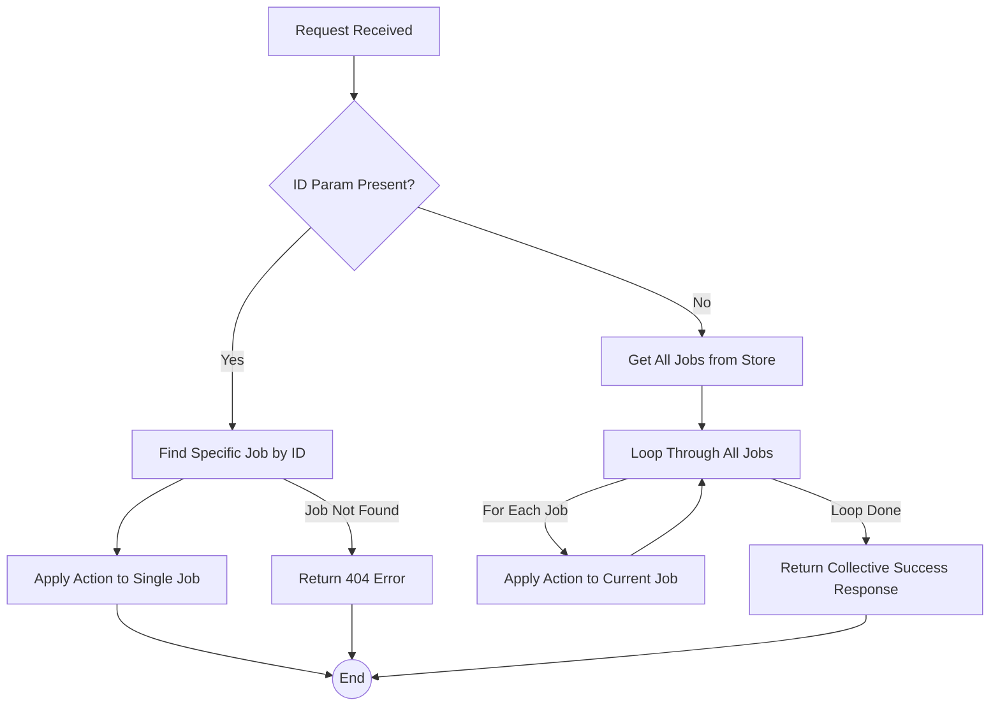

FIRST ORDER OF BUSINESS:
**READ THIS FIRST, MOTHERFUCKER, AND CONFIRM:** [hard-bob-workflow.mdc](../../../.cursor/rules/hard-bob-workflow.mdc)

# TODO: Enhance Mock Server Debug Endpoints for All-Job Operations

**Goal:** Modify the mock server's debug endpoints (`/debug/jobs/start-progression`, `/debug/jobs/stop-progression`, `/debug/jobs/reset-progression`) so that if the `id` query parameter is *not* provided, the action applies to *all* currently stored jobs. Also, enhance the `toggle_mock_server.sh` script to trigger these all-job actions. We're not coding blind monkeys here; we need control.

---

## Target Flow / Architecture

The core change involves adding conditional logic to the existing debug handlers in `mock_api_server/lib/src/debug_routes.dart` (or its refactored parts).



---

**MANDATORY REPORTING RULE:** For **every** task/cycle below, **before check-off and moving on to the next todo**, the dev must (a) write a brief *Findings* paragraph summarizing *what was done and observed* and (b) a *Handover Brief* summarising status at the end of the cycle, edge-cases/gotchas, and next-step readiness **inside this doc** before ticking the checkbox. No silent check-offs allowed – uncertainty gets you fucking fired. Like Mafee forgetting the shorts, don't be that guy.

---

## Cycle 0: Refactoring - Taming the Debug Beast

**Goal:** Split the increasingly unwieldy `mock_api_server/lib/src/debug_routes.dart` into smaller, more manageable files based on responsibility (state, helpers, handlers). This isn't some kindergarten art project; keep it clean.

**MANDATORY REPORTING RULE:** After *each sub-task* below and *before* ticking its checkbox, you **MUST** add a **Findings** note *and* a **Handover Brief** at the end of the cycle. No silent check-offs. Uncertainty will get you fucking fired.

*   0.1. [x] **Task:** Analyze `debug_routes.dart` and identify logical components.
    *   Action: Read the file, noting state variables (`_jobProgressionTimers`, `_jobStatusProgression`), helper functions (`_parseStartProgressionParams`, `_executeFastModeProgression`, etc.), and the main handlers.
    *   Findings: File confirms mix of state, helpers, and handlers. State: `_jobProgressionTimers`, `_jobStatusProgression`. Helpers: `_parseStartProgressionParams`, `_executeFastModeProgression`, `_startTimedProgression`, `_handleProgressionTick`, `_getNextJobStatus`. Handlers: `startJobProgressionHandler`, `stopJobProgressionHandler`, `resetJobProgressionHandler`, `listAllJobsHandler`. Ready for separation.
    *   Handover Brief: Analysis complete. File structure understood. Proceeding to create new files.
*   0.2. [x] **Task:** Create new files for separated concerns.
    *   Action: Create `mock_api_server/lib/src/debug_state.dart`, `mock_api_server/lib/src/debug_helpers.dart`, `mock_api_server/lib/src/debug_handlers.dart`.
    *   Findings: The three new files (`debug_state.dart`, `debug_helpers.dart`, `debug_handlers.dart`) were successfully created in `mock_api_server/lib/src`.
    *   Handover Brief: Empty files are ready. Proceeding to move state variables.
*   0.3. [x] **Task:** Move state variables and progression list to `debug_state.dart`.
    *   Action: Cut/paste state definitions. Ensure necessary imports (`dart:async` for `Timer`). Make variables public (`jobProgressionTimers`, `jobStatusProgression`).
    *   Findings: State variables `jobProgressionTimers` and `jobStatusProgression` successfully moved to `debug_state.dart` and made public. Necessary `dart:async` import added. Variables removed from `debug_routes.dart`.
    *   Handover Brief: State is isolated. Ready to move helper functions.
*   0.4. [x] **Task:** Move helper functions to `debug_helpers.dart`.
    *   Action: Cut/paste helper functions (`_parseStartProgressionParams`, `_executeFastModeProgression`, `_startTimedProgression`, `_handleProgressionTick`, `_getNextJobStatus`, `cancelProgressionTimerForJob`). Update imports (`job_store`, `config`, `shelf`, `dart:convert`, `dart:async`, `debug_state.dart`). Make functions public (`_` prefix removed). Update state variable references.
    *   Findings: Helper functions moved to `debug_helpers.dart`, made public, necessary imports added, and state references updated. Original functions removed from `debug_routes.dart`.
    *   Handover Brief: Helpers isolated. Ready to move main handler functions.
*   0.5. [x] **Task:** Move main handler functions to `debug_handlers.dart`.
    *   Action: Cut/paste handler functions (`startJobProgressionHandler`, `stopJobProgressionHandler`, `resetJobProgressionHandler`, `listAllJobsHandler`). Update imports (`job_store`, `config`, `shelf`, `dart:io`, `dart:convert`, `debug_helpers.dart`, `debug_state.dart`). Make functions public. Remove handlers from `debug_routes.dart` and delete the file.
    *   Findings: Handlers moved to `debug_handlers.dart`, imports added, helper/state calls updated. Original `debug_routes.dart` successfully deleted.
    *   Handover Brief: Handlers isolated. Refactoring of code complete. Ready to update server entry point.
*   0.6. [x] **Task:** Update `mock_api_server/bin/server.dart`.
    *   Action: Change the import for debug routes from `package:mock_api_server/src/debug_routes.dart` to `package:mock_api_server/src/debug_handlers.dart`. Added import for `package:mock_api_server/src/debug_helpers.dart` to resolve call to `cancelProgressionTimerForJob` in `_deleteJobHandler`. Ensure the router correctly references the public handler functions.
    *   Findings: Server entry point updated to use the new `debug_handlers.dart` for routing. Necessary import for `debug_helpers.dart` added to fix linter error in delete handler.
    *   Handover Brief: Server entry point updated. Code refactoring complete. Ready for testing.
*   0.7. [x] **Implement GREEN (Apply Refactor Actions):** The actions from 0.1-0.6 constitute the "implementation" of the refactor.
    *   Implementation Files: `debug_state.dart`, `debug_helpers.dart`, `debug_handlers.dart`, `server.dart`.
    *   Findings: Refactoring actions performed as detailed in tasks 0.1-0.6. State, helpers, and handlers are now in separate files. `server.dart` is updated. `debug_routes.dart` is deleted.
    *   Handover Brief: Core refactoring complete. Files are split.
*   0.8. [x] **Run ALL Unit/Integration Tests (Post-Refactor):** (Corresponds to original 0.7 testing action)
    *   Command: `cd mock_api_server && ./../../scripts/list_failed_tests.dart . --except && cd ..` (Note: `./../../scripts/list_failed_tests.dart .` assumes the script can be run from the subdir or test path needs to be relative to workspace root)
    *   Action: Run tests for `mock_api_server`. Original action: Ran `./scripts/list_failed_tests.dart mock_api_server`. Fixed failing test in `debug_jobs_list_test.dart` by restoring the "available_jobs" field in the 404 response of `startJobProgressionHandler`.
    *   Findings: Initial test run failed due to changed 404 response in `startJobProgressionHandler`. After fixing the handler to match the test expectation, all tests in `mock_api_server` pass.
    *   Handover Brief: Refactoring tested and verified via automated tests.
*   0.9. [x] **Format, Analyze, and Fix:** (Corresponds to original 0.8)
    *   Command: `cd mock_api_server && dart format . && dart analyze . && cd ..`
    *   Findings: `dart format .` reported no changes needed. `dart analyze .` reported "No issues found!".
    *   Handover Brief: Code formatted and analyzed.
*   0.10. [x] **Handover Brief:** (Corresponds to original 0.9)
    *   Status: Refactoring complete. Debug logic is separated into `debug_state.dart`, `debug_helpers.dart`, and `debug_handlers.dart`. The original `debug_routes.dart` has been deleted. Server entry point `server.dart` updated to use the new handler file. All `mock_api_server` tests pass. Code is formatted and analyzed with no issues.
    *   Gotchas: Initially broke a test (`debug_jobs_list_test.dart`) by changing the 404 response structure for non-existent jobs in `startJobProgressionHandler`. This was reverted to maintain compatibility. Also, a linter error appeared in `server.dart` due to `cancelProgressionTimerForJob` being moved; fixed by adding an import for `debug_helpers.dart`.
    *   Recommendations: Ready to implement the "all jobs" logic in the new `debug_handlers.dart` file, starting with Cycle 1.

---

## Cycle 1: Implement "All Jobs" for Start Progression

**Goal:** Modify the `startJobProgressionHandler` (now in `debug_handlers.dart`) to handle the case where no `id` is provided, applying the action to all jobs, following TDD. This cycle also includes the creation of a common helper for all "all jobs" operations.

**MANDATORY REPORTING RULE:** Follow the rule. Don't make me repeat myself.

*   1.1.a. [ ] **Tests RED (Helper):** Define tests for the new `applyActionToAllJobs` helper.
    *   Test File: `mock_api_server/test/debug_helpers_test.dart`
    *   Test Description:
        *   Verify it calls the provided job action for each job from `jobStore.getAllJobs()`.
        *   Verify it returns a `Response.ok` with a collective success message (e.g., "Action 'X' applied to Y jobs.").
        *   Verify it handles an empty job store gracefully (e.g., "Action 'X' applied to 0 jobs.").
        *   Verify it logs errors and continues if the job action throws an exception for a specific job, but still processes other jobs.
        *   Verify it correctly passes parameters like `jobId` to the job action function.
    *   Findings:
    *   Handover Brief:
*   1.1.b. [ ] **Implement GREEN (Helper):** Write the *minimum* code for `applyActionToAllJobs` in `debug_helpers.dart` to make the new tests pass.
    *   Implementation File: `mock_api_server/lib/src/debug_helpers.dart`
    *   Action Details: Create the generic helper function:
        *   Signature: `Future<Response> applyActionToAllJobs(JobStore jobStore, String actionNameForLog, Future<void> Function(String jobId, {/* any other needed params from handler*/}) jobAction)`
        *   Gets all jobs using `jobStore.getAllJobs()`.
        *   Initializes a counter for successful actions.
        *   Loops through each job. Inside the loop:
            *   `try-catch` block to handle errors for the current job's action.
            *   In `try`: Await `jobAction(job.id, /* pass other params */)`. Increment success counter.
            *   In `catch`: Log the error (e.g., "Error applying $actionNameForLog to job ${job.id}: $error"). Continue to the next job.
        *   Returns `Response.ok` with a JSON body: `{'message': '$actionNameForLog applied to $successCounter jobs.'}`.
    *   Findings:
    *   Handover Brief:
*   1.1.c. [ ] **Refactor (Helper):** Clean up the code in `applyActionToAllJobs` and its tests.
    *   Findings:
    *   Handover Brief:

*   1.2. [ ] **Research:** (Optional) Review existing single-job start logic in `debug_helpers.dart` (`executeFastModeProgression`, `startTimedProgression`) to understand what parameters the `jobAction` for starting progression will need from the handler (e.g. `jobProgressionTimers`, `jobStatusProgression`, `fastMode`, `delay`, `targetStatus`).
    *   Findings:
    *   Handover Brief:
*   1.3. [ ] **Tests RED (Handler):** Write tests for the "all jobs" start progression in `startJobProgressionHandler`.
    *   Test File: `mock_api_server/test/debug_handlers_test.dart`.
    *   Test Description:
        *   `startJobProgressionHandler should return 200 OK and a collective message from the helper when no id is provided and jobs exist`.
        *   `startJobProgressionHandler should call the applyActionToAllJobs helper with the correct start progression action when no id is provided`.
        *   `startJobProgressionHandler should handle an empty job store gracefully via the helper when no id is provided`.
        *   Ensure existing single-ID tests for `startJobProgressionHandler` still pass.
    *   Findings:
    *   Handover Brief:
*   1.4. [ ] **Implement GREEN (Handler):** Write the *minimum* amount of code in `startJobProgressionHandler` to make the new tests pass, utilizing the `applyActionToAllJobs` helper.
    *   Implementation File: `mock_api_server/lib/src/debug_handlers.dart`
    *   Action Details:
        *   Read the `id` query parameter.
        *   Parse other relevant query parameters for starting progression (e.g., `fast`, `delay`, `target`).
        *   **If `id` is null or empty:**
            *   Define the `jobAction` function for starting progression. This function will take `jobId` and call the existing single-job start logic (e.g., `cancelProgressionTimerForJob`, then `startTimedProgression` or `executeFastModeProgression` from `debug_helpers.dart`), passing necessary parameters like `jobProgressionTimers`, `jobStatusProgression`, `fastMode`, `delay`, `targetStatus` from the handler.
            *   Call `applyActionToAllJobs(jobStore, 'Start Progression', jobAction)` and return its response.
        *   **Else (if `id` is present):**
            *   Execute the existing single-job logic.
    *   Findings:
    *   Handover Brief:
*   1.5. [ ] **Refactor (Handler):** Clean up the code in `startJobProgressionHandler` and its new tests.
    *   Findings:
    *   Handover Brief:
*   1.6. [ ] **Run Cycle-Specific Tests:**
    *   Command: `cd mock_api_server && ./../../scripts/list_failed_tests.dart test/debug_helpers_test.dart test/debug_handlers_test.dart --except && cd ..` (Run tests for both helpers and handlers)
    *   Findings:
    *   Handover Brief:
*   1.7. [ ] **Run ALL Unit/Integration Tests (for mock_api_server):**
    *   Command: `cd mock_api_server && ./../../scripts/list_failed_tests.dart . --except && cd ..`
    *   Findings:
    *   Handover Brief:
*   1.8. [ ] **Format, Analyze, and Fix (for mock_api_server):**
    *   Command: `cd mock_api_server && dart format . && dart analyze . && cd ..`
    *   Findings:
    *   Handover Brief:
*   1.9. [ ] **Manual Smoke Test (Optional but Recommended):**
    *   Action: Start the server. Use `curl` to:
        *   Create a couple of jobs via `POST /api/v1/jobs`.
        *   Call `POST /api/v1/debug/jobs/start?id=<job_id>` for one job. Verify server logs and timer creation.
        *   Call `POST /api/v1/debug/jobs/start` (no ID). Verify server logs indicate looping through all jobs and starting progression/timers for them, and the collective response.
        *   Call `GET /api/v1/jobs` to observe status changes.
    *   Findings:
    *   Handover Brief:
*   1.10. [ ] **Handover Brief:**
    *   Status: `applyActionToAllJobs` helper created and tested. `startJobProgressionHandler` now supports both single-job and all-jobs operation using this common helper.
    *   Gotchas: Parameter passing to the `jobAction` within the helper, error handling details within the loop.
    *   Recommendations: Proceed to implement stop/reset handlers using the new helper.

---

## Cycle 2: Implement "All Jobs" for Stop Progression

**Goal:** Modify `stopJobProgressionHandler` for all-jobs operation, using the `applyActionToAllJobs` helper and following TDD.

**MANDATORY REPORTING RULE:** You know the drill.

*   2.1. [ ] **Research:** (Optional) Review `cancelProgressionTimerForJob` in `debug_helpers.dart` to confirm parameters for the stop job action.
    *   Findings:
    *   Handover Brief:
*   2.2. [ ] **Tests RED:** Write tests for the "all jobs" stop progression in `stopJobProgressionHandler`.
    *   Test File: `mock_api_server/test/debug_handlers_test.dart`.
    *   Test Description:
        *   `stopJobProgressionHandler should return 200 OK and a collective message from the helper when no id is provided`.
        *   `stopJobProgressionHandler should call the applyActionToAllJobs helper with the correct stop progression action when no id is provided`.
        *   Ensure existing single-ID tests for `stopJobProgressionHandler` still pass.
    *   Findings:
    *   Handover Brief:
*   2.3. [ ] **Implement GREEN:** Modify `stopJobProgressionHandler` to use `applyActionToAllJobs`.
    *   Implementation File: `mock_api_server/lib/src/debug_handlers.dart`.
    *   Action Details: 
        *   Read the `id` query parameter.
        *   **If `id` is null or empty:**
            *   Define the `jobAction` for stopping progression (likely just calls `cancelProgressionTimerForJob(jobId, jobProgressionTimers)`).
            *   Call `applyActionToAllJobs(jobStore, 'Stop Progression', jobAction)` and return its response.
        *   **Else (if `id` is present):**
            *   Execute the existing single-job logic.
    *   Findings:
    *   Handover Brief:
*   2.4. [ ] **Refactor:** Clean up `stopJobProgressionHandler` and related tests.
    *   Findings:
    *   Handover Brief:
*   2.5. [ ] **Run Cycle-Specific Tests:**
    *   Command: `cd mock_api_server && ./../../scripts/list_failed_tests.dart test/debug_handlers_test.dart --except && cd ..`
    *   Findings:
    *   Handover Brief:
*   2.6. [ ] **Run ALL Unit/Integration Tests (for mock_api_server):**
    *   Command: `cd mock_api_server && ./../../scripts/list_failed_tests.dart . --except && cd ..`
    *   Findings:
    *   Handover Brief:
*   2.7. [ ] **Format, Analyze, and Fix (for mock_api_server):**
    *   Command: `cd mock_api_server && dart format . && dart analyze . && cd ..`
    *   Findings:
    *   Handover Brief:
*   2.8. [ ] **Manual Smoke Test (Optional but Recommended):**
    *   Action: Start server. Create jobs. Start progression for all.
        *   Call `POST /debug/jobs/stop?id=<job_id>` for one job. Verify server logs show timer cancelled.
        *   Start progression for all again.
        *   Call `POST /debug/jobs/stop` (no ID). Verify logs show timers cancelled for all and collective response.
    *   Findings:
    *   Handover Brief:
*   2.9. [ ] **Handover Brief:**
    *   Status: `stopJobProgressionHandler` supports single and all-jobs using the common helper.
    *   Gotchas:
    *   Recommendations: Proceed to reset handler.

---

## Cycle 3: Implement "All Jobs" for Reset Progression

**Goal:** Modify `resetJobProgressionHandler` for all-jobs operation, using `applyActionToAllJobs` and TDD.

**MANDATORY REPORTING RULE:** Last time for this pattern with handlers.

*   3.1. [ ] **Research:** (Optional) Review `cancelProgressionTimerForJob` and `job_store.updateJobStatus`. Recall/define `initialJobStatus` for the reset job action.
    *   Findings:
    *   Handover Brief:
*   3.2. [ ] **Tests RED:** Write tests for "all jobs" reset progression in `resetJobProgressionHandler`.
    *   Test File: `mock_api_server/test/debug_handlers_test.dart`.
    *   Test Description:
        *   `resetJobProgressionHandler should return 200 OK and a collective message from the helper when no id is provided`.
        *   `resetJobProgressionHandler should call applyActionToAllJobs helper with the correct reset action (timer cancel + status update) when no id is provided`.
        *   Ensure existing single-ID tests for `resetJobProgressionHandler` still pass.
    *   Findings:
    *   Handover Brief:
*   3.3. [ ] **Implement GREEN:** Modify `resetJobProgressionHandler` to use `applyActionToAllJobs`.
    *   Implementation File: `mock_api_server/lib/src/debug_handlers.dart`.
    *   Action Details: 
        *   Read the `id` query parameter.
        *   **If `id` is null or empty:**
            *   Define the `jobAction` for resetting progression (calls `cancelProgressionTimerForJob(jobId, jobProgressionTimers)` AND `job_store.updateJobStatus(jobId, initialStatus)`).
            *   Call `applyActionToAllJobs(jobStore, 'Reset Progression', jobAction)` and return its response.
        *   **Else (if `id` is present):**
            *   Execute the existing single-job logic.
    *   Findings:
    *   Handover Brief:
*   3.4. [ ] **Refactor:** Clean up `resetJobProgressionHandler` and related tests.
    *   Findings:
    *   Handover Brief:
*   3.5. [ ] **Run Cycle-Specific Tests:**
    *   Command: `cd mock_api_server && ./../../scripts/list_failed_tests.dart test/debug_handlers_test.dart --except && cd ..`
    *   Findings:
    *   Handover Brief:
*   3.6. [ ] **Run ALL Unit/Integration Tests (for mock_api_server):**
    *   Command: `cd mock_api_server && ./../../scripts/list_failed_tests.dart . --except && cd ..`
    *   Findings:
    *   Handover Brief:
*   3.7. [ ] **Format, Analyze, and Fix (for mock_api_server):**
    *   Command: `cd mock_api_server && dart format . && dart analyze . && cd ..`
    *   Findings:
    *   Handover Brief:
*   3.8. [ ] **Manual Smoke Test (Optional but Recommended):**
    *   Action: Start server. Create jobs. Start progression.
        *   Call `POST /debug/jobs/reset?id=<job_id>` for one. Verify logs and status via `GET /jobs`.
        *   Start progression for all again.
        *   Call `POST /debug/jobs/reset` (no ID). Verify logs and statuses and collective response.
    *   Findings:
    *   Handover Brief:
*   3.9. [ ] **Handover Brief:**
    *   Status: `resetJobProgressionHandler` supports single and all-jobs using the common helper. All handlers updated.
    *   Gotchas:
    *   Recommendations: Enhance the control script.

---

## Cycle 4: Enhance `toggle_mock_server.sh`

**Goal:** Add menu options to the control script to trigger the new all-jobs debug actions using `curl`. Make it useful, not just decorative. (This cycle is script-focused, TDD is adapted).

**MANDATORY REPORTING RULE:** Report on the script changes.

*   4.1. [ ] **Task:** Analyze `scripts/toggle_mock_server.sh`.
    *   Action: Read the script. Understand menu structure (`show_menu`), option handling (`case $option in`), `SERVER_PORT` usage, and `curl` command execution.
    *   Findings:
    *   Handover Brief:
*   4.2. [ ] **Implement Changes:** Add new menu options and corresponding `curl` logic.
    *   Implementation File: `scripts/toggle_mock_server.sh`.
    *   Action Details:
        *   Add options to `show_menu`:
            *   `6) Start ALL Progressions`
            *   `7) Stop ALL Progressions`
            *   `8) Reset ALL Progressions`
            *   Adjust exit option number and prompt range.
        *   In the `case` statement, add entries for new options (6, 7, 8). Each should execute a `curl -s -X POST "http://localhost:$SERVER_PORT/api/v1/debug/jobs/action"` (with appropriate `action` like `start`, `stop`, `reset`) without the `id` parameter. Include user feedback messages.
            ```bash
            # Example for option 6
            6)
                echo "--> Triggering Start Progression for ALL jobs..."
                curl -s -X POST "http://localhost:$SERVER_PORT/api/v1/debug/jobs/start"
                echo # Add newline for cleaner output
                echo "Trigger command sent. Check server logs for details."
                echo "Press Enter to continue..."
                read -r
                ;;
            ```
    *   Findings:
    *   Handover Brief:
*   4.3. [ ] **Refactor (Script Cleanup):** Review script for clarity, consistency, and robustness.
    *   Findings:
    *   Handover Brief:
*   4.4. [ ] **Format & Analyze (Script):**
    *   Command: `shellcheck scripts/toggle_mock_server.sh` (if available). Manually review for style.
    *   Findings:
    *   Handover Brief:
*   4.5. [ ] **Manual Smoke Test (Script Functionality):**
    *   Action: Run `./scripts/toggle_mock_server.sh`.
        *   Start the mock server (option 1).
        *   Create some jobs (manually via `curl` or ensure server has some).
        *   Use new menu options (6, 7, 8). Verify `curl` commands in script output and check mock server logs for expected "all jobs" actions.
        *   Stop the server (option 2).
    *   Findings:
    *   Handover Brief:
*   4.6. [ ] **Handover Brief:**
    *   Status: `toggle_mock_server.sh` enhanced with options to control all-jobs progression.
    *   Gotchas: `curl` commands correct? Script menu logic works? `SERVER_PORT` handled?
    *   Recommendations: Final checks and commit prep.

---

## Cycle 5: Final Polish, Documentation & Cleanup

**Goal:** Ensure everything is clean, documented, and ready for commit. No loose ends.

**MANDATORY REPORTING RULE:** Final report.

*   5.1. [ ] **Task:** Update Mock Server README.
    *   File: `mock_api_server/README.md`.
    *   Action: Document the new behavior of the debug endpoints (affect all jobs if `id` is omitted). Add a note about the new options in `toggle_mock_server.sh`.
    *   Findings:
    *   Handover Brief:
*   5.2. [ ] **Task:** Code Review (Self-Review).
    *   Action: Review all changed files (`mock_api_server/lib/src/debug_*.dart`, `mock_api_server/bin/server.dart`, `mock_api_server/test/debug_handlers_test.dart`, `scripts/toggle_mock_server.sh`, `mock_api_server/README.md`). Check for clarity, consistency, potential bugs, adherence to Hard Bob principles.
    *   Findings:
    *   Handover Brief:
*   5.3. [ ] **Run ALL Unit/Integration Tests (for mock_api_server):**
    *   Command: `cd mock_api_server && ./../../scripts/list_failed_tests.dart . --except && cd ..`
    *   Findings:
    *   Handover Brief:
*   5.4. [ ] **Format, Analyze, and Fix (ALL RELEVANT):**
    *   Command: `cd mock_api_server && dart format . && dart analyze . && cd .. && shellcheck scripts/toggle_mock_server.sh` (Run all relevant checks)
    *   Findings:
    *   Handover Brief:
*   5.5. [ ] **Manual Smoke Test (End-to-End):**
    *   Action: Briefly test the main user flows: start server with script, create jobs, use script options for all-jobs start/stop/reset, check job statuses via `GET /api/v1/jobs` and server logs.
    *   Findings:
    *   Handover Brief:
*   5.6. [ ] **Commit Prep:**
    *   Action: Stage all relevant changes (`git add ...`). Review staged changes (`git diff --staged | cat`). Prepare the Hard Bob Commit message in your head.
    *   Findings:
    *   Handover Brief:
*   5.7. [ ] **Handover Brief:**
    *   Status: Feature complete, tested, documented, staged, ready for commit.
    *   Gotchas: Any last-minute doubts or cleanup needed?
    *   Recommendations: Commit this beautiful piece of controlled chaos.

---

## DONE

[Summarize the key accomplishments once all cycles are complete.]

With these cycles we will have:
1. Refactored the mock server's debug route logic for better organization.
2. Enhanced the `start`, `stop`, and `reset` job progression debug endpoints to operate on all jobs when no ID is specified.
3. Updated the `toggle_mock_server.sh` script to provide easy access to these new all-job control functions.

No more uncertainty. We deliver.