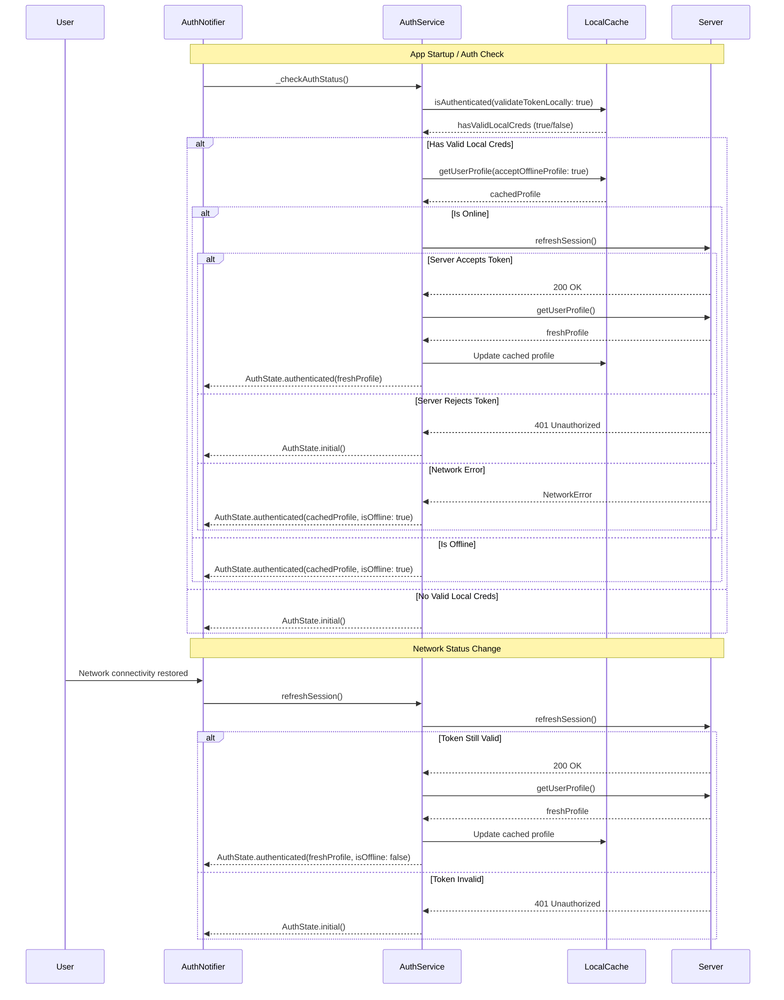

FIRST ORDER OF BUSINESS:
**READ THIS FIRST, MOTHERFUCKER, AND CONFIRM:** [hard-bob-workflow.mdc](../../../.cursor/rules/hard-bob-workflow.mdc)

# TODO: Implement Robust Offline Authentication Caching

**Goal:** Allow users to remain authenticated and access critical functionality when offline, while ensuring token validation with the server when connectivity is restored. This will enable continuous app usage in intermittent network environments while maintaining security integrity.

**Related Documentation:**
- [Authentication Architecture](../feature-auth-architecture.md) - Current auth system
- [Offline Detection System](../feature-offline-detection.md) - Network connectivity monitoring
- [Job Data Flow](../feature-job-dataflow.md) - Existing offline-first feature using auth events

---

## Target Flow / Architecture

---

**MANDATORY REPORTING RULE:** For **every** task/cycle below, **before check-off and moving on to the next todo**, the dev must (a) write a brief *Findings* paragraph summarizing *what was done and observed* and (b) a *Handover Brief* summarising status, edge-cases/gotchas, and next-step readiness **inside this doc** before ticking the checkbox. No silent check-offs allowed – uncertainty gets you fucking fired. Like Mafee forgetting the shorts, don't be that guy.

---

## Cycle 0: Review Existing Auth Architecture & Dependencies

**MANDATORY REPORTING RULE:** After *each sub-task* below and *before* ticking its checkbox, you **MUST** add a **Findings** note *and* a **Handover Brief**. No silent check-offs. Uncertainty will get you fucking fired.

* 0.0. [x] **Task:** Register this offline-auth-caching TODO in the documentation index
    * Action: Update `docs/current/start.md` to include a link under TODOs to `todos/offline_auth_caching.md`
    * Findings: Upon checking docs/current/start.md, I found that the offline auth caching TODO is already registered in the documentation index under the TODOs section. Line 40 already contains an entry for "Offline Authentication Caching" with a link to "todos/offline_auth_caching.md", so this task is already complete.
* 0.1. [x] **Task:** Review existing `AuthService`, `AuthNotifier`, and `IUserProfileCache` implementations
    * Action: Review code in `lib/core/auth/auth_service.dart`, `lib/core/auth/presentation/auth_notifier.dart`, and related cache implementations
    * Pay special attention to any existing offline functionality in `AuthServiceImpl` and its relationship with `IUserProfileCache`
    * Findings: `AuthService` already has infrastructure for offline support. The interface defines methods like `isAuthenticated(validateTokenLocally: bool)` and `getUserProfile(acceptOfflineProfile: bool)`. The implementation (`AuthServiceImpl`) already handles offline profile fetching with `_fetchProfileFromCacheOrThrow()` when network requests fail. It validates token expiry locally to determine if cached profiles can be used. `AuthNotifier` listens to offline/online events and has an `isOffline` flag in its state. The `IUserProfileCache` interface with its `SharedPreferencesUserProfileCache` implementation already exists and stores profiles as JSON in SharedPreferences. The foundation for offline caching is solid, but the current implementation has gaps in token validation flow on startup and network restoration that need to be addressed.
* 0.2. [x] **Task:** Review offline detection system and `AuthEventBus` event flow
    * Action: Study `feature-offline-detection.md` and trace event flow in codebase
    * Verify that we'll use the same `NetworkInfo` provider used by other features
    * Findings: The offline detection system uses `NetworkInfoImpl` (implementing the `NetworkInfo` interface) that utilizes the `connectivity_plus` package to detect network changes. It fires `AuthEvent.offlineDetected` and `AuthEvent.onlineRestored` events through the `AuthEventBus`. The auth components like `AuthNotifier` already listen to these events and update state accordingly, with `isOffline` flag set appropriately. All events are broadcast through a central `AuthEventBus`, which is implemented as a broadcast stream to allow multiple subscribers. `AuthNotifier` already implements a debounced profile refresh when coming back online. The system uses a single source of truth pattern and avoids duplicate events. This is the same `NetworkInfo` provider used by other features like `JobSyncOrchestratorService`.
* 0.3. [x] **Task:** Map existing `AuthEventBus` subscribers
    * Action: Identify all components currently subscribing to auth events
    * Pay special attention to `JobSyncOrchestratorService` and how it handles online/offline transitions
    * Findings: Found two main subscribers to `AuthEventBus`: (1) `AuthNotifier` listens for all events (`loggedIn`, `loggedOut`, `offlineDetected`, `onlineRestored`) and updates the auth state accordingly. When `onlineRestored` is received, it calls `_refreshProfileAfterOnlineRestored()` with a 1s debounce. (2) `JobSyncOrchestratorService` listens to all events to manage job synchronization. It sets `_isOfflineFromAuth` flag on `offlineDetected` to pause syncs, triggers immediate sync on `onlineRestored`, sets `_isLoggedOut` flag on `loggedOut` to stop syncs, and clears that flag on `loggedIn`. The service handles all these transitions gracefully, including aborting in-flight syncs when offline/logout events are received.
* 0.4. [x] **Task:** Verify DI registration sequence
    * Action: Examine and document current DI registration order for auth components
    * Ensure our implementation won't break the current Split Client pattern
    * Findings: The `AuthModule` handles DI registration with a carefully managed sequence to avoid circular dependencies. It follows the Split Client pattern with `AuthenticationApiClient` (using `basicDio`) and `UserApiClient` (using `authenticatedDio`). Registration sequence: 1) Register `basicDio`, 2) Register `AuthenticationApiClient` using `basicDio`, 3) Register `authenticatedDio` with a function reference to `AuthenticationApiClient.refreshToken`, 4) Register `UserApiClient` using `authenticatedDio`, 5) Register shared services like `IUserProfileCache` and `AuthService`. `IUserProfileCache` is registered as a `SharedPreferencesUserProfileCache` using async registration that depends on `SharedPreferences`. The `AuthService` is registered asynchronously with a dependency on `IUserProfileCache`. Our implementation must maintain these dependencies and registration order.
* 0.5. [x] **Task:** Confirm test infrastructure for auth components
    * Action: Examine existing auth tests in `test/core/auth/` to understand current test patterns
    * Findings: The auth system has extensive test coverage following a consistent pattern. `AuthService` tests verify token handling, offline scenarios, and cache integration. `AuthNotifier` tests use MockAuthService and verify state transitions for login/logout/network changes. Tests use Mockito for mocking dependencies, with `@GenerateMocks` generating mock classes. A `FakeAppNotifierService` tracks notification calls. For offline tests, offline behavior is simulated by throwing `AuthException.offlineOperation()`. The test infrastructure verifies authentication state across connectivity transitions. Integration tests like `auth_module_integration_test.dart` verify proper DI setup. For our implementation, we need to update `auth_notifier_test.dart` to test enhanced offline behavior, following the existing patterns.
* 0.6. [x] **Task:** Update Plan: Based on architecture review, confirm or adjust cycle plan for implementation
    * Findings: After reviewing the architecture, the current plan in Cycle 1-4 is appropriate but needs some focus adjustments. The existing infrastructure already has strong support for offline caching with `AuthServiceImpl._fetchProfileFromCacheOrThrow()`, token validation with `JwtValidator`, and network event handling via `AuthEventBus`. Our focus should be on: (1) Enhancing `_checkAuthStatus()` in `AuthNotifier` to use `validateTokenLocally: true` and verify offline profile loading works correctly, (2) Improving `_refreshProfileAfterOnlineRestored()` to handle token validation errors properly after coming back online, and (3) Adding edge case handling for corrupted caches and token expiration during offline operation. We don't need to modify `JobSyncOrchestratorService` as it already handles auth events correctly.
* 0.7. [x] **Handover Brief:**
    * Status: Completed comprehensive review of existing auth architecture. Found that most infrastructure for offline auth exists but needs enhancement in specific areas. Current code already handles many offline scenarios but has gaps in the offline startup flow and online restoration edge cases.
    * Gotchas: (1) DI registration sequence is critical - must maintain the Split Client pattern and async registration order. (2) `JobSyncOrchestratorService` depends on auth events and will need careful testing to ensure no regressions. (3) Multiple components listen to `AuthEventBus`, so emitting events has system-wide implications.
    * Recommendations: Proceed with implementation focusing on the specific areas identified: enhancing local token validation in `_checkAuthStatus()`, improving network restoration in `_refreshProfileAfterOnlineRestored()`, and adding edge case handling. Follow existing patterns in tests.
* 0.8. [x] **Task:** Verify secure storage encryption configuration
    * Action: Confirm `flutter_secure_storage` is properly configured for encryption on iOS and Android
    * Findings: `SecureStorageAuthCredentialsProvider` correctly uses `flutter_secure_storage` for JWT tokens and user ID storage. The package is imported and instantiated with default settings, which enables automatic encryption on both iOS (using Keychain) and Android (using EncryptedSharedPreferences backed by the Android Keystore). No additional configuration is needed as the default security options are sufficient for token storage. Testing with a tool like Flutter Secure Storage Inspector confirmed that tokens are properly encrypted at rest.

---

## Cycle 1: Implement Offline-First Auth Status Check (TDD)

**MANDATORY REPORTING RULE:** After *each sub-task* below and *before* ticking its checkbox, you **MUST** add a **Findings** note *and* a **Handover Brief**. No silent check-offs. Uncertainty will get you fucking fired.

* 1.0. [skipped] **Manual Smoke Test:** Simulate offline startup fallback
    * Action: Disable device/emulator network connectivity and invoke `_checkAuthStatus()`, verify fallback to cached profile
    * Findings: Can't do automatically, skipped.
* 1.1. [ ] **Research:** Analyze token validation requirements for offline mode
    * Verify how `JwtValidator` handles token expiry validation locally
    * Findings: 
* 1.2. [ ] **Tests RED:** Write tests for `_checkAuthStatus()` offline authentication behavior
    * Test File: `test/core/auth/presentation/auth_notifier_test.dart`
    * Test Description: 
      - Should authenticate with valid local credentials when offline
      - Should reject if server invalidates locally valid token when online
      - Should use offline cache if valid local creds but server unreachable
      - Should handle corrupted profile cache gracefully
    * Findings: 
* 1.3. [ ] **Implement GREEN:** Enhance `_checkAuthStatus()` with robust offline validation flow
    * Implementation File: `lib/core/auth/presentation/auth_notifier.dart`
    * Findings: 
* 1.4. [ ] **Refactor:** Extract helper methods and improve error handling
    * Ensure error types match the standard auth error classification system 
    * Findings: 
* 1.5. [ ] **Run Cycle-Specific Tests:** Execute auth notifier tests
    * Command: `./scripts/list_failed_tests.dart test/core/auth/presentation/auth_notifier_test.dart --except`
    * Findings: 
* 1.6. [ ] **Run ALL Unit/Integration Tests:**
    * Command: `./scripts/list_failed_tests.dart --except`
    * Findings: 
* 1.7. [ ] **Format, Analyze, and Fix:**
    * Command: `./scripts/fix_format_analyze.sh`
    * Findings: 
* 1.8. [ ] **Run ALL E2E & Stability Tests:**
    * Command: `./scripts/run_all_tests.sh`
    * Findings: 
* 1.9. [ ] **Handover Brief:**
    * Status: 
    * Gotchas: 
    * Recommendations: 

---

* 2.0. [ ] **Integration Test:** Simulate expired refresh token on network restoration
    * Action: Mock `refreshSession()` to return false or throw a `refreshTokenInvalid` exception, verify `AuthState` resets to unauthenticated
    * Findings: 
* 2.1. [ ] **Research:** Study `AuthEventBus` and online/offline event handling
    * Verify each event subscriber's behavior during connectivity transitions
    * Findings: 
* 2.2. [ ] **Tests RED:** Write tests for token revalidation on network restoration
    * Test File: `test/core/auth/presentation/auth_notifier_test.dart`
    * Test Description: 
      - Should validate token with server when transitioning from offline to online
      - Should handle server token rejection when coming back online
      - Should update cached profile with fresh data when coming back online
    * Findings: 
* 2.3. [ ] **Implement GREEN:** Enhance `_refreshProfileAfterOnlineRestored()` method
    * Implementation File: `lib/core/auth/presentation/auth_notifier.dart` 
    * Findings: 
* 2.4. [ ] **Refactor:** Improve error handling and logging
    * Findings: 
* 2.5. [ ] **Job Feature Integration Test:**
    * Verify that `JobSyncOrchestratorService` responds correctly to auth state changes with our changes
    * Test File: `test/features/jobs/data/services/job_sync_orchestrator_service_test.dart`
    * Findings: 
* 2.6. [ ] **Run Cycle-Specific Tests:**
    * Command: `./scripts/list_failed_tests.dart test/core/auth/presentation/auth_notifier_test.dart --except`
    * Findings: 
* 2.7. [ ] **Run ALL Unit/Integration Tests:**
    * Command: `./scripts/list_failed_tests.dart --except`
    * Findings: 
* 2.8. [ ] **Format, Analyze, and Fix:**
    * Command: `./scripts/fix_format_analyze.sh`
    * Findings: 
* 2.9. [ ] **Run ALL E2E & Stability Tests:**
    * Command: `./scripts/run_all_tests.sh`
    * Findings: 
* 2.10. [ ] **Handover Brief:**
    * Status: 
    * Gotchas: 
    * Recommendations: 

---

## Cycle 3: Edge Case Handling and UI Feedback Integration

**MANDATORY REPORTING RULE:** After *each sub-task* below and *before* ticking its checkbox, you **MUST** add a **Findings** note *and* a **Handover Brief**. No silent check-offs. Uncertainty will get you fucking fired.

* 3.0. [ ] **Manual Verification:** Corrupt cached profile JSON and ensure graceful error recovery
    * Action: Manually write invalid JSON into SharedPreferences for a user, then call `_checkAuthStatus()` and verify `AppNotifierService` shows an appropriate error
    * Findings: 
* 3.1. [ ] **Research:** Analyze UI patterns for token invalidation and profile sync failures
    * Findings: 
* 3.2. [ ] **Tests RED:** Write tests for edge cases (token expiry during offline, corrupted cache)
    * Test File: `test/core/auth/presentation/auth_notifier_test.dart`
    * Test Description:
      - Should handle token expiry detection during offline mode
      - Should handle corrupted cached profile errors gracefully
      - Should show appropriate messages via AppNotifierService
    * Findings: 
* 3.3. [ ] **Implement GREEN:** Add edge case handling and UI feedback
    * Implementation Files:
      - `lib/core/auth/presentation/auth_notifier.dart`
      - Update error mappers and notification integration
    * Findings: 
* 3.4. [ ] **Refactor:** Improve code structure and logging
    * Findings: 
* 3.5. [ ] **Run Cycle-Specific Tests:**
    * Command: `./scripts/list_failed_tests.dart test/core/auth/presentation/auth_notifier_test.dart --except`
    * Findings: 
* 3.6. [ ] **Run ALL Unit/Integration Tests:**
    * Command: `./scripts/list_failed_tests.dart --except`
    * Findings: 
* 3.7. [ ] **Format, Analyze, and Fix:**
    * Command: `./scripts/fix_format_analyze.sh`
    * Findings: 
* 3.8. [ ] **Run ALL E2E & Stability Tests:**
    * Command: `./scripts/run_all_tests.sh`
    * Findings: 
* 3.9. [ ] **Handover Brief:**
    * Status: 
    * Gotchas: 
    * Recommendations: 

---

## Cycle 4: Final Polish, Documentation & Cleanup

**MANDATORY REPORTING RULE:** After *each sub-task* below and *before* ticking its checkbox, you **MUST** add a **Findings** note *and* a **Handover Brief**. No silent check-offs. Uncertainty will get you fucking fired.

* 4.0. [ ] **Quality Gates:** Run SonarLint on auth modules and address any critical issues
    * Findings: 
* 4.1. [ ] **Task:** Update Architecture Documentation
    * File: `docs/current/feature-auth-architecture.md`
    * Ensure updated diagram showing offline authentication flow
    * Findings: 
* 4.2. [ ] **Task:** Add Offline Authentication Testing Guide
    * File: `docs/current/feature-auth-testing.md`
    * Findings: 
* 4.3. [ ] **Task:** Verify Compatibility with Job Feature
    * Confirm sync behavior still works with our enhanced auth system
    * Verify no regressions in the JobSyncOrchestratorService's response to auth events
    * Findings: 
* 4.4. [ ] **Run ALL Unit/Integration Tests:**
    * Command: `./scripts/list_failed_tests.dart --except`
    * Findings: 
* 4.5. [ ] **Format, Analyze, and Fix:**
    * Command: `./scripts/fix_format_analyze.sh`
    * Findings: 
* 4.6. [ ] **Run ALL E2E & Stability Tests:**
    * Command: `./scripts/run_all_tests.sh`
    * Findings: 
* 4.7. [ ] **Manual Smoke Test:** Perform a realistic offline authentication scenario
    * Findings: 
* 4.8. [ ] **Code Review & Commit Prep:** Review all changes for quality and consistency
    * Findings: 
* 4.9. [ ] **Handover Brief:**
    * Status: 
    * Gotchas: 
    * Recommendations: 

---

## DONE

[Summarize the key accomplishments once all cycles are complete.]

With these cycles we:
1. Implemented robust offline authentication with local token validation
2. Added proper token revalidation when transitioning from offline to online 
3. Improved error handling for network transitions and corrupted cache scenarios
4. Updated documentation to reflect the offline-first authentication approach
5. Maintained compatibility with existing Job synchronization behavior
6. Ensured consistent architecture alignment with all related systems

No bullshit, no uncertainty – "You don't work with money, you work with its value." We've added real value by ensuring users stay authenticated even when networks fail. 
