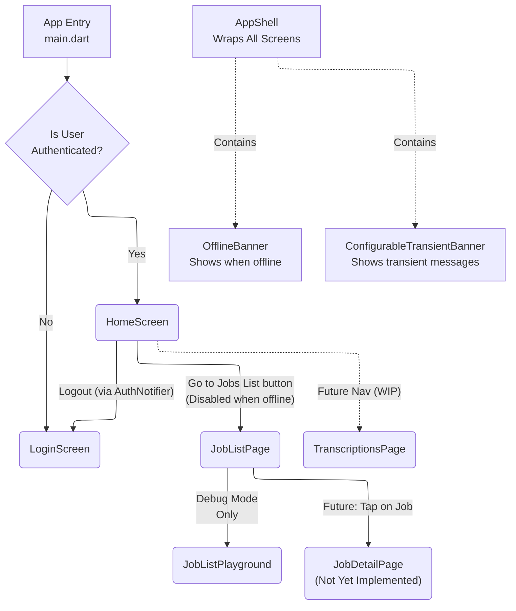
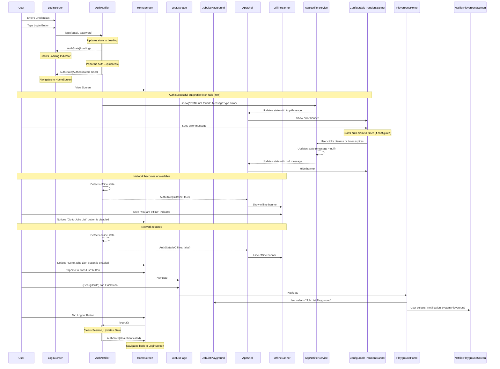

# DocJet Mobile UI Screens

This document provides an overview of all the screens and significant UI components in the DocJet Mobile application.

## Screen Navigation Flow

## Typical User Flow (Sequence)

## Global UI Components

### AppShell
- **Path**: `lib/core/auth/presentation/widgets/app_shell.dart`
- **Purpose**: Provides consistent app-wide UI elements across all screens
- **Current State**: Fully implemented and applied to all screens via `MaterialApp.builder`
- **Key Features**:
  - Wraps all screens in the application
  - Positions the OfflineBanner at the top of each screen
  - Ensures UI consistency regardless of how screens are navigated to (including pushed routes)
  - Implemented as a Column with the OfflineBanner at the top and an Expanded child below

### OfflineBanner
- **Path**: `lib/core/auth/presentation/widgets/offline_banner.dart`
- **Purpose**: Visually indicates when the app is in offline mode
- **Current State**: Fully implemented with theme-aware styling
- **Key Features**:
  - Automatically shows/hides based on the app's offline state through authNotifierProvider
  - Adapts to light/dark themes using the app's theming system
  - Provides proper accessibility support through Semantics widget
  - Animates height and opacity for smooth transitions
  - Uses AnimatedContainer for height transitions and AnimatedOpacity for fade effects
  - Consistently appears at the top of all screens via AppShell

### ConfigurableTransientBanner
- **Path**: `lib/core/common/widgets/configurable_transient_banner.dart`
- **Purpose**: Displays transient messages (info, success, warning, error) without halting app functionality
- **Current State**: Fully implemented with flexible configuration options
- **Key Features**:
  - Supports multiple message types: info, success, warning, error with appropriate styling
  - Automatically dismisses based on configurable duration parameter (or stays until manually dismissed)
  - Includes manual dismiss button for user control
  - Respects safe area to ensure visibility below device notches/islands
  - Uses AnimatedSize with easeOutCubic curve for smooth height transitions
  - Adapts styling based on message type using AppColorTokens notification colors
  - Appears when AppNotifierService has a message to show
  - Enhanced accessibility with Semantics and liveRegion support
  - Can be triggered from anywhere in the app through the AppNotifierService

## Authentication Screens

### LoginScreen
- **Path**: `lib/features/auth/presentation/screens/login_screen.dart`
- **Purpose**: Allows users to authenticate by entering their credentials
- **Current State**: Fully implemented with Cupertino widgets, handles loading, error, and offline states.
- **Key Features**:
  - Email and Password input fields (`CupertinoTextField`)
  - Login button triggering `AuthNotifier.login`
  - Displays specific error messages (`AuthErrorMessage`)
  - Shows a loading indicator during login attempts (`CupertinoActivityIndicator`)
  - Offline status is now displayed through the global OfflineBanner component

## Main Application Screens

### HomeScreen
- **Path**: `lib/features/home/presentation/screens/home_screen.dart`
- **Purpose**: Main screen shown after authentication, serves as an entry point to app features
- **Current State**: Implemented with navigation to JobListPage and offline-aware UI
- **Key Features**:
  - Displays the authenticated user's ID
  - Contains a logout button in the app bar
  - Includes a "Go to Jobs List" button that navigates to the JobListPage
  - The "Go to Jobs List" button is automatically disabled when offline by checking authState.isOffline
  - Will incorporate navigation to other features in the future, including the planned `TranscriptionsPage`

### TranscriptionsPage [WIP]
- **Path**: `lib/features/home/presentation/pages/transcriptions_page.dart`
- **Purpose**: [Future] Intended to show a list of transcriptions (replacing the simpler `JobListPage` eventually or co-existing).
- **Current State**: Skeleton implementation exists but is not currently integrated into the main navigation flow.
- **Key Features**:
  - Contains placeholder UI elements.
  - Includes a `RecordButton` for initiating new recordings (future functionality).
  - UI Components intended for this page are being developed and tested in the `JobListPlayground`.

## Jobs Feature Screens

### JobListPage
- **Path**: `lib/features/jobs/presentation/pages/job_list_page.dart`
- **Purpose**: Displays a list of jobs (simpler view, potentially temporary before `TranscriptionsPage` is fully implemented).
- **Current State**: Fully implemented with BLoC pattern and offline-aware UI.
- **Key Features**:
  - Shows loading indicators during data fetching
  - Displays a list of JobListItem widgets for each job
  - Shows appropriate error messages when needed
  - Displays "No jobs yet" message when the list is empty
  - Disables "Create Job" button when the app is offline
  - Passes offline state to JobListItem components to disable interactions when offline
  - Uses the shared JobListCubit instance from the app level (via BlocProvider.of) to prevent recreation

### JobListPlayground
- **Path**: `lib/features/jobs/presentation/pages/job_list_playground.dart`
- **Purpose**: Development sandbox for rapidly iterating on job list UI components.
- **Current State**: Fully implemented with experimental features, mock data, and offline awareness.
- **Key Features**:
  - Shows the job list with actual data or falls back to mock data if needed
  - Contains buttons for testing job creation
  - Accessible via the central Playground Home
  - Includes offline-aware UI elements that disable actions when offline
  - Uses BlocProvider.value to reuse the existing JobListCubit from the parent context

### NotifierPlaygroundScreen
- **Path**: `lib/features/playground/notifier_playground.dart`
- **Purpose**: Development sandbox for testing the app-wide notification system.
- **Current State**: Fully implemented with controls for all notification types and durations.
- **Key Features**:
  - Contains buttons to trigger notifications of all types (info, success, warning, error)
  - Allows testing both auto-dismiss and manual dismiss behaviors
  - Includes test for rapid sequential notifications
  - Displays notifications using the ConfigurableTransientBanner component
  - Accessible via the central Playground Home

### PlaygroundHome
- **Path**: `lib/features/playground/playground_home.dart`
- **Purpose**: Central hub for accessing all UI playground screens.
- **Current State**: Fully implemented with navigation to all available playgrounds.
- **Key Features**:
  - Provides a list of all available playground screens
  - Each playground has a descriptive tile with icon and description
  - Accessible via a debug button in JobListPage (only in debug builds)
  - Serves as the single entry point to all UI experimentation areas
  - Easily extensible to add new playground screens as needed

## Navigation and Routing

The application uses a simple routing approach:

1. **Initial Route**: Determined in `main.dart` based on authentication state
   - If authenticated: Shows `HomeScreen`
   - If not authenticated: Shows `LoginScreen`

2. **Manual Navigation**:
   - From `HomeScreen` to `JobListPage` using `Navigator.push` with `CupertinoPageRoute`
   - From `JobListPage` to `PlaygroundHome` using `Navigator.push` with `MaterialPageRoute`
   - From `PlaygroundHome` to specific playground screens using `Navigator.push` with `MaterialPageRoute`

3. **Global UI Wrapper**:
   - All screens are wrapped with `AppShell` via `MaterialApp.builder`
   - This ensures consistent UI elements (such as the OfflineBanner) appear on all screens
   - Works with both initial routes and screens navigated to with `Navigator.push`

## UI Widgets

### Record Buttons
- `lib/core/widgets/record_button.dart` - Central shared implementation
- Re-exported by feature modules for backward compatibility
- Uses theme-aware styling from the app's theming system with AppColorTokens

### JobListItem
- **Path**: `lib/features/jobs/presentation/widgets/job_list_item.dart`
- **Purpose**: Renders a single job item in the list
- **Key Features**:
  - Displays job title, sync status, and date
  - Shows warning icon for jobs with file issues
  - Uses Cupertino styling for consistent iOS-like appearance
  - Adapts to the app's theme system for consistent colors
  - Responds to offline state to disable interactions when appropriate

## Offline Behavior

The app implements a comprehensive offline-aware UI strategy:

1. **Visibility**: The offline state is clearly communicated to users through:
   - The global OfflineBanner at the top of all screens
   - Disabled buttons and interactions throughout the app

2. **Interaction Restrictions**: When offline:
   - The "Go to Jobs List" button on HomeScreen is disabled
   - The "Create Job" button on JobListPage is disabled
   - The flask icon (debug mode) for accessing JobListPlayground is disabled
   - Various action buttons in JobListPlayground are disabled
   - JobListItem interactions may be restricted

3. **Theme Integration**: The offline UI elements integrate with the app's theming system:
   - The OfflineBanner uses theme-aware colors via OfflineBannerTheme
   - Colors adapt to light/dark mode automatically
   - Styling is consistent across the application

4. **Accessibility**: Offline status is properly communicated to screen readers:
   - The OfflineBanner includes appropriate Semantics wrapper with descriptive labels
   - State changes are announced to assistive technologies
