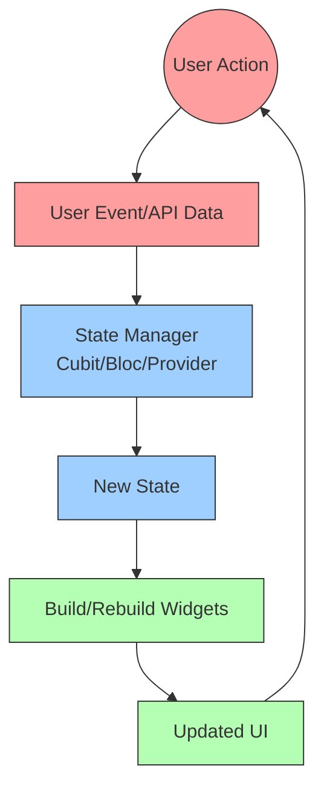
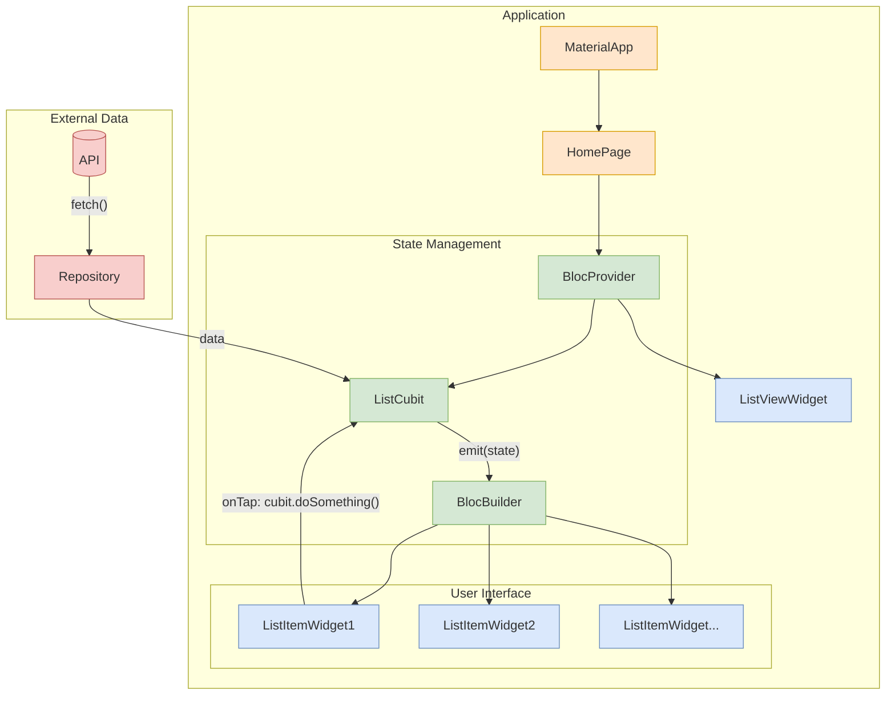
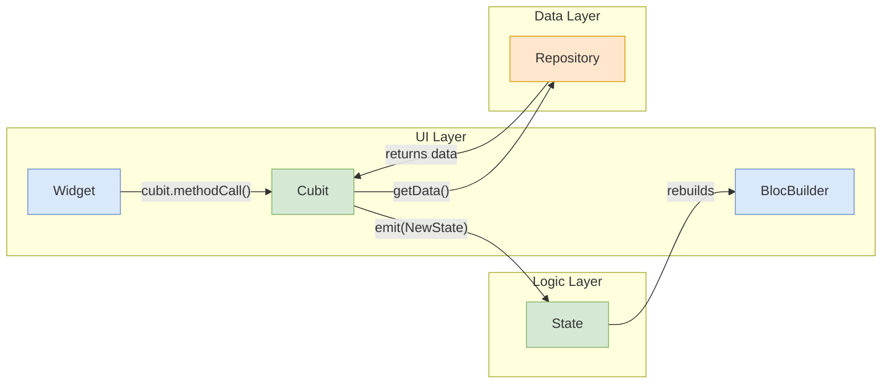
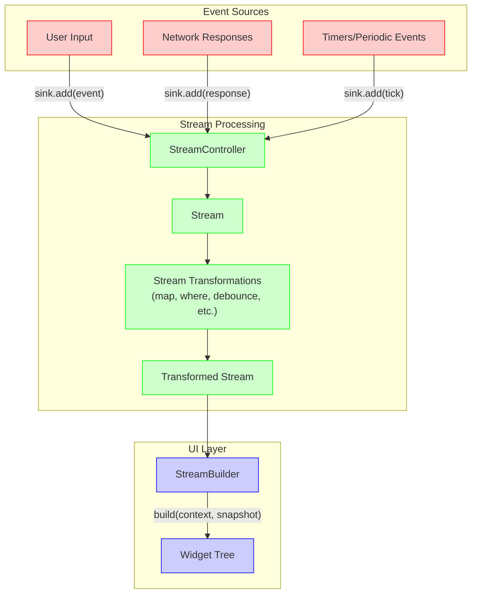
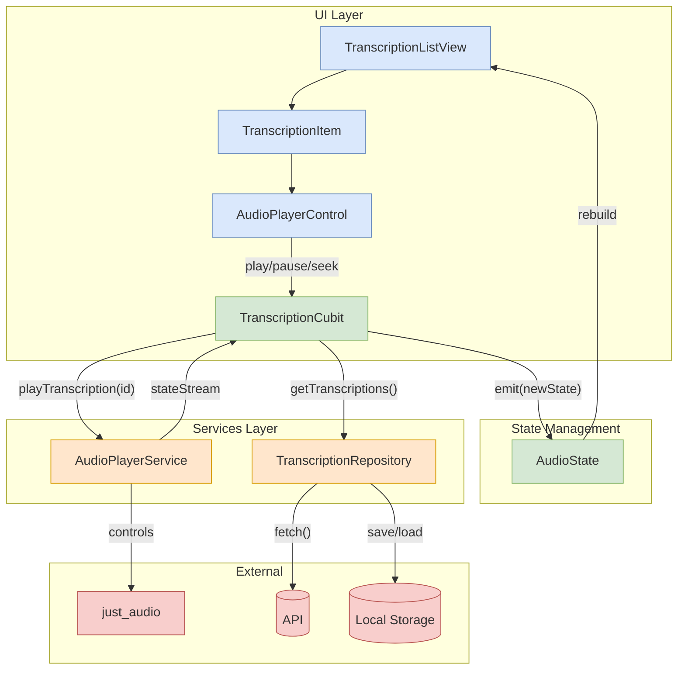

# Flutter for Software Engineers: No Bullshit Edition

Alright, you know software engineering but are new to Flutter and reactive programming. Let me break it down without the marketing fluff.

## What Flutter Actually Is

Flutter is a UI toolkit that renders its own pixels rather than using the native UI components of the platform. It's built on these key components:

1. **Dart**: A C-style language with modern features (null safety, async/await, strong typing)
2. **Widget Tree**: Everything is a "Widget" in a composable tree structure
3. **Rendering Engine**: Skia (the same one Chrome uses) for consistent cross-platform rendering
4. **State Management**: Various approaches to handle UI updates when data changes

## The Mental Model Shift

Here's what makes Flutter different from traditional UI frameworks:

### 1. Declarative UI

In traditional imperative UI (like Android XML, iOS Storyboards), you:
- Create views
- Get references to them
- Mutate their properties

In Flutter's declarative UI, you:
- Describe what the UI should look like for a given state
- When state changes, Flutter rebuilds the parts that need to change

```dart
// Traditional imperative approach (pseudocode)
Button myButton = findButtonById("submit");
myButton.setText("Submit");
myButton.setEnabled(isFormValid);

// Flutter declarative approach
return Button(
  text: "Submit",
  enabled: isFormValid,
  onPressed: submitForm,
);
```

### 2. Everything is a Widget

Unlike frameworks with separate concepts for views, layouts, and controls, Flutter uses widgets for everything:
- UI elements (Button, Text)
- Layout (Row, Column, Stack)
- Spacing (Padding, SizedBox)
- Animation (AnimatedBuilder)
- Even invisible helpers (StreamBuilder, FutureBuilder)

Widgets compose like functions, not like traditional XML hierarchies.

### 3. Immutable UI, Mutable State

Flutter's architecture is based on:
- **Immutable widgets**: Cannot change after creation
- **Mutable state**: Stored separately from widgets
- **Rebuild cycle**: When state changes, widgets rebuild

This is different from traditional frameworks where you directly modify UI elements.

## The Three Key Widget Types

1. **StatelessWidget**: Pure function of its inputs (props/parameters)
   - Like a React functional component
   - Use when UI depends only on inputs, not internal state

2. **StatefulWidget**: Has internal state that can change
   - Comes in pairs: Widget class + State class
   - State persists across rebuilds
   - Use when widget needs to maintain data or control logic

3. **InheritedWidget**: Propagates data down the tree implicitly
   - Like React Context
   - Avoids "prop drilling" through intermediate widgets

## The Reactive Programming Part

Flutter embraces reactive programming through:

### Streams

Think of Streams as asynchronous event channels:
- Data flows from source to sink over time
- You can transform, combine, and filter the data flow
- UI can react to these events via StreamBuilder widget

```dart
Stream<int> counterStream = Stream.periodic(Duration(seconds: 1), (i) => i);

// In UI:
StreamBuilder<int>(
  stream: counterStream,
  builder: (context, snapshot) {
    return Text('Counter: ${snapshot.data}');
  }
)
```

### State Management

The fundamental reactive question: "How does the UI update when data changes?"

Flutter offers many approaches, ranked from simplest to most structured:

1. **setState()**: Manual trigger for StatefulWidget rebuilds
2. **InheritedWidget/Provider**: Passing state down the tree
3. **Streams/BLoC**: Reactive data flow with business logic
4. **Redux/MobX**: Centralized state with prescribed patterns
5. **Riverpod/GetX**: Modern alternatives with specific features

## The Build Context Mystery

`BuildContext` is often confusing to newcomers. Think of it as:
- The location of a widget in the widget tree
- A way to access data higher up in the tree
- A handle that lets widgets interact with the framework

```dart
// Using context to find data higher in the tree
final theme = Theme.of(context);
final navigator = Navigator.of(context);
```

## The Flutter Execution Model

1. **Single-Threaded**: UI runs on one thread (the main isolate)
2. **Event-Driven**: Framework responds to events (touch, timers, data)
3. **Three Trees**:
   - **Widget Tree**: The blueprint (what you code)
   - **Element Tree**: The instantiation of widgets (managed by framework)
   - **Render Tree**: The actual painting instructions (also framework-managed)

## Coming from Other Frameworks

- **React Devs**: Flutter is like React with additional rendering responsibility
- **Android/iOS Devs**: No more view controllers or activities; everything is composable widgets
- **Desktop Devs**: Forget retained-mode UI and embrace the rebuild paradigm

## The Hard Bob Bottom Line

Flutter fundamentally differs from traditional UI frameworks by embracing:
1. **Frequent rebuilds** rather than mutation
2. **Composition** rather than inheritance
3. **Reactive data flow** rather than imperative updates

This paradigm takes some adjustment, but once it clicks, you'll build UIs more efficiently than in traditional frameworks.

## Glossary of Flutter Terms

### Core Concepts

| Term | Definition |
|------|------------|
| **Widget** | The fundamental building block of Flutter UIs. Everything visible (and many invisible things) is a widget. |
| **State** | Data that can change during the lifetime of a widget. When state changes, the UI can be rebuilt to reflect those changes. |
| **BuildContext** | A reference to the location of a widget in the widget tree, providing access to theme, navigation, and other tree-wide resources. |
| **Scaffold** | A basic material design layout structure that provides app bars, bodies, floating action buttons, etc. |
| **MaterialApp** | The root widget that configures the overall visual theme and navigation structure for material design apps. |

### State Management

| Term | Definition |
|------|------------|
| **Cubit** | A simplified form of BLoC that exposes state and methods to change that state, but without events. Part of the bloc package. |
| **Bloc** | Business Logic Component - a more structured state management approach that separates events, state, and logic using streams. |
| **Provider** | A dependency injection and state management solution that uses InheritedWidget under the hood. |
| **ChangeNotifier** | A Flutter class that provides change notification to listeners. Used with Provider for simpler state management. |
| **GetX** | An alternative state management solution that includes routing, dependency injection, and other utilities. |
| **Riverpod** | An improved version of Provider that adds compile-time safety and more flexibility. |

### Asynchronous Patterns

| Term | Definition |
|------|------------|
| **Future** | A value or error that will be available at some time in the future (like a JavaScript Promise). |
| **Stream** | A sequence of asynchronous events, like an observable sequence in ReactiveX. |
| **StreamController** | Creates and manages a Stream, allowing you to add events programmatically. |
| **StreamBuilder** | A widget that builds itself based on the latest snapshot of interaction with a Stream. |
| **FutureBuilder** | A widget that builds itself based on the latest snapshot of interaction with a Future. |
| **async/await** | Syntax for working with asynchronous code more like synchronous code. |

### Layout and Styling

| Term | Definition |
|------|------------|
| **Container** | A convenience widget that combines common painting, positioning, and sizing operations. |
| **Row/Column** | Flex-based layouts that arrange children horizontally or vertically. |
| **Stack** | A widget that positions children relative to its box boundaries. |
| **SizedBox** | A box with a specified size, often used for creating precise spacing. |
| **BoxDecoration** | Describes how to draw a box (background, border, shadow, etc.). |
| **ThemeData** | Defines colors and typography styles for an application. |

## How Flutter's Reactive System Works Together

### The Reactive Data Flow Architecture

The power of Flutter comes from how these components work together to create a reactive system:



### Widget Tree and State Flow

Here's how state flows through a typical Flutter application with a Cubit:



### State Management with Cubit/Bloc

The Cubit pattern (a simplified BLoC) works like this:



### Streams, Bloc, and Cubit: The Connection

**Important Clarification**: Both BLoC and Cubit use streams *internally*, but they provide different developer experiences:

1. **Cubit** is a simplification that *hides* the stream complexity:
   - You call methods directly on the Cubit instance
   - Internally, it uses a stream to emit state changes
   - But you don't directly interact with the stream API

2. **BLoC** (original pattern) exposes more of the stream paradigm:
   - You add events to a sink
   - BLoC transforms events to states using stream operators
   - It's more powerful but requires more boilerplate

3. **What's happening under the hood:**
   ```dart
   // Simplified representation of what Cubit does internally
   class Cubit<State> {
     // This is the INTERNAL stream controller
     final _stateController = StreamController<State>.broadcast();
     
     // The stream that widgets listen to (you don't directly use this in code)
     Stream<State> get stream => _stateController.stream;
     
     // Your method call triggers this
     void emit(State state) {
       _stateController.add(state); // Add to the stream
     }
   }
   ```

### Direct Stream-Based Reactivity

The "Stream-Based Reactivity" section shows the *direct* use of streams, which is an alternative approach when:

1. You need more fine-grained control over event processing
2. You're not using the bloc/cubit packages
3. You're integrating with platform channels or other stream-based APIs
4. You want to use complex stream transformations

This is what raw stream usage looks like without Cubit's abstractions:



### When to Use Which Approach

1. **Use Cubit/Bloc when**:
   - You want a standardized state management approach
   - You prefer a more structured API over raw streams
   - Your state changes follow predictable patterns
   - You want easy testing with bloc_test

2. **Use direct streams when**:
   - You're integrating with APIs that already provide streams
   - You need complex transformations (throttling, debouncing, combining)
   - You prefer a more functional reactive programming style
   - You want more direct control over subscription lifecycle

For your audio player list, the Cubit approach is likely the most straightforward - you get the benefits of streams without having to manage them directly.

### Audio Player Architecture Example

For your specific audio player list, here's how components would work together:



## Practical Example: Audio Player with Cubit

Here's a practical code sketch of how the components work together for an audio player list:

```dart
// 1. STATE DEFINITION
class TranscriptionState extends Equatable {
  final List<Transcription> transcriptions;
  final String? currentlyPlayingId;
  final bool isPlaying;
  final Duration position;
  final Duration duration;
  
  // Constructor, copyWith, props methods...
}

// 2. CUBIT (STATE MANAGEMENT)
class TranscriptionCubit extends Cubit<TranscriptionState> {
  final TranscriptionRepository _repository;
  final AudioPlayerService _playerService;
  late final StreamSubscription _playerSubscription;
  
  TranscriptionCubit(this._repository, this._playerService) 
      : super(TranscriptionState.initial()) {
    
    // Listen to audio player state changes
    _playerSubscription = _playerService.stateStream.listen(_updatePlaybackState);
  }
  
  Future<void> loadTranscriptions() async {
    // Load data and emit new state
    final transcriptions = await _repository.getTranscriptions();
    emit(state.copyWith(transcriptions: transcriptions));
  }
  
  Future<void> playTranscription(String id) async {
    // Get file path and play
    final path = await _repository.getAudioFilePath(id);
    await _playerService.play(path);
    emit(state.copyWith(currentlyPlayingId: id));
  }
  
  void _updatePlaybackState(AudioPlayerState playerState) {
    // Update state based on player events
    emit(state.copyWith(
      isPlaying: playerState.isPlaying,
      position: playerState.position,
      duration: playerState.duration,
    ));
  }
  
  // More methods: pause, seek, etc.
}

// 3. UI COMPONENTS
class TranscriptionListView extends StatelessWidget {
  @override
  Widget build(BuildContext context) {
    return BlocBuilder<TranscriptionCubit, TranscriptionState>(
      builder: (context, state) {
        return ListView.builder(
          itemCount: state.transcriptions.length,
          itemBuilder: (context, index) {
            final item = state.transcriptions[index];
            final isPlaying = state.currentlyPlayingId == item.id;
            
            return TranscriptionItem(
              transcription: item,
              isPlaying: isPlaying,
              position: isPlaying ? state.position : Duration.zero,
              duration: isPlaying ? state.duration : item.duration,
              onPlay: () => context.read<TranscriptionCubit>().playTranscription(item.id),
              onPause: () => context.read<TranscriptionCubit>().pausePlayback(),
              onSeek: (position) => context.read<TranscriptionCubit>().seekTo(position),
            );
          },
        );
      },
    );
  }
}
```

This reactive model ensures your UI always stays in sync with the application state, creating a smooth and maintainable audio player list implementation.