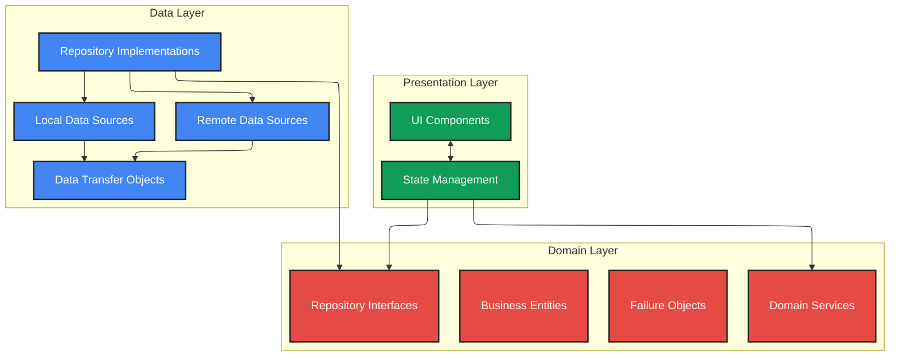

# DocJet Mobile Architecture

This document provides an overview of the DocJet Mobile application architecture.

## Table of Contents

1. [Architectural Principles](#architectural-principles)
2. [Layered Architecture](#layered-architecture)
3. [Feature Architectures](#feature-architectures)
4. [Documentation Guidelines](#documentation-guidelines)

## Architectural Principles

DocJet Mobile follows these key principles:

1. **Clean Architecture** - Clear separation of concerns between layers
2. **Domain-Driven Design** - Core business logic in a pure Dart domain layer
3. **Repository Pattern** - Abstraction over data sources with consistent interfaces
4. **Offline-First** - Local storage with remote synchronization
5. **Reactive UI** - State management for reactive user interfaces

## Layered Architecture

The application uses a 3-layer architecture:

### Presentation Layer
- UI components (screens, widgets)
- State management (Cubits/BLoCs)
- Navigation

### Domain Layer
- Business entities (pure Dart objects)
- Repository interfaces
- Domain services
- Failure handling

### Data Layer
- Repository implementations
- Remote data sources (API clients)
- Local data sources (database)
- Data transfer objects (DTOs)

## Feature Architectures

Detailed architecture documentation for specific features:

1. [Jobs Feature Architecture](./job_dataflow.md) - Components and data flow for jobs
2. [Authentication Architecture](./auth_architecture.md) - Authentication components and flows

## Documentation Guidelines

For creating consistent documentation and diagrams:

1. [Mermaid Guidelines](./mermaid_guidelines.md) - Standards for creating Mermaid diagrams
