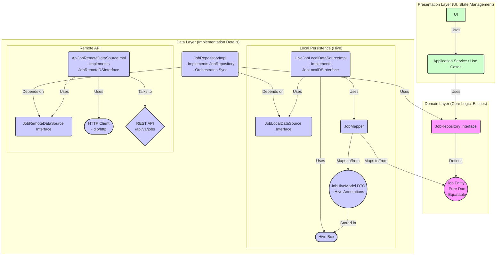
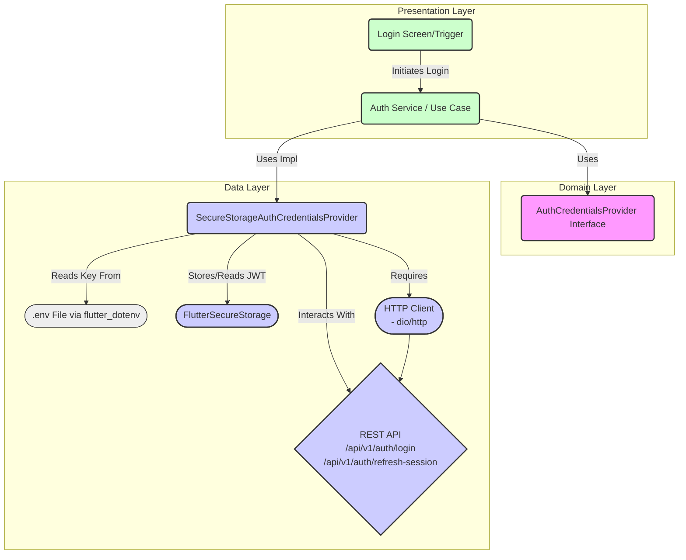

# Job Feature Architecture

```mermaid
graph TD
    subgraph "Presentation Layer (UI, State Management)"
        UI -->|Uses| AppService(Application Service / Use Cases)
    end

    subgraph "Domain Layer (Core Logic, Entities)"
        AppService -->|Uses| JobRepositoryInterface(JobRepository Interface)
        JobEntity((Job Entity\n- Pure Dart\n- Equatable))
        JobRepositoryInterface -- Defines --> JobEntity
    end

    subgraph "Data Layer (Implementation Details)"
        JobRepositoryImpl(JobRepositoryImpl\n- Implements JobRepository\n- Orchestrates Sync) -->|Uses| JobRepositoryInterface
        JobRepositoryImpl -->|Depends on| JobLocalDSInterface(JobLocalDataSource Interface)
        JobRepositoryImpl -->|Depends on| JobRemoteDSInterface(JobRemoteDataSource Interface)

        subgraph "Local Persistence (Hive)"
            HiveJobLocalDS(HiveJobLocalDataSourceImpl\n- Implements JobLocalDSInterface) -->|Uses| JobLocalDSInterface
            HiveJobLocalDS -->|Uses| JobMapper(JobMapper)
            HiveJobLocalDS -->|Uses| HiveBox([Hive Box])
            JobMapper -->|Maps to/from| JobHiveModel((JobHiveModel DTO\n- Hive Annotations))
            JobMapper -->|Maps to/from| JobEntity
            JobHiveModel -- Stored in --> HiveBox
        end

        subgraph "Remote API"
            ApiJobRemoteDS(ApiJobRemoteDataSourceImpl\n- Implements JobRemoteDSInterface) -->|Uses| JobRemoteDSInterface
            ApiJobRemoteDS -->|Uses| HttpClient([HTTP Client\n- dio/http])
            ApiJobRemoteDS -->|Talks to| RestAPI{REST API\n/api/v1/jobs}
            %% ApiJobRemoteDS -->|Maps JSON to/from| JobEntity %% Potentially needs ApiDTO later
        end
    end

    %% Styling for clarity
    classDef domain fill:#f9f,stroke:#333,stroke-width:2px;
    classDef data fill:#ccf,stroke:#333,stroke-width:2px;
    classDef presentation fill:#cfc,stroke:#333,stroke-width:2px;

    class JobEntity,JobRepositoryInterface domain;
    class JobRepositoryImpl,JobLocalDSInterface,JobRemoteDSInterface,HiveJobLocalDS,ApiJobRemoteDS,JobMapper,JobHiveModel,HiveBox,HttpClient,RestAPI data;
    class UI,AppService presentation;

```

# Authentication Architecture

This diagram illustrates the flow for obtaining and managing authentication credentials (JWT and API Key).

```mermaid
graph TD
    subgraph "Presentation Layer"
        UI(Login Screen/Trigger) -->|Initiates Login| AuthService(Auth Service / Use Case)
    end

    subgraph "Domain Layer"
        AuthService -->|Uses| AuthCredProviderInterface(AuthCredentialsProvider Interface)
    end

    subgraph "Data Layer"
        AuthService -->|Uses Impl| AuthCredProviderImpl(SecureStorageAuthCredentialsProvider)
        AuthCredProviderImpl -->|Reads Key From| DotEnv([.env File via flutter_dotenv])
        AuthCredProviderImpl -->|Stores/Reads JWT| SecureStorage([FlutterSecureStorage])
        AuthCredProviderImpl -->|Interacts With| AuthAPI{REST API\n/api/v1/auth/login\n/api/v1/auth/refresh-session}
        AuthCredProviderImpl -->|Requires| HttpClient([HTTP Client\n- dio/http])
        HttpClient --> AuthAPI
    end

    %% Styling
    classDef domain fill:#f9f,stroke:#333,stroke-width:2px;
    classDef data fill:#ccf,stroke:#333,stroke-width:2px;
    classDef presentation fill:#cfc,stroke:#333,stroke-width:2px;
    classDef external fill:#eee,stroke:#333,stroke-width:1px;


    class UI,AuthService presentation;
    class AuthCredProviderInterface domain;
    class AuthCredProviderImpl,SecureStorage,HttpClient,AuthAPI data;
    class DotEnv external;
``` 