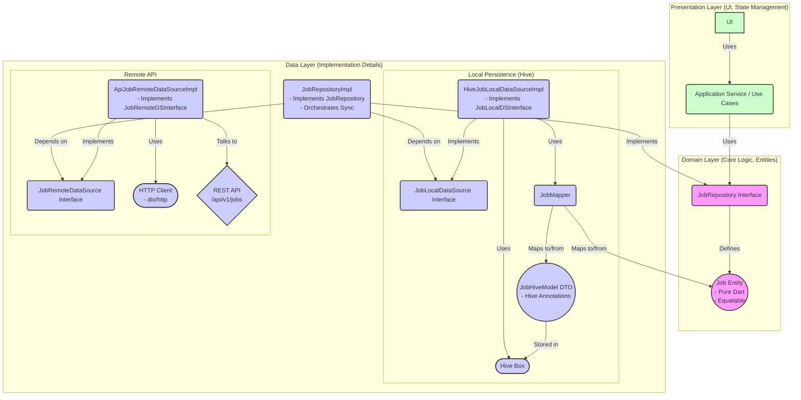
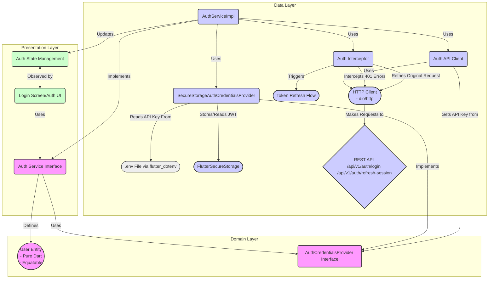
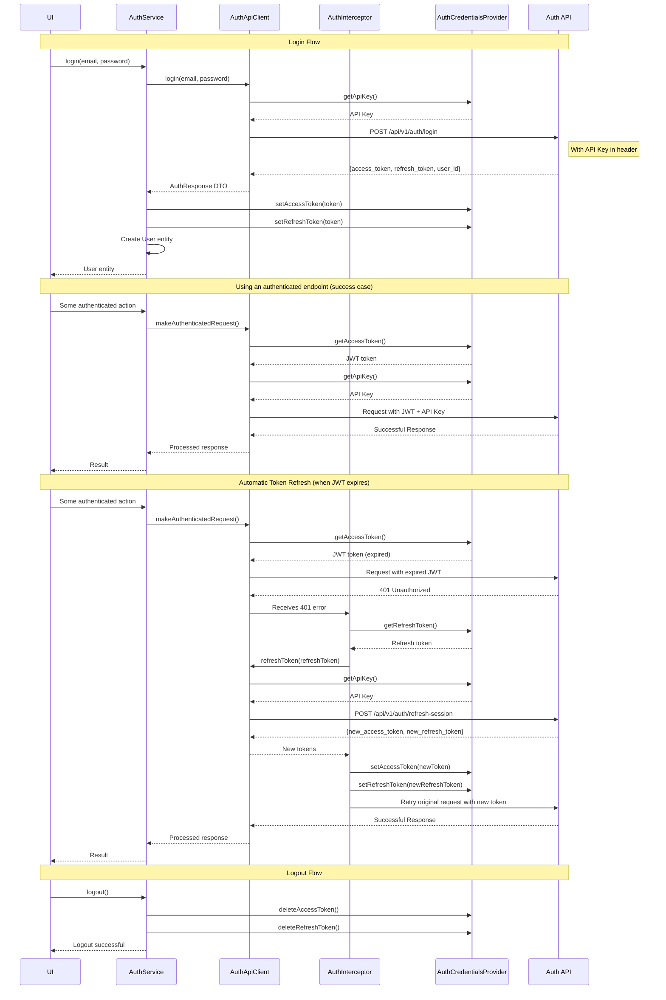

# Job Feature Architecture

# Authentication Architecture

This diagram illustrates the components and their relationships for the authentication system.

## Authentication Flow

This sequence diagram illustrates the authentication process from login to using authenticated endpoints.

## Authentication Components

### Domain Layer

#### AuthService Interface
The `AuthService` interface defines the following methods:
- `Future<User> login(String email, String password)` - Authenticates a user and returns user data
- `Future<bool> refreshSession()` - Manually refreshes the authentication token (used on startup)
- `Future<void> logout()` - Logs the user out by clearing stored tokens
- `Future<bool> isAuthenticated()` - Checks if stored credentials exist (basic check for initial app state)

#### AuthCredentialsProvider Interface
Manages secure storage and retrieval of authentication credentials:
- API key from environment variables
- Access and refresh tokens in secure storage

### Data Layer

#### AuthServiceImpl
Implements the `AuthService` interface, orchestrating the authentication flow.

#### AuthApiClient
Responsible for communication with authentication endpoints:
- `login()` - Authenticates with email/password
- `refreshToken()` - Refreshes tokens when expired
- Maps API errors to domain-specific exceptions

#### AuthInterceptor
A Dio interceptor that:
1. Automatically detects 401 (Unauthorized) errors
2. Initiates token refresh flow
3. Retries the original request with the new token
4. Handles failure cases (like invalid refresh tokens)

This approach provides seamless token refresh without UI layer awareness of expired tokens. The authentication flow is handled at the data layer where it belongs, maintaining clean separation of concerns.

#### SecureStorageAuthCredentialsProvider
Concrete implementation of `AuthCredentialsProvider` using:
- `flutter_secure_storage` for token storage
- `flutter_dotenv` for environment variables (API key)

### Presentation Layer

#### AuthState
Immutable state object representing the current authentication state:
- `user` - The authenticated user entity
- `status` - Current status (authenticated, unauthenticated, loading, error)
- `errorMessage` - Error message if authentication failed

#### AuthNotifier
State management for authentication, connecting UI to domain services:
- `login()` - Authenticates a user
- `logout()` - Logs out the current user
- `checkAuthStatus()` - Verifies authentication on app startup

The UI components observe the `AuthNotifier` state to render the appropriate screens based on authentication status. 