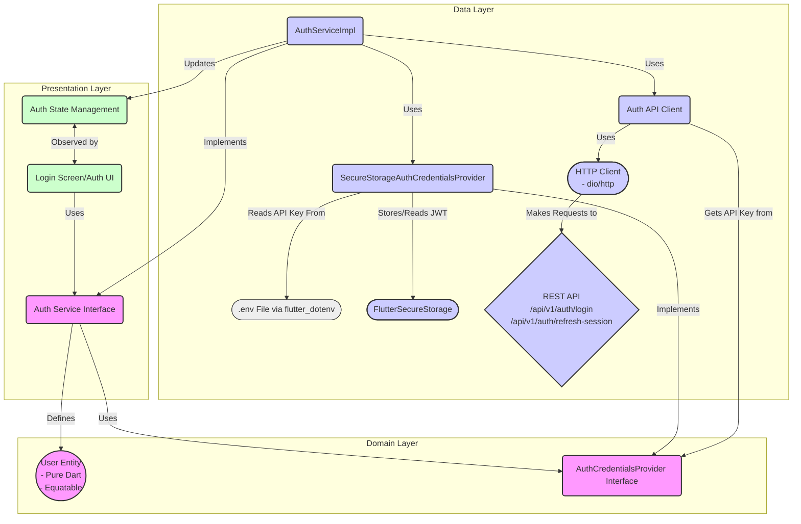
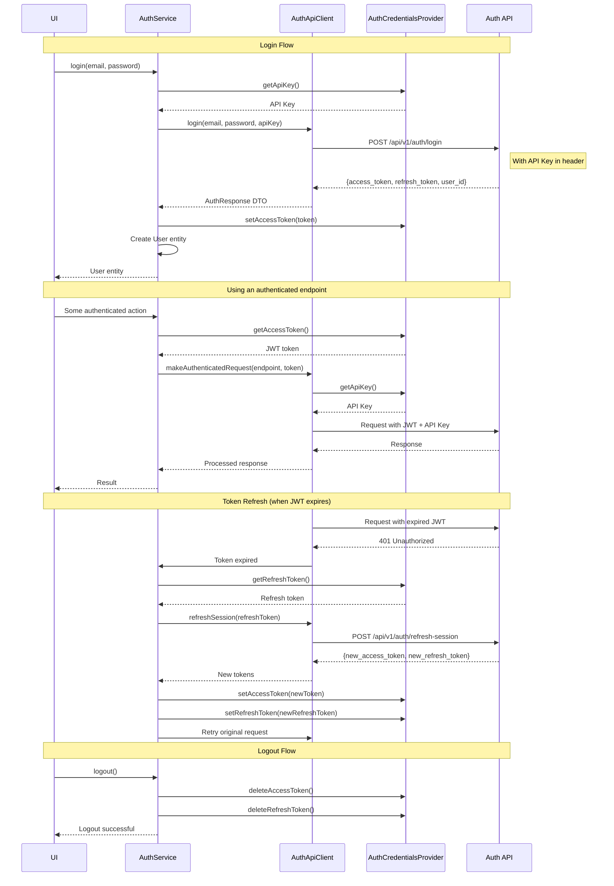

# Job Feature Architecture

# Authentication Architecture

This diagram illustrates the components and their relationships for the authentication system.

## Authentication Flow

This sequence diagram illustrates the authentication process from login to using authenticated endpoints.

## AuthService Interface

The `AuthService` interface defines the following methods:

- `Future<User> login(String email, String password)` - Authenticates a user and returns user data
- `Future<bool> refreshSession()` - Refreshes the authentication token when it expires
- `Future<void> logout()` - Logs the user out by clearing stored tokens
- `Future<bool> isAuthenticated()` - Checks if the user is currently authenticated 