# Job Data Layer Flow

This document details the data flow architecture for the Job feature in DocJet Mobile.

> **TLDR:** This is an offline-first architecture with server-side synchronization. Jobs have a dual-ID system (client-generated UUID and server-assigned ID), undergo local-first CRUD operations, are synchronized on a 15-second interval, and can handle network failures with appropriate status tracking. Historical development details can be found in [job_dataflow_development_history.md](./job_dataflow_development_history.md).

## Key Architecture Decisions

1. **Dual-ID System**
   * `localId`: Client-generated UUID that never changes
   * `serverId`: Server-assigned ID after first successful sync
   * Preserves local references while supporting server-generated IDs

2. **Offline-First Operations**
   * All operations (create/update/delete) happen locally first
   * Changes are marked with appropriate sync status
   * Background synchronization pushes changes to server

3. **Individual Job Synchronization**
   * Each job is processed independently with clear paths for:
     - Creating new jobs (`serverId == null`)
     - Updating existing jobs (`serverId != null`)
     - Deleting jobs (`syncStatus == pendingDeletion`)
   * Allows for granular error handling per job

4. **Server Authority Model**
   * Server is the ultimate source of truth
   * Server data overwrites local data after initial sync
   * No conflict resolution - server response is accepted as-is

5. **Robust Error Handling**
   * Per-job error state tracking
   * Failed jobs are retried with exponential backoff
   * Maximum retry attempts with permanent failure state
   * Sync process continues with other jobs even if one fails
   * Non-fatal audio file deletion errors

6. **Resource Management**
   * Audio files tied directly to job lifecycle
   * Automatic cleanup when jobs are deleted (locally or server-side)

7. **Service-Oriented Architecture**
   * Specialized services with single responsibilities
   * Clear separation between read, write, delete, and sync operations
   * Split sync responsibility between Orchestrator (what to sync) and Processor (how to sync)
   * Improved testability with focused components

8. **Background Processing Support**
   * Explicit sync triggering mechanism
   * App lifecycle aware (foreground/background transitions)
   * Compatible with platform-specific background workers

## Job Feature Architecture Overview

The following diagram illustrates the components and their relationships for the job feature.

```mermaid
graph TD
    subgraph "Presentation Layer (UI, State Management)"
        UI --> |Uses| AppService(Application Service / Use Cases)
    end

    subgraph "Domain Layer (Core Logic, Entities)"
        AppService -->|Uses| JobRepositoryInterface(JobRepository Interface)
        JobEntity((Job Entity<br>- Pure Dart<br>- Equatable))
        JobRepositoryInterface -- Defines --> JobEntity
    end

    subgraph "Data Layer (Implementation Details)"
        JobRepositoryImpl(JobRepositoryImpl<br>- Delegates to Services) -->|Implements| JobRepositoryInterface

        subgraph "Service Layer"
            ReaderService(JobReaderService<br>- Read Operations)
            WriterService(JobWriterService<br>- Write Operations)
            DeleterService(JobDeleterService<br>- Delete Operations)
            
            SyncOrchestrator(JobSyncOrchestratorService<br>- Job collection & sync decisions)
            SyncProcessor(JobSyncProcessorService<br>- API operations & status updates)
            SyncTrigger(JobSyncTriggerService<br>- 15s Timer & Lifecycle)
            
            SyncTrigger -->|Calls| SyncOrchestrator
            SyncOrchestrator -->|Delegates to| SyncProcessor
        end

        JobRepositoryImpl -->|Uses| ReaderService
        JobRepositoryImpl -->|Uses| WriterService
        JobRepositoryImpl -->|Uses| DeleterService
        JobRepositoryImpl -->|Uses| SyncOrchestrator

        subgraph "Infrastructure & Data Sources"
            LocalDS[JobLocalDataSource]
            RemoteDS[JobRemoteDataSource]
            Network[NetworkInfo]
            UUID[UuidGenerator]
            FileSystem[FileSystem]
        end

        ReaderService -->|Uses| LocalDS
        ReaderService -->|Uses| RemoteDS
        
        WriterService -->|Uses| LocalDS
        WriterService -->|Uses| UUID
        
        DeleterService -->|Uses| LocalDS
        DeleterService -->|Uses| FileSystem
        
        SyncOrchestrator -->|Uses| LocalDS
        SyncOrchestrator -->|Uses| Network
        
        SyncProcessor -->|Uses| LocalDS
        SyncProcessor -->|Uses| RemoteDS
        SyncProcessor -->|Uses| FileSystem

        subgraph "Local Persistence (Hive)"
            HiveJobLocalDS(HiveJobLocalDataSourceImpl) -->|Implements| LocalDS
            HiveJobLocalDS -->|Uses| JobMapper(JobMapper)
            HiveJobLocalDS -->|Uses| HiveBox([Hive Box])
            JobMapper -->|Maps to/from| JobHiveModel((JobHiveModel DTO<br>- Hive Annotations))
            JobMapper -->|Maps to/from| JobEntity
            JobHiveModel -- Stored in --> HiveBox
        end

        subgraph "Remote API"
            ApiJobRemoteDS(ApiJobRemoteDataSourceImpl) -->|Implements| RemoteDS
            ApiJobRemoteDS -->|Uses| HttpClient([HTTP Client<br>- dio/http])
            ApiJobRemoteDS -->|Uses| JobMapper
            ApiJobRemoteDS -->|Uses| JobApiDTO((JobApiDTO<br>- API Contract))
            JobMapper -->|Maps to/from| JobApiDTO
            ApiJobRemoteDS -->|Talks to| RestAPI{REST API<br>/api/v1/jobs}
            JobApiDTO -->|Serializes/Deserializes| RestAPI
        end
    end

    %% Styling for clarity with improved contrast
    classDef invisible fill:none,stroke:none;
    classDef domain fill:#E64A45,stroke:#222,stroke-width:2px,color:#fff,padding:15px;
    classDef service fill:#6E9E28,stroke:#222,stroke-width:2px,color:#fff;
    classDef data fill:#4285F4,stroke:#222,stroke-width:2px,color:#fff;
    classDef presentation fill:#0F9D58,stroke:#222,stroke-width:2px,color:#fff;

    class JobEntity,JobRepositoryInterface domain;
    class ReaderService,WriterService,DeleterService,SyncOrchestrator,SyncProcessor,SyncTrigger service;
    class JobRepositoryImpl,LocalDS,RemoteDS,HiveJobLocalDS,ApiJobRemoteDS,JobMapper,JobHiveModel,JobApiDTO,HiveBox,HttpClient,RestAPI,Network,UUID,FileSystem data;
    class UI,AppService presentation;
```

## Job Data Layer Flow

This sequence diagram shows the typical flows when the application requests job data, demonstrating how the repository interacts with local and remote data sources.

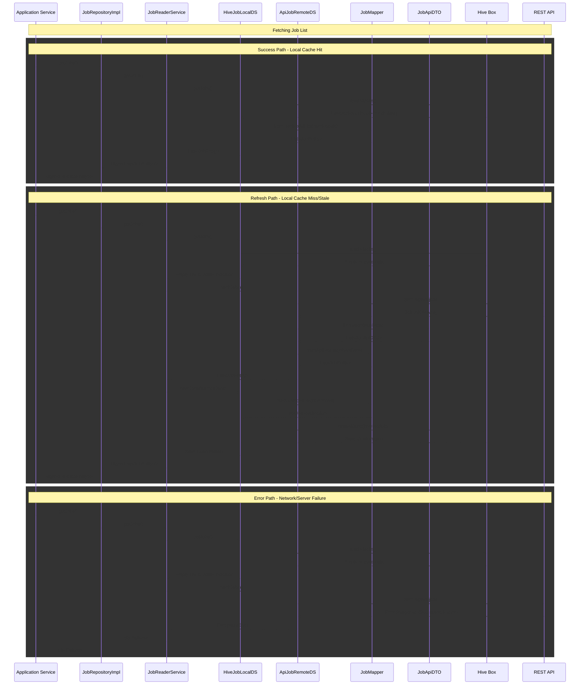

## Job Creation, Update, and Sync Flow

This sequence diagram illustrates the data flow for creating new jobs, updating existing jobs, and synchronizing pending changes with the backend.


## Job Data Layer Components

### Service-Oriented Repository Pattern

The job feature implements a service-oriented repository pattern with specialized services for different operations.

#### JobRepository Interface

The public contract for job operations that feature modules interact with. It defines all operations without exposing implementation details.

Key methods:
* Read: `getJobs()`, `getJobById(localId)`
* Write: `createJob(audioFilePath, text)`, `updateJob(localId, updates)`
* Delete: `deleteJob(localId)`
* Sync: `syncPendingJobs()`, `resetFailedJob(localId)`

#### JobRepositoryImpl

Lightweight implementation that delegates to specialized services:

```dart
class JobRepositoryImpl implements JobRepository {
  final JobReaderService _readerService;
  final JobWriterService _writerService;
  final JobDeleterService _deleterService;
  final JobSyncOrchestratorService _orchestratorService;
  
  // Methods delegate directly to appropriate service
  Future<Either<Failure, List<Job>>> getJobs() => _readerService.getJobs();
  // Other methods follow the same pattern...
}
```

#### JobReaderService

Handles all read operations related to jobs.

Key features:
* Getting jobs from local storage
* Fetching jobs from remote API when needed
* Detecting server-side deletions

#### JobWriterService

Handles all job creation and update operations.

Key features:
* Creating new jobs with client-generated UUID
* Validating updates to avoid unnecessary processing
* Marking jobs for sync

#### JobDeleterService

Handles all job deletion operations.

Key features:
* Marking jobs for deletion (soft delete)
* Permanently deleting jobs after sync
* Cleaning up associated audio files

#### JobSyncOrchestratorService

Orchestrates the synchronization process by determining what needs to be synced and delegating the actual sync operations.

Key features:
* Collecting jobs that need synchronization (pending, pendingDeletion, retry-eligible)
* Network connectivity verification
* Concurrency protection with mutex
* Delegating individual job processing to the processor service
* Resetting failed jobs upon user request

#### JobSyncProcessorService

Handles the actual synchronization operations with the remote API.

Key features:
* Processing different sync paths (create/update/delete) 
* Making API calls to create, update, or delete jobs
* Error handling with retry mechanism
* Updating job status based on sync results
* Managing audio file cleanup after successful deletion

#### JobSyncTriggerService

Manages periodic sync operation triggered by timer or app lifecycle events.

Key features:
* 15-second periodic timer for sync
* App lifecycle awareness (background/foreground)
* Error handling for sync operation

### Data Sources

#### JobLocalDataSource

Interface defining operations for local storage of jobs. Implemented by `HiveJobLocalDataSourceImpl`.

New methods added for error recovery:
* `getJobsToRetry(maxRetries, backoffDuration)`: Gets jobs eligible for retry based on retry count and backoff time

#### JobRemoteDataSource

Interface for remote API operations. Implemented by `ApiJobRemoteDataSourceImpl`.

### Job Model Enhancements

#### SyncStatus Enum

Enhanced with additional states:
* `pending`: Waiting for sync to server
* `synced`: Successfully synced
* `pendingDeletion`: Marked for deletion
* `error`: Failed sync but will retry
* `failed`: Failed sync and exceeded max retry attempts

#### Job Entity

Enhanced with error recovery fields:
* `retryCount`: Number of failed sync attempts (default: 0)
* `lastSyncAttemptAt`: Timestamp of last sync attempt for backoff calculation

## Sync Strategy

This section details the comprehensive synchronization strategy for jobs, covering creation, updates, deletions, and error handling.

### Core Principles

1. **Server Authority ("Server Wins")**: 
   - The server is the ultimate source of truth
   - After initial sync, server data always overwrites local data
   - No conflict detection or resolution needed - server response is accepted as-is

2. **Offline-First Creation/Updates**:
   - New jobs are created locally first with client-generated UUID
   - Job updates are applied locally first
   - Both are marked with `SyncStatus.pending` until synced

### Sync Architecture

The sync process is split between two specialized services:

1. **JobSyncOrchestratorService**:
   - Decides *what* to sync and when
   - Handles concurrency with mutex lock
   - Collects jobs that need synchronization
   - Checks network connectivity
   - Delegates actual sync operations to processor
   - Provides API for manual reset of failed jobs

2. **JobSyncProcessorService**:
   - Performs the actual API operations
   - Updates local job state based on API responses
   - Handles error conditions and updates job status
   - Manages associated resources (e.g., audio files)

This separation of concerns allows for:
- Better testability of the orchestration logic separate from API interactions
- Clearer responsibility boundaries
- Reduced risk of race conditions

### Sync Process Details

1. **Triggering:** 
   - The `JobSyncTriggerService` calls `JobRepository.syncPendingJobs()` every 15 seconds
   - Triggers also occur on app foregrounding via lifecycle observer
   - Compatible with platform-specific background workers

2. **Orchestration:** 
   - `JobSyncOrchestratorService` gathers three types of jobs to process:
     * Jobs with `SyncStatus.pending` for creation/update
     * Jobs with `SyncStatus.pendingDeletion` for deletion
     * Jobs with `SyncStatus.error` that meet retry criteria
   - For each job, it calls the appropriate processor method
   - Handles concurrency with mutex to prevent parallel sync attempts

3. **Retry Eligibility:**
   - Jobs are eligible for retry when:
     * `syncStatus == SyncStatus.error`
     * `retryCount < MAX_RETRY_ATTEMPTS` (default: 5)
     * Time since last attempt follows exponential backoff: `now - (baseBackoff * 2^retryCount)`
   - The `JobLocalDataSource` implements the logic for finding retry-eligible jobs

4. **Processing:**
   - `JobSyncProcessorService` handles each job based on its status:
   - **New Job Flow** (`serverId == null`, `SyncStatus.pending`):
     * Creates job on server with client-generated `localId`
     * Receives response with server-assigned `serverId`
     * Updates job with `SyncStatus.synced`
   - **Update Job Flow** (`serverId != null`, `SyncStatus.pending`):
     * Updates job on server using its `serverId`
     * Only sends changed fields
     * Updates job with `SyncStatus.synced`
   - **Delete Job Flow** (`SyncStatus.pendingDeletion`):
     * Deletes job on server (if it has a `serverId`)
     * Permanently deletes local job on success
     * Deletes associated audio file

5. **Error Handling:**
   - When a sync operation fails:
     * `JobSyncProcessorService` increments `retryCount`
     * Updates `lastSyncAttemptAt` to current time
     * Sets `syncStatus = SyncStatus.error` if retries remain
     * Sets `syncStatus = SyncStatus.failed` if max retries exceeded
   - Processing continues with other jobs even if one fails

6. **Manual Reset:**
   - Jobs with `SyncStatus.failed` require manual intervention
   - UI displays failed jobs with a retry option
   - `resetFailedJob(localId)` in the `JobSyncOrchestratorService`:
     * Checks if job exists and has `SyncStatus.failed`
     * Resets to `SyncStatus.pending` with zeroed retry count
     * Returns `Right<Unit>` on success or appropriate error

### Server-Side Deletion Handling

When fetching jobs from the server:
1. Repository gets full list of jobs from API
2. Compares with local jobs that have `syncStatus.synced` (ignoring pending ones)
3. Any jobs previously synced but missing from API response are considered deleted by server
4. These jobs are immediately deleted locally (including associated audio files)

> **IMPORTANT:** Jobs with `SyncStatus.pending`, `SyncStatus.pendingDeletion`, `SyncStatus.error`, or `SyncStatus.failed` are intentionally ignored during this check to prevent accidental deletion of jobs that have not yet successfully synced to the server.

### Audio File Management

1. Audio files are stored locally when jobs are created
2. Files remain on device as long as their associated job exists
3. When a job is deleted (either locally initiated or server-detected), its audio file is also deleted
4. Audio lifecycle is 100% tied to job lifecycle - when the job is gone, the audio is gone

## Background Processing Support

The job feature architecture is designed to work with background processing mechanisms:

1. **In-App Foreground Sync:**
   - `JobSyncTriggerService` manages a 15-second `Timer.periodic` when app is foregrounded
   - Timer is paused/resumed based on app lifecycle events

2. **Background Worker Integration:**
   - The architecture separates triggering from execution
   - Platform-specific implementations (WorkManager for Android, BackgroundTasks for iOS) can call the same `JobRepository.syncPendingJobs()` method
   - Consistent retry mechanism works regardless of what triggered the sync

3. **Lifecycle-Aware Processing:**
   - `JobSyncLifecycleObserver` manages sync state during app transitions
   - Ensures sync is running when app is visible
   - Pauses sync when app is backgrounded (unless using platform background workers)

## Remaining Improvements

The detailed implementation plan, including outstanding tasks for error recovery, sync triggering, lifecycle management, concurrency protection, and logging, can be found in the [JobRepository Refactoring Plan](./jobrepo_refactor.md).

## Synchronization Flow Diagrams

To make the sync flow clear, we've split it into small, focused sequence diagrams.

### Sync Orchestration - Job Collection

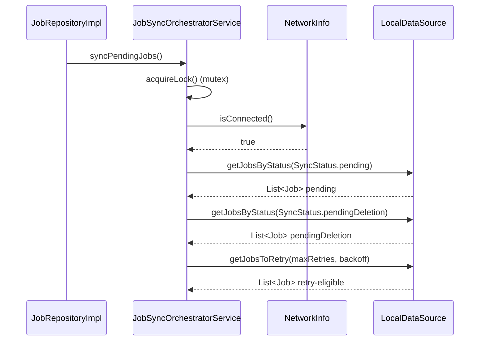

### Sync Orchestration - Delegation

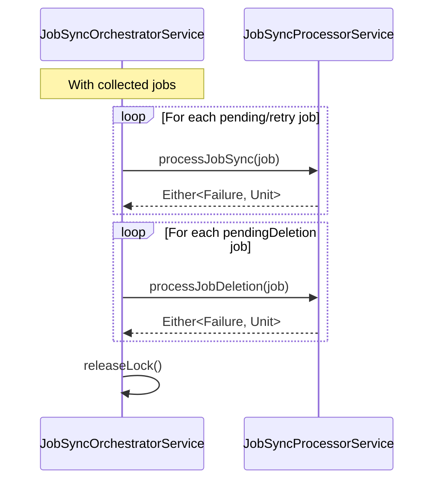

### Processor - New Job Creation 

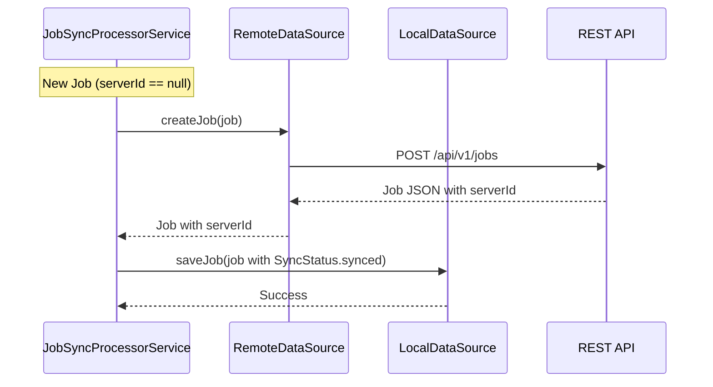

### Processor - Job Update

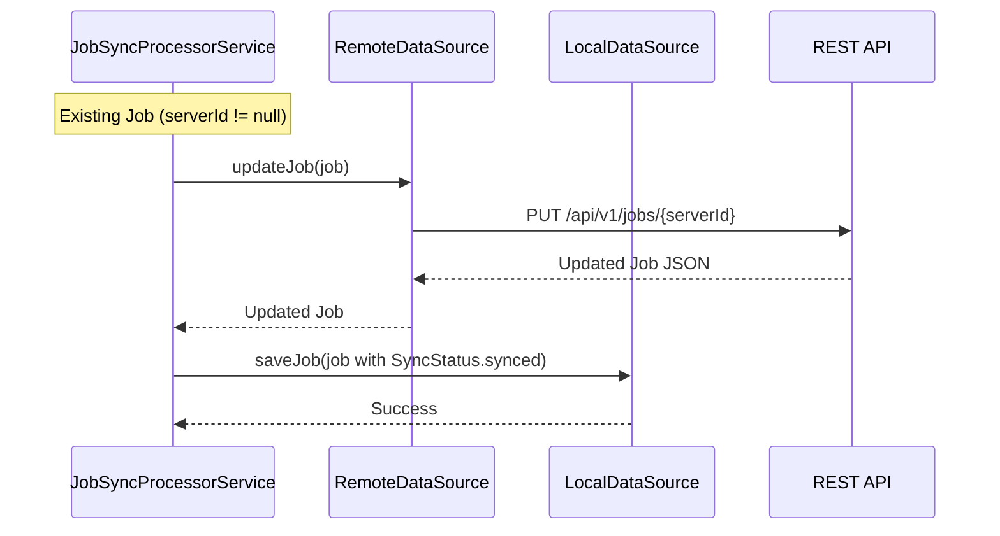

### Processor - Sync Error Handling

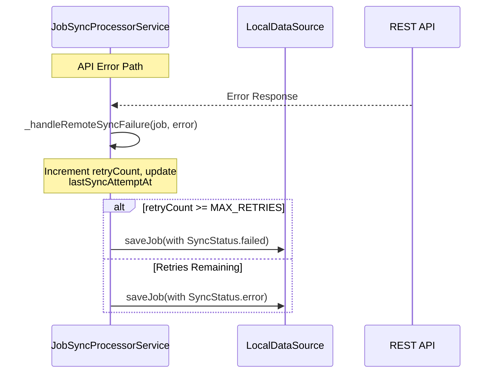

### Processor - Job Deletion

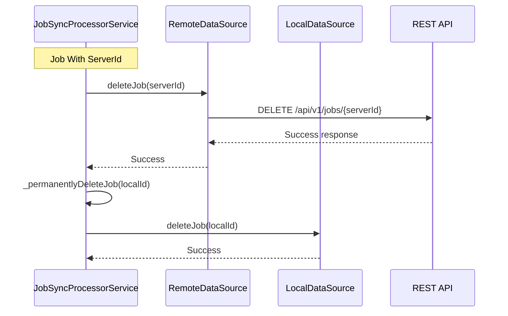

### Processor - Local File Cleanup

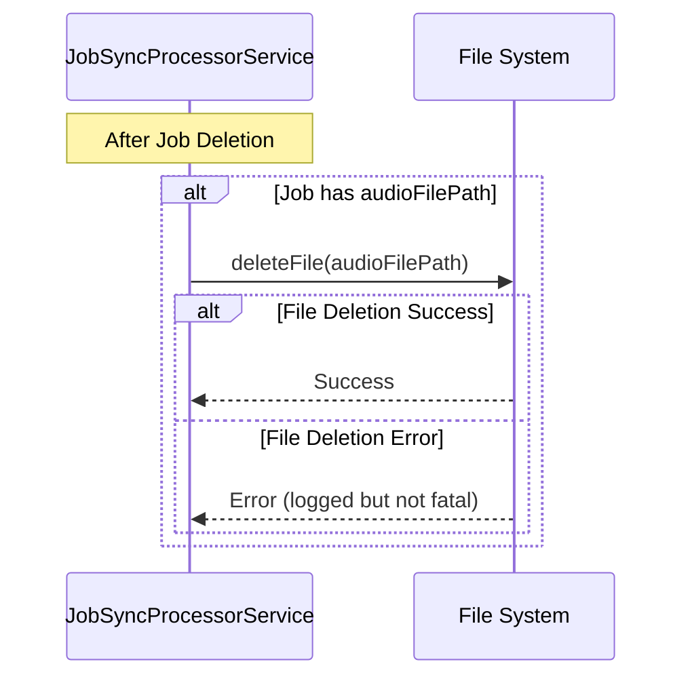

### Manual Reset of Failed Job

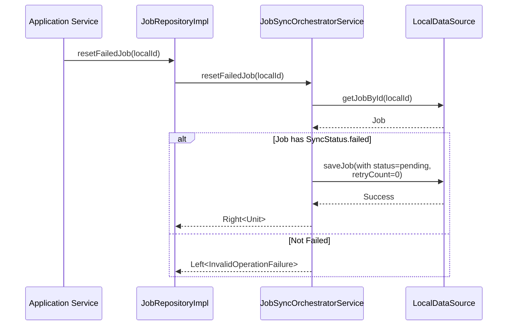

## Local-First Operations Flow

This section illustrates the data flow for creating, updating, and deleting jobs locally before they are synchronized with the backend.

### Job Creation Flow

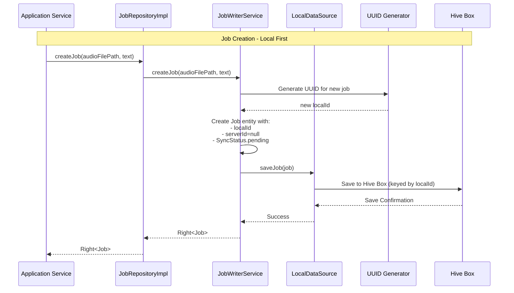

### Job Update Flow

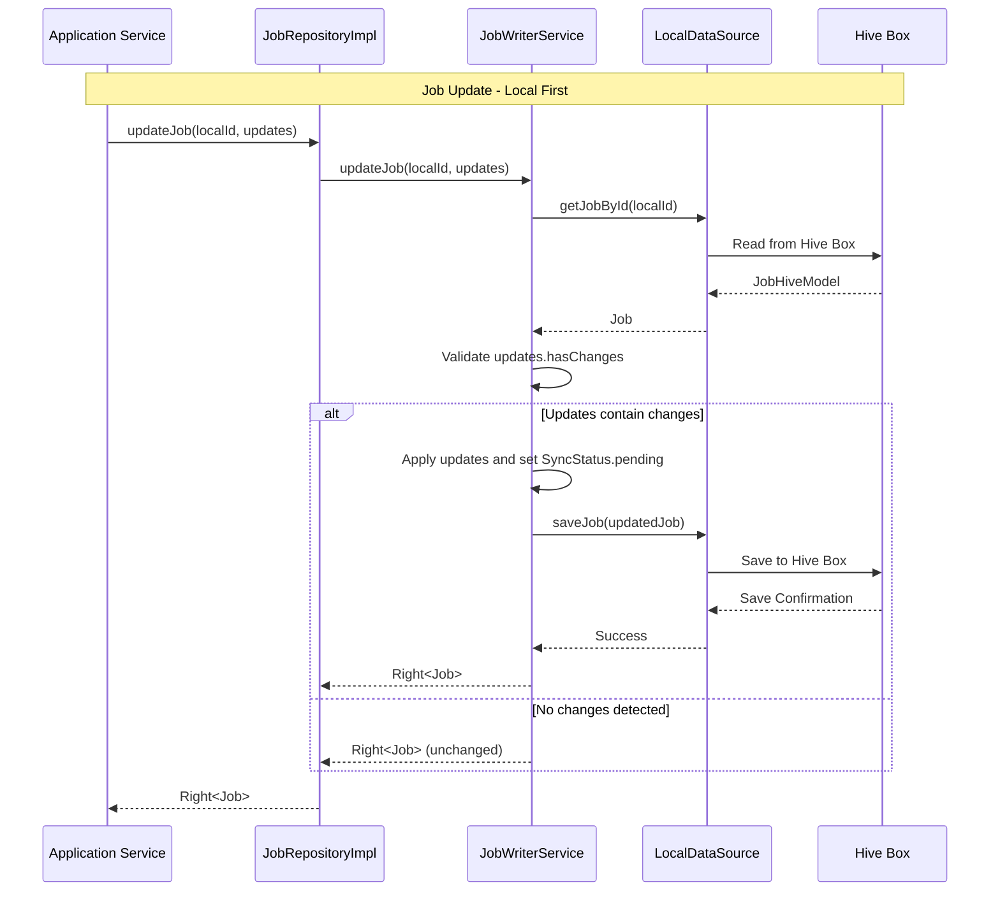

### Job Deletion Flow

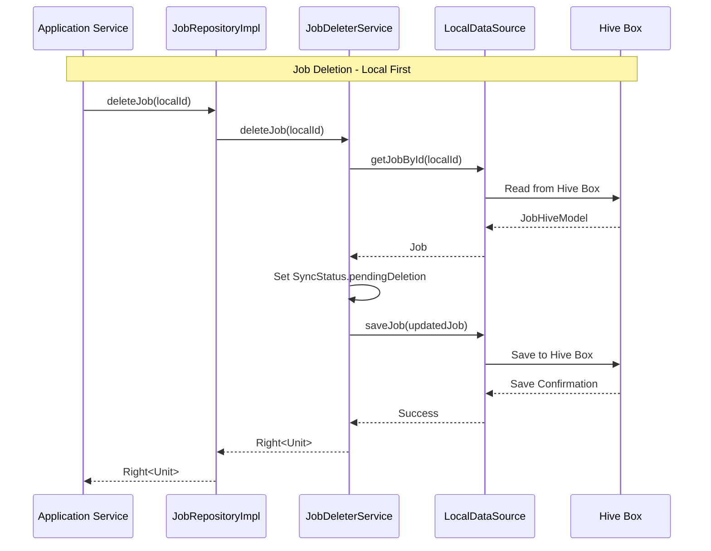

## Legacy Monolithic Diagram (For Reference)

This sequence diagram illustrates the old data flow approach before our refactoring to orchestrator/processor pattern.

