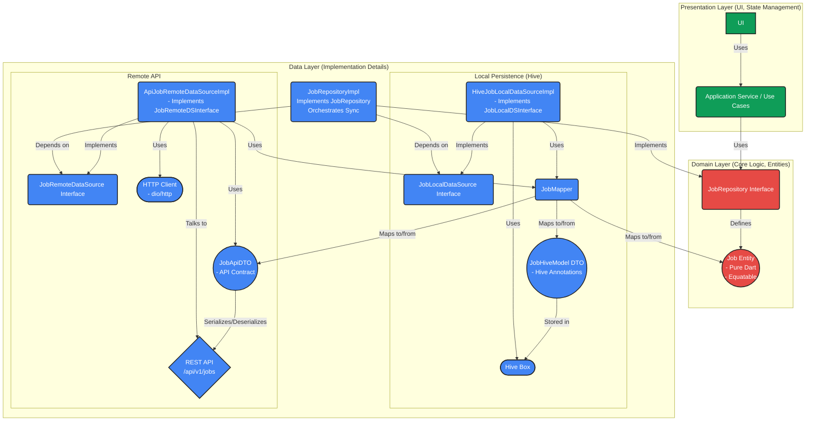
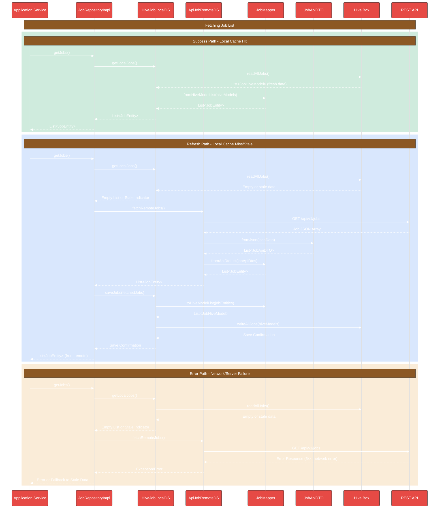

# Job Data Layer Flow

This document details the data flow architecture for the Job feature in DocJet Mobile.

> **TLDR:** This is an offline-first architecture with server-side synchronization. Jobs have a dual-ID system (client-generated UUID and server-assigned ID), undergo local-first CRUD operations, are synchronized on a 15-second interval, and can handle network failures with appropriate status tracking. Historical development details can be found in [job_dataflow_development_history.md](./job_dataflow_development_history.md).

## Key Architecture Decisions

1. **Dual-ID System**
   * `localId`: Client-generated UUID that never changes
   * `serverId`: Server-assigned ID after first successful sync
   * Preserves local references while supporting server-generated IDs

2. **Offline-First Operations**
   * All operations (create/update/delete) happen locally first
   * Changes are marked with appropriate sync status
   * Background synchronization pushes changes to server

3. **Individual Job Synchronization**
   * Each job is processed independently with clear paths for:
     - Creating new jobs (`serverId == null`)
     - Updating existing jobs (`serverId != null`)
     - Deleting jobs (`syncStatus == pendingDeletion`)
   * Allows for granular error handling per job

4. **Server Authority Model**
   * Server is the ultimate source of truth
   * Server data overwrites local data after initial sync
   * No conflict resolution - server response is accepted as-is

5. **Robust Error Handling**
   * Per-job error state tracking
   * Failed jobs are retried in subsequent sync cycles
   * Sync process continues with other jobs even if one fails
   * Non-fatal audio file deletion errors

6. **Resource Management**
   * Audio files tied directly to job lifecycle
   * Automatic cleanup when jobs are deleted (locally or server-side)

7. **Comprehensive Testing**
   * Full suite of unit and integration tests
   * Verified core lifecycle and error handling scenarios
   * Full implementation details in [job_dataflow_development_history.md](./job_dataflow_development_history.md)

## Job Feature Architecture Overview

The following diagram illustrates the components and their relationships for the job feature.

## Job Data Layer Flow

This sequence diagram shows the typical flows when the application requests job data, demonstrating how the repository interacts with local and remote data sources.

## Job Creation, Update, and Sync Flow

This sequence diagram illustrates the data flow for creating new jobs, updating existing jobs, and synchronizing pending changes with the backend.

```mermaid
%%{init: {'theme': 'base', 'themeVariables': { 
  'primaryColor': '#E64A45', 
  'primaryTextColor': '#fff', 
  'primaryBorderColor': '#222', 
  'lineColor': '#4285F4', 
  'secondaryColor': '#0F9D58', 
  'tertiaryColor': '#9E9E9E',
  'actorLineColor': '#e0e0e0',
  'noteBkgColor': '#8C5824',      
  'noteTextColor': '#fff'       
}}}%%
sequenceDiagram
    participant AppSvc as Application Service
    participant JobRepo as JobRepositoryImpl
    participant LocalDS as HiveJobLocalDS
    participant RemoteDS as ApiJobRemoteDS
    participant Mapper as JobMapper
    participant UUID as UUID Generator
    participant Hive as Hive Box
    participant API as REST API
    participant FileSystem as File System

    %% Job Creation Flow
    rect rgb(15, 157, 88, 0.2)
    Note over AppSvc, API: Job Creation - Local First
    AppSvc->>JobRepo: createJob(audioFilePath, text)
    JobRepo->>UUID: Generate UUID for new job
    UUID-->>JobRepo: new localId
    JobRepo->>JobRepo: Create Job entity with:<br/>- localId<br/>- serverId=null<br/>- SyncStatus.pending
    JobRepo->>Mapper: toHiveModel(jobEntity)
    Mapper-->>JobRepo: JobHiveModel
    JobRepo->>LocalDS: saveJobHiveModel(hiveModel)
    LocalDS->>Hive: Save to Hive Box (keyed by localId)
    Hive-->>LocalDS: Save Confirmation
    LocalDS-->>JobRepo: Save Confirmation
    JobRepo-->>AppSvc: Job entity (with localId)
    end
    
    %% Job Update Flow
    rect rgb(230, 77, 69, 0.2)
    Note over AppSvc, API: Job Update - Local First
    AppSvc->>JobRepo: updateJob(jobId, updates)
    JobRepo->>LocalDS: getJobHiveModel(jobId)
    LocalDS->>Hive: Read from Hive Box
    Hive-->>LocalDS: JobHiveModel
    LocalDS-->>JobRepo: JobHiveModel
    JobRepo->>JobRepo: Update job data and set SyncStatus.pending
    JobRepo->>LocalDS: saveJobHiveModel(updatedModel)
    LocalDS->>Hive: Save to Hive Box (keyed by localId)
    Hive-->>LocalDS: Save Confirmation
    LocalDS-->>JobRepo: Save Confirmation
    JobRepo-->>AppSvc: Updated Job entity
    end
    
    %% Job Deletion Flow
    rect rgb(241, 156, 31, 0.2)
    Note over AppSvc, API: Job Deletion - Local First
    AppSvc->>JobRepo: deleteJob(jobId)
    JobRepo->>LocalDS: getJobHiveModel(jobId)
    LocalDS->>Hive: Read from Hive Box
    Hive-->>LocalDS: JobHiveModel
    JobRepo->>JobRepo: Set SyncStatus.pendingDeletion
    JobRepo->>LocalDS: saveJobHiveModel(updatedModel)
    LocalDS->>Hive: Save to Hive Box (keyed by localId)
    Hive-->>LocalDS: Save Confirmation
    LocalDS-->>JobRepo: Save Confirmation
    JobRepo-->>AppSvc: Success response
    end
    
    %% Sync Pending Jobs Flow
    rect rgb(66, 133, 244, 0.2)
    Note over AppSvc, API: Sync Pending Jobs - Every 15 Seconds
    AppSvc->>JobRepo: syncPendingJobs()
    JobRepo->>LocalDS: getJobsToSync()
    LocalDS->>Hive: Query for SyncStatus.pending AND SyncStatus.pendingDeletion
    Hive-->>LocalDS: List<JobHiveModel> (both types)
    LocalDS-->>JobRepo: List<JobHiveModel>
    JobRepo->>Mapper: fromHiveModelList(pendingJobModels)
    Mapper-->>JobRepo: List<JobEntity>
    
    loop For each pending job
        alt Job has SyncStatus.pending
            JobRepo->>JobRepo: Check serverId field
            
            alt serverId == null (New Job)
                JobRepo->>RemoteDS: createJob(jobEntity)
                RemoteDS->>API: POST /api/v1/jobs with audio upload
                API-->>RemoteDS: Job JSON with server ID
                RemoteDS-->>JobRepo: Job entity with serverId assigned
                
                JobRepo->>Mapper: toHiveModel(syncedJob)
                Mapper-->>JobRepo: JobHiveModel with serverId
                JobRepo->>LocalDS: saveJobHiveModel(syncedModel)
                LocalDS->>Hive: Save updated job (still keyed by localId)
                Hive-->>LocalDS: Save Confirmation
                
                JobRepo->>LocalDS: updateJobSyncStatus(localId, SyncStatus.synced)
                LocalDS->>Hive: Update sync status
                Hive-->>LocalDS: Update Confirmation
                
            else serverId != null (Update)
                JobRepo->>RemoteDS: updateJob(job.serverId, updates)
                RemoteDS->>API: PATCH/PUT /api/v1/jobs/{serverId}
                API-->>RemoteDS: Updated Job JSON
                RemoteDS-->>JobRepo: Updated Job entity
                
                JobRepo->>Mapper: toHiveModel(syncedJob)
                Mapper-->>JobRepo: JobHiveModel
                JobRepo->>LocalDS: saveJobHiveModel(syncedModel)
                LocalDS->>Hive: Save updated job (still keyed by localId)
                Hive-->>LocalDS: Save Confirmation
                
                JobRepo->>LocalDS: updateJobSyncStatus(localId, SyncStatus.synced)
                LocalDS->>Hive: Update sync status
                Hive-->>LocalDS: Update Confirmation
            end
            
        else Job has SyncStatus.pendingDeletion
            alt serverId != null
                JobRepo->>RemoteDS: deleteJob(job.serverId)
                RemoteDS->>API: DELETE /api/v1/jobs/{serverId}
            else serverId == null (local-only job)
                Note over JobRepo: Skip API call for jobs never synced to server
            end
            
            API-->>RemoteDS: Success response
            RemoteDS-->>JobRepo: Success
            
            JobRepo->>LocalDS: deleteJob(job.localId)
            LocalDS->>Hive: Delete from Hive Box
            Hive-->>LocalDS: Delete Confirmation
            
            alt Job has audioFilePath
                JobRepo->>FileSystem: deleteFile(audioFilePath)
                alt File Deletion Success
                    FileSystem-->>JobRepo: Success
                else File Deletion Error
                    FileSystem-->>JobRepo: Error (logged but not fatal)
                end
            end
        end
        
        alt API Error/Network Error
            API-->>RemoteDS: Error response
            RemoteDS-->>JobRepo: Throws exception
            JobRepo->>LocalDS: updateJobSyncStatus(localId, SyncStatus.error)
            LocalDS->>Hive: Update status to error
            Hive-->>LocalDS: Update Confirmation
            LocalDS-->>JobRepo: Update Confirmation
        end
    end
    
    JobRepo-->>AppSvc: Sync completion (Success/Failure)
    end
    
    %% Server-Side Deletion Detection
    rect rgb(142, 68, 173, 0.2)
    Note over AppSvc, API: Server-Side Deletion Detection
    AppSvc->>JobRepo: getJobs() (refresh)
    JobRepo->>RemoteDS: fetchJobs()
    RemoteDS->>API: GET /api/v1/jobs
    API-->>RemoteDS: List of current jobs
    RemoteDS-->>JobRepo: List<JobEntity> with serverIds
    
    JobRepo->>LocalDS: getSyncedJobs()
    LocalDS->>Hive: Query jobs with SyncStatus.synced and serverId != null
    Hive-->>LocalDS: List<JobHiveModel>
    LocalDS-->>JobRepo: List<JobHiveModel>
    
    JobRepo->>JobRepo: Find jobs with serverId not in server response
    
    loop For each job missing from server
        JobRepo->>LocalDS: deleteJob(job.localId)
        LocalDS->>Hive: Delete from Hive Box
        Hive-->>LocalDS: Delete Confirmation
        
        alt Job has audioFilePath
            JobRepo->>FileSystem: deleteFile(audioFilePath)
            alt File Deletion Success
                FileSystem-->>JobRepo: Success
            else File Deletion Error
                FileSystem-->>JobRepo: Error (logged but not fatal)
            end
        end
    end
    
    JobRepo->>LocalDS: saveJobHiveModels(serverJobs)
    LocalDS->>Hive: Save/update jobs from server (keyed by localId)
    Hive-->>LocalDS: Save Confirmation
    
    JobRepo-->>AppSvc: List<JobEntity>
    end
```

## Job Data Layer Components

### JobRepositoryImpl
Orchestrates data operations for Jobs. It decides whether to fetch from the local cache or the remote API, and handles the synchronization between them. Implements the `JobRepositoryInterface`.

Key features:
* Dual-ID system: Uses `localId` (client-generated UUID) and `serverId` (server-assigned)
* Individual job sync: Processes each job independently with appropriate operation paths
* Error handling: Tracks sync failures per job without aborting the entire process

### HiveJobLocalDataSourceImpl
Implements the `JobLocalDataSourceInterface`. Responsible for interacting with the local persistence layer (Hive). Uses `JobMapper` to convert between `JobEntity` and `JobHiveModel`.

Key features:
* Manages sync status tracking
* Fetch timestamp handling for freshness detection
* Provides methods to query jobs by sync status

### ApiJobRemoteDataSourceImpl
Implements the `JobRemoteDataSourceInterface`. Responsible for communicating with the backend REST API (`/api/v1/jobs`) using an HTTP client. Uses `JobApiDTO` for parsing API responses and `JobMapper` for converting between `JobApiDTO` and `JobEntity`. 

Key features:
* Handles syncing of individual pending jobs to the API
* Supports creating, updating, and deleting jobs

### JobMapper
Bidirectional mapper that handles transformations between:
- `JobEntity` (domain) and `JobHiveModel` (local persistence)
- `JobEntity` (domain) and `JobApiDTO` (API communication)

### JobApiDTO
Data Transfer Object specifically for API communication. Mirrors the API's JSON structure and handles serialization/deserialization.

### Hive Box
The Hive database box used for local storage.

### REST API
The backend endpoint providing job data. Supports GET for fetching, POST for creating, PUT/PATCH for updating, and DELETE for removing jobs.

## Sync Strategy

This section details the comprehensive synchronization strategy for jobs, covering creation, updates, deletions, and conflict handling.

### Core Principles

1. **Server Authority ("Server Wins")**: 
   - The server is the ultimate source of truth
   - After initial sync, server data always overwrites local data
   - No conflict detection or resolution needed - server response is accepted as-is

2. **Offline-First Creation/Updates**:
   - New jobs are created locally first with client-generated UUID
   - Job updates are applied locally first
   - Both are marked with `SyncStatus.pending` until synced

### Sync Process Details

1. **Triggering:** 
   - The `JobRepositoryImpl.syncPendingJobs()` method is called every 15 seconds
   - Repository doesn't trigger itself - external timer/service calls it
   - Future: May add triggers on network reconnect, app foregrounding, etc.

2. **Identify Pending:** 
   - Repository requests all records with `SyncStatus.pending` or `SyncStatus.pendingDeletion` from `JobLocalDataSource`
   - No batching or prioritization - all pending jobs are processed in one go

3. **Sync Logic:**
   - Repository iterates through pending jobs one by one
   - **New Job Flow** (`serverId == null`, `SyncStatus.pending`):
     * Creates job on server with client-generated `localId`
     * Receives response with server-assigned `serverId`
     * Saves both IDs locally (never overwriting `localId`)
   - **Update Job Flow** (`serverId != null`, `SyncStatus.pending`):
     * Updates job on server using its `serverId`
     * Sends only changed fields to avoid unnecessary updates
   - **Delete Job Flow** (`SyncStatus.pendingDeletion`):
     * Deletes job on server (if it has a `serverId`)
     * Removes job from local storage
     * Deletes associated audio file

4. **Success Handling:**
   - Updates `syncStatus = SyncStatus.synced` after successful API interaction
   - For deleted jobs, removes from local DB after successful API deletion

5. **Error Handling:**
   - Sets `syncStatus = SyncStatus.error` on network/server errors
   - Jobs in the `error` state are retried on subsequent sync cycles
   - Sync process continues with other jobs even if one fails

### Server-Side Deletion Handling

When fetching jobs from the server:
1. Repository gets full list of jobs from API
2. Compares with local jobs that have `syncStatus.synced` (ignoring pending ones)
3. Any jobs previously synced but missing from API response are considered deleted by server
4. These jobs are immediately deleted locally (including associated audio files)

> **IMPORTANT:** Jobs with `SyncStatus.pending` or `SyncStatus.pendingDeletion` are intentionally ignored during this check to prevent accidental deletion of jobs that have been created locally but not yet synced to the server.

### Audio File Management

1. Audio files are stored locally when jobs are created
2. Files remain on device as long as their associated job exists
3. When a job is deleted (either locally initiated or server-detected), its audio file is also deleted
4. Audio lifecycle is 100% tied to job lifecycle - when the job is gone, the audio is gone 