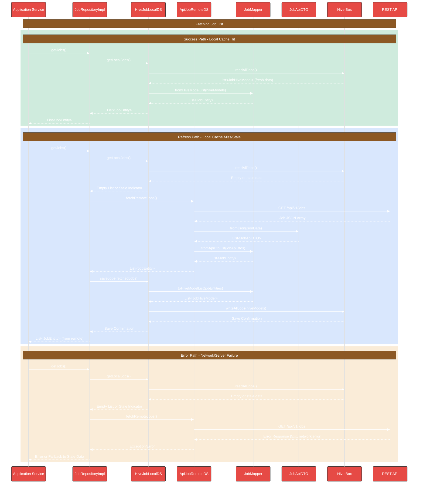

# Job Data Layer Flow

This document details the data flow architecture for the Job feature in DocJet Mobile.

## Job Feature Architecture Overview

The following diagram illustrates the components and their relationships for the job feature.

## Job Data Layer Flow

This sequence diagram shows the typical flows when the application requests job data, demonstrating how the repository interacts with local and remote data sources.

## Job Data Layer Components

### JobRepositoryImpl
Orchestrates data operations for Jobs. It decides whether to fetch from the local cache or the remote API, and handles the synchronization between them. Implements the `JobRepositoryInterface`.

### HiveJobLocalDataSourceImpl
Implements the `JobLocalDataSourceInterface`. Responsible for interacting with the local persistence layer (Hive). Uses `JobMapper` to convert between `JobEntity` and `JobHiveModel`.

### ApiJobRemoteDataSourceImpl
Implements the `JobRemoteDataSourceInterface`. Responsible for communicating with the backend REST API (`/api/v1/jobs`) using an HTTP client. Uses `JobApiDTO` for parsing API responses and `JobMapper` for converting between `JobApiDTO` and `JobEntity`.

### JobMapper
Bidirectional mapper that handles transformations between:
- `JobEntity` (domain) and `JobHiveModel` (local persistence)
- `JobEntity` (domain) and `JobApiDTO` (API communication)

### JobApiDTO
Data Transfer Object specifically for API communication. Mirrors the API's JSON structure and handles serialization/deserialization.

### Hive Box
The Hive database box used for local storage.

### REST API
The backend endpoint providing job data.

## Implementation Status & TODOs

This section tracks the current implementation status of components in the Jobs feature.

### Implemented Components
- ✅ Job Entity (lib/features/jobs/domain/entities/job.dart)
- ✅ JobRepository Interface (lib/features/jobs/domain/repositories/job_repository.dart)
- ✅ JobLocalDataSource Interface (lib/features/jobs/data/datasources/job_local_data_source.dart)
- ✅ HiveJobLocalDataSourceImpl (lib/features/jobs/data/datasources/hive_job_local_data_source_impl.dart)
- ✅ JobHiveModel (lib/features/jobs/data/models/job_hive_model.dart)
- ✅ JobRemoteDataSource Interface (lib/features/jobs/data/datasources/job_remote_data_source.dart)
- ✅ ApiJobRemoteDataSourceImpl (lib/features/jobs/data/datasources/api_job_remote_data_source_impl.dart)
- ✅ Basic JobMapper (for Hive models only) (lib/features/jobs/data/mappers/job_mapper.dart)
- ✅ JobApiDTO (lib/features/jobs/data/models/job_api_dto.dart)
- ✅ SyncStatus enum (lib/features/jobs/domain/entities/sync_status.dart)

### TODO Components
- ✅ **EXISTING NEEDS UPDATE** - JobRepositoryImpl (lib/features/jobs/data/repositories/job_repository_impl.dart)
  - File exists but needs enhancement
  - Needs to implement sync mechanisms using the new sync status fields
  - Add support for syncing pending jobs when connectivity is restored

- ✅ **COMPLETED** - Extend JobMapper with API DTO support (lib/features/jobs/data/mappers/job_mapper.dart)
  - Implemented `fromApiDto` and `toApiDto`
  - Implemented `fromApiDtoList`
  - Skipped `toApiDtoList` as likely not needed for batch updates

- ❌ **HIGH PRIORITY** - Implement JobStatus enum for type-safe status handling
  - Create `JobStatus` enum in domain layer
  - Update `Job`, `JobHiveModel`, and `JobApiDTO` to use the enum
  - Update `JobMapper` to handle conversion between different status formats
  - Update any business logic that depends on job status

- ❌ **LOW PRIORITY** - Pagination support in RemoteDataSource
  - Add pagination parameters to API calls
  - Implement pagination state tracking

- ❌ **LOW PRIORITY** - Network connectivity detection
  - Add network state detection before API calls
  - Implement offline-first behavior

### Implementation Notes
- ApiJobRemoteDataSourceImpl currently maps JSON directly to Job entities in _mapJsonToJob
- No freshness policy is implemented yet (deciding when local data is stale)
- No explicit error recovery strategy implemented for network failures
- ✅ **COMPLETED** - Added SyncStatus enum tracking to JobHiveModel
- ✅ **COMPLETED** - Implemented getJobsToSync and updateJobSyncStatus methods in JobLocalDataSource

### Current Implementation Progress

✅ **COMPLETED** - The latest implementation adds support for sync status tracking and timestamp handling:

1. ✅ **COMPLETED** - Updated `JobLocalDataSource` interface to include timestamp methods:
   - Added `Future<DateTime?> getLastFetchTime();` - Returns when data was last fetched from remote
   - Added `Future<void> saveLastFetchTime(DateTime time);` - Records when data was fetched

2. ✅ **COMPLETED** - Implemented these methods in `HiveJobLocalDataSourceImpl`:
   - Store fetch timestamp in Hive using a dedicated key
   - Handle null cases and type errors for first-time access
   - Ensure UTC consistency in timestamp handling

3. ✅ **COMPLETED** - Added support for sync status tracking:
   - Created SyncStatus enum (pending/synced/error)
   - Extended JobHiveModel with syncStatus field
   - Added getJobsToSync and updateJobSyncStatus methods to JobLocalDataSource
   - Implemented methods in HiveJobLocalDataSourceImpl with robust error handling

### Next Steps

The following are the next high-priority items:

1. ❌ **HIGH PRIORITY** - Update existing JobRepositoryImpl:
   - Add methods to support the new sync status functionality
   - Implement offline-first strategy with pending sync tracking
   - Add functionality to sync pending jobs when connectivity is restored
   - Implement error handling and retry mechanism for sync operations

2. ❌ **HIGH PRIORITY** - Create JobStatus enum:
   - Identify all possible job statuses from API and app requirements
   - Replace string-based status in all model layers
   - Update mappers and any status-dependent logic

3. ❌ **MEDIUM PRIORITY** - Create comprehensive tests for JobRepositoryImpl:
   - Test caching behavior with different staleness scenarios
   - Test sync status handling and recovery
   - Test error handling and fallback strategies

Once these are completed, the jobs feature will have:
- Full type safety for job status and sync status
- Robust offline support with proper sync tracking
- Comprehensive error handling throughout the stack 